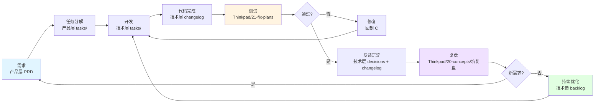

# 产品文档库总索引(.products)

> 本目录是本工作区的**产品文档库**,由"产品经理 agent"维护,按项目分库。
> 代码改完 → Wiki 维护 agent 自动同步更新对应文档。
>
> **2026-07-22 主人拍板**:所有项目相关文档(计划/设计/验证/问答/SPEC)落 **`.products/specs/`** 或各项目子目录;**经验/教训**落 **`Thinkpad/22-entities-实体档案/agent-经验库/`**;**调研/文章**落 **`Thinkpad/20-concepts-已消化笔记/调研/`**;**主人原话**落 **`Thinkpad/99-log/`**。

---

## 📁 两层结构(关键区分)

`.products/projects/` 下分两类目录,**不要混用**:

| 类别       | 命名约定                     | 职责                                 | 例子                                                        |
| ---------- | ---------------------------- | ------------------------------------ | ----------------------------------------------------------- |
| **产品层** | `wk-train-center/`(产品代号) | 跨代码仓的产品需求、用户故事、决策   | `wk-train-center/docs/PRD.md`                               |
| **技术层** | `wk-{产品}-{端}/`(代码仓名)  | 单一代码仓的技术文档、ADR、changelog | `wk-train-center-service/docs/`、`wk-train-center-ui/docs/` |

**判定原则**:文档涉及"业务/用户/产品功能" → 产品层;涉及"接口/技术栈/部署" → 技术层;不归属具体项目的基础设施 → 基础工具。

---

## 📁 项目分库

```
.products/
├── README.md                  # 本文件(总索引)
└── projects/
    ├── wk-train-center/           # 【产品层】跨代码仓产品文档
    │   ├── docs/
    │   │   ├── PRD.md             # 产品需求文档(产品级)
    │   │   ├── changelog.md       # 产品变更日志
    │   │   ├── user-stories/      # 用户故事(按特性分文件)
    │   │   └── decisions/         # 产品/架构决策记录 ADR
    │   └── tasks/                 # 产品级任务看板
    │
    ├── wk-train-center-service/   # 【技术层】Java 后端
    │   ├── docs/
    │   │   ├── README.md          # 技术仓说明(不是产品 PRD)
    │   │   ├── changelog.md       # 后端代码变更日志
    │   │   ├── user-stories/      # 后端实现的用户故事
    │   │   └── deployment/        # 部署/运维文档
    │   └── tasks/                 # 后端任务看板
    │
    ├── wk-train-center-ui/        # 【技术层】Vue 2 旧前端
    │   └── docs/ + tasks/         # 同上
    ├── wk-train-center-ui-v3/     # 【技术层】Vue 3 迁移目标
    │   └── docs/ + tasks/
    ├── wk-mhc-mobile/             # 【技术层】H5 移动端
    │   └── docs/ + tasks/
    ├── wk-PPTist-ui/              # 【技术层】PPT 编辑器
    │   └── docs/ + tasks/
    └── wk-mhc-ui/                 # 【技术层】Angular 门户
        └── docs/ + tasks/
```

---

## 📋 每个项目文档库的内容

| 文件 / 目录                            | 维护者          | 何时更新            |
| -------------------------------------- | --------------- | ------------------- |
| `PRD.md`(产品层) / `README.md`(技术层) | 产品经理 agent  | 需求变更时          |
| `user-stories/{feature}.md`            | 产品经理 agent  | 新增 / 改需求时     |
| `decisions/{YYYY-MM-DD}-{title}.md`    | Wiki 维护 agent | 架构 / 技术栈变更时 |
| `changelog.md`                         | Wiki 维护 agent | 每次代码改完必更新  |
| `tasks/{YYYY-MM-DD}-{task}.md`         | 项目经理 agent  | 任务进度变化时      |

---

## 🔄 闭环流程:需求 → 开发 → 测试 → 反馈 → 持续优化



### 闭环节点说明

| 节点           | 落点                                                     | Agent       |
| -------------- | -------------------------------------------------------- | ----------- |
| **需求**       | `.products/projects/wk-train-center/docs/PRD.md`         | 产品经理    |
| **任务分解**   | `.products/projects/wk-train-center/tasks/`              | 项目经理    |
| **开发**       | `.products/projects/{技术层}/tasks/`                     | 代码专家    |
| **代码变更**   | `.products/projects/{技术层}/docs/changelog.md`          | Wiki 维护   |
| **测试与修复** | `Thinkpad/21-fix-plans-修复经验/`                        | 测试专家    |
| **复盘沉淀**   | `Thinkpad/20-concepts-已消化笔记/坑复盘/`                | 主人 + 小马 |
| **持续优化**   | `.products/projects/{技术层}/tasks/inbox/`(技术债 inbox) | 项目经理    |

---

## ⚠️ 注意

- **绝对不写到项目根目录**(违反 `CLAUDE.md` §5 AI 产出物规范)
- 文档**随代码迭代**,不是写完就完——这是硬约束
- 每个项目独立文件库,**禁止把 v2 的文档写到 v3 目录下**
- **产品需求只写产品层**(`wk-train-center/`),不写到技术层项目下
- **技术文档只写技术层**,不冒充产品需求
- ❌ **不要再往 `E:\rhProject\docs/` 写任何东西**(.gitignore 已隐藏,等于"丢")
- ✅ 所有项目相关文档 → `.products/specs/` 或各项目子目录

---

## 📁 版本归集规范(2026-07-22 主人拍板,硬约束)

短期产物(设计/任务/评审/迭代)按版本子目录归集,**不再 flat 散落**。

### 命名

| 节奏 | 目录命名 | 例子 | Git 分支 |
|---|---|---|---|
| PC/web 端 | `1.x/` | `tasks/1.2/` | `local/1.2/dev` |
| **Mobile 端** | **`mobile1.x/`(无连字符)** | `tasks/mobile1.2/` | `local/mobile-v1.x/dev` |
| 旧/历史 | `_archive/` | `reviews/_archive/` | 任意 |
| 跨版本/长期 | 留根 | `docs/PRD.md` | — |

**禁用**(AI 看到报错):
- ❌ `mobile-1.x/`(db/ 老命名,2026-07-22 改完)
- ❌ `mobile-v1.x/`(只用于 Git 分支)
- ❌ `v1.x/`(VERSION_GUIDE 老规范,已废)

### 长期 vs 短期(放哪)

| 类型 | 放哪 | 例子 |
|---|---|---|
| PRD / changelog / architecture / decisions / user-stories | docs/ 根(跨版本) | `docs/PRD.md` |
| **设计稿** | **design/{version}/** | `design/mobile1.2/2026-07-15-*.md` |
| **评审报告** | **reviews/{version}/** | `reviews/mobile1.2/2026-07-22-*.md` |
| **项目计划** | **项目目录 `plan/{version}/`；跨版本留 `plan/` 根** | `projects/wk-train-center/plan/mobile1.2/2026-07-22-*.md` |
| **历史任务资料** | **tasks/{version}/** | `tasks/mobile1.2/2026-07-14-*.md` |
| **迭代记录** | **iterations/{version}/** | `iterations/mobile1.2/2026-07-22-*.md` |

**判定铁律**:**跨版本仍有效 → 留根;只服务某一版本 → 入版本子目录**。

### 归集判定原则(给 reviews/tasks/design 写)

> 同一时间窗口 → 一个版本
> 主体归属 = 子仓 `git branch --show-current` 在该窗口的实际值

### 版本号权威源(2026-07-14 主人铁律)

**不准凭根仓 git 推断版本号**,必须:
1. `cd {子仓} && git branch --show-current` ← 权威
2. 或读各仓 `docs/version-registry.json` 的 `current` 字段

各仓 version-registry 现状(2026-07-22 摸底):

| 仓 | 现状分支 | registry 状态 |
|---|---|---|
| wk-train-center-service | `local/mobile1.2/fix` | ✅ 已修(原 mobile-v1.1 过期) |
| wk-train-center-ui | `local/mobile1.2/fix` | ✅ 已重写(原 L82-L113 数据损坏 + mobile-v1.1 过期) |
| wk-train-center-ui-v3 | `master` | ✅ 原本就对 |
| wk-train-center(产品层) | (不映射) | ✅ 已建(指向关联子仓) |
| wk-mhc-mobile | `train/mobile-v1.1/dev` | ⚠️ 主人说 1.2 实际 1.1,待确认 |
| wk-mhc-ui | `release` | (本次未动) |
| wk-PPTist-ui | `local/mobile-v1.0/dev` | (本次未动) |

---

## 📁 落库铁律(2026-07-22 主人拍板,硬约束)

| 类型 | 落点 |
|---|---|
| 跟项目有关的文档(计划/设计/验证/问答) | **`.products/specs/`** 或各项目子目录 |
| 经验(踩坑/教训/方法论) | **`Thinkpad/22-entities-实体档案/agent-经验库/`** |
| 调研(articles) | **`Thinkpad/20-concepts-已消化笔记/调研/`** |
| 主人原话记录 | **`Thinkpad/99-log/`** |

❌ **不要**再往 `E:\rhProject\docs/` 落任何东西(被 .gitignore 隐藏)。

---

## 🤖 Agent 维护责任

| Agent      | 维护范围                                           |
| ---------- | -------------------------------------------------- |
| 产品经理   | 产品层 `PRD.md` + `user-stories/`                  |
| 项目经理   | 产品层 `tasks/` + 技术层 `tasks/inbox/`(技术债)    |
| Wiki 维护  | `changelog.md` + `decisions/` + PRD 的"接口契约"段 |
| 各代码专家 | 间接(代码改动触发 Wiki 维护扫尾)                   |

---

## 🚦 文档质量自检(闭环检查)

每次代码 PR 合入前 + 每次复盘结束:

- [ ] 产品层 PRD 有本次需求变更记录(产品经理)
- [ ] 产品层 tasks/ 对应任务状态 → 完成(项目经理)
- [ ] 技术层 changelog.md 有本次代码变更(Wiki 维护)
- [ ] 技术层 decisions/ 有新 ADR(如架构变化)
- [ ] Thinkpad/21-fix-plans 有本次测试/修复经验(测试专家)
- [ ] Thinkpad/20-concepts/坑复盘 有本次复盘沉淀(主人 review)
- [ ] 技术债识别 → 进对应技术层 tasks/inbox/(项目经理)
