# 船舶维保定价系统 - DDD 领域梳理

> 版本: v2.13 | 日期: 2026-09-11
>
> **v2.13 变更（2026-09-11 第三轮，件数工时系数退役，对齐业务梳理 v1.14 / D18）**：① **删除**——字典 **LaborQtyCoefficient（件数工时系数）整体退役**（"多件作业工时效率折减 1.0/0.9/0.8/0.75"口径废除），**R-34 作废**、**IN-MC-14 收敛为"缸数分档区间完备"**（原 14a 件数区间部分作废）；② **修订**——行金额公式由 `Σ(费率×人数) × 单件工时 × 件数 × 件数系数` 改为 **`Σ(费率×人数) × 单件工时 × 数量`**（R-33）；R-36 快照推导要素去"件数系数"；③ 6.2.1 类图/对象表、6.3 计算规则、7.3 流程图与算例、8/9 规则与决策注记、10 落地清单同步；④ 原型侧同步——件数系数卡移除、后台菜单「费率与系数」更名为「职级费率」（页内仅剩职级费率卡）。保底价"按一份计"等 D16/D17 口径不变。表设计 v2.8 / 需求文档 v1.11 / 验收用例 v2.7 同步。
>
> **v2.12 变更（2026-09-11 第二轮，客户侧展示口径，对齐业务梳理 v1.13）**：R-36 展示口径扩展——**客户侧预算页仅展示最终报价**，明细合计/保底价与补足额/影响系数/推导要素只进销售邮件与后台视图；7.3 算例尾注与第 10 节第 7 条完成注同步。快照冻结成员与模型不变（构成仍冻结，仅不对客户外显）。
>
> **v2.11 变更（2026-09-11，D16/D17 原型落地 + 残留清理，对齐业务梳理 v1.12）**：① **Demo 现状更新**——第 7 条落地清单的"前台 Demo 待改造 / 后台管理 demo 待改造"**已完成**（前台 PC v2 / H5 v8 采集服务信息三项并按新公式实时重算与快照冻结；后台落地「保底参数」「影响系数」页、方案预览服务信息模拟器与新价格构成、客户定价单详情 TC-INQ-05，端到端验证通过）；② D16 落地注、7.2 示例后注同步；③ 第 10 节第 4 条验收用例状态活引用补 v2.4（R-38～41 / TC-IN-10～12 / TC-INQ-05）、第 6 条 D9～D13 清单中被 D16/D17 取代的合计公式标注。领域模型无变化（v2.10 已闭环）。
>
> **v2.10 变更（2026-09-10，服务信息与影响系数 + 保底价取代基础服务费，对齐业务梳理 v1.11 / D16/D17）**：
> **删除**——① 聚合根 **BaseServiceFeeRule（基础服务费规则）整体退役**（D13 被 D16 取代；含不变量 **IN-MC-11 作废**），"按出勤固定成本加收固定额"的口径废除；② 6.2 聚合表、6.0/6.2 类图、6.3 计算规则与算例、7.3 流程中的基础服务费分叉全部移除。
> **新增**——③ 维保目录上下文新增：**服务地点 ServiceLocation（三级主数据树 大地区 > 国家 > 地点）**、**地点影响系数 LocationCoefficient**、**紧急程度 UrgencyLevel（字典·含系数）**、**时间影响系数 LeadTimeCoefficient（天数区间）**、**保底参数 PricingParam（最低计费工时，默认 8h）**；④ 预算估算上下文新增值对象 **保底价 FloorPrice（项保底价集合 + 合计保底价 + 保底补足额）** 与 **影响系数 PricingCoefficient**；⑤ **R-19 修订为最终报价公式**、**R-30 重写为保底价**、新增 **R-38～R-41**（是否紧急 / 服务地点 / 服务时间 / 影响系数）；⑥ 不变量新增 **IN-MC-16～IN-MC-19**、**IN-INQ-05**（服务日期 ≥ 提交日），IN-MC-09/10 的"基础服务费"字样移除（周期约束不再涉及该对象）。
> **核心口径**——**最终报价 = Max(合计保底价, 明细合计) × 影响系数**；项保底价 = 该项人员配置综合费率 × 最低计费工时（**按一份计**：不乘数量、不乘件数系数）；影响系数 = Max(紧急, 地点, 时间)（取最大值，各未配置 = 1.0，只作用于订单级最终报价，Q-9 已决）。询价单新增三项服务信息字段与系数、保底价快照（IN-INQ-02 快照范围扩展）。
> 表设计 v2.5 / 需求文档 v1.8 / 验收用例 v2.4 同步。
>
> **v2.9 变更（2026-09-10，取消"套餐份数"，对齐业务梳理 v1.10）**：业务方确认**套餐不再有"份数"概念**（2026-09-10 评审：不需要份数）——"几台设备就几份"的诉求由**每台设备各自提交一次询价**承载。模型级修订：① 统一语言删除 **套餐份数 / Package Quantity**；② `Selection.PackageChoice` 成员去掉份数（套餐 + 勾选明细 + 明细数量调整），`Budget` 各套餐小计成员改为 **Σ(勾选明细行金额)**（原 明细合计 × 份数）；③ 6.3 速览表删除"份数"行、套餐小计公式去掉 × 份数；④ 7.3 计算示例与 7.5 流程图同步（份数 2 的场景删除）；⑤ **IN-MC-11**（基础服务费唯一命中）表述由"不随套餐份数放大"改为"**订单级一次、与明细增减无关**"；⑥ D9/D11/D13 决策注记与 R-06/R-09/R-17/R-30 同步；⑦ 快照冻结成员去掉份数（对齐表设计 v2.4 删除 `inquiry.package_qty`）。前台 Demo（PC v2 / H5 v8）与后台客户定价单展示同步移除份数。
>
> **v2.8 变更（2026-09-08，新增后台客户定价单，对齐业务梳理 v1.9 / 需求文档 v1.6 FR-09）**：① 7.4 提交流程的 Demo 现状差距注更新——前台 Demo 提交已将冻结快照写入浏览器共享存储（IndexedDB 键 `pc_mgmt_inquiries_v1`），后台管理 demo 新增「询价受理 · 客户定价单」只读查询页（快照详情，IN-INQ-02/03 的原型级演示）；② 第 10 节落地清单补验收用例状态（v2.2 新增 TC-INQ-01～04）。领域模型无变化（inquiry / inquiry_snapshot 建模不变，「客户定价单」仅为后台展示名）。
>
> **v2.7 变更（2026-09-08，文档统一校对，防漂移，对齐业务梳理 v1.8 / 表设计 v2.3）**：① 6.3 组合包定价速览护栏句"三级回溯"漏改清理为两级（IN-MC-12/v2.6 口径）；② 第 10 节落地清单补验收用例最新状态（TC-R37、TC-IN-01～09、TC-R32 两级化重写）；③ 7.3 示例后注后台管理 demo 现状更新（prototype-design 多页版已实现标准工时两级配置与方案预览推导计价）。
>
> **v2.6 变更（2026-09-07，退役"机型组"，标准工时改两级回溯 + 型号级多选，对齐业务梳理 v1.7 / 表设计 v2.2）**：
> **删除**——① 聚合根 **ModelGroup（机型组）整体删除**（含 ModelGroupMember 归属实体与不变量 **IN-EQ-05 作废**）："缸径系列共享一份工时配置"的诉求由 **LaborStandard 型号级配置多选型号**直接承载（一条配置挂多台 Model，维护量与原机型组等价，少一层主数据与一级回溯）；② 不变量 **IN-MC-12 修订为两级回溯：型号级（可多型号）> 设备级**，至多命中一条启用配置；型号级唯一性约束改为"同（服务项+类型+周期）下一台型号至多命中一条型号级配置"。
> **修订**——③ LaborStandard 的 Scope 收敛为 **型号级 / 设备级**，新增成员 `models（多型号关联，型号级时 ≥1）`；④ 术语表、上下文清单、类图（6.0/6.2）、预算行公式、定价引擎（7.4/7.5）、R-29/R-32、D14/D15 决策注记、落地清单全部两级化；⑤ 历史机型组级配置迁移：按组员清单写入型号级多选（表设计 v2.2 3.23 迁移说明）。
>
> **v2.5 变更（2026-09-03，服务项分组改为可选归属）**：`服务项 --> 项目分组` 由 **强制多对一** 改为 **可选多对一（`0..1`）**——分组是服务项的**可选分类属性**，职责仅前端归组展示（D2），既不参与计价（D15 后单价由标准工时推导），也不是被引用（套餐明细 / 建议项 / 标准工时）的前置条件；把它设为必填等于用展示便利阻塞录入（实际作业是"先建项配工时、后归类"）。未分组服务项是**合法状态**，前台归入兜底分组"其他"。同步修订：3.2/3.4 术语、流程 B 顺序（分组字典变为可后置）、6.0/6.2 类图基数与 ServiceItem 成员、D2 决策注记；表设计 v2.1 / 需求文档 v1.2 同步。
>
> **v2.4 变更（2026-08-28，D15 统一工时标准，修订 D14、变更 D12 载体）**：**退役直价路径**——聚合根 **ServiceItemPrice（服务项价格）整体删除**，`ServiceItem.priceMode` 字段删除；**全部服务项统一按 标准工时推导计价**（6.2.1 成为唯一计价模型）。不变量 **IN-MC-08 作废**（唯一命中语义由 IN-MC-12 三级回溯承载）；**作废 R-13**，修订 R-29/R-31。D12"不同型号同项不同价"的能力保留——载体由价格行变更为**标准工时的型号级配置**。类图/计算规则/示例同步。
>
> **v2.3 变更（2026-08-27，D14 工时计价，对齐 业务梳理 v1.4 / 表设计 v1.9）**：新增**工时计价**子模型——① `ServiceItem` 增定价路径（direct 直价 / labor_hour 工时推导）；② 维保目录上下文新增聚合根 **LaborStandard（标准工时）**、**RankRateCard（职级费率卡，生效期版本化）**、**ModelGroup（机型组，仅后台归组维度，不违背 D1）** 与字典 **JobRank（职级）**、**LaborQtyCoefficient（件数工时系数）**；③ 工时配置回溯扩为三级 **型号级 > 机型组级 > 设备级**；④ 定价引擎双路径：labor_hour 行金额 = Σ(职级费率×人数) × 单件标准工时 × 件数 × 件数系数（系数源自评估清单备注 1.0/0.9/0.8/0.75）；⑤ 快照冻结推导要素。新增不变量 **IN-EQ-05 / IN-MC-12～IN-MC-15**、规则 **R-31～R-36**。件数系数是工时效率折减，与套餐折扣（D11 已废）正交。
>
> **v2.2 变更（2026-08-25，D13 修订：保底 → 基础服务费）**：聚合根 **MinimumServiceFeeRule（最低服务费规则）更名为 BaseServiceFeeRule（基础服务费规则）**——维度不变（维保类型 +（保养周期）+ 适用范围，型号级>设备级回溯），保底金额 → **基础服务费（加收）**；预算合计由 max(明细合计, 最低服务费) 改为 **明细合计 + 基础服务费**（R-30，修订 R-19）；**订单级一次**、不随套餐份数放大；预算页**常显**"基础服务费"行（原"保底补足"语义废除）；取值锚定单次出勤固定成本；差旅/等待实报费用不进预算。`Budget` 值对象成员改为 明细合计/基础服务费/合计（删除 shortfall 补足额）；询价单冻结命中的基础服务费；IN-MC-11 同步修订。依据服务业"基础服务费/出场费"惯例（主机厂费率将行程时间/出差补贴单列于服务费之外）。
>
> **v2.1 变更（2026-08-24，D13 最低服务费）**：新增聚合根 **MinimumServiceFeeRule（最低服务费规则）**——维度 维保类型 +（保养周期）+ 适用范围（型号级>设备级回溯）→ 保底金额；预算合计改为 **max(明细合计, 最低服务费)**（R-30，修订 R-19）；保底**订单级一次**、不随套餐份数放大；触发时预算页独立展示"保底补足"；差旅/等待实报费用不进预算。`Budget` 值对象补明细合计/保底额/补足额成员；询价单冻结命中的保底额；新增不变量 IN-MC-11。依据船舶维修行业"不足按最低计"惯例（主机厂技术服务按半天起步、船厂 tariff 最低计量、国内修船不足按最低量计）。（**v2.2 已修订为"基础服务费（加收）"**）
>
> **v2.0 变更（2026-08-24，需求调整 D9～D12，模型级修订）**：
> ① **套餐 → 组合包（D9，修订 D4/R-09/R-10）**——`Package` 去掉 定价模式/折扣率/覆盖价，`PackageLine` 去掉 removable（全部明细可取消勾选、数量可调）；展示规则去掉 mandatory（套餐默认勾选但可整体取消）。**D4"套餐内项目不允许移除"被 D9 取代**。
> ② **设备保养周期（D10，修订 R-07）**——新增字典实体 **MaintenanceCycle（5年保养/10年保养）**与 维保类型.cycleFlag；"液压和电控系统保养"启用周期，选择该类型时展示周期下拉（必填）；周期进入 展示规则/建议项规则/价格/询价单 的维度。
> ③ **套餐无折扣（D11）**——删除 dynamic/fixed 双模式与 IN-MC-03/IN-MC-04；套餐小计 = Σ(勾选明细行金额) × 份数。
> ④ **价格按型号维度维护（D12，修订 R-13/R-14）**——新增聚合根 **ServiceItemPrice（服务项价格）**：单价按 维保类型 +（保养周期）+ 服务项 + 适用范围（**型号级 > 设备级回溯**）维护；`ServiceItem` 不再持有单价策略（删除 UnitPricePolicy/Tier 族与 IN-MC-02/IN-MC-07，阶梯价退役）；数量策略二类（固定值/按缸数自动，客户均可调）。新增不变量 IN-MC-08/09/10。
>
> **v1.9 变更（2026-08-21）**：6.3 开头新增 **"套餐定价速览"**——收敛此前分散在 3.2/6.2/6.3/7.3/第 8 节的价格逻辑：一句话总览（先算明细、再按模式归总）、dynamic/fixed 两模式对比表（公式、是否随型号变、明细锁定、份数语义、适用场景与**存在理由**——原只存在于头脑风暴 Q2）、份数进入方式与护栏引用。首次阅读 6.3 先拿全景再看细节。
>
> **v1.8 变更（2026-08-20，类图标签标准化）**：① 所有"可空"文字改为 UML 基数 **`"0..1"`**（展示规则/建议项规则→型号、设备；询价单/咨询单→设备；型号→默认厂家）——"可空"不再用文字表达；② 图例新增**线标签读法约定**（关联名/基数/注释/文档引用四种成分的读法）；③ 清理混入概念模型的字段名（`group_id 归属` → `归属`）。
>
> **v1.7 变更（2026-08-20，分组建模修订）**：**项目分组从"维保类型聚合内实体（组持服务项引用）"降级为"全局分类字典 + 服务项 group_id 多对一归属"**——分组的本质是服务项的固有分类（HCU 项永远属于 HCU），不随维保类型变化；职责收敛为**仅前端归组展示**（原"后台批量维护"降为界面便利，非模型职责）；demo 中挂在分组上的"建议"徽标（tier）迁移至**建议项规则**。同步修订：3.2/3.4 术语、流程 B 顺序（分组字典先于服务项维护）、6.0/6.2 类图（删除 维保类型*--分组 组合线，改为 服务项-->分组 归属）、D2 决策注记；表设计 3.13 描述对齐（结构本就一致，无需改表）。
>
> **v1.6 变更（2026-08-20，图勘误第 2 轮）**：**流程 A**——"没找到？联系我们"分支从第①步搜索判断移至第②步型号/厂家处（与 Demo 入口实际位置一致，R-25/D7），第①步搜索无结果改为提示回环；缸数节点补自定义型号手填例外（R-05）；提交校验措辞对齐 R-21（型号含缸数）。**7.2** 空方案节点补"引导咨询"（R-26 后半句）；**7.3** 补 IN-MC-07 前置校验注记；**7.4** 补 Demo 现状差距注记（询价提交尚未接邮件发送，`collectInquiryData` 为待接入代码）；**6.1** 补"设备挂载维保类型"关系线与 6.0 呼应；**6.4** 询价单补"提交时间"成员。验收用例 TC-R24-P 同步修正。
>
> **v1.5 变更（2026-08-20，6.0 图勘误）**：① 型号-厂家关联基数修正为多对多（原误标 1:N，实际经关联实体，见 6.1）；② 展示规则/建议项规则对型号、设备的跨上下文引用统一为虚线 `..>`（与图例及 6.2 一致，原误用 `-->`）；③ Tier 阶梯档位标注"仅阶梯策略"（归属 Tiered 子类，非抽象父类）；④ 补设备挂载维保类型、询价单可空引用设备两条关系；⑤ 引言措辞由"全部"改为"核心/主要"。
>
> **v1.4 变更（2026-08-20）**：补全**类图关系**——6.0 全景类图新增设备分类、建议项规则、数量策略、选择结果、预算行、金额等缺失节点与全部关联；6.1–6.4 各上下文新增**带属性与方法的详细类图**（含单价策略/数量策略继承族）；新增类图图例（组合/引用/依赖/继承的语义约定）。
>
> **v1.3 变更（2026-08-20，评审修订）**：D6 更新为"已落地"（原文案过期，与第 10 节矛盾）；统一语言中"型号"示例改为具体机型（对齐 D3 方案 A）；计算示例与阶梯档位示例币种统一为 USD（对齐 D5）；澄清 R-17（fixed 锁明细数量、份数仍可调）与 R-27/D8（未勾选不计价，勾选后取默认数量）；新增不变量 **IN-MC-07**（单价与数量不得同时依赖缸数，防"缸数双乘"）。
>
> **v1.2 变更（2026-08-20）**：业务方继续拍板——**D4 套餐内项目不允许移除**（套餐锁定）、**D5 默认币种 USD**、**D7 设备无目录数据时引导咨询**（提示"暂无维保方案数据"并展示"没找到？请联系我们"）、**D8 建议项不默认勾选**。Demo 已同步调整，D1–D8 全部关闭（7 项决策 + D6 随 Demo 落地）。
>
> **v1.1 变更（2026-08-20）**：业务方已拍板三项决策——**D1 不引入系列层级**（设备→型号两级，厂家挂型号）、**D2 引入项目分组**、**D3 缸数作为型号属性**。本文档已同步更新正文与 Demo 改造。
>
> **文档定位**：先理清业务流程与领域逻辑，**不含数据表设计**。数据表结构设计文档待领域模型稳定后再修订。
>
> **输入材料**：
> - 《头脑风暴.md》——定价规则讨论结论（Q1/Q2/Q3）
> - 《船舶维保定价系统-数据表结构设计.md v1.0》——第一版表结构
> - 客户定价 Demo v7（客户定价demov7.html）——已验证的交互原型
> - 《传统二冲机维修项目评估清单_职级更新.xls》——人工时间评估矩阵（v2.3/D14 工时计价的源数据）
>
> **本文件回答四个问题**：
> 1. 业务到底在做什么、边界在哪里（第 2 节）
> 2. 概念怎么统一叫法（第 3 节 统一语言）
> 3. 系统怎么拆、每个部分管什么（第 4~6 节 子域 / 限界上下文 / 领域模型）
> 4. 每条业务规则是什么、来源哪里、哪些还没定（第 7~8 节 流程与规则清单、第 9 节 待决策点）

---

## 目录

1. [文档定位](#1-文档定位)
2. [业务全景](#2-业务全景)
3. [统一语言（Ubiquitous Language）](#3-统一语言ubiquitous-language)
4. [子域划分](#4-子域划分)
5. [限界上下文与上下文映射](#5-限界上下文与上下文映射)
6. [领域模型详解](#6-领域模型详解)
7. [核心流程细化](#7-核心流程细化)
8. [业务规则清单](#8-业务规则清单)
9. [与现有材料的分歧与待决策点](#9-与现有材料的分歧与待决策点)
10. [下一步建议](#10-下一步建议)

---

## 1. 文档定位

本文件用 DDD（领域驱动设计）的方法，把"船舶维保客户定价"这件事从业务流程层面重新梳理一遍：

- **不谈表结构**：不出现 SQL、字段类型、索引；聚合/实体/值对象只描述"是什么、归谁管、守什么规则"。
- **对齐三份材料**：Demo（交互事实）、头脑风暴（讨论结论）、表设计（第一版建模）之间有多处不一致，本文统一以"规则编号 + 待决策点"的方式显式列出（第 8、9 节），避免带病进入开发。
- **一个核心洞察先行**：本系统的"定价"其实是两层——**目录定价**（后台维护的标准价格体系）和**询价定价**（客户上下文驱动的预算计算）。给客户展示的永远是"预算估算（Budget）"，不是最终成交价；最终报价由销售人工确认，在系统边界之外。

---

## 2. 业务全景

### 2.1 一句话业务

客户（船东 / 船管公司）在嵌入页面自助完成 **"选设备 → 填维保需求 → 选维保方案 → 看预算 → 提交询价"**，系统按标准目录实时算出预算，生成询价单邮件推送给销售跟进。

```
┌─────────────────────────────────────────────────────────────┐
│  主数据侧（低频，运营维护）          交易侧（高频，客户驱动）      │
│                                                             │
│  设备目录 ──┐                    ┌──→ 预算估算（实时计算）      │
│            ├──→ 目录定价规则 ────┤                            │
│  维保目录 ──┘                    └──→ 询价单（冻结快照）──→ 销售 │
│                                                             │
│  「定价」= 目录定价（怎么算） + 询价定价（算出来的结果）            │
└─────────────────────────────────────────────────────────────┘
```

### 2.2 参与角色

| 角色 | 使用场景 | 关注点 |
|------|---------|--------|
| **客户** | 前台三步流程 | 快速找到设备、看懂方案构成、拿到预算参考、留下询价 |
| **运营管理员** | 后台维护 | 维护设备/厂家/型号、标准工时/费率、套餐与展示规则，控制维护量 |
| **销售** | 系统外 | 接收询价/咨询邮件，人工确认最终报价并跟进 |

### 2.3 三条业务流程

#### 流程 A：客户询价主流程（前台，Demo 已验证）

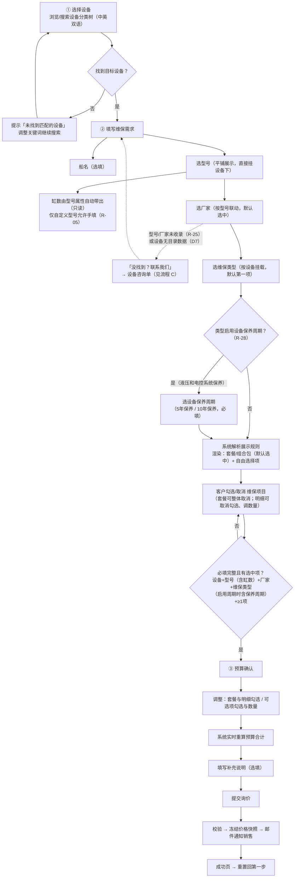

#### 流程 B：目录主数据维护流程（后台）

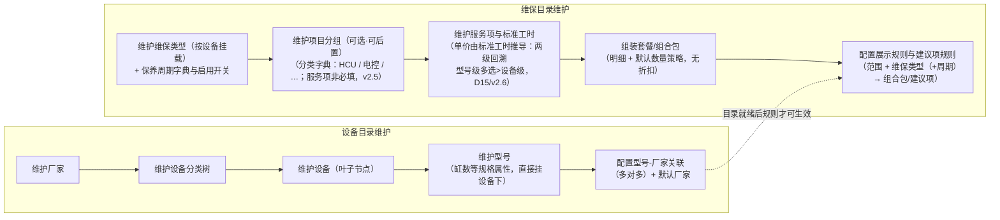

#### 流程 C：未收录设备咨询流程（前台例外流程）

客户在型号/厂家选择处点"没找到？请联系我们"：


> 关键区别：**咨询单**只做线索收集，不算预算、不进询价流程；**询价单**是完整的"设备上下文 + 方案选择 + 预算快照"。两者是不同的聚合，见第 6.4 节。

### 2.4 系统边界

| 系统内（本期建设） | 系统外（预留，不建模） |
|------------------|----------------------|
| 设备/维保目录维护 | 客户主数据（用已有用户体系，登录态取姓名/电话/邮箱） |
| 展示规则解析 | 销售跟进过程管理（CRM） |
| 预算实时计算 | 正式报价单、订单、合同 |
| 询价单/咨询单受理与邮件通知 | 支付、结算 |

---

## 3. 统一语言（Ubiquitous Language）

所有文档、代码、沟通统一使用以下术语。**歧义词在"辨析"列说明**。

### 3.1 设备侧术语

| 术语 | 英文 | 定义 | 备注 |
|------|------|------|------|
| 设备分类 | Equipment Category | 层级树（如：机械设备主要部件 → 推进用柴油机 → 柴油机 → 主机柴油机），**仅用于导航**，不参与定价 | Demo 4 级，编码如 601.001 |
| 设备 | Equipment | 分类树的叶子节点，一类可维保设备（如 主机柴油机 Main diesel engine）。**维保类型挂在设备上** | |
| 型号 | Model | 设备的**具体机型**（如 6S35ME，含缸数 6）。**型号直接挂在设备下，无中间层级（D1 已决）** | 型号 = 设计 + 缸数（D3 方案 A）；Demo 种子已按此口径使用具体机型（6S60MC-C 等，名称自带缸数） |
| 缸数 | Cylinder Count | 参与计价的关键规格参数（1–20 整数）。**是型号的固有属性（D3 已决：方案 A），选型号后自动带出、只读**；仅未收录的"自定义型号"由客户手填 | 表设计 v1.0 方向 |
| 厂家 | Manufacturer | 型号的生产方（含授权生产）。**直接挂在型号上（多对多，D1 已决）** | 型号-厂家为**多对多** |
| 默认厂家 | Default Manufacturer | 前端默认选中的厂家 | 必须属于该型号的关联厂家集合 |

### 3.2 维保目录侧术语

| 术语 | 英文 | 定义 | 备注 |
|------|------|------|------|
| 维保类型 | Maintenance Type | 一类维保服务（液压和电控系统保养 / 健康检查 / 监工服务 / 车间保养测试 / 常规吊缸类 / 故障排查维修 / 部件翻新） | 按设备挂载；D10："5年保养/10年保养"不再是维保类型 |
| 设备保养周期 | Maintenance Cycle | 维保类型下的细分参数（**5年保养 / 10年保养**），全局字典 | 维保类型**启用周期**（cycleFlag）后，选择该类型时前端展示周期下拉、必填；目前仅"液压和电控系统保养"启用（D10） |
| 项目分组 | Project Group | 服务项的**可选分类属性**（全局字典，如 HCU、HPS、电控系统、转速测量系统），仅用于前端归组展示；**服务项可不属于任何分组**（未分组 = 合法，前台归入"其他"） | D2 已决；v1.7 修订：由"维保类型下分组"改为服务项属性；**v2.5 修订：归属改为可选（`0..1`），非必填** |
| 服务项 / 维修项目 | Service Item | **最小计价单元**（如 Accumulator overhaul），含计量单位（EA/set） | v2.0：不再持有单价；v2.4/D15 起由标准工时推导（6.2.1） |
| ~~服务项价格~~ | ~~Service Item Price~~ | **已退役（v2.4/D15）**：聚合根删除，无独立价格表 | 原 D12 能力由标准工时的型号级配置承载（IN-MC-12） |
| ~~定价路径~~ | ~~Price Mode~~ | **已退役（v2.4/D15）**：`priceMode` 字段删除，**统一工时推导**（标准工时聚合 × 职级费率卡） | 工时推导输出仍是"该型号该服务项的单价"，预算行骨架不变 |
| 职级 | Job Rank | 工程服务人员技能等级字典（T5/T4/P5/P4/P3/P2），如吊缸人员配置 `T4×1+P5×1+P4×1+P3×2` | v2.3 新增（D14）；字典，本身无价格 |
| 职级费率卡 | Rank Rate Card | 各职级每小时费率，**带生效期**（调薪只改费率卡） | v2.3 新增聚合根（D14）；按计算时点取生效卡 |
| ~~机型组~~ | ~~Model Group~~ | **已删除（v2.6）**：缸径系列共享工时改由标准工时**型号级配置多选型号**直接表达，不再需要该聚合 | v2.3 新增（D14）；v2.6 删除 |
| 标准工时 | Labor Standard | 服务项 × 适用范围（型号级可多选型号 / 设备级）→ 人员配置 + 单件标准工时 + 计件基准（+缸数分档）；"天"按 8 小时折算 | v2.3 新增聚合根（D14）；v2.6 两级化：回溯 型号级 > 设备级 |
| ~~件数工时系数~~ | ~~Labor Qty Coefficient~~ | **已删除（v2.13，D18）**：多件作业效率折减口径废除——行金额 = Σ(职级费率×人数) × 单件标准工时 × 数量，无任何件数系数 | 原 v2.3 新增字典（D14）；退役理由：业务方确认不需要件数折算（多件按全额计） |
| ~~基础服务费~~ | ~~Base Service Fee~~ | **已退役（v2.10，D13 → D16）**：改为**保底价**机制（见 3.3 与 6.3），不再加收固定额 | 原口径：按 维保类型+（周期）+范围 配置固定额，订单级加收一次；查询示例与表结构的 `base_service_fee` 同步退役 |
| 服务地点 | Service Location | **三级主数据树**：大地区 > 具体国家 > 地点（如 东南亚 > 新加坡 > 裕廊船厂）；供客户在询价时级联选择 | v2.10 新增（D17）；系数可配在**任意一级**，解析 **地点级 > 国家级 > 大地区级**，规则行留空 = 该维度任意（IN-MC-19） |
| 影响系数规则 | Pricing Coefficient Rule | 订单级乘数的配置规则：**紧急程度**（按取值）、**地点系数**（按服务地点主数据）、**时间系数**（按距询价天数区间） | v2.10 新增聚合根/字典（D17）；解析唯一命中、未命中 = 1.0（IN-MC-16～18） |
| 保底参数 | Pricing Param | 保底价机制的全局参数：**最低计费工时**（`min_billable_hours`，默认 8 小时/天）、保底开关、**"天"→小时折算**（`hours_per_day`，默认 8） | v2.10 新增（D16）；**两项工时参数默认值相同（8）但相互独立**：`min_billable_hours` 只用于保底价，`hours_per_day` 只用于标准工时的"天"折算（R-33） |
| 数量策略 | Quantity Policy | 明细默认数量怎么来：固定值 / 按缸数自动 / 每2缸自动（v2.3 增第三类，D14/R-35） | v2.0：客户对套餐明细与建议项数量**均可调**（≥1），策略只给默认值 |
| 套餐 / 组合包 | Package | 服务项的**预打包推荐组合**：默认整体勾选，可整体取消，明细可取消勾选、调数量 | 有推荐标识；**无折扣、无一口价**（D9/D11）；v2.0 删除定价模式 |

### 3.3 交易侧术语

| 术语 | 英文 | 定义 | 辨析 |
|------|------|------|------|
| 预算 / 预算估算 | Budget | 系统按目录规则实时算出的价格结果，含明细行与合计 | **给客户看的参考价，不是成交价** |
| 预算行 | Budget Line | 预算里的一行（某服务项 × 数量 × 单价 = 行金额） | |
| 询价单 | Inquiry | 客户提交的完整询价记录：设备上下文 + 方案选择 + **价格快照** + 补充说明 | 提交后只读 |
| 价格快照 | Price Snapshot | 提交时刻冻结的预算明细；此后目录调价不影响历史询价单 | |
| 建议项 / 自由选择项 | Suggested Item | 套餐外可选加的服务项，按项目分组展示，可勾选、可调数量 | 与"套餐内项目"相对 |
| 设备咨询单 | Contact Request | "没找到？联系我们"生成的线索单，只有文本描述，无预算 | 不是询价单 |
| 补充说明 | Remarks | 提交询价时的备注（交期、差旅等要求） | 选填 |
| 是否紧急 | Urgency | 客户对本次服务的紧急程度（**不紧急 / 紧急**，字典可扩展），订单级 | v2.10（D17）；后台按取值配置紧急系数（R-38） |
| 服务时间 | Service Date | 客户期望的服务**具体日期**；派生 **距询价天数 = 服务日期 − 提交日期**（自然日，当天 = 0） | v2.10（D17）；不得早于提交日（IN-INQ-05） |
| 保底价 / 合计保底价 | Floor Price | 整单的**最低收费下限**：各**已勾选服务项**按"人工最低一天（默认 8 小时）"折算的**项保底价**之和 | v2.10（D16）；**下限保护**，不足才托底、充足不改价 |
| 项保底价 | Item Floor Price | 单个服务项的兜底价 = 该项**人员配置综合费率 × 最低计费工时** | **按一份计**：不乘数量、不看实际标准工时（R-30） |
| 保底补足额 | Floor Shortfall | 触发保底时的差额 = Max(0, 合计保底价 − 明细合计) | 未触发 = 0 |
| 影响系数 | Pricing Coefficient | 订单级乘数：**Max(紧急系数, 地点系数, 时间系数)**（取三者最大值，各未配置 = 1.0） | v2.10（D17）；只作用于**最终报价**（R-41），不进明细行/小计/保底价 |
| 最终报价 | Final Price | **Max(合计保底价, 明细合计) × 影响系数** | 预算输出值（原"预算合计"改称）；仍是**参考价**，成交价在系统外 |

### 3.4 易混概念辨析

| 易混点 | 辨析 |
|--------|------|
| 设备 vs 型号 | 设备是"一类机器"（分类树叶子），型号是"一个设计"（含缸数规格，直接挂设备下，D1 已决）。客户船上具体那台 = 型号（× 厂家） |
| 预算 vs 报价 | 预算 = 系统算的参考价（本系统输出）；报价 = 销售人工确认的成交价（系统外） |
| 保底价 vs 折扣 | 保底价是**下限保护**（明细不足时托底，充足时**不生效、不改价**）；折扣是往下削价。保底价只会把价格"托"上来，永不会压低价格 |
| 保底价 vs 原基础服务费 | 原"基础服务费"（D13，已作废）是**固定加收**（明细合计 + 固定额，总要收）；"保底价"（D16）是**下限比较**（取高者，不足才补）。都订单级一次、都不随明细增减被放大 |
| 影响系数 vs 折扣 | 影响系数作用于**订单最终报价**（服务条件：紧急/远地/临近排期）；折扣是促销让利（套餐永不打折，D11）。位置与语义互不相同（原"件数系数"已退役，v2.13/D18） |
| 套餐 vs 项目分组 | 分组是服务项的**可选分类属性**（可为空——未分组服务项仍可被引用于套餐与建议项，仅前台归入"其他"；前端归组展示用，HCU 类、电控类）；套餐（组合包）是面向客户的**预打包推荐组合**（套餐明细直接引用服务项）。一个套餐自然可包含多个分组下的项目 |
| 默认勾选 vs 推荐 vs 建议 | 默认勾选：套餐命中展示规则后整体默认选中，但**客户可取消**（D9 后无"必选锁定"）；推荐：套餐级标识（前端展示"推荐"角标）；建议：套餐外的可选项（默认不勾） |

---

## 4. 子域划分

| 子域 | 类型 | 内容 | 理由 |
|------|------|------|------|
| **预算估算与询价** | **核心域** | 定价引擎、方案展示解析、询价单/咨询单受理 | 直接创造业务价值（自助转化线索），是系统存在的理由 |
| 设备目录 | 支撑域 | 分类树、设备、型号、厂家 | 核心域的数据基础；变更低频，模型相对稳定 |
| 维保目录 | 支撑域 | 维保类型、项目分组、服务项与标准工时、职级费率卡、**服务地点与影响系数（紧急/地点/时间）、保底参数**、套餐、展示规则 | 核心域的数据基础；**运营日常在此工作**，易变（原"基础服务费"已退役，v2.10） |
| 用户身份 | 通用域 | 登录态、用户信息 | 已有系统，直接复用，不建模 |
| 邮件通知 | 通用域 | 发邮件给销售 | 成熟能力，买/用现成方案 |

---

## 5. 限界上下文与上下文映射

### 5.1 四个限界上下文

| 上下文 | 职责 | 对应子域 | 关键对象 |
|--------|------|---------|---------|
| **设备目录上下文** Equipment Catalog | 回答"有什么设备、什么型号、谁生产" | 支撑域 | 设备、型号（含缸数规格）、厂家 |
| **维保目录上下文** Maintenance Catalog | 回答"这类设备能做什么维保、什么价、怎么打包、给谁看、**服务条件怎么调价**" | 支撑域 | 维保类型、项目分组、服务项、标准工时、职级费率卡、**服务地点、影响系数规则（紧急/地点/时间）、保底参数**、套餐、展示规则 |
| **预算估算上下文** Estimation | 回答"这一单大概多少钱"——纯计算，无状态 | **核心域** | 定价引擎（领域服务）、预算、定价上下文 |
| **询价受理上下文** Inquiry | 受理询价与咨询、冻结快照、通知销售 | **核心域** | 询价单、设备咨询单 |

### 5.2 上下文映射

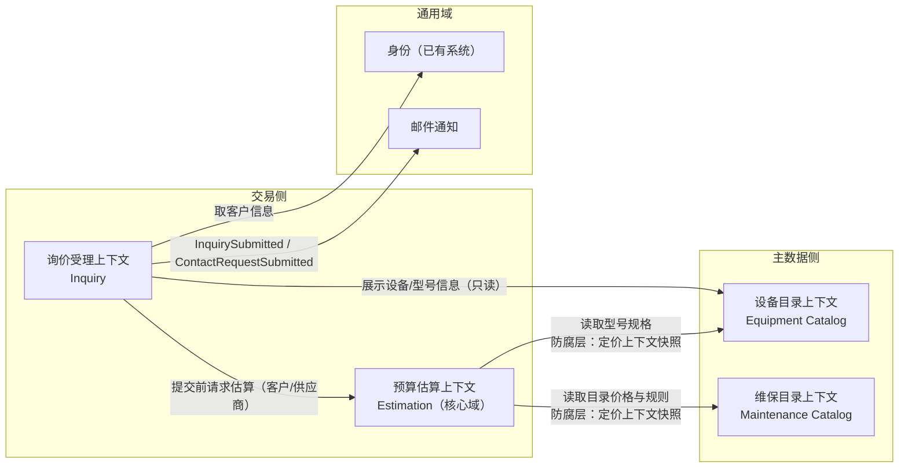

**映射关系说明**：

| 上游 → 下游 | 关系 | 防腐手段 |
|------------|------|---------|
| 设备目录 / 维保目录 → 预算估算 | 客户/供应商（Customer-Supplier） | 估算上下文只接收**定价上下文快照**（值对象），不直接依赖主数据表结构；目录调价不影响已算出的预算 |
| 设备目录 / 维保目录 → 询价受理 | 只读引用 | 询价单内嵌**价格快照**，提交后与主数据解耦 |
| 询价受理 → 邮件通知 | 发布/订阅 | 通过领域事件 `InquirySubmitted` 触发，通知方式可替换 |
| 身份 → 询价受理 | 遵奉者（Conformist） | 直接取登录态字段，不自建客户模型 |

> **为什么不合并目录与估算**：目录是"维护型"模型（运营增删改），估算是"计算型"模型（无状态纯函数）。合并会让价格计算逻辑被维护逻辑污染，也无法独立演进定价规则。

---

## 6. 领域模型详解

### 6.0 领域模型全景

全景类图展示四个上下文的**核心**聚合、实体、值对象及其**主要**关系（策略子类、型号-厂家关联实体、工时子模型的构成行/缸数分档、客户信息等细节见各上下文详细类图 6.1～6.4，工时子模型见 6.2.1）：

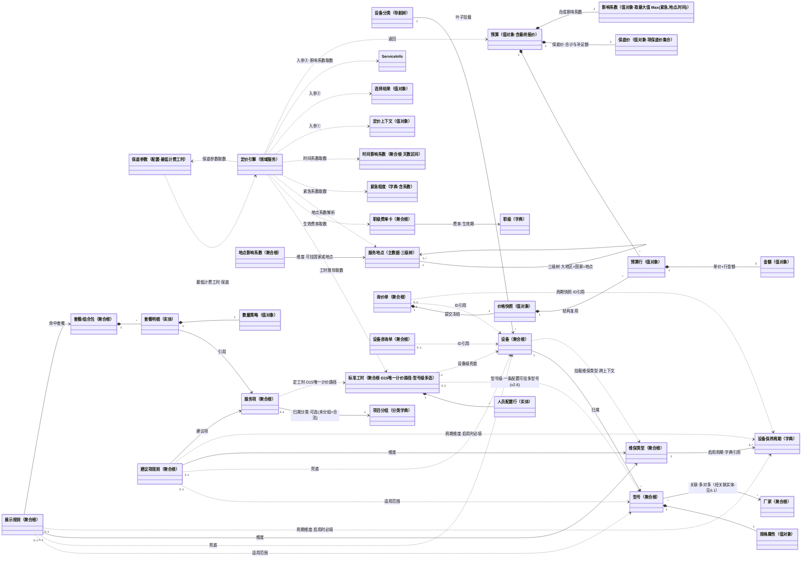

**类图图例**（本文档所有类图统一遵循）：

| 关系 | 语义 | 约定 |
|------|------|------|
| `*--` 组合 | 聚合根拥有实体/值对象 | 同生命周期、同事务保存；外部只能经聚合根访问 |
| `-->` 引用 | 跨聚合关联 | **按 ID 引用**，不级联、不联表约束 |
| `..>` 依赖 | 领域服务的入参/返回 | 或跨上下文的弱依赖（如展示规则引用型号） |
| `<|--` 继承 | 策略族的多态实现 | 如 数量策略 ← 固定数量/按缸数自动 |
| `"1"` `"*"` `"0..1"` `"2"` | 关联基数 | 标在连线两端；**`"0..1"` = 可空/可选引用**——"可空"一律用基数表达，不写文字 |

**线标签（冒号后文案）读法约定**——标签由以下四种成分构成：

| 成分 | 形式 | 示例 | 读法 |
|------|------|------|------|
| 关联名/角色名 | 动词短语 | `Equipment "1" --> "*" Model : 归属` | 顺线读成句："型号 **归属** 于设备" |
| 基数（表达可选） | 端点上的 `"0..1"` | `DisplayRule "0..1" ..> Model : 适用范围` | 一条规则引用零或一个型号（规则可不绑型号） |
| 注释 | `·` 分隔的后缀 | `ServiceItemPrice "0..1" ..> MaintenanceCycle : 周期维度·启用时必填` | `·` 后是约束/条件说明（UML 规范位置为 `{...}` 约束，此处压缩进标签） |
| 文档引用 | `（…）` 括号 | `Model "0..1" ..> Manufacturer : 默认厂家（IN-EQ-04）` | 括号指向本文档的不变量编号或章节，如"见 6.1" |

> 另注：`SuggestionRule --> ServiceItem : 建议项` 中的"建议项"是**角色名**（该服务项在此关系中扮演的角色）；`Inquiry "0..1" ..> Equipment : ID引用` 中的"ID引用"强调**按标识引用**（防腐层约定，见下）。

> **跨上下文引用说明**：凡虚线 `..>` 且跨上下文的（展示规则/建议项规则引用型号、设备；设备挂载维保类型；询价单/咨询单可空引用设备），均为防腐层内的**标识引用**（按 ID，不共享模型）；询价单的价格快照在结构上复用预算行（估算上下文的值对象），但提交后与目录完全解耦（IN-INQ-02）。

---

### 6.1 设备目录上下文

**职责**：维护"设备 → 型号 → 厂家"的主数据（无系列层级，D1 已决），为估算与询价提供设备上下文。

| 类型 | 对象 | 说明 |
|------|------|------|
| 聚合根 | 厂家 Manufacturer | 编码唯一；含中英文名 |
| 聚合根 | 设备 Equipment | 分类树的叶子；挂载可用的维保类型 |
| 聚合根 | 型号 Model | 归属设备；**含缸数规格属性（D3 已决）**；关联厂家集合 + 默认厂家 |
| 值对象 | 规格属性 ModelSpec | 缸数（必填）、功率、缸径等；参与计价 |
| 值对象 | 双语名称 BilingualName | 中文名 + 英文名（分类树与搜索都用到） |
| 值对象 | 分类路径 CategoryPath | 只读导航，不参与定价 |

**类图关系**：

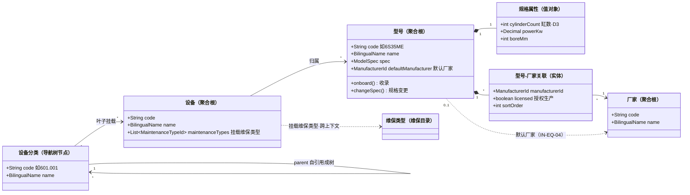

> 型号-厂家关联（`ModelManufacturerLink`）是型号聚合**内部**的实体（组合 `*--`）；对厂家本体只是按 ID 引用（`-->`）。设备分类树仅导航，与设备是弱关联。

**不变量**：

- IN-EQ-01 型号编码全局唯一
- IN-EQ-02 型号必属唯一设备
- IN-EQ-03 型号与厂家多对多；同一组合不重复；可标记"授权生产"
- IN-EQ-04 默认厂家必须属于该型号的关联厂家集合

**领域事件**：`型号已收录 ModelOnboarded`、`型号规格已变更 ModelSpecChanged`、`厂家已关联 ManufacturerLinked`

---

### 6.2 维保目录上下文

**职责**：维护"某设备在某维保类型下，展示什么方案、什么价格"的全部规则。

#### 聚合与对象

| 类型 | 对象 | 说明 |
|------|------|------|
| 聚合根 | 维保类型 MaintenanceType | 名称、**是否启用设备保养周期 cycleFlag**；按设备挂载（聚合内无分组，v1.7 修订） |
| 字典 | 设备保养周期 MaintenanceCycle | 全局字典（5年保养 / 10年保养）；启用周期的维保类型引用其作为下拉选项（D10） |
| 分类字典 | 项目分组 ProjectGroup | **全局字典表**（如 HCU、电控系统…），**仅用于前端归组展示**；服务项以 group_id **可选**多对一归属（`0..1`，v2.5：非必填，未分组为合法状态；v1.7 由维保类型聚合内实体降级为字典） |
| 聚合根 | 服务项 ServiceItem | 最小计价单元：名称、计量单位（EA/set/次/缸）、**归属分组（可选，`0..1`）**；**不持有单价且无价格表**（v2.0 剥离 → v2.4/D15 直价退役，统一由标准工时推导） |
| ~~聚合根~~ | ~~服务项价格 ServiceItemPrice~~ | **已退役（v2.4/D15）**——见 6.2.1 标准工时（唯一计价模型） | 
| ~~聚合根~~ | ~~基础服务费规则 BaseServiceFeeRule~~ | **已退役（v2.10，D13 → D16）**：固定加收口径废除，改为**保底价**（R-30；值对象见 6.3） | 
| 主数据 | 服务地点 ServiceLocation | **三级树**（大地区 > 具体国家 > 地点），供客户级联选择；系数可挂在**任意一级**（IN-MC-19） | 
| 聚合根 | 地点影响系数 LocationCoefficient | 服务地点（大地区/国家/地点）→ 系数；解析 **地点级 > 国家级 > 大地区级**，规则行留空 = 该维度任意（区域兜底），未命中 = 1.0 | 
| 字典 | 紧急程度 UrgencyLevel | 取值字典（不紧急 / 紧急 / …）→ **紧急系数**；客户所选值即维度 | 
| 聚合根 | 时间影响系数 LeadTimeCoefficient | 距询价天数区间 [min, max] → 系数；区间**不重叠且全覆盖 [0,∞)**（IN-MC-18） | 
| 配置 | 保底参数 PricingParam | **最低计费工时**（默认 8 小时/天）+ 保底开关；保底价计算取数（D16） | 
| 聚合根 | 套餐 Package | 名称、说明、推荐标识、套餐明细列表；**组合包，无定价模式/折扣率/覆盖价**（D9/D11） |
| 实体 | 套餐明细 PackageLine | 引用服务项 + **数量策略**（默认数量来源）；客户可取消勾选、可调数量（v2.0：无 removable 标志） |
| 值对象 | 数量策略 QuantityPolicy | **固定值 n / 按缸数自动 / 每2缸自动（缸数÷2 向上取整，v2.3）**；都只决定默认值，客户均可调（≥1） |
| 聚合根 | 展示规则 DisplayRule | 适用范围（型号级/设备级）+ 维保类型 +（保养周期，启用时必填）→ 套餐；**无必选性标志**（套餐默认勾选但客户可整体取消，D9） |
| 聚合根 | 建议项规则 SuggestionRule | 适用范围 + 维保类型 +（保养周期）→ 服务项 + 建议徽标 + 默认勾选（预留）+ 默认数量来源 |

**类图关系**：

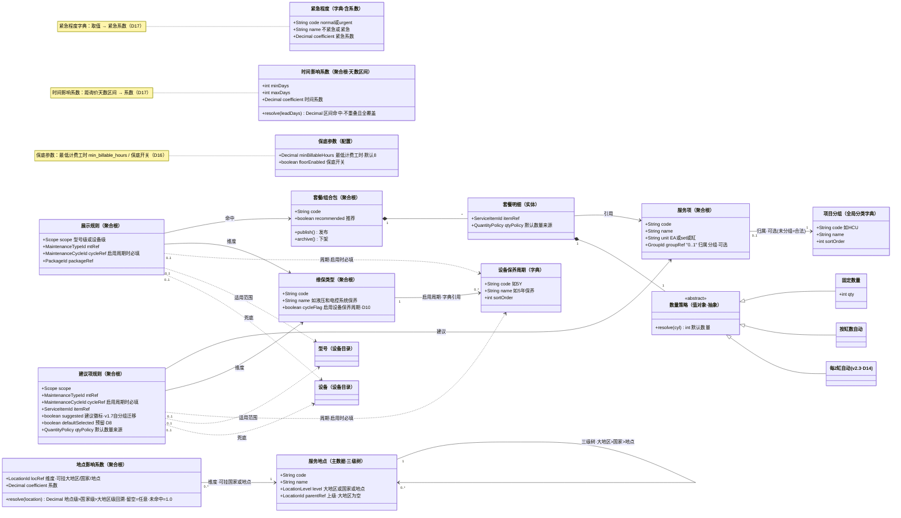

> **v2.0 建模要点**：① **价格独立成聚合**——单价既随服务项走，也随 维保类型/周期/型号范围 变化，任何单一宿主（服务项或套餐）都装不下这个维度组合，故建 `ServiceItemPrice` 聚合根；② **数量策略只给默认值**——组合包语义（D9）下客户可调一切明细数量，FixedQty/AutoCylinderQty 的区别只剩"默认数量怎么来"，UserInputQty 子类删除（不再有"不可调"数量）。

#### ⭐ 核心建模洞察：标准工时推导单价 × 数量策略（D15 唯一路径）

头脑风暴/表设计 v1.0 的四种"定价方式"（fixed / per_cylinder / per_unit / tiered）混合了两个独立维度，v1.4 曾拆成"单价策略 × 数量策略"正交分解；v2.0（D12）进一步把**单价本身从服务项定义中剥离**：

> **一个预算行 = 型号维度单价（标准工时按 型号级(多选)>设备级 两级回溯推导，D15/v2.6） × 数量（默认值由数量策略给出，客户可调）**

| 原定价方式 | v2.4/D15 表达 | 等价公式 |
|-----------|----------|---------|
| fixed 固定价 | 标准工时（设备级：固定人员配置×单件工时） | 推导单价 × 1 |
| per_cylinder 按缸数 | 标准工时（qty_basis=per_cylinder，可型号级差异化） | 推导单价 × 缸数（数量策略=按缸数自动） |
| per_unit 按数量 | 标准工时（qty_basis=per_unit） | 推导单价 × 客户调整后数量 |
| tiered 阶梯价 | **退役**——缸数分档（DurationTier）+ 型号级标准工时覆盖其能力 | 标准工时按 缸数分档/型号 差异化配置 |

这样拆分后：

- **不同型号、同一维保类型、同一保养周期、同一服务项，价格可以不同**（D12 的原始诉求）——差异型号配型号级标准工时（可多选），其余用设备级兜底（D15/v2.6 载体）；
- 阶梯价（按缸数区间取档）退役：它表达不了"同缸数不同型号不同价"（如 6S35 与 6S40 同为 6 缸），标准工时的 缸数分档 + 型号级 配置完全覆盖；
- 缸数继续通过**数量策略**（按缸数自动）参与计价，且"缸数双乘"（原 IN-MC-07）结构性不可能——单价由工时推导，不依赖缸数公式；
- 调薪/调工时只动 费率卡/标准工时，服务项定义与套餐结构不受影响，领域事件 `RankRateChanged` / `LaborStandardChanged` 发布（见 6.2.1）。

**不变量**：

- IN-MC-01 服务项编码唯一
- IN-MC-02 ~~Tiered 必须配置档位~~ **已作废（D12）**：阶梯价机制退役
- IN-MC-03 ~~dynamic 折扣率~~ **已作废（D11）**：折扣机制退役
- IN-MC-04 ~~fixed 覆盖价锁定明细数量~~ **已作废（D11）**：一口价机制退役
- IN-MC-05 数量策略为"按缸数自动"的服务项，定价时型号上下文必须提供缸数
- IN-MC-06 同一（适用范围 + 维保类型 + 保养周期）下，同一套餐/服务项的规则不得重复
- IN-MC-07 ~~单价与数量不得同时依赖缸数~~ **已作废（D12）**：单价不再按缸数公式计算（价格按型号解析），“按缸数”只出现在数量维度
- IN-MC-08 ~~（v2.0）价格解析唯一命中~~ **已作废（v2.4/D15）**：直价/服务项价格退役；唯一命中语义由 IN-MC-12（标准工时两级回溯，v2.6）承载
- IN-MC-09 **（v2.0，v2.4 随 D15 修订载体；v2.10 移除基础服务费）周期一致性**：启用周期的维保类型，其标准工时、展示规则、建议项规则必须带周期；未启用周期的，不得带周期
- IN-MC-10 **（v2.0，v2.4 随 D15 修订载体；v2.10 移除基础服务费）配置范围互斥**：标准工时/展示规则/建议项规则的范围同款约束——型号级时设备上下文必须与型号一致，设备级时设备必填，两者不得同时缺位
- ~~IN-MC-11~~ **（v2.1 新增，v2.10 作废）基础服务费唯一命中**：随 **BaseServiceFeeRule 聚合退役**（D13 → D16）而作废；其"唯一命中"护栏语义由 **IN-MC-16～IN-MC-18**（影响系数规则）承接，保底价的订单级一次比较见 **R-30**
- IN-MC-16 **（v2.10 新增）影响系数规则唯一命中**：同一维度同一取值至多一条**启用**的系数规则——紧急按紧急程度取值、地点按服务地点主数据（同一地点至多一条）、时间按天数区间；未命中一律视为 **1.0**（不报错、不丢价）
- IN-MC-17 **（v2.10 新增）影响系数取值合法**：系数必须 > 0（拒绝 0 与负数）；建议区间 [0.5, 3.0]，超出时**保存告警**（不拒绝）；紧急程度字典为封闭字典，客户只能选已启用项
- IN-MC-18 **（v2.10 新增）时间系数区间完整性**：时间影响系数的天数区间必须**不重叠且全覆盖 [0, +∞)**，否则**拒绝保存**（与 IN-MC-14 缸数分档同款区间护栏）
- IN-MC-19 **（v2.10 新增）服务地点树层级与系数挂载**：ServiceLocation 固定**三级**（大地区 > 国家 > 地点）：大地区无上级、国家必挂大地区、地点必挂国家；**系数可挂任意一级**，解析 **地点级 > 国家级 > 大地区级**，规则行**留空字段 = 该维度"任意"**（区域/国家兜底行，同一优先级内至多一条）；同一父节点下同级名称唯一

**领域事件**：`套餐已发布 PackagePublished`、`套餐已下架 PackageArchived`、`展示规则已配置 DisplayRuleConfigured`；原 `服务项价格已调整 ServiceItemPriceChanged` 随 D15 退役，价格变更由 6.2.1 的 `职级费率已调整 RankRateChanged` / `标准工时已维护 LaborStandardChanged` 承载

#### 6.2.1 工时计价子模型（v2.3 新增，D14）

> 适用**全部服务项**（v2.4/D15 起**唯一**计价路径：`ServiceItem.priceMode` 字段随直价退役删除）。源数据：《传统二冲机维修项目评估清单_职级更新.xls》，3 品牌 × 4~5 缸径系列 × 28 维修项目 的人工时间矩阵；原固定价服务项（如健康检查包价）按清单/经验补录"人员配置+工时"。

| 类型 | 对象 | 说明 |
|------|------|------|
| 聚合根 | 标准工时 LaborStandard | 维度 = 服务项 +（维保类型+（周期））+ 适用范围（**型号级（多选型号） / 设备级**，两级回溯，v2.6）；成员：型号级适用型号（models，型号级时 ≥1）、人员配置（CrewLine 实体列表）、单件标准工时（小时，"天"×8 折算）、计件基准（单件/每缸/每2缸/整台）、缸数分档（DurationTier 实体列表，可空）、算法/风险说明 |
| 实体 | 人员配置行 CrewLine | 职级 + 人数；**计费依据**（"N人"为派生校验值）；同一标准工时内职级唯一（P4×2 而非 P4×1+P4×1） |
| 实体 | 缸数分档 DurationTier | [min缸数, max缸数] → 该档单件工时（如 贯穿螺栓 6缸 10h / 8-10缸 13h / 11-12缸 18h）；档位区间不重叠 |
| 聚合根 | 职级费率卡 RankRateCard | 职级 → 每小时费率（Money）+ 生效期 [from, to)；按计算时点取各职级当前生效行；**调薪只改费率卡，全部工时推导价自动跟随** |
| 字典 | 职级 JobRank | T5/T4/P5/P4/P3/P2 |
| ~~字典~~ | ~~件数工时系数 LaborQtyCoefficient~~ | **已删除（v2.13，D18）**：件数系数整体退役——多件作业不再折减，行金额 = 单价 × 数量 |
| ~~聚合根~~ | ~~机型组 ModelGroup~~ | **已删除（v2.6）**：型号级多选配置取代该聚合（见表设计 v2.2 3.23 退役说明） |

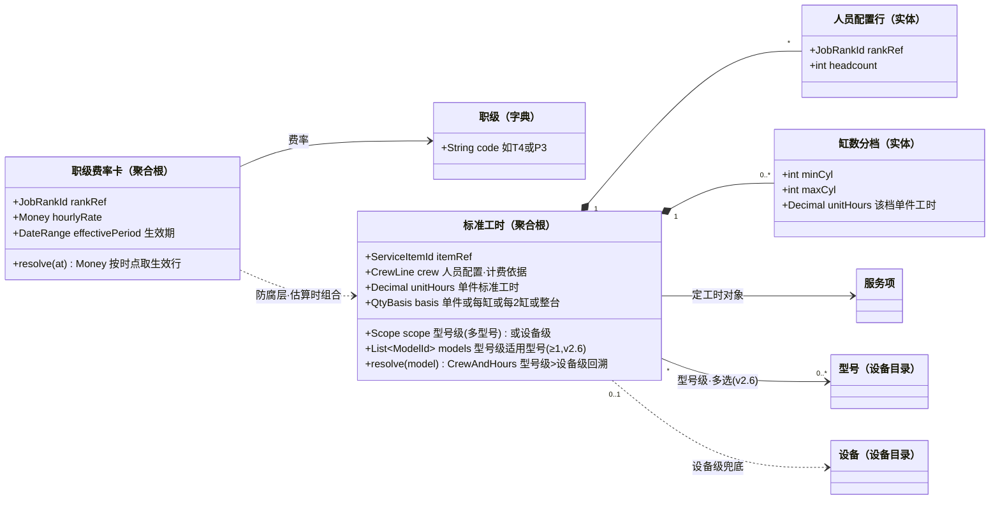

**工时计价不变量**：

- IN-MC-12 **（v2.3；v2.6 两级化）工时配置唯一命中**：同一（服务项 + 维保类型 +（周期））下，适用范围按 **型号级（一条配置可挂多型号）> 设备级** 回溯，至多命中一条**启用**的标准工时；型号级唯一性 = 同上下文下一台型号至多出现在一条启用配置的 models 中；两级都未命中则该明细不可计价（前台不展示/提示，后台预警——与 IN-MC-08 同款处理）
- IN-MC-13 **（v2.3）构成与费率完整**：服务项的标准工时必须至少一条构成行；计算时点各职级必须存在生效费率行（缺任一 → 不可计价并预警）；构成行内职级不重复；导入/保存时校验 人数 ≠ Σ构成人数 则告警（人数为派生参考，费用按构成行计）
- IN-MC-14 **（v2.3；v2.13 收敛为缸数分档）缸数分档区间完备**：min ≤ max、区间不重叠，有分档必须全覆盖 1–20 缸；**缸数未命中任何档 = 配置错误，该行不可计价并预警**（同 IN-MC-12R，不回退主表工时）。原"件数系数区间完备"部分随件数系数退役作废（**IN-MC-14a 作废**，D18）
- IN-MC-15 **（v2.3；v2.13 修订）推导要素快照**：提交时冻结 职级费率明细、人员配置、单件标准工时与推导单价；此后费率卡/工时配置变更不影响历史询价单（IN-INQ-02 同款原则）
- ~~IN-EQ-05~~ **（v2.3；v2.6 作废）机型组归属唯一**：机型组聚合已删除，该不变量随之作废（型号级配置的唯一性约束并入 IN-MC-12）

**领域事件**：`职级费率已调整 RankRateChanged`（触发全部工时推导价变化，前台预算实时重算）、`标准工时已维护 LaborStandardChanged`

---

### 6.3 预算估算上下文（核心域，纯领域服务）

**职责**：给定定价上下文与客户选择，算出预算。**无状态、无持久化**，是纯函数式的领域服务。

#### ⭐ 组合包定价速览（全景先行，细节见下文对象表与 7.3）

> **一句话：预算就是把每一行"单价 × 数量"加起来——单价不手填，统一按 标准工时聚合（两级回溯命中：型号级（多选）> 设备级，v2.6）× 职级费率卡 推导（D14/D15，见 6.2.1/7.3；v2.13 件数系数已退役）；数量取数量策略默认值并允许客户调整；套餐（组合包）只是预打包这些行，不做任何价格归总。**

| | 组合包（v2.0，唯一形态） |
|--|----------------|
| 套餐小计 | **Σ(勾选明细行金额)**——无折扣率、无一口价、无份数（D11，v2.9） |
| 随型号变吗 | ✅ 自动变（价格按型号解析，型号级行覆盖设备级） |
| 明细 | 客户可取消勾选、可调数量（≥1，默认值由数量策略给出，D9）；默认数量 = 固定值 / 缸数 / 缸数÷2（每2缸，D14） |
| 取消套餐 | 客户可整体取消，取消后明细全部不计价（D9） |

**最终报价 = Max(合计保底价, 明细合计) × 影响系数**（v2.10，D16/D17；原"预算合计 = 明细合计 + 基础服务费"已作废）。其中 明细合计 = Σ(各套餐小计) + Σ勾选建议项行金额（R-19）；合计保底价 = Σ(各**已勾选**服务项的项保底价)，项保底价 = 该项**人员配置综合费率 × 最低计费工时**（默认 8h，**按一份计**：不乘数量，R-30）；影响系数 = Max(紧急系数, 地点系数, 时间系数)（各未配置 = 1.0，**只作用于最终报价**，R-41，Q-9 已决）。护栏：标准工时两级回溯必须唯一命中（型号级（多选）> 设备级，IN-MC-12/v2.6；IN-MC-08 已随直价作废）；启用周期的类型标准工时必须带周期（IN-MC-09）；影响系数规则唯一命中（IN-MC-16）、系数 > 0（IN-MC-17）、时间区间不重叠且全覆盖（IN-MC-18）、地点树三级（IN-MC-19）。

| 类型 | 对象 | 说明 |
|------|------|------|
| 领域服务 | 定价引擎 BudgetCalculator | 唯一入口：`estimate(定价上下文, 选择结果) → 预算` |
| 值对象 | 定价上下文 PricingContext | 型号规格**快照**（缸数等）+ 维保类型 +（保养周期）+ 币种；从目录上下文经防腐层取得 |
| 值对象 | 选择结果 Selection | 套餐选择（套餐 + 勾选的明细 + 明细数量调整）、建议项选择（项 + 数量） |
| 值对象 | 预算 Budget | 预算行列表 + 各套餐小计（Σ勾选明细行金额）+ 建议项小计 + **明细合计 + 保底价（合计/补足额）+ 影响系数（三类与合成）+ 最终报价** |
| 值对象 | 保底价 FloorPrice | 项保底价集合（每项 = 该项综合费率 × 最低计费工时）+ **合计保底价** + **保底补足额**（D16/R-30） |
| 值对象 | 影响系数 PricingCoefficient | 紧急系数 + 地点系数 + 时间系数 + **合成系数**（取三者最大值，各默认 1.0）（D17/R-41，Q-9 已决） |
| 值对象 | 服务信息 ServiceInfo | **是否紧急 + 服务地点（大地区/国家/地点）+ 服务日期 + 距询价天数**；订单级输入，与设备/型号无关（D17/R-38～R-40） |
| 值对象 | 预算行 BudgetLine | 服务项、单价（工时推导的每件有效单价，D14/D15 唯一路径）、数量、行金额、所属套餐/建议区 |
| 值对象 | 金额 Money | 数额 + 币种（**必须带币种，默认 USD，D5 已决**） |

**类图关系**：

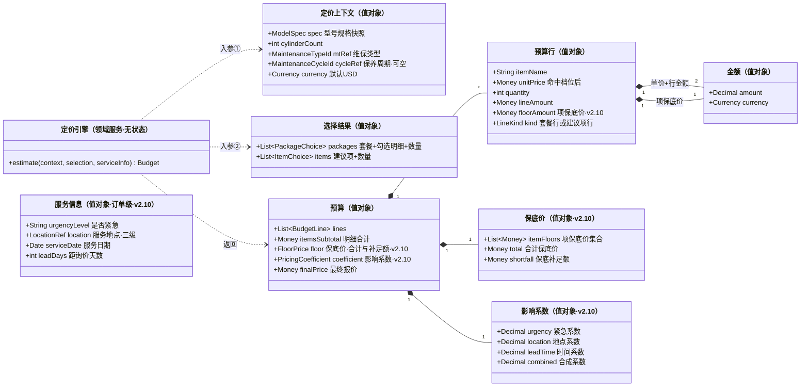

> 定价引擎是**无状态领域服务**：不持有任何对象，只消费两个入参值对象、产出一个预算值对象（可反复调用、随时重算，7.1 流程中每次选择变化都触发）。

**计算规则**（详见 7.3）：

```
实际单价     = 工时推导（唯一路径，D14/D15）：Σ(职级小时费率生效行 × 构成人数) × 单件标准工时（型号级(多选)>设备级 两级回溯，IN-MC-12/v2.6；缸数分档按型号缸数命中）
              → 得"单价"（v2.13：件数系数已退役，不再有系数环节，D18）
行金额       = 实际单价 × 数量（默认值 = 数量策略解析：固定值 / 缸数 / 缸数÷2（每2缸基准）；客户可调 ≥1）
套餐小计     = Σ(勾选明细行金额)              // 无份数（v2.9 取消）
明细合计     = Σ(套餐小计) + Σ(勾选建议项行金额)

项保底价     = Σ(职级小时费率生效行 × 构成人数) × 最低计费工时 Hmin   // Hmin = pricing_param.min_billable_hours，默认 8h（与 hours_per_day 独立）
合计保底价   = Σ(各已勾选服务项的项保底价)      // 按"一份"计：不乘数量、不看实际标准工时（R-30）
计价基数     = Max(合计保底价, 明细合计)         // D16：明细不足按保底托底
保底补足额   = Max(0, 合计保底价 − 明细合计)

紧急系数     = 紧急程度字典按客户所选取值（未命中 = 1.0，IN-MC-16）
地点系数     = 地点影响系数按 服务地点 解析（地点级 > 国家级 > 大地区级；留空=任意兜底；全未命中 = 1.0）
时间系数     = 时间影响系数按 距询价天数 命中区间（区间全覆盖 [0,∞)，IN-MC-18）
影响系数 K   = Max(紧急系数, 地点系数, 时间系数)   // D17：取最大值（Q-9 已决），只作用于最终报价（R-41）
最终报价     = Round(计价基数 × K, 2)
```

> **唯一路径（D15）**：全部服务项按本式推导，`ServiceItemPrice` 聚合与 `priceMode` 字段已退役。工时推导输出仍是"该型号该服务项的单价"，`BudgetLine` 结构不变（R-16 骨架）；各行额外携带推导要素（构成/费率/工时）与**项保底价**（v2.10），提交时随快照冻结（IN-MC-15/R-36），销售邮件与后台视图可见、客户侧默认只展示价格。
>
> **系数作用位置（v2.10）**：影响系数是**订单级**乘数，`BudgetLine` 与套餐小计、明细合计、合计保底价**均不含系数**——保证"每行怎么来的"可解释、快照可逐项复现；系数只出现在预算的最终报价环节。

---

### 6.4 询价受理上下文

**职责**：受理询价与咨询，冻结快照，发出通知。

#### 聚合：询价单 Inquiry（聚合根）

提交时从 Demo 收集的内容推断聚合结构：

| 组成 | 内容 | 来源 |
|------|------|------|
| 客户信息 | 姓名、电话、邮箱 | 登录态（只读拷贝） |
| 船舶信息 | 船名（选填） | 客户输入 |
| 设备上下文 | 设备、型号、缸数、厂家（含"自定义厂家/型号"文本） | 客户选择 |
| 维保需求 | 维保类型 +（设备保养周期，启用周期时） | 客户选择 |
| 服务信息（订单级） | **是否紧急**、**服务地点**（大地区/具体国家/地点）、**服务日期**（与派生的距询价天数） | 客户选择（R-38～R-40） |
| 方案与预算快照 | 套餐（明细行、小计）、建议项（明细行、小计）、明细合计、**保底价（项保底价/合计保底价/保底补足额）**、**影响系数（紧急/地点/时间/合成）**、**最终报价**、币种 | 定价引擎输出，**提交时冻结** |
| 补充说明 | 文本（选填） | 客户输入 |
| 受理信息 | 工单号、提交时间、来源渠道 | 系统生成 |

#### 聚合：设备咨询单 ContactRequest（聚合根）

厂家文本、型号文本、需求描述、客户信息、工单号、提交时间。**无预算、无状态流转**。

**类图关系**（询价单与咨询单是两个独立聚合，互不引用）：

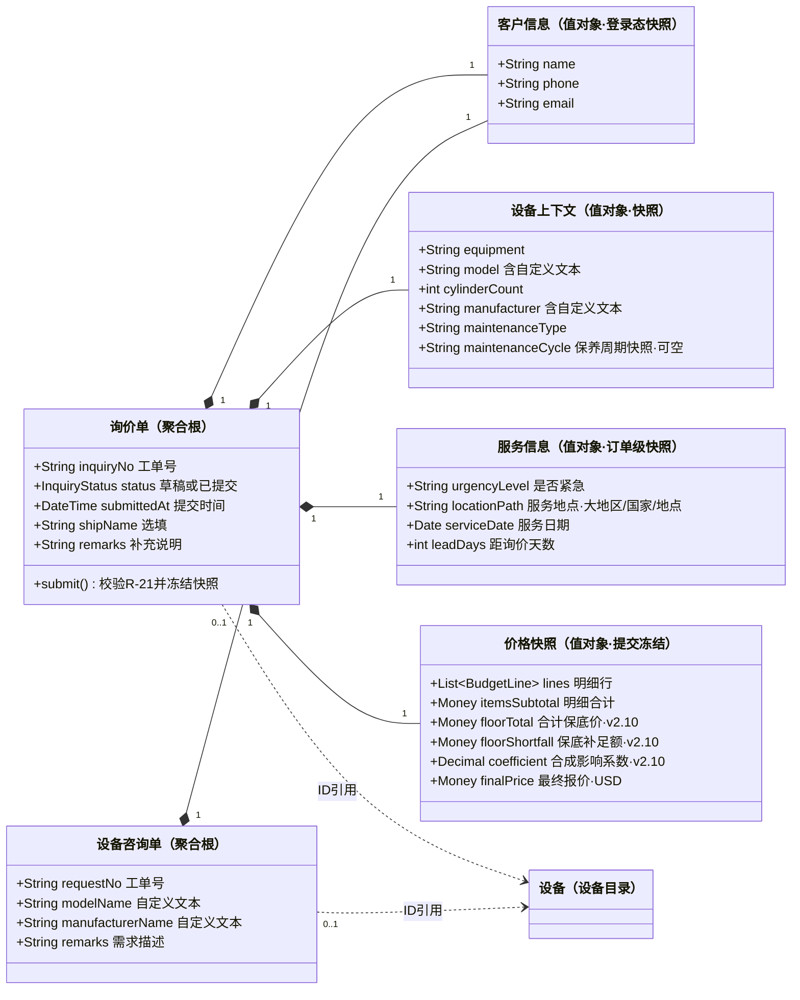

> 设备上下文与价格快照都是**值对象快照**：提交时从设备目录与定价引擎的输出拷贝冻结，此后与主数据完全解耦（IN-INQ-02）。`Equipment` 节点定义在设备目录上下文（6.1），此处仅为可空 ID 引用。

#### 询价单状态机

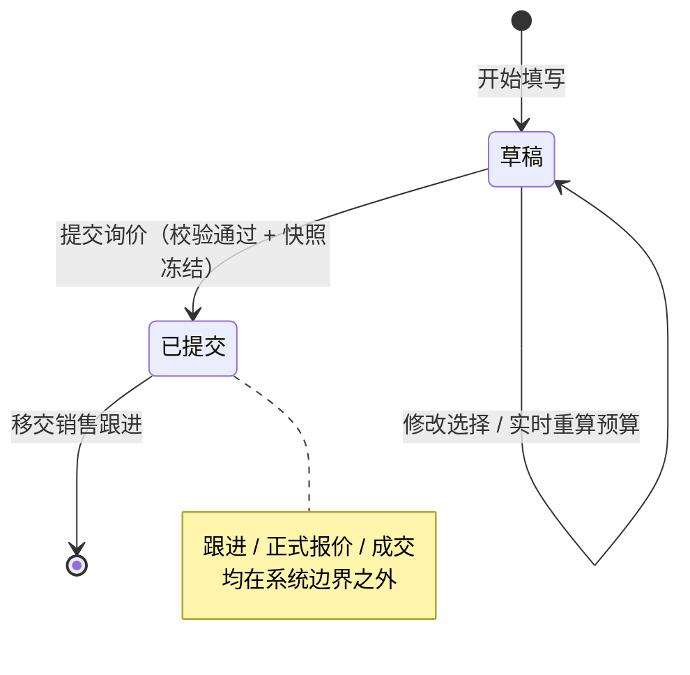

**不变量**：

- IN-INQ-01 提交前必须通过完整性校验（规则 R-21）
- IN-INQ-02 提交时冻结价格快照；此后目录调价、套餐下架**不影响**该询价单
- IN-INQ-03 已提交的询价单只读，不可修改
- IN-INQ-04 工单号全局唯一且不可变
- IN-INQ-05 **（v2.10 新增）服务日期不早于提交日**：服务信息为订单级必填（是否紧急 / 服务地点至少到具体国家 / 服务日期）；**服务日期不得早于提交日期**，距询价天数 = 服务日期 − 提交日期 ≥ 0（保证时间系数可解析、不出现负天数区间）
- IN-INQ-06 **（v2.10 新增）服务条件是订单级快照**：是否紧急 / 服务地点 / 服务日期及其命中的三类系数与合成系数，提交时随价格快照一并冻结；此后调整系数规则或地点主数据**不影响**历史询价单（IN-INQ-02 同款）

**领域事件**：`询价已提交 InquirySubmitted`、`设备咨询已提交 ContactRequestSubmitted`

---

## 7. 核心流程细化

### 7.1 前台询价流程逐步规则（对应 Demo 三步）

| # | 步骤 | 客户操作 | 系统行为（联动规则） | 涉及上下文 |
|---|------|---------|--------------------|-----------|
| 1 | 选择设备 | 浏览分类树 / 中英文搜索 | 加载分类树；搜索命中叶子节点并展示完整路径 | 设备目录 |
| 2 | 选定设备 | 点击叶子"选择" | 确认卡片展示设备与路径；进入下一步 | 设备目录 |
| 3 | 填船名 | 输入（选填） | 无联动 | — |
| 4 | 选型号 | 从型号下拉选择（平铺） | 型号直接挂设备下平铺展示（D1 已决）；选定后**自动带出缸数**（D3 已决）并联动厂家 | 设备目录 |
| 5 | 确认缸数 | 只读展示（自动带出） | 缸数 = 型号属性，客户无需手填；**按缸数计价的数量实时重算** | 估算 |
| 6 | 选厂家 | 从联动下拉选择 | 厂家列表 = **该型号关联的厂家集合**；**默认选中第一个（或默认厂家）** | 设备目录 |
| 7 | 找不到？ | 点"没找到？联系我们" | 弹窗 → 提交设备咨询单（流程 C）；自定义文本回填表单 | 询价受理 |
| 8 | 选维保类型 | 下拉选择（默认第一项） | 触发**展示规则解析**（见 7.2）；类型启用周期时展示"设备保养周期"下拉（5年保养/10年保养，必填，R-28），选周期后重新解析 | 维保目录 |
| 9 | 选服务信息 | 选是否紧急（默认不紧急）；服务地点三级级联（大地区→国家→地点，地点选填）；服务时间选具体日期（不得早于当天） | **订单级字段，与设备/型号无关**；进入预算计算后据此取三类影响系数（R-38～R-41）；改动只影响最终报价，**不改明细行与明细合计** | 维保目录 + 估算 |
| 10 | 选方案 | 套餐整体勾选/取消；套餐明细勾选/取消、调数量；自由选择项勾选/取消 | 套餐默认自动选中（R-08）但可整体取消（D9）；套餐明细可取消勾选、数量可调（默认值 = 数量策略：固定值/缸数/每2缸）；自由选择支持整组/逐项勾选；支持项目名搜索过滤 | 维保目录 |
| 11 | 查看预算 | 点"查看预算" | 校验 R-21 通过后，调用定价引擎渲染预算：明细合计 → 与合计保底价取高者 → × 影响系数 = **最终报价** | 估算 |
| 12 | 调整预算 | 套餐整体/明细勾选与数量；可选项勾选与数量；服务信息三项 | **实时重算**最终报价（改服务信息只重算系数环节） | 估算 |
| 13 | 补充说明 | 输入（选填） | 无联动 | — |
| 14 | 提交询价 | 点"提交询价" | 冻结快照（含服务信息与保底价/系数）→ 生成工单号 → 发邮件 → 成功页 → 重置 | 询价受理 |

> 注意 Demo 已实现的级联清空：**切换设备或型号会清空下游全部选择**（已选方案、数量、自定义厂家/型号），避免脏组合（R-06）。**服务信息（是否紧急/服务地点/服务时间）是订单级字段，不在清空范围内**——切换设备/型号后仍需重算最终报价，但服务信息保留。

### 7.2 方案展示解析（展示规则回溯）

客户确定"型号 + 维保类型（启用周期时含设备保养周期）"后，系统解析应展示的套餐与建议项：

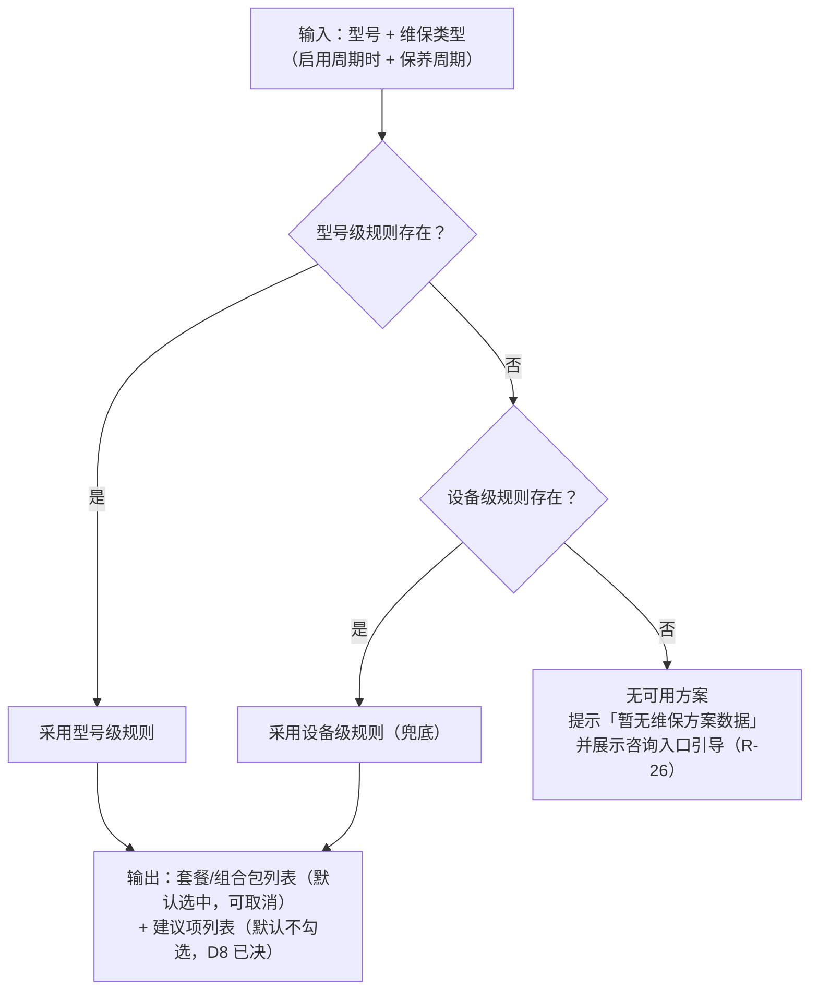

**回溯原则**：`型号级 > 设备级`，取命中的最细粒度配置（无系列级，D1 已决）。设备级兜底让"同一设备的通用方案"只配一次，减少维护量（头脑风暴结论）。

**周期匹配**：启用周期的维保类型，规则按 维保类型 + 保养周期 匹配（IN-MC-09：5年与10年各自配置；未启用周期的类型不得配周期）——客户切换周期即重新解析。

### 7.3 预算计算流程

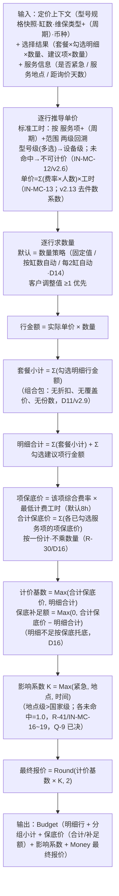

> **前置校验（IN-MC-09/12/13/14/16/17/18）**：进入计算前校验——每行明细的标准工时必须能按 型号级(多选)>设备级 两级唯一命中（v2.6），未命中的明细不得进入预算（前台提示/隐藏，后台预警）；启用周期的维保类型，工时与规则的周期维度必须齐备；服务信息须完整（服务日期 ≥ 提交日，IN-INQ-05）；三类影响系数规则各至多一条命中（未命中 = 1.0，IN-MC-16）、系数 > 0（IN-MC-17）、时间区间不重叠且全覆盖（IN-MC-18）。原 IN-MC-07（缸数双乘）随单价公式退役而结构性消失（v2.0）；IN-MC-11（基础服务费唯一命中）随 D13 → D16 作废。；原 IN-MC-08（直价唯一命中）随直价退役并入 IN-MC-12（v2.4/D15）；原 IN-EQ-05（机型组归属唯一）随机型组删除而作废（v2.6）。

> **计算示例**（统一工时标准，金额按 D5 统一为 USD；费率假设 T4=$60、P5=$50、P4=$40、P3=$30/h）：
>
> 场景：型号 6S35ME（6 缸），维保类型 液压和电控系统保养 + 周期 5年保养
>
> | 服务项 | 标准工时（人员配置 × 单件工时） | 数量策略 | 计算 |
> |--------|---------------------------|---------|------|
> | 系统检测 | P4×1+P3×1（R=70）× 5h（设备级） | 固定 1 | 70×5×1 = $350 |
> | 气缸大修 | T4×1+P5×1+P4×1+P3×2（R=210）× 6h（**型号级配置**） | 按缸数自动 6 | 210×6×6 = $7,560 |
> | 燃油滤器更换 | P4×1+P3×1（R=70）× 5h（设备级） | 固定 4 | 70×5×4 = $1,400 |
>
> 套餐（组合包）明细合计 = $9,310（**无折扣**）→ 套餐小计 = $9,310（**无份数**，v2.9）
> 建议项：喷油器清洗 70×5×2 = $700 + 冷却水检测 70×5×1 = $350 = $1,050
> 明细合计 = 9,310 + 1,050 = $10,360
> **① 合计保底价**（每个已勾选服务项按"人工最低一天 8 小时"兜底，共 5 项）：系统检测 70×8=560 + 气缸大修 210×8=1,680 + 燃油滤器更换 70×8=560 + 喷油器清洗 70×8=560 + 冷却水检测 70×8=560 = **$3,920**；明细合计 $10,360 > $3,920 → **保底不生效**，保底补足额 = $0，**计价基数 = $10,360**
> **② 影响系数**（紧急 1.2000 × 新加坡国家级 1.1500 × 距询价 3 天 1.1000）= **1.5180**
> **③ 最终报价 = Max(3,920, 10,360) × Max(1.2000, 1.1500, 1.1000) = 10,360 × 1.2000 = $12,432.00**（构成链路 进销售邮件/后台视图；**客户侧预算页仅展示最终报价**——R-36 口径扩展，v2.12）
>
> 反例（小单，保底触发，D16 目标场景）：客户只勾"系统检测"1 项 → 明细合计 $350；合计保底价 = 70×8 = **$560** > 明细 → **计价基数 = $560**、**保底补足额 = $210**；影响系数（不紧急 1.0000 / 国家级 1.0000 / 距询价 45 天 0.9500，取最大值 = 1.0000）→ **最终报价 = 560 × 1.0000 = $560**（取最大值口径下 K ≥ 1.0，保底价不被时间系数削弱，Q-12 随 Q-9 消解）
>
> 同设备换型号 6S40ME（6 缸）：气缸大修命中 6S40ME 型号级标准工时（如 T5×1+P4×1 × 7h）——**同缸数、不同型号、不同价**（D12 能力/D15 载体）；v2.13 起件数系数已退役，多件作业按"单价 × 数量"全额计（D18）。
>
> ⚠️ 与 Demo 的差异：后台管理 demo（prototype-design 多页版）已按 D15 移除直价模块（原直价服务项折算为等效人员配置+工时展示），并已实现标准工时两级配置（型号级多选）与「方案预览」逐行推导计价（**v2.11 起已按 D16/D17 新口径展示：服务信息模拟器 + 明细合计 → 合计保底价 → 计价基数 → ×影响系数 → 最终报价**）；前台 Demo v8 已采集服务信息三项并按新公式实时重算（价格数据与工时推导引擎复用后台 data.js 全局量，正式服务化待落地）。
### 7.4 提交与通知时序

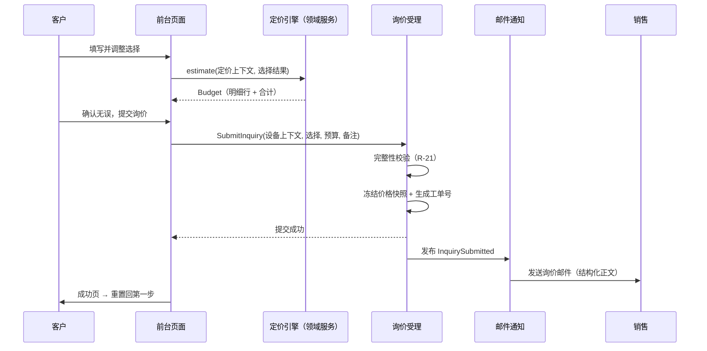

> **Demo 现状差距**：前台 Demo 的提交已冻结快照并写入浏览器共享存储（IndexedDB 键 `pc_mgmt_inquiries_v1`，与后台配置快照分键），后台管理 demo「询价受理 · 客户定价单」页可只读查看（列表/筛选/分页/快照详情，需求文档 v1.6 FR-09）；询价邮件正文构造（`collectInquiryData()`）已具备但**尚未接入发送**，快照亦未落 inquiry / inquiry_snapshot 表。正式实现按本图落地（调用邮件服务 + 快照入库）。

---

## 8. 业务规则清单

> 状态说明：**已定** = 三份材料一致或已明确；**作废** = 被后续决策取代，保留编号供对照（原"待决策"项 D1～D8 均已关闭，v2.0 新增 D9～D12、v2.1 新增 D13、v2.3 新增 D14，见第 9 节）。

| 编号 | 规则 | 来源 | 状态 |
|------|------|------|------|
| R-01 | 设备分类树仅用于导航，叶子节点 = 设备，不参与定价 | Demo / 表设计 | 已定 |
| R-02 | 型号直接挂设备下平铺展示（无系列层级）；可选厂家由**型号**决定 | Demo（D1 已决） | 已定 |
| R-03 | 型号-厂家多对多（含"授权生产"标记）；可设默认厂家用于前端默认选中 | 头脑风暴 / 表设计 | 已定 |
| R-04 | 选型号后厂家列表联动并默认选中；价格与厂家无关（按型号属性计价） | Demo / 头脑风暴 | 已定 |
| R-05 | 缸数为**型号属性**（选型号自动带出、只读）；1–20 整数；仅未收录的"自定义型号"允许手填 | Demo（D3 已决） | 已定 |
| R-06 | 切换设备或型号清空下游全部选择（方案、数量、自定义输入） | Demo | 已定 |
| R-07 | 维保类型按设备挂载；前端默认选中第一个。"5年保养/10年保养"不是维保类型，是"液压和电控系统保养"的保养周期选项 | Demo / D10 | 已定 |
| R-08 | 适用范围内的套餐默认自动选中（客户可整体取消，D9） | Demo | 已定 |
| R-09 | 套餐（组合包）整体可勾选/可取消；套餐小计 = 勾选明细行金额合计（**无份数**，v2.9） | Demo / D9 | 已定 |
| R-10 | 套餐内明细可**取消勾选**、数量 ≥1 **可调**；默认数量由数量策略（固定值/按缸数自动/每2缸自动，D14 后三类）给出 | D9（修订原 D4"不允许移除"） | 已定 |
| R-11 | 建议项（自由选择区）支持整组勾选、逐项勾选、取消；支持项目名搜索 | Demo | 已定 |
| R-12 | 建议项数量 ≥1 可调，可取消勾选 | Demo | 已定 |
| R-13 | ~~实际单价 = 价格聚合按 维保类型 +（保养周期）+ 服务项 + 适用范围 解析~~ **已作废（D15）**：直价/服务项价格退役，单价统一按 R-32/R-33 工时推导 | — | 作废 |
| R-14 | 数量默认值来源：固定值 / 按缸数自动 / 每2缸自动（D14 新增第三类，见 R-35）；套餐明细与建议项数量客户均可调（≥1） | Demo / D9 / D14 | 已定 |
| R-15 | ~~Tiered 档位区间不得重叠~~ **已作废（D12）**：阶梯价机制退役，由型号维度价格取代 | — | 作废 |
| R-16 | 行金额 = 实际单价 × 数量；金额必须带币种（**默认 USD**，D5 已决） | 表设计 / Demo | 已定 |
| R-17 | 套餐为组合包：**无折扣率、无一口价、无份数**，套餐小计 = Σ(勾选明细行金额) | D11（修订头脑风暴 Q2） | 已定 |
| R-18 | ~~dynamic 折扣率 ∈ (0, 1]~~ **已作废（D11）**：折扣机制退役 | — | 作废 |
| R-19 | **最终报价 = Max(合计保底价, 明细合计) × 影响系数**（v2.10 修订，D16/D17；原"预算合计 = 明细合计 + 基础服务费"已作废）：明细合计 = Σ(套餐小计) + Σ建议项行金额；合计保底价见 R-30；影响系数见 R-41 | 头脑风暴 / 表设计 / D16+D17 | 已定 |
| R-20 | 展示规则回溯：型号级 > 设备级，取最细粒度命中（无系列级）；启用周期的类型按 维保类型+周期 匹配 | 头脑风暴（D1）/ D10 | 已定 |
| R-21 | 提交校验：设备 + 型号（含缸数）+ 厂家 + 维保类型（启用周期时含保养周期）+ **是否紧急 + 服务地点（到大地区/国家）+ 服务日期（≥ 提交日）** + ≥1 选中项，全部满足才可提交（v2.10 扩展） | Demo / D10 / D17 | 已定 |
| R-22 | 船名、补充说明为选填 | Demo | 已定 |
| R-23 | 提交时冻结价格快照；此后目录调价/下架不影响历史询价单 | 推导（Demo 邮件正文即快照） | 已定 |
| R-24 | 提交后询价单只读；邮件通知销售（结构化正文：客户/船舶/设备/方案/明细/合计/备注）；页面重置 | Demo | 已定 |
| R-25 | 未收录厂家/型号 → 设备咨询单（独立流程、独立工单号），可返回继续询价，自定义文本回填表单 | Demo | 已定 |
| R-26 | 设备无目录数据时提示"暂无维保方案数据"，并**引导**走咨询流程（展示"没找到？请联系我们"，转化线索不流失） | D7 已决 | 已定 |
| R-27 | 建议项**不默认勾选、不计价**（客户勾选后数量取默认数量并开始计价）；default_selected 字段保留供未来配置 | D8 已决（按 Demo：默认全不勾） | 已定 |
| R-28 | 维保类型可启用"设备保养周期"（cycleFlag）；启用时选择该类型展示周期下拉（5年保养/10年保养）且必填，周期是展示规则与价格的匹配维度；未启用的类型不得出现周期 | D10 | 已定 |
| R-29 | 同一服务项在不同型号下价格可不同：由标准工时的**型号级配置**表达（型号级 > 设备级 两级回溯，IN-MC-12 / v2.6） | D12/D15/v2.6 | 已定 |
| R-30 | **保底价（人工最低一天兜底）**：项保底价 = 该项**人员配置综合费率 × 最低计费工时**（默认 8h，PricingParam）；合计保底价 = Σ(各**已勾选**服务项的项保底价)；**按一份计**（不乘数量、不看实际标准工时）；订单级比较一次、不随明细增减被放大；明细 < 保底时按保底计（差额 = 保底补足额），否则不生效不改价；未勾选/已取消的项不计入；差旅/等待等实报不进目录预算 | **D16（v2.10，替代 D13）** | 已定（"按一份"口径待确认，见业务梳理 Q-10） |
| R-31 | 服务项**统一按标准工时计价（D15）**：原"直价/工时"双路径退役，无独立价格表（IN-MC-08 作废） | D14/D15 | 已定 |
| R-32 | 工时配置按 服务项+（类型+（周期））+适用范围 维护，解析 **型号级 > 设备级** 两级回溯至多命中一条（IN-MC-12 / v2.6）；两级未命中不可计价；型号级一条配置可**多选型号**（缸径系列一次配齐；同上下文下一台型号至多命中一条型号级配置） | D14 / v2.6 修订 | 已定 |
| R-33 | 行人工费 = Σ(职级小时费率×人数) × 单件标准工时 × 数量（**v2.13 去件数系数**，D18）；费率卡按计算时点生效期解析；构成行为计费依据（"N人"派生校验，IN-MC-13）；"天"按 8 小时折算；缸数分档按型号缸数命中 | D14（v2.13 修订） | 已定 |
| R-34 | ~~件数工时系数 1件 1.0 / 2件 0.9 / 3-5件 0.8 / ≥6件 0.75……~~ **已作废（v2.13，D18）**：件数工时系数机制退役——多件作业不再折减，行金额 = 单价 × 数量 全额计 | — | 作废 |
| R-35 | 计件基准四类：per_unit / per_cylinder / per_2cylinder / whole_job；per_cylinder 对齐 auto_cylinder，per_2cylinder 为新增数量来源（缸数÷2 向上取整） | D14 | 已定 |
| R-36 | 提交时冻结推导要素（费率明细/构成/标准工时/推导单价，IN-MC-15），调费率不影响历史询价单；工时构成对销售邮件与后台可见，客户侧默认只展示价格 | D14（v2.13 修订） | 已定 |
| R-37 | 服务项的**项目分组为非必填**（可选归属，未分组为合法状态；前台归入"其他"，后台不得判错） | D2 / v1.8 新增 | 已定 |
| R-38 | **是否紧急**为订单级必填（不紧急 / 紧急，默认不紧急）；按取值命中**紧急系数**（紧急程度字典配置，可扩展） | D17 | 已定 |
| R-39 | **服务地点**为订单级必填，三级级联 **大地区 > 具体国家 > 地点**；**大地区+国家必填、地点选填**；地点系数解析 **地点级 > 国家级 > 大地区级**（规则行留空 = 该维度任意，IN-MC-19） | D17 | 已定 |
| R-40 | **服务时间**为订单级必填（具体日期，**前台不得早于当天、提交阻断** IN-INQ-05；**后端对异常/负值按最紧急档兜底**）；派生 **距询价天数 = 服务日期 − 提交日期**（自然日，当天 = 0），按天数区间命中**时间系数** | D17 | 已定 |
| R-41 | **影响系数 = Max(紧急系数, 地点系数, 时间系数)**（取三者最大值，各未命中 = 1.0，IN-MC-16，Q-9 已决）；系数 > 0（IN-MC-17）、时间区间不重叠且全覆盖（IN-MC-18）；**只作用于订单级最终报价**，不进明细行/套餐小计/明细合计/合计保底价；提交时三类系数与合成系数一并冻结（IN-INQ-06） | D17 | 已定 |

---

## 9. 与现有材料的分歧与待决策点

> 这是本文档最重要的部分：三份材料的不一致处全部显式化，每条给出建议，**需要业务方拍板后再修订表设计**。

### D1 是否引入"系列"层级 —— ✅ 已决策（2026-08-20）

- **决策结果**：**不引入系列层级**。采用表设计方向：设备 → 型号两级，型号直接挂设备下，厂家直接挂型号（多对多）。
- **含义**：无"系列"实体、无系列级展示规则回溯（回溯为型号级 > 设备级）；厂家在**型号**上配置（每个型号配一次厂家集合，维护量大于系列级，但模型简单、无层级歧义）。
- **Demo 改造**：型号下拉去掉系列分组（MC/ME-C、UEC、RTA），平铺展示；厂家改为从型号取。

### D2 是否引入"项目分组" —— ✅ 已决策（2026-08-20，v1.7 修订归属方式）

- **决策结果**：**引入分组，套餐明细保持直接引用服务项**（不破坏表设计）。
- **v1.7 修订**：分组的归属方式从"维保类型聚合内实体（组持服务项引用）"改为**"全局分类字典 + 服务项 group_id 多对一归属"**。理由：分组的本质是服务项的**固有分类**（HCU 项永远属于 HCU），不随维保类型变化——真正随维保类型变化的是"方案选哪些项"，那由套餐明细与建议项规则承担，分组不欠维保类型任何东西。
- **含义**：分组职责收敛为**仅前端归组展示**（自由选择区按分组勾选渲染）；"后台按组批量维护"降级为界面便利（按 group_id 筛选批量操作），非模型职责；分组**不改变计价逻辑**。demo 中挂在分组上的"建议"徽标（tier）迁移至建议项规则（suggested 字段）。
- **v2.5 修订（2026-09-03）**：归属基数由 **"多对一"改为"可选多对一（`0..1`）"——服务项的项目分组是非必填**。理由：① 分组**不参与计价**（D15 后单价由标准工时推导），② 也不是被引用（套餐明细 / 建议项 / 标准工时）的前置条件，③ 实际录入顺序是"先建服务项配工时、后归类"，必填只会把展示便利变成录入阻塞。**未分组是合法状态**（前台归入兜底分组"其他"），后台新增/导入/校验均不得判为错误。

### D3 缸数归属 —— ✅ 已决策（2026-08-20）：方案 A 型号含缸数

- **现状**：
  - 表设计：缸数存在型号上（`model.cylinder_count`），型号是具体机型（如 6S35ME）；
  - Demo：型号为**具体机型**（如 6S60MC-C，名称自带缸数），缸数随型号自动带出（R-05）；仅自定义/未收录型号由客户手动输入（1–20）。
- **两个方案对比**：

| | 方案 A：型号含缸数（表设计）✅ | 方案 B：型号为设计级 + 缸数为询价参数（Demo） |
|--|---------------------------|---------------------------------------------|
| 主数据量 | 大（每个缸数一个型号条目） | 小（一个设计一条） |
| 计价依据 | 型号属性 | 定价上下文（客户输入） |
| 风险 | 维护遗漏缸数变体 | 客户填错缸数；无法校验合法性 |
| 阶梯价 | 仍需按缸数配档 | 语义更顺（缸数本来就是变量） |
| Demo 兼容 | 需改造前端 | 前端已验证 |

- **决策结果**：**方案 A**——缸数是型号的固有属性，客户选型号后**自动带出、无需手填**，计价依据为型号属性。
- **含义**：主数据需维护"型号-缸数"映射；前端选型号后缸数只读展示；R-05 相应更新。
- **Demo 改造**：缸数输入框改为**自动带出（只读）**，随型号选择联动填充。

### D4 套餐内项目能否移除 ⚠️ 已决（v1.2）→ **已被 D9 取代（2026-08-24）**

- **原决策**：套餐内的选项**不允许移除**。套餐整体份数可调（R-09），但套餐内任何服务项客户不可取消，避免"拆散打包"导致套餐定价失真。
- **v2.0 修订**：需求调整（D9）将套餐放开为**组合包**——整体可取消、明细可取消勾选、数量可调。原"套餐行可否移除"标志随之删除（全部可移除），R-09/R-10 已重写。

### D5 币种 ✅ 已决（v1.2）

- **决策**：默认币种 **USD**（美元）。金额值对象强制带币种（`Money{amount, currency}`）；本期不做多币种切换，预留 currency 字段供后续扩展。
- **落地**：Demo 已全部以 USD（$）计价（`unit_price_usd`）；表设计金额字段统一标注 USD。

### D6 展示规则接入 Demo —— ✅ 已落地（2026-08-20）

- **现状**：Demo 已实现规则驱动的套餐展示——新增 `DISPLAY_RULES` 规则表与 `getResolvedPackages()` 解析器，回溯顺序 `型号级 > 设备级`（R-20，无系列级）；支持多套餐（标准保养 / 豪华保养），如型号 `6G80ME-C9.5` 命中型号级规则出"豪华保养"，其余型号回退设备级默认"标准保养"；预算与询价邮件按解析出的套餐名渲染。
- **剩余差距**：Demo 的规则目前是前端硬编码常量；正式实现需将规则入库（`package_display_rule` / `suggested_item_rule`，见表设计 v1.1）并提供后台维护界面。

### D7 设备无目录数据的兜底 ✅ 已决（v1.2）

- **决策**：设备无目录数据时提示"暂无维保方案数据"，并**引导**客户点击"没找到？请联系我们"提交咨询，避免转化线索流失。
- **落地**：Demo 中辅助柴油发电机组（Aux. diesel generator aggregates, complete，无型号/维保数据）显示空态提示，同时展示"没找到？请联系我们"入口（有目录数据但未收录型号/厂家时同样走该入口，R-25）。

### D8 建议项默认勾选策略 ✅ 已决（v1.2）

- **决策**：建议项**不默认勾选、不计价**。客户勾选后数量取默认值（default_qty）并开始计价；`default_selected` 字段保留，供未来运营配置"推荐即选中"策略时启用，无需改模型。
- **落地**：Demo 现状一致（自由选择区默认全不勾），本轮无需改动。

### D9 套餐放开为"组合包" ✅ 已决（2026-08-24，修订 D4/R-09/R-10）

- **决策**：套餐是**预打包推荐组合**（组合包），不是锁定销售单位。客户可**整体取消**套餐；套餐内明细可**取消勾选**、**调整数量**（≥1）。**v2.9（2026-09-10）：取消"份数"概念**——小计 = Σ勾选明细行金额（原 × 份数）；多台设备由客户分别提交询价。
- **建模含义**：`Package` 去掉 定价模式/折扣率/覆盖价；`PackageLine` 去掉 removable 标志；展示规则去掉 mandatory（套餐默认勾选、可取消）；数量策略从三类收敛为二类（固定值/按缸数自动），只决定默认值。
- **落地**：Demo v8 已按此交互（套餐卡片可取消、明细树可勾选/取消/调量、预算明细可勾选调量）；正式实现去除后台"锁定"配置项。

### D10 维保类型与设备保养周期 ✅ 已决（2026-08-24，修订 R-07/R-21）

- **决策**："5年保养""10年保养"**不再是维保类型**，它们是"液压和电控系统保养"维保类型的**设备保养周期**选项。维保类型可**启用周期**（cycleFlag）；启用时选择该类型展示"设备保养周期"下拉（5年保养/10年保养），**必填**，并作为展示规则、建议项规则、价格的匹配维度。
- **建模含义**：新增字典实体 `MaintenanceCycle`；`MaintenanceType` 增加 cycleFlag；`DisplayRule`/`SuggestionRule`/`ServiceItemPrice` 增加可空周期引用（启用时必填，IN-MC-09）；询价单设备上下文快照周期。
- **落地**：Demo v8 已实现（维保类型下拉过滤 5年/10年 并注入"液压和电控系统保养"，选择该类型时展示周期下拉并校验必填）。

### D11 套餐无折扣 ✅ 已决（2026-08-24，作废 R-18/IN-MC-03/IN-MC-04，修订 R-17）

- **决策**：套餐（组合包）**不打折、无一口价**。套餐小计 = Σ(勾选明细行金额)。（v2.9 起无份数。）头脑风暴 Q2 的"动态/固定双模式"结论不再适用。
- **建模含义**：删除 dynamic/fixed 定价模式及折扣率、覆盖价字段；6.3 速览表与 7.3 计算流程去掉模式分叉；快照不再冻结折扣要素。

### D12 价格按型号维度维护 ✅ 已决（2026-08-24，修订 R-13/R-14，作废 R-15/IN-MC-02/IN-MC-07）

- **问题**：不同型号、同一维保类型、同一保养周期、同一服务项，价格**有可能不相同**。原设计单价全局挂在服务项上（阶梯价按缸数取档），表达不了"同缸数不同型号不同价"。
- **决策**：新增聚合根 **ServiceItemPrice（服务项价格）**——单价按 维保类型 +（保养周期，启用时必填）+ 服务项 + 适用范围 维护，解析时**型号级 > 设备级回溯**，至多命中一条（IN-MC-08）。差异型号配型号级价格，无差异的共用设备级价格。
- **连带退役**：`ServiceItem` 不再持有单价策略（UnitPricePolicy/Tier 族删除）；阶梯价（按缸数取档）退役——"按缸数计价"由 每缸单价 × 数量策略（按缸数自动）表达；"缸数双乘"（IN-MC-07）结构性消失。
- **新增不变量**：IN-MC-08（唯一命中回溯）、IN-MC-09（周期一致性）、IN-MC-10（范围互斥）。
- **落地**：Demo v8 单价仍全局挂服务项数据，型号维度价格待正式实现（见第 10 节）。

### D13 基础服务费（出勤固定费，加收机制） ⚠️ **已被 D16 取代（v2.10，2026-09-10）**

- **问题**：一次出勤/进场的固定成本（工程师派遣、行程、协调）不随项目多少变化，无论订单大小都要收回；原"小单亏本价"问题由此而来。
- **决策（2026-08-25 修订）**：引入**基础服务费（加收）**——预算合计 = 明细合计 + 基础服务费。基础服务费按 维保类型 +（保养周期）+ 适用范围（**型号级 > 设备级**回溯，与价格同款范围模式）配置；**订单级收取一次，与明细增减无关**（v2.9 表述；同船多台设备仍是一次出勤）；预算页**常显**"基础服务费"行；取值锚定**单次出勤固定成本**（可含最低合理毛利）。原决策（2026-08-24）为"最低服务费保底 = max(明细合计, 保底额)"，本修订改为固定加收。
- **行业依据**：服务业"基础服务费/出场费"惯例（设备维修上门费；主机厂费率将行程时间、出差补贴、代垫管理费单列在服务费之外）。2026-08-24 调研的"不足按最低计"（半天起步、最低计量）支持的是保底方案；本修订取其"固定投入单列计收"的精神，改用固定加收形式。
- **边界**：差旅、住宿、等待时间等**实报费用不进目录预算**，由销售正式报价时确认（基础服务费覆盖**己方出勤投入**，与第三方实报口径区分，避免"双重收费"质疑）。
- **建模含义**：聚合根 `BaseServiceFeeRule`（6.2，v2.1 名 MinimumServiceFeeRule）；`Budget` 成员为 明细合计/基础服务费/合计（6.3，v2.2 删除 shortfall 补足额）；询价单冻结命中的基础服务费（6.4）；不变量 IN-MC-11。
- **落地**：Demo 未实现；正式实现含配置（表设计 3.20 `base_service_fee`）、合计公式与预算页常显"基础服务费"行。
- **v2.10 后续**：**2026-09-10 业务方改口径——去除基础服务费，改为保底价（D16）**。理由：固定加收既不看实际成本也不看单量（小单托底、大单"白收"），保底价按人工最低一天兜底、更贴近"不足才补"的成本逻辑。`BaseServiceFeeRule` 聚合与 `base_service_fee` 表随之退役，IN-MC-11 作废。

### D16 出勤/人工成本的下限保护机制 ✅ 已决（2026-09-10，取代 D13；重写 R-30，修订 R-19，新增 IN-MC-16～19）

- **问题**：原 D13"基础服务费（固定加收）"有三处不合业务：① 固定额与实际成本脱钩（与做几项、做多久无关）；② 小额订单与大额订单收同一笔，大单"白收"、小单未必够；③ 需要为每个 维保类型+周期+范围 维护一笔金额，配置量大且难校准。
- **决策**：**去除基础服务费，改为保底价（人工最低一天兜底）**——每个**已勾选服务项**按"该项人员配置综合费率 × **人工最低一天（默认 8 小时）**"得**项保底价**，求和为**合计保底价**；与实际**明细合计**比较，**不足则按保底计**（差额 = 保底补足额），充足则保底**不生效、不改价**。**最终报价 = Max(合计保底价, 明细合计) × 影响系数**（系数见 D17）。
- **口径要点**：① **按一份计**——项保底价不乘客户数量、不看该项实际标准工时（保底是"最少出一天工"的成本底线，不随数量放大）；② **只看已勾选**——未勾选/已取消的项不计入（否则"取消勾选反而更贵"）；③ **订单级一次比较**——不随明细增减被放大；④ **最低计费工时是全局参数**（默认 8h，后台可配），与 R-33"天按 8 小时折算"同源；⑤ 保底价同样乘影响系数（公式即 `Max(...) × K`，见业务梳理 Q-12）。
- **建模含义**：删除聚合根 `BaseServiceFeeRule`（IN-MC-11 作废）；预算估算上下文新增值对象 **FloorPrice（项保底价集合 + 合计保底价 + 保底补足额）**，`BudgetLine` 增 `floorAmount`；维保目录上下文新增配置 **PricingParam（最低计费工时 / 保底开关）**；询价单冻结 保底价三要素（IN-INQ-02 快照范围扩展）。
- **行业依据**：人工最低一天（8 小时）是现场作业的**最小可交付投入**——出勤一次即占用一天人员配置的可用工时；漏项或小额订单的报价不应低于该成本线（与服务业"半天/一天起步"惯例同源）。
- **待确认**：项保底价"按一份"的口径（是否应乘数量）——见业务梳理 Q-10。
- **落地**：原型已实现（v2.11，2026-09-11）——后台「保底参数」页（开关 + 最低计费工时）、前台/预览按 `Max(合计保底价, 明细合计)` 计价与补足额展示、快照冻结保底三要素；正式实现含 表设计 3.26～3.30（服务地点/系数/保底参数）、定价引擎保底价环节、快照入库。

### D17 服务条件对成交价的影响 ✅ 已决（2026-09-10，新增 R-38～R-41，修订 R-19/R-21，新增 IN-INQ-05/06）

- **问题**：同一份方案，加急赶工、远地出勤、临近排期的实际成本明显更高，原模型只有"目录价"，服务条件无法进入报价；同时业务需要知道"客户要什么时候、在哪儿做"，以便排产与派工。
- **决策**：**新增三项订单级服务信息 + 三类可配置影响系数**——① **是否紧急**（不紧急/紧急）；② **服务地点**（大地区 > 具体国家 > 地点，三级级联；系数可配**任意一级**，解析 **地点级 > 国家级 > 大地区级**，留空 = 该维度任意作兜底）；③ **服务时间**（具体日期 → **距询价天数** = 服务日期 − 提交日期，按天数区间取系数）。**影响系数 = Max(紧急系数, 地点系数, 时间系数)**（取三者最大值，各未配置 = 1.0，Q-9 已决）。
- **口径要点**：① **系数只作用于订单级最终报价**——明细行金额、套餐小计、明细合计、合计保底价都不含系数，保证报价构成可解释、快照可逐项复现；② **系数不是折扣**（服务条件的成本调节，与 D11"套餐无折扣"不冲突）；③ **未配置 = 1.0**（不静默丢价、不静默加价）；④ 服务信息**与设备/型号无关**，切换设备不清空。
- **建模含义**：维保目录上下文新增 **ServiceLocation（三级主数据树）**、**LocationCoefficient**、**UrgencyLevel（字典·含系数）**、**LeadTimeCoefficient（天数区间）**；预算估算上下文新增值对象 **PricingCoefficient** 与 **ServiceInfo**（定价引擎签名扩为 `estimate(context, selection, serviceInfo)`）；询价单聚合新增 ServiceInfo 值对象与系数快照（IN-INQ-06）；表设计 3.26～3.29。
- **待确认**：时间系数 < 1.0 档是否削减保底（Q-12）、紧急与时间是否重复计费（Q-13）——见业务梳理 §11.1。**已按原型实现闭环**：合成方式 = 三维连乘（Q-9）、项保底价按一份计（Q-10）、地点系数支持大地区级与区域兜底（Q-11）。
- **落地**：原型已实现（v2.11，2026-09-11）——前台采集三项服务信息（R-21 扩展校验 + IN-INQ-05 日期下限），后台「影响系数」页维护紧急字典/地点树与系数/时间档位，预览与前台按三维连乘实时重算并随快照冻结（IN-INQ-06）。

### D14 维修类服务项工时计价（职级费率 × 标准工时） ✅ 已决（2026-08-27，新增 R-31～R-36 / IN-MC-12～15 / IN-EQ-05；**D15 修订：双路径收敛为统一工时标准**；**D18 修订：件数系数退役**）

- **问题**：《传统二冲机维修项目评估清单_职级更新.xls》的人工成本以「人员配置职级构成 × 人数 × 工时」形态维护（约 400 个单元格），现有模型（D12 直价查表）表达不了——若存最终价，每次调薪需人工重算全部价格；且销售需要工时构成解释报价。
- **决策**：引入**工时推导定价路径**（与 D12 直价并存，`ServiceItem.priceMode` 二选一）——行金额 = Σ(职级小时费率 × 构成人数) × 单件标准工时 × 数量。新增聚合根 **LaborStandard（标准工时：人员配置 + 单件工时 + 计件基准 + 缸数分档）**、**RankRateCard（职级费率卡，生效期版本化——调薪只改费率卡）**、**ModelGroup（机型组：缸径系列归组，仅后台维度——v2.6 已删除，由型号级多选取代）** 与字典 JobRank；~~LaborQtyCoefficient（1.0/0.9/0.8/0.75）~~ **v2.13 已删除（D18：件数系数退役）**。
- **与既有决策的关系**：不推翻 D12——推导输出仍是型号维度单价，IN-MC-08 护栏语义保留（解析对象换成工时配置，IN-MC-12）；不违背 D1——机型组不进前台导航（IN-EQ-05，v2.6 随聚合删除作废）；与 D11 无关——原有"件数系数是工时效率折减、非套餐折扣"的说明随 D18 退役，多件作业按全额计。
- **快照与展示**：提交冻结推导要素（IN-MC-15）；客户侧默认只看价格，工时构成进销售邮件/后台。
- **待确认**（业务梳理 v2.13 第 11 节 Q-7～Q-8）：费率卡维护方与调频、评估清单数据修正（"1.5小时"疑为 1.5 天；人数与构成不一致以构成为准）。~~件数系数跨行合并口径~~ 已随 D18 消解。
- **落地**：前台/后台原型已实现工时推导（前台 PC v2 / H5 v8 与后台「方案预览」均按 单价 × 数量 计价，v2.13 起去件数系数）；表设计 3.21～3.25（**3.25 件数系数表 v2.8 退役**），需评估清单 Excel 导入器（含数据质量报告）。

### D15 服务项定价统一为工时标准 ✅ 已决（2026-08-28，修订 D14、变更 D12 载体，作废 R-13，修订 R-29/R-31）

- **问题**：D14 落地后存在"直价/工时"双路径并存——两套配置入口（服务项价格 + 标准工时）、两类计价逻辑，维护与理解成本高；且源数据《传统二冲机维修项目评估清单》本身是**完整的工时矩阵**（28 类项目全部有人员配置×工时，含健康检查），不存在清单之外的独立价目表——直价路径没有数据源支撑。
- **决策**：**全部服务项统一按标准工时推导计价**。聚合根 `ServiceItemPrice` 删除、`ServiceItem.priceMode` 字段删除、表 `service_item_price` 退役；D12"不同型号同项不同价"能力**保留**——载体变更为标准工时的**型号级配置**（两级回溯 型号级>设备级，v2.6；IN-MC-12 取代作废的 IN-MC-08）。原固定价服务项按 清单/经验 补录"人员配置+工时"表达。
- **建模含义**：6.2/6.0 类图删除 ServiceItemPrice；6.2.1 成为唯一计价模型；6.3 计算规则单路径化；单价 = Σ(职级费率×人数) × 单件工时 × 件数系数 的推导输出仍是"该型号该服务项的单价"，`BudgetLine`/快照/合计公式骨架全部不变（R-16/R-19 骨架不受影响）；基础服务费（D13）**不是服务项价格**，不受本决策影响。
- **落地**：后台管理 demo 已同步（移除「服务项价格（直价）」模块，原直价服务项折算为等效人员配置+工时）；表设计 v2.0 退役 3.19。

### D18 件数工时系数退役 ✅ 已决（2026-09-11，修订 R-33/R-36，作废 R-34；D14 修订）

- **问题**：D14 引入的**件数工时系数**（1件 1.0 / 2件 0.9 / 3-5件 0.8 / ≥6件 0.75）用于表达"多件同做省时"的工时效率折减。业务方复核后确认**不需要该折算**——多件作业按全额计，报价更直观、口径更简单（避免"同一项目做几件单价不同"带来的解释与快照复杂度）。
- **决策**：**去除"件数工时系数"相关功能**——行金额 = Σ(职级费率 × 人数) × 单件标准工时 × 数量，不再乘任何件数系数。**R-34 作废**（保留编号）；字典聚合 `LaborQtyCoefficient` 删除；`labor_qty_coefficient` 表（3.25）退役；快照字段 `qty_coefficient` 删除。
- **建模含义**：LaborStandard 去掉"件数系数"协同对象（6.2.1）；定价引擎去掉件数系数解析环节（6.3/7.3）；IN-MC-14 收敛为"缸数分档区间完备"（件数系数部分即 IN-MC-14a 作废）；快照推导要素收敛为 职级费率明细/人员配置/标准工时/推导单价（IN-MC-15/R-36）。**保底价不受影响**——其"按一份计：不乘数量、不看实际标准工时"的口径本就不含件数系数（R-30/D16）。
- **落地**：原型已实现（2026-09-11）——后台移除「费率与系数」页的件数系数卡（`coef.js`/`COEFS` 删除）并将该页**更名为「职级费率」**（页内只剩职级费率卡）、方案预览与客户定价单去系数列与系数计算；前台 PC v2 / H5 v8 行金额改为 单价 × 数量；正式实现不建 3.25 表、快照不写 `qty_coefficient`。

---

## 10. 下一步建议

1. **D1–D14 全部拍板**：D1 不引入系列 / D2 引入分组 / D3 缸数为型号属性 / ~~D4 套餐内项目不允许移除（已被 D9 取代）~~ / D5 默认币种 USD / D6 规则驱动展示 / D7 空数据引导咨询 / D8 建议项不默认勾选；**v2.0 新增（2026-08-24）**：D9 组合包 / D10 保养周期 / D11 无折扣 / D12 型号维度价格；**v2.1/v2.2 新增**：D13 基础服务费；**v2.3 新增（2026-08-27）**：D14 工时计价；**v2.13 新增（2026-09-11）**：D18 件数工时系数退役（D14 修订）。
2. 用第 3 节统一语言对齐团队与代码命名（建议直接采用本文术语做代码模块名与类名前缀）。**✅ 已完成（v1.2）**：Demo JS 标识符已全面对齐——设备 `equipment`、设备目录 `EQUIPMENT_CATALOG`、当前设备数据 `currentEquipment`、型号 `model`、厂家 `manufacturer`、缸数 `cylinderInput`、维保类型 `maintenanceType` / `MAINTENANCE_TYPE_LIST`、服务项 `selectedServiceItems` / `SERVICE_ITEM_MAP`、特殊5年保养 `SPECIAL_5Y_PACKAGE` / `SPECIAL_5Y_SERVICE_ITEMS`、套餐 `PACKAGES` / `selectedPackage`、询价 `collectInquiryData`、设备咨询单 `contactRequest*`、预算 `budget*`。
3. 修订《数据表结构设计》：**不新增 series 表**（D1 已决）；新增 `service_item_group`（项目分组，D2）、`inquiry`（询价单）/ `inquiry_snapshot`（价格快照）/ `contact_request`（设备咨询单，均含客户电话与邮箱）；维持 `model.cylinder_count`（D3）；`package_display_rule` / `suggested_item_rule` 范围为型号级/设备级；金额字段统一带币种（D5）。**✅ 已完成（表设计 v1.1，v1.2 补充联系方式与缸数双乘校验约束）**。
4. 以第 8 节规则清单（R-01～R-27）作为验收用例与测试用例的输入，每条规则至少一个正例/反例。**✅ 已完成（v1.0）**：见《船舶维保定价系统-验收与测试用例.md》；**现已随规则扩展至 R-01～R-41 + TC-R37 与后台联动校验 TC-IN-01～12（v1.8 新增 TC-R37 分组非必填、v1.9 新增 TC-IN 系列、v2.0 两级化重写 TC-R32/TC-R29② 并作废 TC-IN-04）**；v2.2 新增后台客户定价单用例 **TC-INQ-01～04**（FR-09）；**v2.4 新增 TC-R38～R41（服务信息与影响系数）与 TC-IN-10～12（系数配置校验）、TC-INQ-05（服务信息与新价格构成展示）**。
5. Demo 已按 D1/D3 改造：型号平铺（去系列分组）、缸数自动带出只读、厂家按型号联动；套餐锁定、默认 USD、空数据引导咨询分别符合 D4、D5、D7（已同步调整）；**✅ 展示规则解析（D6）已接入**：新增 `DISPLAY_RULES` 规则表与 `getResolvedPackages()` 解析器（型号级 > 设备级回溯，R-20），套餐从硬编码改为规则驱动（支持多套餐：标准保养 / 豪华保养），预算与询价邮件按解析出的套餐名渲染。
6. **落地清单（D9～D13）**：
   - **表设计 v1.8 已同步**——新增 `maintenance_cycle` / `service_item_price` / `base_service_fee`（D13，v1.7 名 minimum_service_fee，v1.8 更名）；`service_item` 去掉 pricing_type/base_price；`service_item_tier_price`、`package.pricing_mode/discount_rate/fixed_price`、`package_item.is_removable`、展示规则 `is_mandatory` 退役；规则表与 `inquiry` 补周期维度及基础服务费快照；
   - **验收用例 v1.5 已同步**——TC-R09/R10/R13/R17/R19/R30 重写，TC-R15/R18 作废，新增 TC-R28/R29；
   - **Demo 待改造（前台）**——交互已到位（D9/D10/D11），**价格数据仍是全局单价**（D15 起废弃该形态）、~~基础服务费未实现（D13）~~（**已随 D16 作废，合计公式见第 7 条**）：需将全局单价改为 标准工时（人员配置×工时）× 职级费率 × 件数系数 推导并实现两级回溯（型号级（多选）> 设备级）；~~合计改为 明细合计 + 基础服务费 并常显"基础服务费"行~~（**已被 D16/D17 取代**：最终报价 = Max(合计保底价, 明细合计) × 影响系数，见第 7 条）（后台管理 demo 的 prototype-design 多页版已先行实现工时两级配置与预览推导）；
   - **数据迁移**——存量"5年保养/10年保养"维保类型及其规则/价格，迁移为"液压和电控系统保养"+ 周期维度。
7. **落地清单（D16 保底价 + D17 服务信息与影响系数，v2.10）**：
   - **表设计 v2.5 已同步**——新增 3.26 `service_location`（三级树）/ 3.27 `location_coefficient` / 3.28 `urgency_level`（含系数）/ 3.29 `lead_time_coefficient`（天数区间）/ 3.30 `pricing_param`（最低计费工时）；`inquiry` 增服务信息与计价结果字段、`inquiry_snapshot` 增 `floor_amount`；3.20 `base_service_fee` 退役；
   - **验收用例 v2.4 已同步**——TC-R19/TC-R30 重写，新增 TC-R38～R41 与 TC-IN-10～12（系数配置校验）；
   - **定价引擎（FR-03）**——签名扩为 `estimate(定价上下文, 选择结果, 服务信息)`；新增保底价环节（项保底价/合计保底价/补足额）与系数合成（紧急/地点/时间），最终报价 = Max(兜底, 明细) × 系数；
   - **前台 Demo 待改造**——~~STEP 2 采集是否紧急/服务地点（三级级联）/服务时间（日期选择）；预算页展示 明细合计 → 保底价 → 影响系数 → 最终报价；校验扩展（R-21）~~（**v2.11 已完成**：三项服务信息采集 + 新公式实时重算 + 快照冻结，端到端验证通过；**v2.12 客户侧仅展示最终报价，构成不外显**）；
   - **后台管理 demo 待改造**——~~「基础服务费」页改为「保底参数」（最低计费工时/开关）；新增「影响系数」页（紧急/地点/时间三块）与「服务地点」树维护；「方案预览」按新公式展示~~（**v2.11 已完成**：保底参数 / 影响系数（地点树与系数合一维护）/ 方案预览模拟器与新价格构成 / 客户定价单详情）；
   - **数据迁移**——`base_service_fee` 存量配置废弃（不迁移为保底价，保底价由工时+费率推导）；服务地点树需初始化种子数据（大地区/国家/常用地点）。
8. **落地清单（D14 工时计价，D15 收敛为唯一路径；v2.6 无机型组；v2.13 去件数系数）**：表设计已同步（3.21～3.24a：job_rank / rank_rate_card / ~~model_group~~（v2.2 退役）/ labor_standard 及构成、分档子表、labor_standard_model（型号级多选）；~~labor_qty_coefficient~~（3.25，**v2.8 退役，D18**）；v1.9 曾给 `service_item` 补 price_mode，v2.0 已随 D15 删除；`inquiry_snapshot` 补推导要素快照**（v2.8 起去 `qty_coefficient`）**）；验收用例已同步（TC-R31～R36，v1.7 随 D15 重写；v2.0+ 随两级化重写 TC-R32/TC-R29②、新增 TC-R37 与 TC-IN-01～09；**v2.7 修订 TC-R33/R36、TC-R34 作废**）；落地顺序建议——① 建职级/费率卡字典（纯增量）→ ② 评估清单 Excel 导入器（缸径系列行→一条型号级配置挂该系列全部型号，产出数据质量报告，Q-8）→ ③ 定价引擎（工时推导唯一路径，两级回溯）→ ④ 快照与销售邮件工时构成。
