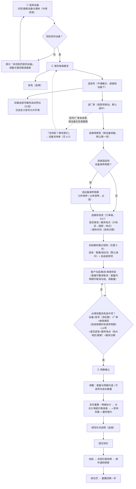
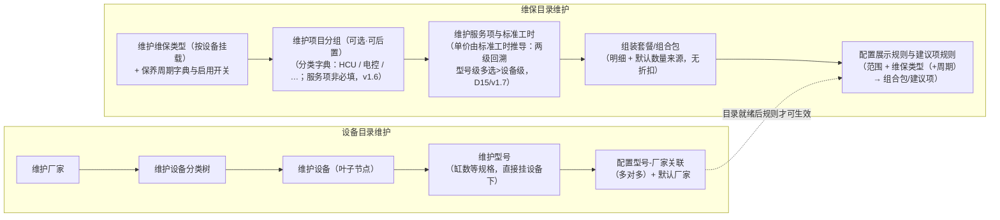
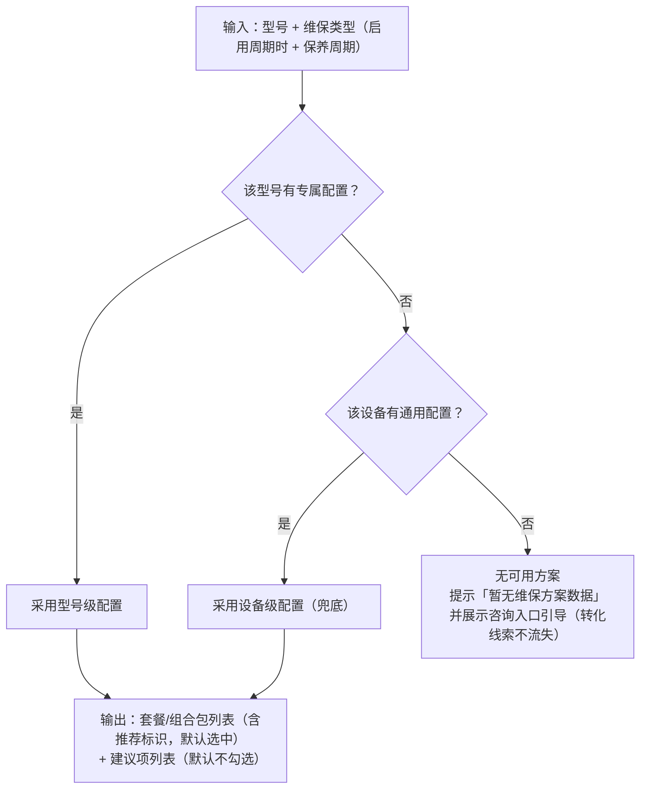

# 船舶维保定价系统 - 业务梳理

> 版本: v1.15 | 日期: 2026-09-18
>
> **v1.15 变更（2026-09-18，影响系数合成方式改为取最大值，Q-9 已决）**：业务方拍板**影响系数由"三维相乘"改为"取三者最大值"**——`K = Max(紧急系数, 地点系数, 时间系数)`（各未配置 = 1.0）。理由：相乘时三维叠加放大幅度可能超出预期（如 1.15 × 1.20 × 1.15 = 1.59），取最大值可将单维度影响控制在可预期范围；同时**消解 Q-12**（取最大值后 K ≥ 1.0，保底价不会被时间系数 < 1.0 削弱）与 **Q-13**（紧急 / 临近排期不再叠加放大）。同步修订：R-41（合成方式）、R-19（影响系数定义）、3.3 术语、6.3 公式与算例、6.7 公式、D17 注记、11.1 Q-9（已决）/ Q-13（闭环）；前台 Demo（PC v2 / H5 v8）与后台（preview / inquiry）计算逻辑同步改为 `Math.max(u.c, l.c, b.c)`。DDD / 表结构 / 验收与测试用例同步。
>
> **v1.14 变更（2026-09-11
>
> **v1.14 变更（2026-09-11 第三轮，件数工时系数退役，新增 D18）**：业务方确认**去除"件数工时系数"相关功能**（原 D14 引入的多件作业工时效率折减 1.0/0.9/0.8/0.75 不再需要）——**行金额 = Σ(职级费率 × 人数) × 单件标准工时 × 数量**，多件作业按全额计，不再乘任何件数系数。同步修订：R-33（行人工费去系数）、**R-34 作废（保留编号）**、R-36（快照推导要素去件数系数）、D14（决策注记）、6.1/6.3/6.4/6.6 公式与算例、3.2/3.4 术语、11.1 Q-6（消解）、11.2 G-6；新增决策 **D18**。DDD v2.13 / 表设计 v2.8 / 需求文档 v1.11 / 验收用例 v2.7 同步。
>
> **v1.13 变更（2026-09-11 第二轮，客户侧展示口径确认）**：业务方明确**客户不需要知道影响系数与计价工时，客户侧只看最终价格**——R-36"客户侧默认只看价格"口径扩展到 D16/D17 全部构成：**客户侧预算页仅展示最终报价（估算）**，明细合计 / 合计保底价与补足额 / 影响系数 / 工时与费率构成**只进销售邮件与后台视图**（供销售解释报价）；提交流程与快照冻结范围不变（构成仍逐项冻结，只是不对客户外显）。同步修订：6.4 算例展示行、6.5 Demo 现状、6.7 口径要点。
>
> **v1.12 变更（2026-09-11，D16/D17 原型落地 + 残留清理）**：① **Demo 现状更新（6.5 / 11.2 G-5）**——前台 Demo（PC v2 / H5 v8）已实现**服务信息三项采集**（是否紧急 / 服务地点三级级联 / 服务时间）与**新报价公式**（明细合计 → 合计保底价 → ×影响系数 → 最终报价，含保底触发与补足额展示、快照冻结 svc 与保底三要素）；后台管理 demo 已落地「**保底参数**」（原基础服务费页改造）与「**影响系数**」（紧急/地点/时间三块维护）页、「方案预览」服务信息模拟器与新价格构成、「客户定价单」详情服务信息与新构成（TC-INQ-05）——浏览器端到端验证通过（含 PC 提交 → 后台受理全链路）。② **残留清理**——本文 §"与 DDD 的关系"编号范围更新为 R-01～R-41 / D1～D17。业务口径无变化（v1.11 已闭环）。
>
> **v1.11 变更（2026-09-10，新增服务信息字段与影响系数 + 基础服务费改保底价，对齐 D16/D17）**：
> ① **新增订单级采集字段（D17）**——**是否紧急**（不紧急/紧急）、**服务地点**（大地区 > 国家 > 地点 三级）、**服务时间**（具体日期，派生"距询价天数 = 服务日期 − 提交日期"）；三项均可在后台配置**影响系数**，订单级成交价随服务条件浮动。
> ② **基础服务费（D13）作废，改为保底价（D16）**——去除"按出勤固定成本加收固定额"的逻辑，改为**人工最低一天（默认 8 小时）兜底**：每个**已勾选服务项**按"该服务项人员配置综合费率 × 最低计费工时"得"项保底价"（**按一份计**：不乘数量、不乘件数系数），求和得**合计保底价**；与**明细合计**比较取高者作**计价基数**（明细不足按保底托底，差额为**保底补足额**）。
> ③ **最终报价公式（修订 R-19）**——**最终报价 = Max(合计保底价, 明细合计) × 影响系数**，其中 **影响系数 = 紧急系数 × 地点系数 × 时间系数**（各维度未配置 = 1.0）。系数**只作用于订单级最终报价**，明细行/套餐小计/明细合计/合计保底价均不含系数。
> ④ 新增规则 **R-38～R-41**（是否紧急 / 服务地点 / 服务时间 / 影响系数），重写 **R-30**（基础服务费 → 保底价）、修订 **R-19**；新增决策 **D16 / D17**，D13 标注作废；新增不变量 IN-MC-16～IN-MC-19、IN-INQ-05。
> ⑤ 6.3 合计公式、6.4 计算示例（重算）、6.6 与保底价的分工口径、第 7 节提交校验与快照、第 11 节待确认（Q-5 修订 + 新增 Q-9～Q-12）同步。
> DDD v2.10 / 表设计 v2.5 / 需求文档 v1.8 / 验收用例 v2.4 同步。
>
> **v1.10 变更（2026-09-10，取消"套餐份数"）**：业务方确认**套餐不再有"份数"概念**（2026-09-10 评审："什么是套餐、需要份数吗？不需要份数"）——原"整包倍数（几台设备就几份）"的诉求由**每台设备各自提交一次询价**承载，前台不再提供份数调整入口。修订 **R-09 / D9 / D11**：套餐（组合包）整体可勾选/取消、明细可取消勾选与调数量**不变**；**套餐小计 = Σ(勾选明细行金额)**（原 × 份数）；基础服务费的"订单级一次"改用"**与明细增减无关**"表述（不再借"不随份数放大"表达）；R-06 级联清空范围删去"份数"。表设计删除 `inquiry.package_qty` 快照字段、`package_subtotal` 注释同步；前台 Demo（PC v2 / H5 v8）与后台客户定价单展示已移除份数。DDD v2.9 / 表设计 v2.4 / 需求文档 v1.7 / 验收用例 v2.3 同步。
>
> **v1.9 变更（2026-09-08，新增后台客户定价单）**：① 术语 3.3「询价单」补后台展示名**「客户定价单」**（同一实体，后台受理查看入口的命名）；② 6.5 / 11.2 Demo 现状更新——前台 Demo「提交询价」已将冻结快照写入浏览器共享存储（原型级），后台管理 demo 新增「询价受理 · 客户定价单」页（列表/筛选/分页/只读快照详情）；③ 11.2 G-2 快照口径更新并新增 G-7（后台受理查询页的正式化差距）。需求文档 v1.6 / 验收用例 v2.2（TC-INQ-01～04）同步。
>
> **v1.8 变更（2026-09-08，文档统一校对，防漂移）**：① 第 6 节引言"三级回溯"漏改清理为**两级**（型号级多选 > 设备级，R-32/v1.7 口径）；② 第 9 节 D14 行活引用更新（DDD v2.4 / 表设计 v2.0 → v2.7 / v2.3），输入材料补 DDD 现版本注记；③ 第 6.5 节与 11.2 G-5/G-6 后台管理 demo 现状更新（`prototype-design/` 多页版已实现标准工时两级配置、职级费率、件数系数、基础服务费维护与「方案预览」推导计价），明确"前台未实现 / 后台已实现"口径。
>
> **v1.7 变更（2026-09-07，退役"机型组"，标准工时改两级回溯 + 型号级多选）**：业务方确认**去除"机型组"概念**——标准工时适用范围由「型号级 > 机型组级 > 设备级」三级回溯简化为「**型号级 > 设备级**」两级（R-32 修订）；**型号级一条配置可多选型号**（同缸径系列一次选入、共享同一套人员配置与工时），"缸径系列共享工时"的诉求由型号级多选直接承载，不再需要机型组主数据；约束：同（服务项+类型+周期）下一台型号至多命中一条型号级配置（回溯唯一性不变，IN-MC-12 口径随两级化）。后台管理 demo 已移除「机型组」页面与导航，工时标准页按 型号级(多选)/设备级 两级配置，历史"机型组级"配置自动迁移为型号级多选（成员取组内型号清单）。DDD v2.6 / 表设计 v2.2 / 需求文档 v1.4 / 验收用例 v2.0 已同步退役 model_group 建模（新增 labor_standard_model 型号级多选关联表）。
>
> **v1.6 变更（2026-09-03，服务项的项目分组改为非必填）**：业务方口径确认——**分组是服务项的可选分类属性，服务项可以不归属任何分组**（未分组为合法状态）。理由：分组只用于前台自由选择区的归组展示，既不影响计价（D15 后单价由标准工时推导），也不是被套餐/建议项引用的前置条件；实际作业是"先建服务项配工时、后归类"，强制归属会阻塞录入。未分组服务项前台归入兜底分组"其他"。同步修订：第 2 节术语、概念辨析、第 3 节维护流程、第 4 节 D2 决策；DDD v2.5 / 表设计 v2.1 / 需求文档 v1.2 同步。
>
> **v1.5 变更（2026-08-28，D15 统一工时标准，修订 D14、变更 D12 载体）**：**退役"直价/服务项价格"路径**——服务项不再区分定价路径，**全部按标准工时计价**（单价 = Σ(职级费率×人数) × 单件标准工时 × 件数系数 推导）；`service_item_price` 表与"定价路径"概念退役。D12"不同型号同项不同价"的能力**保留**，载体由价格行的型号级覆盖变更为**标准工时的型号级覆盖**（三级回溯 型号级>机型组级>设备级；IN-MC-12 取代 IN-MC-08）。**作废 R-13**，修订 R-29/R-31。原固定价服务项（如健康检查包价）按清单/经验补录"人员配置+工时"表达。后台管理 demo 已同步移除「服务项价格（直价）」模块。
>
> **v1.4 变更（2026-08-27，D14 工时计价，对齐 DDD v2.3 / 表设计 v1.9）**：依据《传统二冲机维修项目评估清单_职级更新.xls》（人工时间评估矩阵）新增 **工时计价机制（D14/R-31～R-36）**——服务项分双定价路径：**直价**（沿用 维保类型+（周期）+型号范围 单价，D12 不变）与 **工时推导**（单价 = Σ(职级小时费率 × 人数) × 单件标准工时 × 件数工时系数）；新增主数据：职级字典、职级费率卡（带生效期）、**机型组**（缸径系列归组，仅后台工时配置维度，不进前台导航、不违背 D1）、标准工时（含人员配置/缸数分档/计件基准）、件数工时系数（1件 1.0 / 2件 0.9 / 3-5件 0.8 / 5件以上 0.75，源自评估清单备注）；工时配置回溯扩为三级 **型号级 > 机型组级 > 设备级**；快照冻结推导要素。件数系数是**工时效率折减**，与套餐折扣（D11 已废）无关。开放问题见第 11 节 Q-6～Q-8。
>
> **v1.3 变更（2026-08-25，D13 修订：保底 → 基础服务费）**：最低服务费（保底）机制调整为**基础服务费（加收）机制**——**预算合计 = 明细合计 + 基础服务费**：基础服务费按 维保类型+（保养周期）+适用范围（型号级>设备级）配置，**订单级收取一次、不随套餐份数放大**；预算页**常显**"基础服务费"行（原"保底补足/充足时无感/凑保底提示"语义废除）；取值锚定**单次出勤固定成本**；差旅、等待等实报费用仍不进目录预算，由销售报价时确认。依据：服务业"基础服务费/出场费"惯例（设备维修上门费；主机厂费率将行程时间/出差补贴单列于服务费之外）。
>
> **v1.2 变更（2026-08-24，D13 最低服务费）**：新增 **最低服务费（保底）机制（D13/R-30）**——预算合计 = max(明细合计, 最低服务费)：保底额按 维保类型+（保养周期）+适用范围（型号级>设备级）配置，**订单级收取一次、不随套餐份数放大**；明细不足时预算页独立展示"保底补足"行，明细充足时客户无感；差旅、等待等实报费用不进目录预算，由销售报价时确认。依据：船舶维修行业通行"不足按最低计"惯例（主机厂技术服务按半天起步、船厂 tariff 管路最低按 3 米/钢板不足最低吨位按双倍计、国内修船"小块不足 10KG 按 10KG 计"）。（**v1.3 已修订为"基础服务费（加收）"**）
>
> **v1.1 变更（2026-08-24，需求调整 D9～D12）**：
> ① **套餐放开为"组合包"（D9，修订 D4/R-09/R-10）**——套餐整体可取消；套餐内明细可取消勾选、数量可调；份数保留为整包倍数。
> ② **维保类型与设备保养周期（D10，修订 R-07）**——"5年保养/10年保养"不再是维保类型，归属"液压和电控系统保养"；该类型启用"设备保养周期"下拉（5年保养/10年保养），周期进入展示规则与价格维度，提交时必填。
> ③ **套餐无折扣（D11，作废 R-18，修订 R-17）**——组合包不打折、无一口价，套餐小计 = 选中明细行金额合计 × 份数（头脑风暴 Q2 的折扣结论不再适用）。
> ④ **价格按型号维度维护（D12，修订 R-13，作废 R-15）**——单价从服务项上剥离，按 维保类型 +（保养周期）+ 服务项 + 适用范围（**型号级 > 设备级回溯**）维护；不同型号同一服务项可不同价；阶梯价（按缸数取档）机制退役，"按缸数计价"由 每缸单价 × 按缸数数量 表达。
>
> **文档定位**：**纯业务视角**，供业务方对齐用。不含 DDD 概念（聚合、上下文、实体等）、不含数据表设计、不含实现细节。先把"业务做什么、规则是什么、定了什么、还有什么没定"说清楚，建模与设计放后一步。
>
> **与《船舶维保定价系统-DDD领域梳理.md》的关系**：业务事实同源、规则编号一致（R-01～R-41、D1～D18，与《验收与测试用例》可直接对照）。本文面向业务对齐；DDD 文档面向设计与开发，待业务确认后再行修订。
>
> **输入材料**：
> - 《头脑风暴.md》——定价规则讨论结论（Q1/Q2/Q3）
> - 客户定价 Demo（v7 验证，现迭代至 v8）——已验证的交互原型
> - 《船舶维保定价系统-DDD领域梳理.md》——前期梳理成果（本文的业务事实来源；撰写时为 v1.9，现已同步迭代至 v2.7，两文档持续互相同步）
> - 《传统二冲机维修项目评估清单_职级更新.xls》——人工时间评估矩阵（D14 工时计价的源数据）
>
> **本文回答四个问题**：
> 1. 业务到底在做什么、给谁做（第 1～2 节）
> 2. 业务上的东西怎么统一叫法（第 3 节）
> 3. 客户和运营各走什么流程、钱怎么算（第 4～7 节）
> 4. 每条业务规则是什么、哪些已拍板、哪些还没定（第 8～9、11 节）

---

## 目录

1. [业务定位](#1-业务定位)
2. [参与角色](#2-参与角色)
3. [业务概念与术语](#3-业务概念与术语)
4. [业务流程](#4-业务流程)
5. [方案展示规则（客户看到什么方案）](#5-方案展示规则客户看到什么方案)
6. [预算怎么算（定价规则）](#6-预算怎么算定价规则)
7. [提交询价：校验、快照与通知](#7-提交询价校验快照与通知)
8. [业务规则清单](#8-业务规则清单)
9. [已拍板的业务决策](#9-已拍板的业务决策)
10. [业务边界](#10-业务边界)
11. [待对齐问题与遗留事项](#11-待对齐问题与遗留事项)

---

## 1. 业务定位

### 1.1 一句话业务

客户（船东 / 船管公司）在嵌入页面自助完成 **"选设备 → 填维保需求 → 选维保方案 → 看预算 → 提交询价"**，系统按标准目录实时算出预算，生成询价单邮件推送给销售跟进。

### 1.2 业务全景

```
┌─────────────────────────────────────────────────────────────┐
│  主数据侧（低频，运营维护）          交易侧（高频，客户驱动）      │
│                                                             │
│  设备目录 ──┐                    ┌──→ 预算估算（实时计算）      │
│            ├──→ 目录定价规则 ────┤                            │
│  维保目录 ──┘                    └──→ 询价单（冻结快照）──→ 销售 │
│                                                             │
│  「定价」= 目录定价（怎么算） + 询价定价（算出来的结果）            │
└─────────────────────────────────────────────────────────────┘
```

### 1.3 两个核心认识（先对齐这个）

1. **"定价"是两层**：
   - **目录定价**——后台维护的标准价格体系，回答"这类维保怎么算钱"；
   - **询价定价**——客户选完设备型号后实时算出的结果，回答"这一单大概多少钱"。
2. **给客户看的永远是"预算估算"，不是成交价**。最终报价由销售人工确认，发生在系统之外。系统的价值是：客户自助拿到价格参考、自助留下询价线索，销售拿到结构完整的跟进线索。

---

## 2. 参与角色

| 角色 | 使用场景 | 关注点 |
|------|---------|--------|
| **客户** | 前台三步流程 | 快速找到设备、看懂方案构成、拿到预算参考、留下询价 |
| **运营管理员** | 后台维护 | 维护设备/厂家/型号、标准工时/费率、套餐与展示规则，控制维护量 |
| **销售** | 系统外 | 接收询价/咨询邮件，人工确认最终报价并跟进 |

---

## 3. 业务概念与术语

所有文档、沟通、系统界面统一使用以下叫法。**易混词在 3.4 辨析**。

### 3.1 设备侧

| 术语 | 定义 | 备注 |
|------|------|------|
| 设备分类 | 层级树（如：机械设备主要部件 → 推进用柴油机 → 柴油机 → 主机柴油机），**仅用于导航**，不参与定价 | Demo 4 级，编码如 601.001 |
| 设备 | 分类树的叶子节点，一类可维保设备（如 主机柴油机 Main diesel engine）。**维保类型挂在设备上** | |
| 型号 | 设备的**具体机型**（如 6S35ME，含缸数 6）。**直接挂在设备下，无中间层级（D1 已决）** | 型号 = 设计 + 缸数（D3）。Demo 种子已按 D3 拆为具体机型（6S60MC-C、7RT-flex84T-D、6UEC45LSE-Eco-B2 等，名称自带缸数，见第 11 节） |
| 缸数 | 参与计价的关键规格（1–20 整数）。**是型号的固有属性（D3 已决）**，选型号后自动带出、只读 | 仅未收录的"自定义型号"允许客户手填 |
| 厂家 | 型号的生产方（含授权生产）。**与型号是多对多**（如同一专利机由多家授权生产） | 价格与厂家无关，按型号属性计价 |
| 默认厂家 | 前端默认选中的厂家 | 必须在该型号的合作厂家范围内 |

### 3.2 维保目录侧

| 术语 | 定义 | 备注 |
|------|------|------|
| 维保类型 | 一类维保服务（液压和电控系统保养 / 健康检查 / 监工服务 / 车间保养测试 / 常规吊缸类 / 故障排查维修 / 部件翻新） | 按设备挂载；D10 后"5年保养/10年保养"不再是维保类型，归属"液压和电控系统保养"的保养周期 |
| 设备保养周期 | 维保类型下的细分参数（**5年保养 / 10年保养**）。维保类型**启用周期**后，选择该类型时展示"设备保养周期"下拉，必选 | 目前仅"液压和电控系统保养"启用周期（D10）；周期参与展示规则匹配与价格取数 |
| 项目分组 | 服务项的**可选分类属性**（全局统一字典，如 HCU、HPS、电控系统），仅用于前端归组展示；**服务项可为空（未分组，v1.6）** | D2 已决；分组是服务项的固有分类（HCU 项永远属于 HCU），不随维保类型变化，**不影响计价**；未分组项前台归入"其他"，不算错误 |
| 服务项 / 维修项目 | **最小计价单元**（如 Accumulator overhaul），含计量单位（EA/set） | 单价不挂在服务项上，由标准工时推导（D15） |
| ~~服务项价格~~ | ~~某服务项在「维保类型+（周期）+范围」下的独立单价~~ **已退役（D15）**：不再存在独立价格表，单价统一由标准工时推导 | 原 D12 能力（不同型号同项不同价）由标准工时的型号级配置表达 |
| 计价方式（统一） | 服务项**统一按标准工时计价（D15）**：单价 = Σ(职级费率×人数) × 单件标准工时 推导，无独立价格表 | 原"直价/工时"双路径已退役；推导输出的仍是"该型号该服务项的单价"，前台计价骨架（单价 × 数量）不变；**件数系数已退役（v1.14/D18），多件作业按全额计** |
| 职级 | 工程服务人员的技能等级字典（T5/T4/P5/P4/P3/P2），如吊缸人员配置 `T4×1+P5×1+P4×1+P3×2` | D14 新增；职级本身无价格 |
| 职级费率卡 | 各职级的**每小时费率**，带生效期（调薪只改费率卡，工时配置不动） | D14 新增；按询价/计算时点取生效卡；费率与币种绑定（默认 USD） |
| ~~机型组~~ | ~~型号的缸径系列归组~~ **已退役（v1.7）**：缸径系列共享工时改由**型号级配置多选型号**直接表达，不再需要该主数据 | 原 D14 新增；v1.7 退役，历史"机型组级"配置迁移为型号级多选 |
| 标准工时 | 某服务项在某适用范围下的**人员配置 + 单件标准工时 + 计件基准**；工时随缸数分档的配缸数档位 | D14 新增；适用范围回溯：**型号级（可多选型号）> 设备级**（v1.7 两级化）；"天"按 8 小时折算 |
| ~~件数工时系数~~ | ~~多件作业的工时效率折减：1件 1.0 / 2件 0.9 / 3-5件 0.8 / ≥6件 0.75~~ **已退役（v1.14，D18）**：多件作业不再折减——行金额 = 综合费率 × 单件标准工时 × 数量，不乘任何系数 | 原 D14 新增；退役理由：业务方确认不需要件数折算（多件按全额计） |
| ~~基础服务费~~ | ~~一单预算的出勤固定费（加收）~~ **已作废（v1.11，D13 → D16）**：改为**保底价**机制（见 6.3 与 3.3 术语），不再"加收固定额"，而是"与实际明细合计取高者"作下限保护 | 原口径：按 维保类型+（周期）+范围 配置固定额、订单级加收一次。历史注记保留 |
| 数量来源 | 明细默认数量怎么来：**后台固定值 / 按缸数自动 / 每2缸自动（D14 新增，缸数÷2 向上取整）**；客户在报价中均可调整（≥1） | 见 6.1/6.6；D9 后不再区分"可调/不可调"，模式只决定初始默认值 |
| 套餐 / 组合包 | 服务项的**预打包推荐组合**（如"标准保养"）：默认整体勾选，客户可**整体取消**，也可对**明细取消勾选、调整数量** | 有推荐标识；**无折扣、无一口价**（D9/D11），套餐小计 = 选中明细行金额合计（**无份数**） |

### 3.3 交易侧

| 术语 | 定义 | 辨析 |
|------|------|------|
| 预算 / 预算估算 | 系统按目录规则实时算出的价格结果，含明细行与合计 | **给客户看的参考价，不是成交价** |
| 预算行 | 预算里的一行（某服务项 × 数量 × 单价 = 行金额） | |
| 询价单 | 客户提交的完整询价记录：设备上下文 + 方案选择 + **价格快照** + 补充说明 | 提交后只读；后台受理查看入口称**「客户定价单」**（同一实体） |
| 价格快照 | 提交时刻冻结的预算明细；此后目录调价不影响历史询价单 | |
| 建议项 / 自由选择项 | 套餐外可选加的服务项，按项目分组展示，可勾选、可调数量 | 与"套餐内项目"相对；不勾选不计价（D8） |
| 设备咨询单 | "没找到？联系我们"生成的线索单，只有文本描述，无预算 | **不是询价单**（见 4.2） |
| 补充说明 | 提交询价时的备注（交期、差旅等要求） | 选填 |
| 是否紧急 | 客户对本次服务的紧急程度：**不紧急 / 紧急**（订单级，字典可扩展） | 后台按取值配置**紧急系数**（R-38/R-41） |
| 服务地点 | 服务发生地的三级归类：**大地区 > 具体国家 > 地点**（订单级） | 系数可配在**任意一级**，解析 **地点级 > 国家级 > 大地区级**；**规则行留空的维度视为"任意"**（如国家留空 = 该地区区域兜底行）（R-39/IN-MC-19） |
| 服务时间 / 距询价天数 | 客户期望的服务**具体日期**；派生 **距询价天数 = 服务日期 − 提交日期**（自然日，当天 = 0） | 后台按天数区间配置**时间系数**（R-40/R-41） |
| 保底价 / 合计保底价 | 对整单的**最低收费下限**：各**已勾选服务项**按"人工最低一天（默认 8 小时）"折算的**项保底价**之和 | **下限保护**——不足才托底，不是折扣也不是加收；替代原"基础服务费"（D13 已作废，D16） |
| 项保底价 | 单个服务项的兜底价 = 该项**人员配置综合费率 × 最低计费工时**（默认 8h） | 按**一份**计：不乘数量（R-30） |
| 保底补足额 | 触发保底时的差额 = Max(0, 合计保底价 − 明细合计) | 未触发 = 0，预算页不出该行 |
| 影响系数 | 订单级乘数：**Max(紧急系数, 地点系数, 时间系数)**（取三者最大值，各维度未配置 = 1.0） | 只作用于**最终报价**，不进明细行/小计/保底价（R-41，Q-9 已决 2026-09-18） |

### 3.4 易混概念辨析

| 易混点 | 辨析 |
|--------|------|
| 设备 vs 型号 | 设备是"一类机器"（分类树叶子），型号是"一个具体机型"（含缸数）。客户船上具体那台 = 型号（× 厂家） |
| 预算 vs 报价 | 预算 = 系统算的参考价（本系统输出）；报价 = 销售人工确认的成交价（系统外） |
| 套餐 vs 项目分组 | 分组是服务项的**可选分类属性**（可为空——未分组服务项照样被套餐/建议项引用并计价，仅前台归入"其他"；前端归组展示用，HCU 类、电控类）；套餐（组合包）是面向客户的**预打包推荐组合**。一个套餐自然可包含多个分组下的项目 |
| 保底价 vs 折扣 | 保底价是**下限保护**（明细不足时托底，明细充足时**不生效、不改价**）；折扣是**往下削价**。两者相反：保底价只会把价格"托"上来，永不会把价格压低 |
| 保底价 vs 原基础服务费 | 原"基础服务费"（D13，已作废）是**固定加收**（明细合计 + 固定额，总要收）；新"保底价"（D16）是**下限比较**（取高者，不足才收）。共同点：都订单级一次、都不随明细增减被放大；差别：加收是"总要收"，保底是"不足才补" |
| 影响系数 vs 折扣 | 影响系数作用于**订单最终报价**（服务条件：紧急/远地/临近排期），是成本调节；折扣是促销让利（套餐永不打折，D11）。两者位置与语义互不相同（原"件数系数"已退役，v1.14/D18） |
| 默认勾选 vs 推荐 vs 建议 | 默认勾选：套餐命中展示规则后整体默认选中，但**客户可取消**（D9 后无"必选锁定"）；推荐：套餐级标识（前端展示"推荐"角标）；建议：套餐外的可选项（默认不勾选） |
| 询价单 vs 咨询单 | 询价单 = 完整的"设备上下文 + 方案选择 + 预算快照"，用于销售报价；咨询单 = 纯文本线索（厂家/型号/需求描述），只做线索收集 |

---

## 4. 业务流程

### 4.1 客户询价主流程（前台，Demo 已验证）



**关键交互约定**（Demo 已验证 / 待同步）：

- 选定型号后，**缸数自动带出只读**、厂家列表联动并默认选中；
- 选择**启用周期的维保类型**（如"液压和电控系统保养"）时，展示**设备保养周期**下拉（5年保养/10年保养），必选；切换维保类型或周期会**重新解析展示规则**；
- **切换设备或型号会清空下游全部选择**（已选方案、数量、自定义厂家/型号），避免残留脏组合；
- **服务信息（是否紧急 / 服务地点 / 服务时间）为订单级必填**：与设备、型号、维保类型无关地作用于**整单最终报价**；改动任一项只影响"影响系数"，不改变明细行与明细合计；
- 预算随任何选择变化**实时重算**：明细合计 → 与合计保底价取高者（计价基数）→ 乘影响系数 = 最终报价；
- **切换设备或型号不清空服务信息**（服务信息是订单级、与设备无关）；切换后若该设备方案的价格结构变化，重算即可。

### 4.2 未收录设备咨询流程（前台例外流程）

客户在型号/厂家选择处点"没找到？联系我们"：


> **咨询单与询价单是两条独立的线**：咨询单只做线索收集，不算预算、不进询价流程；询价单是完整的"设备上下文 + 方案选择 + 预算快照"。两者工单号独立。

### 4.3 目录维护流程（后台，运营低频操作）



---

## 5. 方案展示规则（客户看到什么方案）

客户确定"型号 + 维保类型（启用周期时含设备保养周期）"后，系统按下述顺序决定展示哪些套餐与建议项：



**周期作为匹配维度**：启用周期的维保类型，展示规则按 `维保类型 + 保养周期` 匹配（5年保养与10年保养各自配置套餐与建议项）；切换周期即重新解析。

**回溯原则**：`型号级 > 设备级`，取命中的最细粒度配置。

**为什么允许设备级兜底**：很多方案对同一设备的所有型号都适用（比如"燃油系统检测"6 缸 8 缸都一样），挂设备级只配一次，减少维护量。型号差异大的（如高端型号配"豪华保养"）才单独配型号级。

**Demo 已验证**：展示规则驱动的多套餐展示已实现——如型号 `6G80ME-C9.5` 命中型号级规则出"豪华保养"，其余型号回退设备级默认"标准保养"。

---

## 6. 预算怎么算（定价规则）

> **一句话：预算就是把每一行"单价 × 数量"加起来——单价不手填，统一按「职级费率 × 标准工时」推导（D14/D15，见 6.6；v1.14 件数系数已退役），标准工时按 服务项+（类型+（周期））+范围 两级回溯（型号级多选 > 设备级）命中；数量取默认值（按缸数/每2缸/固定值）并允许客户调整；套餐（组合包）只是把这些行预打包，不打折。**

### 6.1 一个明细行 = 型号维度单价 × 数量

每行明细的金额 = **单价 × 数量**，两个维度各自独立：

- **单价（工时推导，不手填，D14/D15）**：
  - 服务项**没有独立价格表**（原"服务项价格"已退役）——单价由两要素推导：**人员配置 × 职级小时费率**（综合费率）、**单件标准工时**（随缸数可分档）；件数不再折减（件数系数已退役，v1.14/D18），只通过"数量"进入行金额；
  - 标准工时按「维保类型 +（保养周期）+ 服务项 + 适用范围」维护，适用范围回溯：**型号级（可多选型号）> 设备级**（v1.7 两级化），至多命中一条（见 6.6）；
  - **不同型号、同一服务项，价格可以不同**（D12 能力保留）：有差异的型号配**型号级**标准工时（可一次多选同缸径系列），其余用**设备级**兜底。
- **数量（默认值 + 客户可调）**：
  - 默认数量来源三类：**后台固定值**（如"系统检测"固定 1 次）、**按缸数自动**（如"气缸大修"数量 = 缸数）、**每2缸自动**（D14，缸数÷2 向上取整，如 RTA 高压油泵，见 6.6）；
  - **套餐内明细与建议项数量客户均可调整（≥1）**（D9）；数量来源只决定初始默认值。

业务上常说的计价方式，都是这两个维度的组合：

| 业务上常说的 | 统一工时标准下的表达 | 例子（费率假设 T4=$60/P5=$50/P4=$40/P3=$30） |
|-------------|---------------------|------|
| 固定价项目 | 固定人员配置×工时 推导单价 × 固定数量（通常 1） | 系统检测 P4+P3（70/h）× 5h = $350/次 |
| 按缸数计价项目 | 推导单价 × 数量 = 缸数 | 气缸大修 210×6h × 6 缸 = $7,560 |
| 按数量计价项目 | 推导单价 × 客户输入件数 | 吊缸 3 件：$1,260/件 × 3 = $3,780 |
| 不同型号不同价 | 同一服务项配型号级标准工时（人员配置/工时/分档可不同） | S35 某项 P4+P3×5h，S90 同项 T5+P4×8h |

**为什么统一到工时**：源数据《传统二冲机维修项目评估清单》本身就是完整的"人员配置×工时"矩阵（覆盖全部 28 类项目，含健康检查），不存在清单之外的独立价目表——单一路径让数据源唯一、调薪全局生效、报价构成可解释。原阶梯价（D12 退役）、直价（D15 退役）与机型组级回溯（v1.7 退役）的能力均被"型号级（多选）>设备级"的标准工时两级回溯覆盖。

### 6.2 套餐（组合包）：预打包推荐，不打折

套餐是一组服务项的**预打包推荐组合**，本质是"帮客户预勾选 + 预填数量"的模板，**没有任何价格归总逻辑**：

| | 规则 |
|--|------|
| 套餐价 | **= 选中明细行金额合计**（无折扣率、无一口价，无份数，D11） |
| 整体 | 默认勾选；客户可**整体取消**（取消后明细全部不计价，D9） |
| 明细 | 客户可**取消勾选**某项、**调整数量**（≥1）；默认数量由数量来源给出（按缸数/固定值） |
| 推荐标识 | 套餐级"推荐"角标，仅展示引导，不锁定任何东西 |

### 6.3 合计公式与计价护栏

```
行金额        = 单价（工时推导，见 6.6）× 数量
套餐小计      = Σ(勾选明细行金额)              // 无折扣、无份数（D11 / v1.10）
明细合计      = Σ(各套餐小计) + Σ勾选建议项行金额

项保底价      = Σ(职级费率 × 构成人数) × 最低计费工时 Hmin   // Hmin 默认 8 小时
合计保底价    = Σ(各已勾选服务项的项保底价)      // 每个服务项按"一份"计：不乘数量

计价基数      = Max(合计保底价, 明细合计)        // 明细不足按保底托底
保底补足额    = Max(0, 合计保底价 − 明细合计)     // 触发时 > 0

影响系数 K    = Max(紧急系数, 地点系数, 时间系数)   // 取三者最大值（Q-9 已决），各维度未配置 = 1.0
最终报价      = Round(计价基数 × K, 2)           // 先取高者，再乘系数
```

**保底价（D16 新增，替代原"基础服务费"，D13 已作废）**：

- **锚定"人工最低一天"**：保底价按人工最低一天（默认 **8 小时**）的计价成本兜底——每个**已勾选服务项**按"该服务项人员配置综合费率 × 8 小时"得一个**项保底价**，求和得**合计保底价**；
- **按一份计**：项保底价**不看该项实际标准工时**（实际 7 小时也按 8 小时兜底）、**不乘客户数量**——保底是"最少出一天工"的成本底线，不随数量放大；
- **不足才托底**：明细合计 ≥ 合计保底价时保底**不生效、不改价**（客户无感）；明细合计 < 合计保底价时按保底计，差额即**保底补足额**；
- **只看已勾选**：未勾选的套餐明细、未勾选的建议项**不计入保底**（否则"取消勾选反而更贵"，反直觉）；已整体取消的套餐不计入；
- **订单级一次**：合计保底价对整张询价单**比较一次**，不随明细增减被放大；
- **与"天"折算的关系**：最低计费工时（`min_billable_hours`）与 R-33 的"天按 8 小时折算"（`hours_per_day`）**默认值相同（都是 8），但两个参数相互独立**——前者只作用于保底价，后者只作用于标准工时的"天"折算；改其一不影响另一（见 6.7）；
- 差旅、住宿、等待时间等**实报费用不进目录预算**，由销售在正式报价时确认。

**影响系数（D17 新增，作用于最终报价）**：

- **三个维度**：① **是否紧急**（不紧急 / 紧急）；② **服务地点**（大地区 > 国家 > 地点；系数可配在**任意一级**，解析 **地点级 > 国家级 > 大地区级**，规则行留空 = 该维度"任意"作兜底）；③ **服务时间**（按"距询价天数 = 服务日期 − 提交日期"落入的天数区间取系数）；
- **合成方式：取最大值**（`K = Max(紧急, 地点, 时间)`），任一维度未配置视为 **1.0**（不影响价格）；2026-09-18 业务拍板**取最大值**，**Q-9 已决**（取代原"相乘"方案，避免三维叠加过度放大；详见 11.1 Q-9）。
- **作用位置**：只作用于订单级**最终报价**——明细行金额、套餐小计、明细合计、合计保底价**都不含系数**，保证"报价构成可解释 + 快照可复现"；
- **不是折扣**：系数是"服务条件对成本的调节"（加急赶工、远地差旅、临近排期），与 D11"套餐无折扣、无一口价"并不冲突——套餐本身永不打折；
- **口径提示**：保底价同样会被系数放大/缩小（公式即 `Max(...) × K`）；时间系数若配出 < 1.0 的"远期档"，会使保底价略低于 8 小时全额（见 Q-12）。

**计价护栏**（配置和计算时都要守住）：

1. **标准工时必须能解析**——同一（维保类型 +（周期）+ 服务项 + 范围）至多一条工时配置；解析顺序 型号级（可多选型号）> 设备级（v1.7 两级化）；两级都未命中时该明细**不可计价**，前台不展示或提示未配置（后台预警）；
2. **启用周期的维保类型，标准工时必须带周期**；未启用周期的，不得带周期（配置期校验）；
3. **影响系数规则唯一命中**：同一维度同一取值至多一条**启用**规则（紧急按取值、地点按服务地点主数据、时间按天数区间）；未命中视为 **1.0**（不报错）；地点系数按 地点级 > 国家级 > 大地区级 回溯，同一优先级内**至多一条**（区域/国家兜底行用留空字段表达）；
4. **建议项不勾选不计价**；勾选后数量取默认值、开始计价；
5. 按"缸数自动"计默认数量的项目，**必须知道型号缸数**才能算（自定义型号需客户手填缸数）；
6. 金额必须带币种（默认 USD），同一询价内币种一致（含保底价与最终报价）；
7. **影响系数取值合法**：系数 > 0（拒绝 0 与负数）；建议区间 [0.5, 3.0]，超出保存时**告警**（不拒绝）；**时间系数区间必须不重叠且全覆盖 [0, +∞)**，否则拒绝保存；
8. **服务日期不得早于提交日期**（距询价天数 ≥ 0）：**前台禁止选择过去日期并阻断提交**（IN-INQ-05）；**后端对异常/负值按最紧急档兜底**（防御性处理，不报错、不产生负系数）；服务地点至少选到**具体国家**（地点选填，未选则按 国家级 > 大地区级 回溯）；
9. **保底价与影响系数的要素逐项冻结**：项保底价、合计保底价、命中的三类系数、合成系数、计价基数与最终报价，提交时全部进快照（R-23 同款）。

### 6.4 计算示例

> 场景：型号 6S35ME（6 缸），维保类型 液压和电控系统保养 + 周期 5年保养，币种 USD
> （费率假设：T4=$60、P5=$50、P4=$40、P3=$30/h；各服务项均已配置标准工时）
>
> | 服务项 | 标准工时（人员配置 × 单件工时） | 数量来源 | 计算 |
> |--------|---------------------------|---------|------|
> | 系统检测 | P4×1+P3×1（R=70）× 5h（设备级） | 固定 1 | 70×5×1 = $350 |
> | 气缸大修 | T4×1+P5×1+P4×1+P3×2（R=210）× 6h（型号级配置） | 按缸数自动 6 | 210×6×6 = $7,560 |
> | 燃油滤器更换 | P4×1+P3×1（R=70）× 5h（设备级） | 固定 4 | 70×5×4 = $1,400 |
>
> 套餐（组合包）明细合计 = 350 + 7,560 + 1,400 = **$9,310**（无折扣）
> 套餐小计 = **$9,310**（无份数，v1.10）
> 建议项（勾选）：喷油器清洗 70×5×2 = $700 + 冷却水检测 70×5×1 = $350 → 小计 $1,050
> **明细合计 = 9,310 + 1,050 = $10,360**
>
> **① 合计保底价**（每个已勾选服务项按"人工最低一天 8 小时"兜底，共 5 项）：
>
> | 服务项 | 综合费率 R = Σ(费率×人数) | 项保底价 = R × 8h |
> |--------|--------------------------|------------------|
> | 系统检测 | 70（P4+P3） | $560 |
> | 气缸大修 | 210（T4+P5+P4+P3×2） | $1,680 |
> | 燃油滤器更换 | 70（P4+P3） | $560 |
> | 喷油器清洗（建议项·已勾选） | 70 | $560 |
> | 冷却水检测（建议项·已勾选） | 70 | $560 |
> | **合计** | — | **合计保底价 = $3,920** |
>
> 明细合计 $10,360 > 合计保底价 $3,920 → **保底不生效**，保底补足额 = $0 → **计价基数 = $10,360**
>
> **② 影响系数**（按后台初始配置：是否紧急 = 紧急 1.2000 / 服务地点 = 新加坡国家级 1.1500 / 服务时间 = 距询价 3 天 1.1000，取最大值）= **1.2000**
>
> **③ 最终报价 = Max(3,920, 10,360) × Max(1.2000, 1.1500, 1.1000) = 10,360 × 1.2000 = $12,432.00**
> 展示口径（v1.13）：**客户侧预算页仅展示最终报价 $12,432.00（估算）**；明细合计 → 合计保底价 → 影响系数 的构成链路进销售邮件与后台视图（R-36 口径扩展）
>
> **反例（小单，保底触发）**：客户只勾选"系统检测"1 项 → 明细合计 = **$350**
> 合计保底价 = 70 × 8 = **$560** → 明细 < 保底 → **计价基数 = $560**，**保底补足额 = $210**
> 影响系数（不紧急 1.0000 / 国家级 1.0000 / 距询价 45 天 0.9500，取最大值 = **1.0000**）→ **最终报价 = 560 × 1.0000 = $560**
>
> 注：① **件数系数已退役（v1.14/D18）**：气缸大修 6 件、喷油器清洗 2 件均按"单价 × 数量"全额计，不再折减；② **项保底价不乘数量**：气缸大修实际 6 件，项保底价仍按 8 小时算**一次**（$1,680），不是 $1,680 × 6；③ 保底价同样乘影响系数（公式即 `Max(...) × K`）；取最大值口径下合成系数 K ≥ 1.0，保底价不会被时间系数 < 1.0 削弱，原 Q-12 已随 Q-9 一并消解。

### 6.5 Demo 现状说明

前台 Demo v8 的交互已按本规则调整（套餐可取消、明细可取消勾选/调数量、无折扣、液压电控类型+周期下拉）；**2026-09-11 起（v1.12），服务信息三项字段（是否紧急/服务地点三级级联/服务时间，前台不得早于当天）已在前台采集（订单级必填，参与 R-21 提交校验），预算按新公式实时重算（**客户侧预算页仅展示最终报价，v1.13 口径：不外显系数/保底/工时构成**）；提交快照冻结服务信息（svc：三维系数）与保底三要素**（IN-INQ-06，构成对客户隐藏、对后台/销售可见）；「提交询价」将冻结快照写入浏览器共享存储（IndexedDB 键 `pc_mgmt_inquiries_v1`，与后台配置快照分键，原型级本地演示口径）。**价格数据模型仍挂在服务项数据上全局共享（工时计价 6.6，D14/D15 的前台推导未服务化——计价函数复用后台 data.js 全局量）**。后台管理 demo（`prototype-design/` 多页版）已按 D15 移除「服务项价格（直价）」模块，并已实现：标准工时维护（**型号级多选 > 设备级 两级回溯**，v1.7 口径）、职级费率卡、**保底参数（D16：开关 + 最低计费工时）与影响系数（D17：紧急程度字典 / 服务地点三级树与系数 / 时间档位）配置维护（v1.12 落地；v1.14 起「件数系数」页卡已移除）**、「方案预览」页的逐行推导计价（含**服务信息模拟器**与「明细合计 → 合计保底价 → 计价基数 → 影响系数 → 最终报价」新价格构成、不可计价缺口清单），以及**「询价受理 · 客户定价单」页**（承载前台提交的询价单：列表/关键词筛选/分页 + 只读快照详情抽屉，详情含服务信息与新价格构成，见需求文档 FR-09 / TC-INQ-05）。

### 6.6 工时计价：职级费率 × 标准工时（D14；v1.14 去件数系数）

> 适用：**全部服务项（D15 统一工时标准）**，源数据为《传统二冲机维修项目评估清单》的完整"人员配置×工时"矩阵。原固定价服务项（如健康检查包价）按清单/经验补录"人员配置+工时"表达；"定价路径"概念随直价退役（D15）。

**公式：**

```
综合费率   R = Σ(职级小时费率 × 该职级人数)              // 人员配置行，如 T4×1+P5×1+P4×1+P3×2
单件标准工时 H = 标准工时配置命中值（"天"按 8 小时折算；
                随缸数分档的项按型号缸数命中档位，如 贯穿螺栓 6缸/8-10缸/11-12缸 三档）
件数       Q = 按计件基准解析：
                单件 per_unit        → 客户输入件数（如吊 3 缸 = 3 件）
                每缸 per_cylinder    → 数量 = 型号缸数（对齐 R-14 auto_cylinder）
                每2缸 per_2cylinder  → 数量 = 缸数 ÷ 2（向上取整，如 RTA 高压油泵）
                整台 whole_job       → 数量 = 1（整台打包，如注油器保养）
行人工费   = R × H × Q            // 推导出的单价 = R × H（单价），前台仍是"单价 × 数量"
                                  // v1.14：件数系数 K 已退役（D18），多件作业不再折减
```

**配置与护栏：**

1. **工时配置两级回溯（v1.7，机型组退役）**：型号级（一条配置可多选型号，同缸径系列一次配齐）> 设备级；两级都未命中 → 不可计价（前台不展示/提示，后台预警，同 R-13 处理）；
2. **费率卡按生效期解析**：计算时点取各职级当前生效的费率行；**调薪只改费率卡，所有工时推导价自动跟随**，无需逐项改价；
3. **构成行为计费依据**：评估清单中"N人"列为派生参考，费用按 Σ(职级费率×人数) 计；导入时校验 人数 ≠ Σ构成人数 则告警（源数据存在不一致，如 60MC 拆检排气阀"2人"但构成 4 人）；
4. **快照冻结推导要素**：提交询价时冻结 职级费率明细、人员配置、标准工时、推导单价——此后调费率/调工时不影响历史询价单（R-23 同款原则）；
5. **多件作业全额计（v1.14，D18）**：件数系数退役后，同一服务项做多件不再折减——行金额 = 单价 × 数量；与套餐组合、D11 无折扣结论一致；
6. **展示口径**：客户侧默认只看价格；工时/构成明细进销售邮件与后台视图，供销售解释报价构成；
7. **与保底价、影响系数的分工**：工时费覆盖现场作业**变动成本**；保底价（D16）给出整单**人工下限**（不足才托底，不改工时算法）；影响系数（D17）按**服务条件**（紧急/地点/时间）调节订单最终价；差旅仍留销售报价确认——四者口径互不重叠。

**计算示例**（MAN K/L/S35MC-C 吊缸：构成 T4×1+P5×1+P4×1+P3×2，单件 6 小时；假设费率 T4=$60、P5=$50、P4=$40、P3=$30/h）：

| 吊缸件数 | 计算 | 行金额 | 单件价 |
|---------|------|--------|--------|
| 1 缸 | 210 × 6 × 1 | $1,260 | $1,260 |
| 2 缸 | 210 × 6 × 2 | $2,520 | $1,260 |
| 3 缸 | 210 × 6 × 3 | $3,780 | $1,260 |
| 6 缸 | 210 × 6 × 6 | $7,560 | $1,260 |

---

### 6.7 服务信息与影响系数（D17，字段口径与后台配置）

**采集字段（订单级，三项均必填）**：

| 字段 | 取值 | 采集口径 | 必填粒度 |
|------|------|---------|---------|
| 是否紧急 | **不紧急 / 紧急**（字典可扩展，如"特急"） | 客户按实际排期选择，默认**不紧急** | 必填（默认不紧急） |
| 服务地点 | **大地区 > 具体国家 > 地点**（三级级联） | 逐级选择；地点为具体港口/厂区/城市 | 大地区 + **具体国家必填**；**地点选填**（未选则按 国家级 > 大地区级 回溯） |
| 服务时间 | 具体日期（前台不得早于当天） | 客户期望的服务日期；派生 **距询价天数** = 服务日期 − 提交日期（自然日，当天 = 0） | 必填 |

**后台配置的系数规则**：

| 维度 | 配置对象 | 取值示例 | 解析 |
|------|---------|---------|------|
| 紧急系数 | 紧急程度字典（不紧急/紧急/…） | 不紧急 1.0000 / 紧急 1.2000 | 按客户所选紧急程度取值（字典可扩展） |
| 地点系数 | 服务地点主数据（**任意一级**） | 舟山 0.98 / 中国 1.00 / 新加坡 1.15 / 中东（区域兜底）1.30 | 按 **地点级 > 国家级 > 大地区级** 回溯；**留空字段 = 该维度任意**（区域/国家兜底行）；全未配 ≈ 1.0 |
| 时间系数 | 距询价天数区间 | [0,2] 1.25 / [3,7] 1.10 / [8,29] 1.00 / [30,∞) 0.95 | 按 lead_days 落入区间取值；区间**不重叠且全覆盖** |

**合成与生效**：

```
影响系数 K = Max(紧急系数, 地点系数, 时间系数)   // 取最大值（Q-9 已决），未配置的维度 = 1.0
最终报价   = Max(合计保底价, 明细合计) × K
```

**口径要点**：

1. **系数只作用于最终报价**：明细行金额、套餐小计、明细合计、合计保底价都不含系数——构成"每一行怎么来的"在快照/销售邮件/后台视图中始终可解释、可逐项复现；**客户侧只展示最终报价**（v1.13 口径）；
2. **系数不是折扣**：它调节的是**服务条件带来的成本差异**（加急赶工、远地差旅、临近排期），与 D11"套餐无折扣"不冲突；
3. **未配置 = 不打折也不加价**：任何维度未配置都视为 1.0，不会静默丢价；
4. **服务信息与设备无关**：切换设备/型号**不清空**服务信息（订单级），只触发预算重算；
4b. **地点系数的兜底语义**：同一地区未配国家/地点级系数时，由该地区的**区域兜底行**（国家、地点均留空）承接；同优先级多行时取第一条（运营侧应避免重复配置）；
5. **最低计费工时**：保底用的"人工最低一天" = 参数 `min_billable_hours`（默认 8h，后台可配）；它与 R-33 的"天"→小时折算参数（`hours_per_day`）**默认值相同但相互独立**，不共用一个变量。

---

## 7. 提交询价：校验、快照与通知

客户点"提交询价"后，系统依次做五件事：

1. **完整性校验**：设备 + 型号（含缸数）+ 厂家 + 维保类型（启用周期时含设备保养周期）+ **是否紧急 + 服务地点（到大地区/国家）+ 服务日期（不早于当天）** + 至少 1 个选中项，全部满足才允许提交（R-21 扩展）；
2. **冻结价格快照**：把当时的预算明细**与服务信息**原样存入询价单——含项保底价/合计保底价/保底补足额、命中的三类影响系数与合成系数、计价基数与最终报价；**此后目录调价、套餐下架、费率或系数调整，都不影响这张询价单**；
3. **生成工单号**（全局唯一）；
4. **发送结构化邮件给销售**：客户信息 / 船舶 / 设备 / 方案 / 明细 / 合计 / 备注；
5. **展示成功页，页面重置**回第一步。

提交后的询价单**只读不可改**；销售跟进、正式报价、成交均在系统边界之外。

> **Demo 现状差距**：邮件正文构造已具备但尚未接入发送；价格快照尚未落库。正式实现补齐。

---

## 8. 业务规则清单

> 状态说明：**已定** = 材料一致或已明确拍板；**作废** = 被后续决策取代，保留编号供对照。编号与《验收与测试用例》（TC-R01～TC-R41）直接对照。

### 设备与型号

| 编号 | 规则 | 来源 | 状态 |
|------|------|------|------|
| R-01 | 设备分类树仅用于导航，叶子节点 = 设备，不参与定价 | Demo / 表设计 | 已定 |
| R-02 | 型号直接挂设备下平铺展示（无系列层级）；可选厂家由**型号**决定 | Demo（D1） | 已定 |
| R-03 | 型号-厂家多对多（含"授权生产"标记）；可设默认厂家用于前端默认选中；默认厂家必须在该型号合作范围内 | 头脑风暴 / 表设计 | 已定 |
| R-04 | 选型号后厂家列表联动并默认选中；价格与厂家无关（按型号属性计价） | Demo / 头脑风暴 | 已定 |
| R-05 | 缸数为**型号属性**（选型号自动带出、只读）；1–20 整数；仅未收录的"自定义型号"允许手填 | Demo（D3） | 已定 |
| R-06 | 切换设备或型号清空下游全部选择（方案、数量、自定义输入） | Demo | 已定 |

### 维保类型与方案展示

| 编号 | 规则 | 来源 | 状态 |
|------|------|------|------|
| R-07 | 维保类型按设备挂载；前端默认选中第一个。"5年保养/10年保养"不是维保类型，是"液压和电控系统保养"的保养周期选项 | Demo / D10 | 已定 |
| R-08 | 适用范围内的套餐默认自动选中（客户可整体取消，D9） | Demo | 已定 |
| R-20 | 展示规则回溯：型号级 > 设备级，取最细粒度命中（无系列级）；启用周期的类型按 维保类型+周期 匹配 | 头脑风暴（D1）/ D10 | 已定 |
| R-26 | 设备无目录数据时提示"暂无维保方案数据"，并引导走咨询流程（线索不流失） | D7 | 已定 |
| R-28 | 维保类型可启用"设备保养周期"；启用时选择该类型展示周期下拉（5年保养/10年保养）且必填，周期是展示规则与价格的匹配维度；未启用的类型不得出现周期 | D10 | 已定 |
| R-37 | 服务项的**项目分组为非必填**（可选归属，未分组为合法状态；前台归入"其他"，后台不得判错、不得阻塞录入） | D2 / v1.8 新增（v1.11 补录本文档） | 已定 |

### 套餐与自由选择项

| 编号 | 规则 | 来源 | 状态 |
|------|------|------|------|
| R-09 | 套餐（组合包）整体可勾选/可取消；套餐小计 = 勾选明细行金额合计（**无份数**，v1.10） | Demo / D9 | 已定 |
| R-10 | 套餐内明细可**取消勾选**、数量 ≥1 **可调**；默认数量由数量来源（固定值/按缸数自动）给出 | D9（修订原 D4"不允许移除"） | 已定 |
| R-11 | 建议项（自由选择区）支持整组勾选、逐项勾选、取消；支持项目名搜索 | Demo | 已定 |
| R-12 | 建议项数量 ≥1 可调，可取消勾选 | Demo | 已定 |
| R-27 | 建议项**不默认勾选、不计价**（勾选后数量取默认值并开始计价） | D8 | 已定 |

### 价格与计算

| 编号 | 规则 | 来源 | 状态 |
|------|------|------|------|
| R-13 | ~~单价按 维保类型 +（保养周期）+ 服务项 + 适用范围 解析：型号级 > 设备级 回溯~~ **已作废（D15）**：直价/服务项价格退役，单价统一按 R-32/R-33 工时推导 | — | 作废 |
| R-14 | 数量默认值来源：固定值 / 按缸数自动 / 每2缸自动（D14 新增第三类，见 R-35）；套餐明细与建议项数量客户均可调（≥1） | Demo / D9 / D14 | 已定 |
| R-15 | ~~阶梯档位区间不得重叠~~ **已作废（D12）**：阶梯价机制退役，由型号维度价格取代 | — | 作废 |
| R-16 | 行金额 = 单价 × 数量；金额必须带币种（**默认 USD**） | 表设计 / Demo（D5） | 已定 |
| R-17 | 套餐为组合包：**无折扣率、无一口价、无份数**，套餐小计 = Σ(勾选明细行金额) | D11（修订头脑风暴 Q2） | 已定 |
| R-18 | ~~dynamic 折扣率 ∈ (0, 1]~~ **已作废（D11）**：折扣机制退役 | — | 作废 |
| R-19 | **最终报价 = Max(合计保底价, 明细合计) × 影响系数**（v1.11 修订，D16/D17，v1.15 合成方式改为取最大值）：其中 明细合计 = Σ(套餐小计) + Σ建议项行金额；合计保底价 = Σ(各已勾选服务项的项保底价)；影响系数 = Max(紧急, 地点, 时间)（取三者最大值，各未配置 = 1.0，Q-9 已决）。计价基数取"保底价与明细合计的高者"，再乘系数后四舍五入到分（R-30 为保底价细则、R-41 为系数细则） | 头脑风暴 / 表设计 / D16+D17（原 D13 口径已作废） | 已定 |
| R-29 | 同一服务项在不同型号下价格可不同：由标准工时的**型号级配置**表达（型号级 > 设备级 两级回溯，R-32 / v1.7）；启用周期的类型标准工时必须带周期 | D12/D15/v1.7 | 已定 |
| R-30 | **保底价（人工最低一天兜底）**：项保底价 = 该项**人员配置综合费率 × 最低计费工时**（默认 8h）；合计保底价 = Σ(各**已勾选**服务项的项保底价)；**按一份计**——不乘客户数量、不看该项实际标准工时；订单级比较一次、不随明细增减被放大；明细合计 < 合计保底价时按保底计（差额 = 保底补足额），否则**不生效不改价**；未勾选/已取消的项不计入；差旅/等待等实报费用不进目录预算 | **D16（v1.11，替代 D13 基础服务费）** | 已定 |
| R-31 | 服务项**统一按标准工时计价（D15）**：原"直价/工时"双路径退役，无独立价格表 | D14/D15 | 已定 |
| R-32 | 工时配置按 服务项 +（维保类型+（周期））+ 适用范围 维护，解析 **型号级 > 设备级** 两级回溯（v1.7 修订：机型组级退役），至多命中一条；两级都未命中不可计价（前台不展示/提示，后台预警）；型号级一条配置可**多选型号**（同缸径系列一次配齐、共享人员配置与工时；同（服务项+类型+周期）下一台型号至多命中一条型号级配置） | D14 / v1.7 修订 | 已定 |
| R-33 | 行人工费 = Σ(职级小时费率×人数) × 单件标准工时 × 数量（**v1.14 去件数系数**，D18）；费率卡按计算时点生效期解析；构成行为计费依据（"N人"列派生校验）；"天"按 8 小时折算（可配置）；随缸数分档的工时按型号缸数命中档位 | D14（v1.14 修订） | 已定 |
| R-34 | ~~件数工时系数：1件 1.0 / 2件 0.9 / 3-5件 0.8 / ≥6件 0.75……~~ **已作废（v1.14，D18）**：件数工时系数机制退役——多件作业不再折减，行金额 = 单价 × 数量 全额计 | — | 作废 |
| R-35 | 计件基准四类：单件 per_unit / 每缸 per_cylinder / 每2缸 per_2cylinder / 整台 whole_job；per_cylinder 对齐数量策略 auto_cylinder，per_2cylinder 为新增数量来源（缸数÷2 向上取整） | D14 | 已定 |
| R-36 | 提交时冻结工时推导要素（职级费率明细/人员配置/标准工时/推导单价），调费率不影响历史询价单；工时构成明细对销售邮件/后台可见，客户侧默认只展示价格 | D14（v1.14 修订） | 已定 |

### 服务信息与影响系数（D17，v1.11 新增）

| 编号 | 规则 | 来源 | 状态 |
|------|------|------|------|
| R-38 | **是否紧急**为订单级必填字段（不紧急 / 紧急，默认不紧急）；按取值命中**紧急系数**（后台按紧急程度配置，字典可扩展） | D17 | 已定 |
| R-39 | **服务地点**为订单级必填字段，三级级联 **大地区 > 具体国家 > 地点**；**大地区+国家必填、地点选填**；地点系数解析 **地点级 > 国家级 > 大地区级**，规则行**留空字段 = 该维度任意**（区域/国家兜底行） | D17 | 已定 |
| R-40 | **服务时间**为订单级必填字段（具体日期，**前台不得早于当天、提交被阻断**，IN-INQ-05；**后端对异常/负值按最紧急档兜底**）；派生 **距询价天数 = 服务日期 − 提交日期**（自然日，当天 = 0），按天数区间命中**时间系数** | D17 | 已定 |
| R-41 | **影响系数 = Max(紧急系数, 地点系数, 时间系数)**（取三者最大值，各未配置 = 1.0；2026-09-18 业务拍板，Q-9 已决，取代原"相乘"）；系数 > 0，建议区间 [0.5, 3.0]（超出保存告警）；时间系数区间不重叠且全覆盖 [0, +∞)；系数**只作用于订单级最终报价**，不进明细行/套餐小计/明细合计/合计保底价；提交时三类系数与合成系数一并冻结 | D17 | 已定 |

### 提交与受理

| 编号 | 规则 | 来源 | 状态 |
|------|------|------|------|
| R-21 | 提交校验：设备 + 型号（含缸数）+ 厂家 + 维保类型（启用周期时含保养周期）+ **是否紧急 + 服务地点（到大地区/国家）+ 服务日期（≥ 提交日）** + ≥1 选中项，全部满足才可提交（v1.11 扩展） | Demo / D17 | 已定 |
| R-22 | 船名、补充说明为选填 | Demo | 已定 |
| R-23 | 提交时冻结价格快照；此后目录调价/下架不影响历史询价单 | 推导 | 已定 |
| R-24 | 提交后询价单只读；邮件通知销售（结构化正文）；页面重置 | Demo | 已定 |
| R-25 | 未收录厂家/型号 → 设备咨询单（独立流程、独立工单号），可返回继续询价，自定义文本回填表单 | Demo | 已定 |

---

## 9. 已拍板的业务决策

D1～D8 由业务方于 2026-08-20 确认；D9～D13 为 2026-08-24 需求调整确认（**D4 被 D9 修订**）；**D14 为 2026-08-27 工时计价设计确认；D15 为 2026-08-28 统一工时标准修订**；**D16/D17 为 2026-09-10 服务信息与保底价需求确认（D13 被 D16 取代）**；**D18 为 2026-09-11 件数工时系数退役确认（修订 D14）**：

| # | 决策 | 结论 | 业务含义 |
|---|------|------|---------|
| D1 | 是否引入"系列"层级 | **不引入** | 设备 → 型号两级；厂家直接挂型号（多对多）。模型简单、无层级歧义；代价是每个型号单独配厂家，维护量略大 |
| D2 | 是否引入"项目分组" | **引入**，全局分类字典，**服务项非必填（可空，v1.6）** | 服务项**可选**归属分组（HCU/电控/…），仅前端归组展示，**不影响计价**；分组是服务项的固有分类，不随维保类型变化；未分组服务项前台归入"其他"，后台不得判为校验错误 |
| D3 | 缸数归属 | **缸数是型号属性** | 型号 = 具体机型含缸数，选型号自动带出、客户不填。代价：主数据需按具体机型逐缸数维护（见第 11 节） |
| D4 | ~~套餐内项目能否移除~~ | ~~不允许移除~~ **已被 D9 修订** | 原拍板"套餐整体锁定"；2026-08-24 需求调整放开为组合包（见 D9），历史注记保留 |
| D5 | 币种 | **默认 USD** | 金额一律带币种，默认美元；本期不做多币种切换，预留扩展 |
| D6 | 展示规则 | **规则驱动展示**（已在 Demo 落地） | 型号级 > 设备级回溯；正式实现需提供后台维护界面（见第 11 节） |
| D7 | 设备无目录数据的兜底 | **引导咨询** | 提示"暂无维保方案数据"+ 展示"没找到？请联系我们"，转化线索不流失 |
| D8 | 建议项默认勾选策略 | **不默认勾选、不计价** | 客户勾选后取默认数量开始计价；保留配置能力，未来想做"推荐即选中"无需改结构 |
| D9 | 套餐形态 | **组合包：可取消、明细可调** | 套餐整体可取消；套餐内明细可取消勾选、数量可调（≥1，默认值由数量来源给出）；**无份数**（v1.10）。修订 D4/R-09/R-10 |
| D10 | 5年/10年保养的归属 | **保养周期，不是维保类型** | 维保类型去掉"5年保养""10年保养"；它们是"液压和电控系统保养"的"设备保养周期"选项。维保类型可启用周期（cycle 开关），启用时前端展示周期下拉、必填，周期进入展示规则与价格维度 |
| D11 | 套餐折扣 | **无折扣、无一口价** | 套餐=组合包，套餐小计 = 勾选明细行金额合计（v1.10 起无份数）。作废 R-18，修订 R-17；头脑风暴 Q2 的折扣结论不再适用 |
| D12 | 不同型号价格不同的表达 | **型号维度价格 + 回溯** | 单价按 维保类型 +（保养周期）+ 服务项 + 适用范围 维护：型号级精确价 > 设备级通用价回溯。作废阶梯价（R-15），"按缸数计价"由 每缸单价 × 按缸数数量 表达 |
| ~~D13~~ | ~~出勤固定成本覆盖机制~~ | ~~基础服务费（加收）~~ **已被 D16 取代（2026-09-10）** | 原口径：预算合计 = 明细合计 + 基础服务费（固定加收一次，按 维保类型+（周期）+范围 配置固定额）。**2026-09-10 业务方改口径：去除基础服务费，改为保底价（D16）**——理由：固定加收既不看实际成本也不看单量，小单托底、大单"白收"；保底价按人工最低一天兜底，更贴近"不足才补"的成本逻辑。历史注记保留 |
| D14 | 维修类服务项的价格来源 | **工时计价（职级费率 × 标准工时）**（v1.14 修订：件数系数退役，见 D18） | 依据《传统二冲机维修项目评估清单_职级更新.xls》：① 服务项分双定价路径——直价（D12 不变）/ 工时推导（D15 后统一为工时推导）；② 新增主数据：职级字典、职级费率卡（生效期版本化）、机型组（缸径系列归组，仅后台维度——**v1.7 已退役**，由型号级多选取代）、标准工时（人员配置+单件工时+计件基准+缸数分档）、~~件数工时系数（1.0/0.9/0.8/0.75）~~（**v1.14 已退役，D18**）；③ 工时配置回溯 型号级（多选）>设备级（v1.7 两级化）；④ 行人工费 = Σ(职级费率×人数) × 单件工时 × 数量（**v1.14 去系数**）；⑤ 调薪只改费率卡、价格自动跟随；⑥ 快照冻结推导要素。落地规则见 R-31～R-36；建模与表结构见 DDD v2.13 / 表设计 v2.8 |
| D16 | 出勤/人工成本的下限保护机制 | **保底价（人工最低一天兜底）**（2026-09-10，取代 D13；重写 R-30，修订 R-19） | **去除基础服务费逻辑，改为保底价**：每个**已勾选服务项**按"该项人员配置综合费率 × 人工最低一天（默认 8 小时）"得**项保底价**（**按一份计**：不乘数量、不乘件数系数、不看实际标准工时），求和得**合计保底价**；与实际**明细合计**比较，**不足则按保底计**（差额为保底补足额），充足则保底不生效、不改价。**最终报价 = Max(合计保底价, 明细合计) × 影响系数**。依据：人工最低一天（8 小时）是现场作业的最小可交付投入，与 R-33"天按 8 小时折算"同源；漏项/小额订单不应低于该成本线 |
| D17 | 服务条件对成交价的影响 | **新增三项订单级服务信息 + 三类影响系数**（2026-09-10，新增 R-38～R-41，修订 R-19/R-21） | 新增采集**是否紧急**（不紧急/紧急）、**服务地点**（大地区>国家>地点）、**服务时间**（具体日期 → 距询价天数）；三者均可在后台配置**影响系数**并影响最终报价：**影响系数 = Max(紧急, 地点, 时间)**（取三者最大值，各未配置 = 1.0），**只作用于订单级最终报价**（明细行与保底价不含系数）。**合成方式已于 2026-09-18 业务拍板：取最大值（Q-9 已决，取代原"相乘"）** |
| D15 | 服务项定价路径 | **统一工时标准**（2026-08-28，修订 D14，作废 R-13，修订 R-29/R-31） | 退役"直价/服务项价格"：全部服务项按 标准工时推导计价；`service_item_price` 表与 price_mode 退役；D12"型号维度差异"能力由标准工时的型号级覆盖承载（IN-MC-12 取代 IN-MC-08）。依据：评估清单本身即完整工时矩阵（含健康检查），单一路径=数据源唯一、调薪全局生效、报价构成可解释 |
| D18 | 件数工时系数是否保留 | **退役（去除件数工时系数相关功能）**（2026-09-11，修订 R-33/R-36，作废 R-34；修订 D14） | 业务方确认**不需要件数折算**：同一服务项做多件不再享工时效率折减——**行金额 = Σ(职级费率×人数) × 单件标准工时 × 数量**，不乘任何件数系数；主数据 `labor_qty_coefficient`（3.25）与快照字段 `qty_coefficient` 一并退役（不再维护/冻结），后台「件数系数」维护页卡与前台/预览的系数计算同步移除。保底价"按一份计"等既有口径不变（保底本就不乘件数系数） |

---

## 10. 业务边界

| 系统内（本期建设） | 系统外（预留，不建） |
|------------------|-------------------|
| 设备/维保目录维护 | 客户主数据（用已有用户体系，登录态取姓名/电话/邮箱） |
| 方案展示规则解析 | 销售跟进过程管理（CRM） |
| 预算实时计算 | 正式报价单、订单、合同 |
| 询价单/咨询单受理与邮件通知 | 支付、结算 |

---

## 11. 待对齐问题与遗留事项

> 本节是业务对齐的重点：以下是材料中**尚未明确或有差距**的事项，按"需要业务拍板"和"业务已定、实现待补"分开列。

### 11.1 需要业务方确认

| # | 问题 | 现状与分歧 |
|---|------|-----------|
| Q-1 | **客户能否同时选多个套餐（组合包）？** | Demo 目前是**单选**（一次套用一个组合包 + 调明细）；组合包语义（可取消、明细可调）下多选的交互成本已很低，合计公式"Σ(各套餐小计)"天然支持多套餐并选。若确认允许多选（如同时做 5年保养 + 健康检查），需明确同项去重规则（同一服务项出现在多个包中时数量合并还是独立计行）。**需拍板。** |
| Q-2 | **型号主数据的拆分口径与维护量** | D3 已定"型号 = 具体机型（含缸数）"，Demo 种子已拆为具体机型条目（6S35ME-B9.3、5S60MC-C、6G80ME-C9.5 等，共 35 型，覆盖 MAN B&W / WinGD / J-ENG UEC 三大品牌）。D15 后型号维度差异由标准工时承载，型号拆分口径直接影响工时配置条目数量。维护量由谁认领、按什么节奏补齐，需业务评估。 |
| Q-3 | **目录维护的运营流程** | 各材料均未定义：目录数据由谁维护（专职运营 / 业务兼职）、调价如何生效（即时 / 定时）、是否需要审核。D15 后标准工时配置（按 维保类型+周期+型号范围）成为日常维护重点，涉及大量数据，建议业务方明确维护分工。 |
| Q-4 | **工时未配置的上架策略** | R-32（v1.7）规定"型号级（多选）> 设备级"两级回溯，两级都未命中的服务项不可计价（前台隐藏/预警）。新型号上架时是"必配齐设备级工时才可发布"还是"允许缺口、后台预警补配"，需运营拍板。 |
| Q-5 | ~~多套餐/多类型并选时基础服务费怎么叠加？~~ **已随 D16 消解（2026-09-10）** | 原问题针对"基础服务费按类型叠加"；改为**保底价**后，保底价是**整单一次比较**（Σ 各已勾选服务项的项保底价，与整单明细合计取高者），天然无叠加问题。若将来允许多套餐并选（Q-1），保底价仍按整单比较一次，无需额外规则。 |
| ~~Q-6~~ | ~~件数系数口径：跨行是否合并计件？~~ **已随 D18 消解（v1.14）** | 件数工时系数整体退役（D18）——多件作业按全额计，"跨行合并取档"问题不复存在，与行结构无关。 |
| Q-7 | **职级费率表的维护方与调频** | 费率不在评估清单中（清单只有构成与工时）。费率卡由谁维护（财务/运营）、多久调整一次（年度调薪？）、是否按品牌或地区差异化，需明确——影响生效期版本设计与价格巡检节奏。 |
| Q-8 | **评估清单数据修正确认** | ① 健康检查"11~12缸，2人，1.5小时"疑为 **1.5 天**（MAN 与 RTA 两处一致笔误）；② 人数与构成不一致处以**构成行为计费依据**、人数列降级为参考+导入校验告警（推荐，源数据如 60MC 拆检排气阀"2人"但构成 4 人）；③ 构成串重复职级（"P4*1+P4*1"）入库时自动合并为 P4*2。**需业务确认**。 |
| Q-9 | **影响系数的合成方式：相乘 / 相加 / 取最大？** | **已拍板（2026-09-18）：取最大值**（`K = Max(紧急, 地点, 时间)`，各未配置 = 1.0，缺配置不影响价格）。原"相乘"方案三维叠加放大幅度可能超出预期（如 1.15 × 1.20 × 1.15 = 1.59），业务选择取最大值以将单维度影响控制在可预期范围；同步消解 **Q-12**（取最大值后 K ≥ 1.0，保底价不会被时间系数 < 1.0 削弱）与 **Q-13** 的"紧急/临近排期重复计费"担忧（取最大后不会叠加放大）。**R-41 与定价引擎（前台 H5/PC、后台 preview/inquiry）已同步改为取最大值**（见 v1.15）。 |
| Q-10 | **项保底价"按一份"的口径确认** | 本期按需求原文"**按照一份服务项，8 小时计算底价**"落地：项保底价 = 该项综合费率 × 8h，**不乘客户数量、不乘件数系数、不看该项实际标准工时**。副作用：实际做 6 缸的项目（如气缸大修 6 件）保底只按 1 份计（$1,680 而非 ×6），即"保底按项目数而非件数兜底"。若业务意图是"每件都至少一天"（保底会显著抬高），需改为乘数量。**需拍板**（影响 R-30 与预算页展示）。 |
| Q-11 | ~~大地区是否也要设系数？~~ **已定（2026-09-10，按原型已实现口径）** | 服务地点为三级（大地区 > 国家 > 地点）；系数**可配在任意一级**，解析 **地点级 > 国家级 > 大地区级**，并支持"**区域兜底行**"（国家、地点留空 = 该地区任意）。即"整个大地区统一加价"（如中东 +30%）由大地区级行直接表达。**已闭环**（影响 R-39/IN-MC-19 与 3.27 表结构，文档已同步）。 |
| Q-12 | **时间系数是否允许 < 1.0（打折档），以及是否会让保底价失效？** | 本期时间系数按区间可配出 < 1.0 的"远期档"（如 [31,∞) 0.95）。由于公式为 `Max(兜底, 明细) × 系数`，**系数会同样作用于保底价**——远期单的"人工最低一天"实际只收到 8h × 0.95。若业务认为保底价应"锁死在 8 小时全额"（不被系数削减），需改为 `Max(兜底, 明细 × 系数)` 或 `Max(兜底 × 系数, 明细 × 系数)` 之外的第三种口径。**需拍板**（影响 R-19/R-41 公式与算例）。 |
| Q-13 | **是否紧急 与 服务时间（临近排期）是否重复计费？** | 两个维度语义相邻：改"紧急"与选"临近服务"都表达"时间紧"。原"相乘"口径下会叠加放大（1.20 × 1.25 = 1.50）；**改为取最大值（Q-9 已决）后，二者不再叠加，最终取较大者（如 Max(1.20, 1.25) = 1.25），自然消解"重复计费"担忧**。当前无需改为互斥或合并维度。**已闭环**（影响 R-38/R-40/R-41）。 |

### 11.2 业务已定、实现待补（Demo 差距）

| # | 事项 | 差距 |
|---|------|------|
| G-1 | 展示规则后台化 | Demo 的展示规则目前是前端硬编码常量，正式实现需入库并提供后台维护界面 |
| G-2 | 询价邮件接入 | 邮件正文构造已具备，但未接入发送；价格快照未落库——前台 Demo 已将提交冻结为快照写入浏览器共享存储（原型级），后台「客户定价单」页可查；正式实现须落 inquiry / inquiry_snapshot 表 |
| ~~G-3~~ | ~~型号维度价格生效~~ **已被 D15 取代** | 直价退役后该差距消失；新差距：存量固定价服务项（如健康检查包价）需补录人员配置与标准工时才能计价（归入 G-6） |
| G-4 | "推荐即选中"预留 | 建议项默认勾选能力已预留（D8），未来若启用需业务再确认 |
| G-5 | ~~基础服务费生效~~ → **保底价与影响系数生效（D16/D17，v1.12 已落地原型）** | 前台 Demo 已实现（服务信息三项采集 + 新报价公式 + 快照冻结）；后台管理 demo（`prototype-design/`）已提供「保底参数」（开关/最低计费工时）与「影响系数」（紧急/地点/时间）维护、「方案预览」模拟器与新价格构成、「客户定价单」详情（TC-INQ-05）。正式实现需落地 `service_location` / `location_coefficient` / `urgency_level` / `lead_time_coefficient` / `pricing_param` 五张表、保底价计算与系数合成服务化、inquiry 与快照的新字段冻结（第 6.3/6.7 节，D16/D17） |
| G-6 | 工时计价生效（D14） | 前台 Demo 未实现（价格仍全局挂服务项）；后台管理 demo（`prototype-design/`）已提供 职级/费率卡/标准工时（型号级多选 + 设备级两级回溯，v1.7 后不含机型组；**v1.14 起「件数系数」页卡已移除**）维护与「方案预览」推导计价。正式实现仍需：定价引擎服务化（工时推导唯一路径，两级回溯，6.6）、评估清单 Excel 导入器（缸径系列行→一条型号级配置挂该系列全部型号；顺带产出数据质量报告，见 Q-8）、快照扩展（R-36）（建模与表结构见 DDD v2.13 / 表设计 v2.8，含 labor_standard_model 型号级多选关联表） |
| G-7 | 后台客户定价单受理查询 | 后台管理 demo 已实现「客户定价单」查询页（列表/筛选/分页/只读快照详情，读取共享存储 + 演示种子）；正式实现需落库（inquiry / inquiry_snapshot）、服务端分页、权限与后续跟进状态流转（本期只读口径） |
