# 船舶维保定价系统 - 数据表结构设计

> 版本: v2.8 | 日期: 2026-09-11
>
> **v2.8 变更（2026-09-11 第三轮，件数工时系数退役，对齐业务梳理 v1.14 / DDD v2.13 / D18）**：① **3.25 `labor_qty_coefficient`（件数工时系数）整表退役**——"多件作业工时效率折减（1.0/0.9/0.8/0.75）"口径废除，保底价与行金额均不再涉及该系数；② **3.15 `inquiry_snapshot` 删除 `qty_coefficient` 字段**（快照推导要素收敛为 职级费率明细/人员配置/标准工时/推导单价）；③ 4.3/4.5 公式与算例、5.7 取数注记、2.1 ER 图、1.1/1.2 总览、附录维护流程同步。**行金额 = Σ(职级费率×人数) × 单件标准工时 × 数量**。在册表数 29 → **28 张**（历史退役表 4 → **5 张**）。需求文档 v1.11 / 验收用例 v2.7 同步。
>
> **v2.7 变更（2026-09-11 第二轮，客户侧展示口径，表结构无变化）**：4.3 报价注的"预算页展示链路"改为**销售邮件/后台视图链路**——客户侧预算页仅展示最终报价（R-36 口径扩展，对齐业务梳理 v1.13）。
>
> **v2.6 变更（2026-09-11，D16/D17 原型落地说明，表结构无变化）**：原型侧按本版表口径实现完成——后台 demo「保底参数」页对应 3.30 `pricing_param`（floorOn/minH）、「影响系数」页对应 3.28 `urgency_level` / 3.26+3.27 `service_location`+`location_coefficient`（demo 数据模型中地点树与系数合一为 LOCATIONS 扁平行，留空维度即"任意"兜底行）/ 3.29 `lead_time_coefficient`（区间完整性校验 IN-MC-18）；前台提交快照已冻结服务信息与保底三要素（对应 `inquiry` 的服务信息/系数/保底字段组）。DDL 与索引不变；正式建库仍以本文 3.26～3.30 为准。
>
> **v2.5 变更（2026-09-10，新增服务信息与影响系数 + 保底价取代基础服务费，对齐业务梳理 v1.11 / DDD v2.10 / D16/D17）**：
> ① **新增 5 张表**——**3.26 `service_location`（服务地点三级树：大地区 > 国家 > 地点）**、**3.27 `location_coefficient`（地点影响系数）**、**3.28 `urgency_level`（紧急程度字典·含系数）**、**3.29 `lead_time_coefficient`（时间影响系数·天数区间）**、**3.30 `pricing_param`（计价参数：最低计费工时等）**；
> ② **3.20 `base_service_fee` 整表退役（D13 → D16）**——"固定加收"口径废除，改为**保底价**（由 3.24 标准工时 + 3.22 费率卡 + 3.30 最低计费工时**推导**，无需配置金额）；
> ③ **`inquiry` 增字段**——服务信息（`urgency_code`/`service_region`/`service_country_code`+`name`/`service_location_code`+`name`/`service_date`/`lead_days`）与计价结果（`detail_total`/`floor_total`/`floor_shortfall`/`pricing_base`/`urgency_coef`/`location_coef`/`lead_time_coef`/`coefficient`/`floor_hours`）；删除 `base_service_fee`；
> ④ **`inquiry_snapshot` 增 `floor_amount`**（行级项保底价快照，用于复现合计保底价）；
> ⑤ **4.2/4.3 公式与算例重写**（最终报价 = Max(合计保底价, 明细合计) × 影响系数）；**5.6 改为"解析影响系数"**（原解析基础服务费），新增 5.7 保底价取数说明；⑥ 2.1 ER 图、2.2 关联链路、第 6 节索引、附录后台维护流程同步。
> 需求文档 v1.8 / 验收用例 v2.4 同步。
>
> **v2.4 变更（2026-09-10，删除套餐份数快照，对齐业务梳理 v1.10 / DDD v2.9）**：业务方确认**套餐不再有"份数"概念**（2026-09-10 评审）——① **删除 `inquiry_snapshot.package_qty`** 字段（ER 图 3.15 与 DDL 同步），`package_subtotal` 语义变为 **Σ(勾选明细行金额)**（原 × 份数）；② 4.2 套餐小计公式、4.3 完整报价与计算示例同步（份数 2 场景删除）；③ 基础服务费"订单级一次"表述由"不随套餐份数放大"改为"**与明细增减无关**"（3.20/4.3）；④ R-35 数量映射中 whole_job 由"fixed(1) × 份数/台数"改为 **fixed(1)**。前台 Demo（PC v2 / H5 v8）与后台客户定价单展示同步移除份数。
>
> **v2.3 变更（2026-09-08，文档统一校对，防漂移，对齐业务梳理 v1.8）**：清理"三级回溯"文字残留——4.2 套餐价格计算注释、5.6 直价退役注记、第 6 节索引建议表 labor_standard 行（去除 idx_lookup_group、口径改两级）；表结构与 DDL 无变化（v2.2 已两级化，本次仅勘误文字）。
>
> **v2.2 变更（2026-09-07，退役"机型组"，标准工时改两级回溯 + 型号级多选，对齐业务梳理 v1.7）**：
> **退役**——① **3.23 `model_group` + `model_group_member` 整节（两表）退役**：缸径系列共享工时改由 `labor_standard` **型号级配置多选型号**直接表达（见下）；② `labor_standard.model_group_id` 列退役（存量数据按组成员清单转写为型号级多选配置后不再读写；全新环境建表可省略该列及 `idx_lookup_group`）。
> **修订**——③ 3.24 `labor_standard` 的型号级配置由"一条一型号"改为"一条**多型号**"：新增关联表 **3.24a `labor_standard_model`**（standard_id + model_id，一配置挂多型号）；同一（服务项+类型+周期）下一台型号至多命中一条启用配置（IN-MC-12 两级口径：型号级 > 设备级）；④ 2.1 ER 图、2.2 关联链路、4.5 解析伪码与回溯 SQL、5.x 索引与后台维护流程全部两级化；⑤ 评估清单导入器：品牌块→设备、缸径系列行→**一条型号级配置挂该系列全部型号**（不再建机型组）。
> **迁移**——存量 `model_group_id` 配置：按 `model_group_member` 把组员型号写入 `labor_standard_model`（过滤已删型号；成员为空的配置删除），此后 `model_group` 两表归档下线。
>
> **v2.1 变更（2026-09-03，服务项项目分组改为非必填）**：`service_item.group_id` **由必填改为可空**（原 3.7 标注 Y、3.13"服务项必须归属一个分组"、2.1 ER 图 `||--o{` 三处均收紧过度）。**理由**：分组是服务项的**可选分类属性**（D2），职责仅前端归组展示，**不参与计价、不作为引用前置**——新录服务项往往是"先建项配工时、后归类"，强制归属会把展示便利变成录入阻塞。未分组（`group_id IS NULL`）的服务项仍可被套餐明细 / 建议项 / 标准工时引用，前台自由选择区归入"其他"分组展示。同步修订：2.1 ER 图基数与图例说明、1.1/1.2 定位描述、3.7 字段必填与建表注释、3.13 关联说明、5.4 分组查询（补未分组兜底）。
>
> **v2.0 变更（2026-08-28，D15 统一工时标准，对齐 DDD v2.4 / 业务梳理 v1.5）**：
> **退役**——① **3.19 `service_item_price` 整表退役**（直价路径取消，索引/查询示例/维护流程同步）；② `service_item.price_mode` 字段删除（全部服务项统一走 3.24 标准工时）；③ IN-MC-08 作废（唯一命中由 IN-MC-12 承载）。
> **修订**——④ 4.1 直价解析退役，单价解析统一为 4.5 工时推导；⑤ ER 图/关联链路/计算示例改单路径；⑥ D12"不同型号同项不同价"能力由标准工时**型号级配置**承载。基础服务费（3.20）**不是服务项价格**，不受影响。
>
> **v1.9 变更（2026-08-27，D14 工时计价，对齐 DDD v2.3 / 业务梳理 v1.4）**：
> **新增**——① **3.21 `job_rank`（职级字典 T5/T4/P5/P4/P3/P2）**；② **3.22 `rank_rate_card`（职级费率卡，生效期版本化）**；③ **3.23 `model_group` + `model_group_member`（机型组：缸径系列归组，仅后台工时配置维度，不进前台导航、不违背 D1）**；④ **3.24 `labor_standard`（标准工时：人员配置 + 单件工时 + 计件基准）+ `labor_crew_line`（构成行，计费依据）+ `labor_duration_tier`（缸数分档工时）**；⑤ **3.25 `labor_qty_coefficient`（件数工时系数 1.0/0.9/0.8/0.75，源自评估清单备注）**；⑥ `service_item` 补 **`price_mode`（direct 直价 / labor_hour 工时推导）**；⑦ `inquiry_snapshot` 补 **推导要素快照**（`labor_rate_detail` / `crew_detail` / `standard_hours` / `qty_coefficient`，IN-MC-15）。
> **修订**——⑧ 工时配置解析回溯扩为三级 **型号级 > 机型组级 > 设备级**（4.5）；⑨ 数量来源新增 **auto_per_2cylinder（每2缸 = 缸数÷2 向上取整）**（R-35）；⑩ 价格健康巡检扩展工时完整性检查。
> 依据：《传统二冲机维修项目评估清单_职级更新.xls》人工时间评估矩阵（3 品牌 × 4~5 缸径系列 × 28 维修项目）。开放问题（系数跨行合并口径、费率维护方、源数据修正）见业务梳理 v1.4 第 11 节 Q-6～Q-8。
>
> **v1.8 变更（2026-08-25，D13 修订：保底 → 基础服务费，对齐 DDD v2.2 / 业务梳理 v1.3）**：
> **更名与修订**——① 3.20 `minimum_service_fee` **更名 `base_service_fee`（基础服务费规则）**，`min_fee` → `base_fee`：基础服务费按 维保类型 +（保养周期）+ 适用范围（**型号级 > 设备级回溯**）配置，订单级一次、不随套餐份数放大；② `inquiry.min_service_fee` → `inquiry.base_service_fee`（提交时冻结的基础服务费快照，NULL=未配置不收取）；③ 报价合计公式改为 **明细合计 + 基础服务费**（4.3，废除 max/保底补足逻辑），预算页**常显**"基础服务费"行；④ 5.6 查询、索引、后台维护流程同步更名；⑤ 取值锚定单次出勤固定成本。差旅/等待等实报费用仍不进目录预算（销售报价确认）。依据服务业"基础服务费/出场费"惯例。
>
> **v1.7 变更（2026-08-24，D13 最低服务费，对齐 DDD v2.1）**：
> **新增**——① **3.20 `minimum_service_fee`（最低服务费规则）**：保底额按 维保类型 +（保养周期）+ 适用范围（**型号级 > 设备级回溯**）配置，订单级一次；② `inquiry` 补 `min_service_fee`（提交时冻结的保底额快照，可空=未配置）。
> **修订**——③ 报价合计公式改为 **max(明细合计, 最低服务费)**（4.3），触发时预算页独立展示"保底补足"行；④ 5.6 补保底解析查询；⑤ 索引与后台维护流程同步。差旅/等待等实报费用不进目录预算（销售报价确认）。依据船舶维修行业"不足按最低计"惯例。（**v1.8 已修订为"基础服务费（加收）"，表与列同步更名**）
>
> **v1.6 变更（2026-08-24，需求调整 D9～D12，对齐 DDD v2.0）**：
> **新增**——① **3.19 `service_item_price`（服务项价格）**：单价按 维保类型 +（保养周期）+ 服务项 + 适用范围（**型号级 > 设备级回溯**）维护，落地 D12"不同型号同项不同价"；② **3.18 `maintenance_cycle`（设备保养周期字典：5年保养/10年保养）**；③ `maintenance_type` 补 `cycle_flag`（是否启用周期，D10）；④ `package_display_rule` / `suggested_item_rule` 补 `maintenance_cycle_id` 维度；⑤ `inquiry` 补 `maintenance_cycle_id` + `maintenance_cycle_name` 快照。
> **退役**——⑥ `service_item` 删 `pricing_type` / `base_price`（价格整体迁至 3.19）；⑦ `service_item_tier_price` **整表退役**（阶梯价被型号维度价格取代）；⑧ `package` 删 `pricing_mode` / `discount_rate` / `fixed_price` / `currency`（组合包无折扣，D11）；⑨ `package_item` 删 `is_removable`、`quantity_mode` 收敛为二值（明细全部可取消/可调，D9）；⑩ `package_display_rule` 删 `is_mandatory`（套餐默认勾选但可取消，D9）；⑪ `inquiry_snapshot` 删 `pricing_mode` / `discount_rate` / `fixed_price`；⑫ 原"缸数双乘禁令"约束删除（单价不再按缸数公式计算，结构性不可能）。
> **迁移**——存量"5年保养/10年保养"维保类型及其规则/价格，迁移为"液压和电控系统保养" + 周期维度。
>
> **v1.5 变更（2026-08-21，对照 DDD v1.9 的遗漏补全）**：
> **A 类遗漏**——① 新增 **3.17 `equipment_maintenance_type`**（R-07"维保类型按设备挂载"落地，前台下拉与规则配置的数据源）；② `inquiry` 补 `model_name` / `manufacturer_name` **自定义文本快照**（R-25 自定义流程，原只有可空 ID 无处存文本）；③ `inquiry_snapshot` 补 `pricing_mode` / `discount_rate` / `fixed_price` / `package_subtotal` **套餐定价要素快照**（原折扣率未冻结，调价后历史套餐价无法复现，R-23 补全）；④ `equipment_category` / `equipment` 补 `name_en`（中英双语搜索的数据来源）；⑤ `package` / `package_display_rule` / `suggested_item_rule` 补 `sort_order`（多套餐/建议项展示顺序）。
> **B 类改进**——⑥ 币种一致性约束（同一套餐及询价内币种必须一致）；⑦ `service_item_tier_price` 维度演进预留注记（按缸径/机型分档；**该演进已在 v1.6 落地为 3.19 型号维度价格，tier 表退役**）；⑧ `model` 补 `mark`（版本号如 C9.7）与 `name_en`；⑨ `inquiry` 补 `running_hours`（选填，提升报价精度）与 `source`（来源渠道）；⑩ 3.11/3.12 补范围互斥约束（后台校验依据）。
>
> **v1.4 变更（2026-08-21，ER 图语法修复）**：修复 2.1 节 ER 图无法渲染的问题——实体中文标签误用了**圆括号** `manufacturer("厂家")`（mermaid erDiagram 非法语法），已全部改为合法的**方括号别名** `manufacturer["厂家"]`，关系线统一引用裸实体名；16 个实体定义块开闭配对、引用完整。
>
> **v1.3 变更（2026-08-20）**：对齐 DDD v1.7 分组建模修订——`service_item_group` 定位明确为**全局分类字典**（仅用于前端归组展示；"后台按组批量维护"为界面便利，非模型职责），表结构不变；`suggested_item_rule` 增加"建议徽标"字段 `suggested`（demo 中挂在分组上的 tier 标识迁移至此）。
>
> **v1.2 变更（2026-08-20，评审修订）**：`inquiry` / `contact_request` 补充**客户电话与邮箱**（快照原则：询价记录脱离邮件后仍可联系客户，对齐 DDD 6.4）；`inquiry.status` 对齐 DDD 状态机（草稿/已提交，取消在系统边界外）；`contact_request` 移除 Demo 未采集的 `ship_name`；新增**缸数双乘校验约束**（`pricing_type=per_cylinder` 的明细不得再用 `auto_cylinder` 数量，DDD IN-MC-07）；澄清 fixed 套餐"锁定明细数量、份数仍可调"；修正 4.4 示例中 tiered 项的数量模式错配。
>
> **v1.1 变更（2026-08-20）**：按《船舶维保定价系统-DDD领域梳理》v1.2 决策同步修订——D1 无系列层级（维持设备→型号两级，无 series 表）；D2 新增**项目分组** `service_item_group`；D3 缸数为型号属性（维持 `model.cylinder_count`）；D4 套餐明细加**不可移除**标志 `package_item.is_removable`；D5 金额字段统一带**币种（默认 USD）**；新增**询价单 `inquiry` / 询价快照 `inquiry_snapshot` / 设备咨询单 `contact_request`** 三张业务流程表。

---

## 目录

1. [设计总览](#1-设计总览)
2. [实体关系图](#2-实体关系图)
3. [数据表详细设计](#3-数据表详细设计)
4. [定价计算规则](#4-定价计算规则)
5. [查询示例](#5-查询示例)
6. [索引建议](#6-索引建议)

---

## 1. 设计总览

### 1.1 核心实体

| 实体 | 说明 | 核心职责 |
|------|------|---------|
| manufacturer | 厂家 | 型号的生产方（一个型号可由多个厂家生产，经 model_manufacturer 多对多关联） |
| equipment_category | 设备分类 | 层级树结构，用于导航 |
| equipment | 设备 | 分类叶节点 |
| model | 型号 | 设备具体型号，含缸数等定价属性 |
| maintenance_type | 维保类型 | 液压和电控系统保养 / 健康检查 / 监工服务…；含 cycle_flag（是否启用设备保养周期）【v1.6】 |
| maintenance_cycle | 设备保养周期字典 | 5年保养 / 10年保养（挂在启用周期的维保类型下，D10）【v1.6 新增】 |
| equipment_maintenance_type | 设备-维保类型挂载 | R-07 落地：设备提供哪些维保类型（前台下拉与规则配置的数据源）【v1.5 新增】 |
| service_item | 服务项 | 最小计价单元（定义性信息；**无单价字段、无价格表**，v2.0/D15 起统一由 3.24 标准工时推导） |
| ~~service_item_price~~ | ~~服务项价格~~ | **已退役（v2.0，D15）**：直价路径取消，单价统一由 3.24 标准工时推导 |
| ~~base_service_fee~~ | ~~基础服务费规则~~ | **已退役（v2.5，D13 → D16）**：固定加收口径取消，改为**保底价**（由 3.24 标准工时 + 3.22 费率卡 + 3.30 `min_billable_hours` 推导，不落配置金额） |
| service_location | 服务地点 | **三级树**（大地区 > 具体国家 > 地点），供客户在询价时级联选择【v2.5 新增，D17】 |
| location_coefficient | 地点影响系数 | 服务地点（**大地区/国家/地点均可**）→ 系数；解析 **地点级 > 国家级 > 大地区级**，规则行留空 = 该维度任意（区域兜底），未命中 = 1.0【v2.5 新增，D17】 |
| urgency_level | 紧急程度字典 | 取值（不紧急/紧急/…）→ **紧急系数**；客户所选值即维度【v2.5 新增，D17】 |
| lead_time_coefficient | 时间影响系数 | **距询价天数区间** [min,max] → 系数；区间不重叠且全覆盖 [0,∞)【v2.5 新增，D17】 |
| pricing_param | 计价参数 | 全局参数键值（**最低计费工时 min_billable_hours 默认 8**、保底开关等）【v2.5 新增，D16】 |
| job_rank | 职级字典 | 工程服务人员技能等级（T5/T4/P5/P4/P3/P2），如吊缸人员配置 T4×1+P5×1+P4×1+P3×2【v1.9 新增，D14】 |
| rank_rate_card | 职级费率卡 | 各职级每小时费率，**带生效期**（调薪只改费率卡，工时推导价自动跟随）【v1.9 新增，D14】 |
| ~~model_group / model_group_member~~ | ~~机型组~~ | **已退役（v2.2）**：缸径系列共享工时改由 labor_standard 型号级多选配置表达（3.24a）【v1.9 新增，D14；v2.2 退役】 |
| labor_standard | 标准工时 | 服务项 × 适用范围（型号级可多选型号 > 设备级）→ 人员配置 + 单件标准工时 + 计件基准（+缸数分档）【v1.9 新增，D14；v2.2 两级化】 |
| labor_crew_line / labor_duration_tier | 构成行 / 缸数分档 | labor_standard 子表：职级×人数（计费依据）；缸数区间→该档单件工时【v1.9 新增，D14】 |
| ~~labor_qty_coefficient~~ | ~~件数工时系数~~ | **已退役（v2.8，D18）**：件数区间 → 效率系数的折减口径废除——行金额 = Σ(职级费率×人数) × 单件标准工时 × 数量，不再乘系数【v1.9 新增，D14；v2.8 退役】 |
| ~~service_item_tier_price~~ | ~~阶梯价配置~~ | **已退役（v1.6）**：阶梯价被型号维度价格取代 |
| package | 套餐/组合包 | 服务项预打包推荐组合（**无折扣、无一口价**，D9/D11） |
| package_item | 套餐明细 | 套餐与服务项的多对多关联（默认数量来源；明细可取消勾选、可调数量，D9） |
| package_display_rule | 套餐展示规则 | 型号/设备 + 维保类型（+周期）→ 套餐 |
| suggested_item_rule | 建议项展示规则 | 型号/设备 + 维保类型（+周期）→ 服务项 |
| service_item_group | 项目分组 | 服务项的可选分组维度（**可空**，v2.1）：前端自由选择区分组勾选 + 后台整组维护（D2） |
| inquiry | 询价单 | 客户提交的报价请求主表（汇总信息） |
| inquiry_snapshot | 询价快照 | 询价单的明细与价格冻结（调价不影响历史单） |
| contact_request | 设备咨询单 | 未收录型号/厂家/设备时的咨询工单 |

### 1.2 关联链路

```
厂家 ──可生产──→ 型号（多对多，经 model_manufacturer 中间表）
                  ↑
设备分类树 → 设备 ──归属──→ 型号
     │
     └──挂载维保类型(R-07)──→ 维保类型 ──启用周期(D10)──→ 设备保养周期（5年/10年，字典）
                               │
              型号 + 维保类型（+周期）──→ 展示规则表 ──→ 套餐/组合包（默认勾选，可取消）
                                     └──→ 建议项规则表 ──→ 服务项（可选）
                                                     │
套餐 ──包含──→ 套餐明细 ──引用──→ 服务项 ──被配工时──→ 标准工时 ──构成──→ 构成行（职级×人数）
                              （D15 唯一路径：单价=Σ(职级费率×人数)×单件工时，无独立价格表；v2.8 去件数系数）
                                                    │                └──分档──→ 缸数分档
                    职级 ──费率（生效期）──→ 职级费率卡（原件数工时系数 1.0/0.9/0.8/0.75 已随 D18 退役，v2.8）
                    标准工时范围两级：型号级（可多选型号）> 设备级（v2.2，机型组退役）

分组：服务项 ──可选归属──→ 项目分组（分类字典，仅前端归组展示；未分组=合法，归入"其他"，v2.1）
询价：询价单 ──包含──→ 询价快照（引用套餐/服务项，价格与数量冻结；推导要素另冻结，见 3.15）
咨询：设备咨询单（独立流程，未收录场景）
```

---

## 2. 实体关系图

### 2.1 可视化 ER 图（Mermaid）

```mermaid
erDiagram
    %% ================= 基础数据 =================
    manufacturer ||--o{ model_manufacturer : "可生产"
    model ||--o{ model_manufacturer : "被生产"
    model o|--|| manufacturer : "default 默认厂家"
    equipment_category ||--o{ equipment : "包含"
    equipment_category ||--o{ equipment_category : "parent_id 层级树"
    equipment ||--o{ model : "归属"
    equipment ||--o{ equipment_maintenance_type : "挂载维保类型"
    maintenance_type ||--o{ equipment_maintenance_type : "被挂载"

    manufacturer["厂家"] {
        BIGINT id PK "主键，自增"
        VARCHAR code UK "厂家编码，唯一"
        VARCHAR name "厂家名称"
        VARCHAR name_en "英文厂名"
        TINYINT status "1=启用 0=停用"
    }

    equipment_category["设备分类树"] {
        BIGINT id PK "主键"
        BIGINT parent_id FK "父节点ID，NULL=根"
        VARCHAR code UK "分类编码，唯一"
        VARCHAR name "分类名称"
        VARCHAR name_en "英文分类名(v1.5)"
        INT level "层级：1=一级，2=二级"
    }

    equipment["设备"] {
        BIGINT id PK "主键"
        BIGINT category_id FK "所属分类"
        VARCHAR code UK "设备编码，唯一"
        VARCHAR name "设备名称"
        VARCHAR name_en "英文设备名(v1.5)"
    }

    model["型号"] {
        BIGINT id PK "主键"
        BIGINT equipment_id FK "所属设备"
        BIGINT default_manufacturer_id FK "默认厂家(可空)"
        VARCHAR code UK "型号编码，如6S35ME"
        VARCHAR name "型号名称"
        VARCHAR name_en "英文型号名(v1.5)"
        VARCHAR mark "mark/版本，如C9.7(v1.5)"
        INT cylinder_count "缸数，影响按缸数定价"
        INT power_kw "功率(kW)"
    }

    model_manufacturer["型号厂家关联"] {
        BIGINT id PK "主键"
        BIGINT model_id FK "型号"
        BIGINT manufacturer_id FK "厂家"
        TINYINT is_license "1=授权生产 0=自有"
        INT sort_order "展示排序"
    }

    maintenance_type["维保类型"] {
        BIGINT id PK "主键"
        VARCHAR code UK "编码，如HYDELEC"
        VARCHAR name "名称，如液压和电控系统保养"
        TINYINT cycle_flag "1=启用设备保养周期(展示周期下拉,D10)(v1.6)"
        INT running_hours "运行小时数"
    }

    equipment_maintenance_type["设备维保类型挂载"] {
        BIGINT id PK "主键"
        BIGINT equipment_id FK "设备"
        BIGINT maintenance_type_id FK "维保类型"
        INT sort_order "下拉排序"
    }

    maintenance_cycle["设备保养周期字典"] {
        BIGINT id PK "主键"
        VARCHAR code UK "编码，如5Y/10Y"
        VARCHAR name "名称：5年保养/10年保养"
        INT sort_order "下拉排序"
    }

    %% ================= 服务项与标准工时 =================
    service_item ||--o{ package_item : "被引用"
    service_location ||--o{ service_location : "三级树(大地区>国家>地点,v2.5)"
    service_location o|--o{ location_coefficient : "地点系数(国家或地点级,v2.5)"

    service_item_group o|--o{ service_item : "分组(可空,未分组不归类)"

    service_item_group["项目分组"] {
        BIGINT id PK "主键"
        VARCHAR code UK "分组编码，如HCU"
        VARCHAR name "分组名称"
        INT sort_order "展示排序"
    }

    service_item["服务项"] {
        BIGINT id PK "主键"
        BIGINT group_id FK "所属项目分组,可空=未分组"
        VARCHAR code UK "服务项编码，唯一"
        VARCHAR name "服务项名称"
        VARCHAR unit "计量单位：次/缸/个/套"
    }


    service_location["服务地点(三级树)"] {
        BIGINT id PK "主键"
        BIGINT parent_id FK "上级(大地区为空)"
        TINYINT level "1=大地区 2=国家 3=地点"
        VARCHAR code UK "编码"
        VARCHAR name "名称"
    }

    location_coefficient["地点影响系数"] {
        BIGINT id PK "主键"
        BIGINT location_id FK "服务地点(国家或地点级)"
        DECIMAL coefficient "系数(地点级>国家级)"
        TINYINT status "1=启用"
    }

    urgency_level["紧急程度字典"] {
        VARCHAR code PK "normal/urgent/..."
        VARCHAR name "不紧急/紧急/..."
        DECIMAL coefficient "紧急系数"
        TINYINT status "1=启用"
    }

    lead_time_coefficient["时间影响系数"] {
        BIGINT id PK "主键"
        INT min_days "天数下限(含)"
        INT max_days "天数上限(含,空=无上限)"
        DECIMAL coefficient "时间系数"
    }

    pricing_param["计价参数"] {
        VARCHAR param_key PK "参数键"
        VARCHAR param_value "参数值(如 min_billable_hours=8)"
        VARCHAR remark "说明"
    }

    %% ================= 套餐 =================
    package ||--o{ package_item : "包含"
    package ||--o{ package_display_rule : "被展示"

    package["套餐/组合包"] {
        BIGINT id PK "主键"
        VARCHAR code UK "套餐编码，唯一"
        VARCHAR name "套餐名称"
        TINYINT is_recommended "1=推荐套餐"
    }

    package_item["套餐明细"] {
        BIGINT id PK "主键"
        BIGINT package_id FK "所属套餐"
        BIGINT service_item_id FK "关联服务项"
        ENUM quantity_mode "默认数量来源：auto_cylinder/fixed"
        INT default_qty "固定/默认数量"
    }

    %% ================= 展示规则 =================
    maintenance_type ||--o{ package_display_rule : "被引用"
    maintenance_cycle o|--o{ package_display_rule : "周期维度"
    model o|--o{ package_display_rule : "型号级精确匹配"
    equipment o|--o{ package_display_rule : "设备级通用"

    package_display_rule["套餐展示规则"] {
        BIGINT id PK "主键"
        BIGINT model_id FK "关联型号，NULL=设备级通用"
        BIGINT equipment_id FK "关联设备"
        BIGINT maintenance_type_id FK "维保类型"
        BIGINT maintenance_cycle_id FK "保养周期(启用周期的类型必填,v1.6)"
        BIGINT package_id FK "关联套餐"
    }

    %% ================= 建议项规则 =================
    maintenance_type ||--o{ suggested_item_rule : "被引用"
    maintenance_cycle o|--o{ suggested_item_rule : "周期维度"
    model o|--o{ suggested_item_rule : "型号级"
    equipment o|--o{ suggested_item_rule : "设备级"
    service_item ||--o{ suggested_item_rule : "被建议"

    suggested_item_rule["建议项展示规则"] {
        BIGINT id PK "主键"
        BIGINT model_id FK "关联型号，NULL=设备级通用"
        BIGINT equipment_id FK "关联设备"
        BIGINT maintenance_type_id FK "维保类型"
        BIGINT maintenance_cycle_id FK "保养周期(启用周期的类型必填,v1.6)"
        BIGINT service_item_id FK "关联服务项"
        TINYINT suggested "1=展示建议徽标"
        TINYINT default_selected "1=默认勾选 0=默认不选"
        ENUM qty_mode "默认数量来源：auto_cylinder/fixed(v1.6)"
        INT default_qty "默认数量"
    }

    %% ================= 询价与咨询 =================
    inquiry ||--o{ inquiry_snapshot : "明细"
    inquiry o|--o{ maintenance_cycle : "周期快照"
    inquiry_snapshot o|--|| package : "引用(套餐行)"
    inquiry_snapshot o|--|| service_item : "引用(建议项)"
    contact_request o|--|| equipment : "引用(可空)"

    inquiry["询价单"] {
        BIGINT id PK "主键"
        VARCHAR inquiry_no UK "询价单号"
        VARCHAR customer_name "客户姓名"
        VARCHAR ship_name "船名"
        BIGINT equipment_id FK "设备"
        BIGINT model_id FK "型号"
        VARCHAR model_name "型号名称快照/自定义文本(v1.5)"
        VARCHAR manufacturer_name "厂家名称快照/自定义文本(v1.5)"
        BIGINT maintenance_cycle_id FK "保养周期快照(v1.6)"
        VARCHAR maintenance_cycle_name "保养周期名称快照(v1.6)"
        VARCHAR urgency_code "是否紧急(v2.5)"
        VARCHAR service_country_code "服务国家(v2.5)"
        VARCHAR service_location_name "服务地点名称快照(v2.5)"
        DATE service_date "服务日期(v2.5)"
        INT lead_days "距询价天数(v2.5)"
        DECIMAL floor_total "合计保底价快照(v2.5)"
        DECIMAL coefficient "合成影响系数快照(v2.5)"
        INT cylinder_count "缸数快照(型号属性)"
        CHAR currency "币种，默认USD"
        DECIMAL total_amount "报价合计"
    }

    inquiry_snapshot["询价快照"] {
        BIGINT id PK "主键"
        BIGINT inquiry_id FK "所属询价单"
        ENUM line_type "套餐行/建议项行"
        VARCHAR item_name "服务项名称快照"
        DECIMAL unit_price "单价快照"
        INT quantity "数量快照"
        DECIMAL line_amount "行金额快照"
        DECIMAL package_subtotal "套餐小计快照(package行)"
        DECIMAL floor_amount "项保底价快照(v2.5)"
    }

    contact_request["设备咨询单"] {
        BIGINT id PK "主键"
        VARCHAR request_no UK "工单号"
        VARCHAR customer_name "客户姓名"
        VARCHAR model_name "自定义型号文本"
        VARCHAR manufacturer_name "自定义厂家文本"
    }

    %% ================= 工时计价（v1.9，D14） =================
    job_rank ||--o{ rank_rate_card : "费率"
    job_rank ||--o{ labor_crew_line : "构成职级"
    rank_rate_card {
        BIGINT id PK "主键"
        BIGINT rank_id FK "职级"
        DECIMAL hourly_rate "每小时费率"
        CHAR currency "币种,默认USD"
        DATE effective_from "生效起(含)"
        DATE effective_to "生效止(不含,空=长期)"
    }
    labor_standard ||--o{ labor_crew_line : "人员配置"
    labor_standard ||--o{ labor_duration_tier : "缸数分档"
    service_item ||--o{ labor_standard : "定工时(D15唯一路径)"
    maintenance_type ||--o{ labor_standard : "维度"
    labor_standard ||--o{ labor_standard_model : "型号级多选(v2.2)"
    model ||--o{ labor_standard_model : "被配置(可多条)"
    labor_standard {
        BIGINT id PK "主键"
        BIGINT service_item_id FK "服务项"
        BIGINT maintenance_type_id FK "维保类型(维度)"
        BIGINT maintenance_cycle_id FK "保养周期(启用时必填)"
        BIGINT model_id FK "型号级-单型号旧列(已废弃,改用3.24a)"
        BIGINT equipment_id FK "设备(兜底)"
        ENUM qty_basis "计件基准(R-35)"
        DECIMAL duration_hours "单件标准工时(小时)"
    }
```



> **图例**：`||` = 恰好一个；`o|` = 零或一个；`o{` = 零或多个；`|{` = 一或多个
>
> **说明**：
> - `service_item.group_id` 为**可空**外键（v2.1 修订：分组非必填，NULL = 未分组），故分组端标注 `o|`；未分组服务项不影响定价与引用，仅前端归入"其他"分组展示；
> - `model_id` / `equipment_id` 在**展示规则、建议项规则、标准工时**中为**可空**外键（型号级优先、设备级兜底），故对应端标注 `o|`（原"基础服务费"已随 v2.5 退役）；
> - `maintenance_cycle_id` 为**可空**外键：维保类型启用周期（cycle_flag=1）时必填，未启用时必须为空（IN-MC-09，后台校验）；
> - `equipment_category.parent_id` 自引用形成分类层级树；**`service_location.parent_id` 同样自引用，固定三级**（大地区 > 国家 > 地点，IN-MC-19）；
> - `service_item_tier_price`（阶梯价）已**退役**（v1.6，D12），图中不再出现；
> - **v1.9 工时计价 8 张表**（job_rank / rank_rate_card / model_group + model_group_member / labor_standard + labor_crew_line + labor_duration_tier / labor_qty_coefficient，D14）已收录，其中已退役三张（组）：**model_group 两表 v2.2 退役**（缸径系列共享工时改由 labor_standard 型号级多选配置承载）、**labor_qty_coefficient（3.25）v2.8 退役（D18）**；labor_standard 的范围两级可空（型号级>设备级回溯，IN-MC-12，v2.2）；
> - 通用字段（`status`、`created_at`、`updated_at`、`sort_order` 等）未在图中展开，完整字段见第 3 节。

### 2.2 关联链路（文字版）

```
manufacturer (厂家)
    │ 可生产（多对多）
    ▼
model_manufacturer (型号厂家关联) ──── N:1 ──── model (型号) ──── N:1 ──── equipment (设备) ──── N:1 ──── equipment_category (设备分类树)
                                                  │
                                                  │ N（型号级标准工时，D15 载体）
                                                  ▼
equipment (设备) ──── N ──── labor_standard (标准工时) ──── N:1 ──── service_item (服务项)
                                  │  ▲                          │
                                  │  └──── N（设备级兜底工时）───┘
                                  │
                     N:1 ──── maintenance_type (维保类型)
                                  │ N:1（启用周期的类型必填）
                                  ▼
                          maintenance_cycle (设备保养周期：5年保养/10年保养)

package_display_rule (套餐展示规则) ──── N:1 ──── model/equipment + maintenance_type（+cycle）
    │
    │ N:1
    ▼
package (套餐/组合包) ──── 1:N ──── package_item (套餐明细) ──── N:1 ──── service_item (服务项)

suggested_item_rule (建议项规则) ──── N:1 ──── model/equipment + maintenance_type（+cycle）
    │ N:1
    ▼
service_item (服务项)

service_location (服务地点三级树：大地区 > 国家 > 地点) ──── 1:N ──── location_coefficient (地点影响系数)
urgency_level (紧急程度字典，含紧急系数)
lead_time_coefficient (时间影响系数：距询价天数区间 → 系数)
pricing_param (计价参数：min_billable_hours 等，供保底价取数)

inquiry (询价单) ──── 1:N ──── inquiry_snapshot (询价快照)
    │ 冻结：服务信息（紧急/服务地点/服务日期/距询价天数）
    │       + 计价结果（明细合计/合计保底价/保底补足额/计价基数/三类系数与合成系数/最终报价）
    ▼
最终报价 = Max(合计保底价, 明细合计) × Max(紧急, 地点, 时间)   // v2.5，D16/D17，Q-9 已决取最大值
```

---

## 3. 数据表详细设计

### 3.1 manufacturer（厂家）

| 字段 | 类型 | 必填 | 说明 |
|------|------|------|------|
| id | BIGINT | Y | 主键，自增 |
| code | VARCHAR(50) | Y | 厂家编码，唯一 |
| name | VARCHAR(100) | Y | 厂家名称 |
| name_en | VARCHAR(200) | N | 英文名 |
| status | TINYINT | Y | 1=启用 0=停用 |
| created_at | DATETIME | Y | 创建时间 |
| updated_at | DATETIME | Y | 更新时间 |

```sql
CREATE TABLE manufacturer (
    id          BIGINT AUTO_INCREMENT PRIMARY KEY,
    code        VARCHAR(50)  NOT NULL COMMENT '厂家编码',
    name        VARCHAR(100) NOT NULL COMMENT '厂家名称',
    name_en     VARCHAR(200) COMMENT '英文厂名',
    status      TINYINT NOT NULL DEFAULT 1 COMMENT '1=启用 0=停用',
    created_at  DATETIME NOT NULL DEFAULT CURRENT_TIMESTAMP,
    updated_at  DATETIME NOT NULL DEFAULT CURRENT_TIMESTAMP ON UPDATE CURRENT_TIMESTAMP,
    UNIQUE KEY uk_code (code)
) ENGINE=InnoDB DEFAULT CHARSET=utf8mb4 COMMENT='厂家';
```

---

### 3.2 equipment_category（设备分类树）

| 字段 | 类型 | 必填 | 说明 |
|------|------|------|------|
| id | BIGINT | Y | 主键 |
| parent_id | BIGINT | N | 父节点ID，NULL=根节点 |
| code | VARCHAR(50) | Y | 分类编码，唯一 |
| name | VARCHAR(100) | Y | 分类名称 |
| name_en | VARCHAR(200) | N | 英文分类名（中英双语搜索用，demo 分类树为双语）【v1.5】 |
| level | INT | Y | 层级：1=一级，2=二级... |
| sort_order | INT | Y | 同级排序 |
| status | TINYINT | Y | 1=启用 0=停用 |

```sql
CREATE TABLE equipment_category (
    id          BIGINT AUTO_INCREMENT PRIMARY KEY,
    parent_id   BIGINT COMMENT '父节点ID，NULL=根节点',
    code        VARCHAR(50)  NOT NULL COMMENT '分类编码',
    name        VARCHAR(100) NOT NULL COMMENT '分类名称',
    name_en     VARCHAR(200) COMMENT '英文分类名',
    level       INT NOT NULL COMMENT '层级深度',
    sort_order  INT NOT NULL DEFAULT 0 COMMENT '同级排序',
    status      TINYINT NOT NULL DEFAULT 1,
    created_at  DATETIME NOT NULL DEFAULT CURRENT_TIMESTAMP,
    updated_at  DATETIME NOT NULL DEFAULT CURRENT_TIMESTAMP ON UPDATE CURRENT_TIMESTAMP,
    UNIQUE KEY uk_code (code),
    INDEX idx_parent (parent_id)
) ENGINE=InnoDB DEFAULT CHARSET=utf8mb4 COMMENT='设备分类树';
```

---

### 3.3 equipment（设备）

设备是分类树的叶节点，挂在某个分类下。

| 字段 | 类型 | 必填 | 说明 |
|------|------|------|------|
| id | BIGINT | Y | 主键 |
| category_id | BIGINT | Y | 所属分类 |
| code | VARCHAR(50) | Y | 设备编码，唯一 |
| name | VARCHAR(100) | Y | 设备名称 |
| name_en | VARCHAR(200) | N | 英文设备名（中英双语搜索用）【v1.5】 |
| status | TINYINT | Y | 1=启用 0=停用 |

```sql
CREATE TABLE equipment (
    id          BIGINT AUTO_INCREMENT PRIMARY KEY,
    category_id BIGINT NOT NULL COMMENT '所属分类',
    code        VARCHAR(50)  NOT NULL COMMENT '设备编码',
    name        VARCHAR(100) NOT NULL COMMENT '设备名称',
    name_en     VARCHAR(200) COMMENT '英文设备名',
    status      TINYINT NOT NULL DEFAULT 1,
    created_at  DATETIME NOT NULL DEFAULT CURRENT_TIMESTAMP,
    updated_at  DATETIME NOT NULL DEFAULT CURRENT_TIMESTAMP ON UPDATE CURRENT_TIMESTAMP,
    UNIQUE KEY uk_code (code),
    INDEX idx_category (category_id)
) ENGINE=InnoDB DEFAULT CHARSET=utf8mb4 COMMENT='设备（分类叶节点）';
```

---

### 3.4 model（型号）

型号挂在设备下，关联厂家，关键属性 `cylinder_count`（缸数）直接影响定价计算。

| 字段 | 类型 | 必填 | 说明 |
|------|------|------|------|
| id | BIGINT | Y | 主键 |
| equipment_id | BIGINT | Y | 所属设备 |
| default_manufacturer_id | BIGINT | N | 默认厂家（前端默认选中，可空） |
| code | VARCHAR(50) | Y | 型号编码，如 6S35ME |
| name | VARCHAR(100) | Y | 型号名称 |
| name_en | VARCHAR(200) | N | 英文型号名【v1.5】 |
| mark | VARCHAR(50) | N | mark/版本号（如 C9.7，影响备件兼容；行业完整型号如 6S60ME-C9.7）【v1.5】 |
| cylinder_count | INT | N | 缸数，影响按缸数定价的服务项 |
| power_kw | DECIMAL(10,2) | N | 功率(kW)，可选定价维度 |
| bore_mm | INT | N | 缸径(mm)，可选定价维度 |
| status | TINYINT | Y | 1=启用 0=停用 |

```sql
CREATE TABLE model (
    id              BIGINT AUTO_INCREMENT PRIMARY KEY,
    equipment_id    BIGINT NOT NULL COMMENT '所属设备',
    default_manufacturer_id BIGINT COMMENT '默认厂家，前端默认选中',
    code            VARCHAR(50)  NOT NULL COMMENT '型号编码',
    name            VARCHAR(100) NOT NULL COMMENT '型号名称',
    name_en         VARCHAR(200) COMMENT '英文型号名',
    mark            VARCHAR(50) COMMENT 'mark/版本号，如C9.7',
    cylinder_count  INT COMMENT '缸数，影响按缸数定价',
    power_kw        DECIMAL(10,2) COMMENT '功率(kW)',
    bore_mm         INT COMMENT '缸径(mm)',
    status          TINYINT NOT NULL DEFAULT 1,
    created_at      DATETIME NOT NULL DEFAULT CURRENT_TIMESTAMP,
    updated_at      DATETIME NOT NULL DEFAULT CURRENT_TIMESTAMP ON UPDATE CURRENT_TIMESTAMP,
    UNIQUE KEY uk_code (code),
    INDEX idx_equipment (equipment_id),
    INDEX idx_default_manufacturer (default_manufacturer_id)
) ENGINE=InnoDB DEFAULT CHARSET=utf8mb4 COMMENT='型号';
```

> **设计要点**：缸数、功率等定价相关属性存在型号表上。后续如需更多定价维度（如冲程），在此表加字段即可。
>
> **多厂家说明**：型号与厂家为**多对多**关系（一个型号可被多个厂家生产，如 MAN B&W 专利机由 HHM、STX、MITSUI 等许可生产）。具体关联见 3.5 `model_manufacturer` 表，此处 `default_manufacturer_id` 仅作前端默认选中与展示兜底。

---

### 3.5 model_manufacturer（型号厂家关联）

型号与厂家的多对多关联表。**厂家十数家、型号多（35+）**，该表数据量极小（最多厂家数 × 型号数）。

| 字段 | 类型 | 必填 | 说明 |
|------|------|------|------|
| id | BIGINT | Y | 主键 |
| model_id | BIGINT | Y | 型号 |
| manufacturer_id | BIGINT | Y | 厂家 |
| is_license | TINYINT | N | 1=授权生产（非设计方）0=自有品牌 |
| sort_order | INT | N | 展示排序 |

```sql
CREATE TABLE model_manufacturer (
    id              BIGINT AUTO_INCREMENT PRIMARY KEY,
    model_id        BIGINT NOT NULL COMMENT '型号',
    manufacturer_id BIGINT NOT NULL COMMENT '厂家',
    is_license      TINYINT NOT NULL DEFAULT 0 COMMENT '1=授权生产 0=自有',
    sort_order      INT NOT NULL DEFAULT 0 COMMENT '展示排序',
    UNIQUE KEY uk_model_manufacturer (model_id, manufacturer_id),
    INDEX idx_manufacturer (manufacturer_id)
) ENGINE=InnoDB DEFAULT CHARSET=utf8mb4 COMMENT='型号厂家关联（多对多）';
```

> **查询方向**：前端流程为"选型号 → 出厂家"，按 `model_id` 查本表；`default_manufacturer_id` 用于快速默认选中，无需 JOIN。

---

### 3.6 maintenance_type（维保类型）

| 字段 | 类型 | 必填 | 说明 |
|------|------|------|------|
| id | BIGINT | Y | 主键 |
| code | VARCHAR(50) | Y | 编码，如 HYDELEC |
| name | VARCHAR(100) | Y | 名称，如 液压和电控系统保养 |
| cycle_flag | TINYINT | Y | 1=启用设备保养周期（选择该类型时前端展示"设备保养周期"下拉且必填，D10/R-28）；默认 0【v1.6】 |
| running_hours | INT | N | 运行小时数 |
| description | TEXT | N | 说明 |
| sort_order | INT | Y | 排序 |
| status | TINYINT | Y | 1=启用 0=停用 |

```sql
CREATE TABLE maintenance_type (
    id              BIGINT AUTO_INCREMENT PRIMARY KEY,
    code            VARCHAR(50)  NOT NULL COMMENT '维保类型编码',
    name            VARCHAR(100) NOT NULL COMMENT '名称',
    cycle_flag      TINYINT NOT NULL DEFAULT 0 COMMENT '1=启用设备保养周期(D10)',
    running_hours   INT COMMENT '运行小时数',
    description     TEXT COMMENT '说明',
    sort_order      INT NOT NULL DEFAULT 0,
    status          TINYINT NOT NULL DEFAULT 1,
    created_at      DATETIME NOT NULL DEFAULT CURRENT_TIMESTAMP,
    updated_at      DATETIME NOT NULL DEFAULT CURRENT_TIMESTAMP ON UPDATE CURRENT_TIMESTAMP,
    UNIQUE KEY uk_code (code)
) ENGINE=InnoDB DEFAULT CHARSET=utf8mb4 COMMENT='维保类型';
```

> **设备挂载（R-07）**：维保类型按设备挂载，挂载关系见 **3.17 `equipment_maintenance_type`**（v1.5 新增）——前台"选完设备出维保类型下拉"与后台规则配置的数据源。
>
> **保养周期（D10，v1.6）**："5年保养/10年保养"**不再是维保类型**（存量数据需迁移为"液压和电控系统保养"+周期）。`cycle_flag=1` 的类型，价格 / 展示规则 / 建议项规则的 `maintenance_cycle_id` 必填（周期字典见 3.18）；`cycle_flag=0` 的类型不得配周期（IN-MC-09，后台校验）。

---

### 3.7 service_item（服务项）

**核心表。** 服务项只保留**定义性信息**（名称、单位、分组）——**无单价字段、无价格表**：v1.6（D12）曾迁至服务项价格，v2.0（D15）起**统一按 3.24 `labor_standard` 推导**（原 3.19 已退役，v1.9 引入的 price_mode 字段一并删除）。

| 字段 | 类型 | 必填 | 说明 |
|------|------|------|------|
| id | BIGINT | Y | 主键 |
| group_id | BIGINT | **N** | 所属项目分组（D2，见 3.13）；**可空 = 未分组**（v2.1 修订：非必填） |
| code | VARCHAR(50) | Y | 编码，唯一 |
| name | VARCHAR(200) | Y | 服务项名称 |
| unit | VARCHAR(20) | N | 计量单位：次/缸/个/套（"缸"表示按缸计价语义，数量策略配 auto_cylinder） |
| description | TEXT | N | 说明 |
| status | TINYINT | Y | 1=启用 0=停用 |

> **项目分组非必填（v2.1）**：`group_id IS NULL` 表示该服务项暂未归类。**不影响任何下游能力**——套餐明细、建议项规则、标准工时均直接引用 `service_item.id`，与分组无关；单价由标准工时推导（3.24），不经分组。仅在前端自由选择区渲染时归入兜底分组"其他"（见 5.4 查询）。后台录入与导入均不得把"未分组"当校验错误。

> **v1.6 退役字段**：`pricing_type`（fixed/per_cylinder/per_unit/tiered）、`base_price`、`currency` 已删除——四种"定价方式"由「标准工时推导单价 × 数量策略（固定值/按缸数自动/每2缸自动）」表达（DDD v2.4 6.2 / 表设计 3.24）。

```sql
CREATE TABLE service_item (
    id          BIGINT AUTO_INCREMENT PRIMARY KEY,
    group_id    BIGINT COMMENT '所属项目分组(可空=未分组,v2.1起非必填)',
    code        VARCHAR(50)  NOT NULL COMMENT '服务项编码',
    name        VARCHAR(200) NOT NULL COMMENT '名称',
    unit        VARCHAR(20) COMMENT '计量单位',
    description TEXT COMMENT '说明',
    status      TINYINT NOT NULL DEFAULT 1,
    created_at  DATETIME NOT NULL DEFAULT CURRENT_TIMESTAMP,
    updated_at  DATETIME NOT NULL DEFAULT CURRENT_TIMESTAMP ON UPDATE CURRENT_TIMESTAMP,
    UNIQUE KEY uk_code (code),
    INDEX idx_group (group_id)
) ENGINE=InnoDB DEFAULT CHARSET=utf8mb4 COMMENT='服务项';
```

---

### 3.8 ~~service_item_tier_price（阶梯价配置）~~ 【已退役 v1.6】

> **整表退役（D12）**：阶梯价按缸数区间取档，表达不了"同缸数不同型号不同价"（如 6S35 与 6S40 同为 6 缸），被 **3.19 `service_item_price`** 的型号维度价格完全取代——差异型号配型号级价格，无差异的共用设备级价格。存量 tier 数据迁移为设备级通用价格行。

---

### 3.9 package（套餐/组合包）

服务项的**预打包推荐组合**（D9/D11）：默认整体勾选，客户可整体取消、明细可取消勾选与调数量；**无折扣率、无一口价**——套餐小计 = Σ(勾选明细行金额)（**无份数**，v2.4）。

| 字段 | 类型 | 必填 | 说明 |
|------|------|------|------|
| id | BIGINT | Y | 主键 |
| code | VARCHAR(50) | Y | 套餐编码，唯一 |
| name | VARCHAR(200) | Y | 套餐名称 |
| description | TEXT | N | 套餐说明 |
| is_recommended | TINYINT | Y | 1=推荐套餐（前端展示推荐标识） |
| sort_order | INT | Y | 展示排序（多套餐并存时的前台顺序）【v1.5】 |
| status | TINYINT | Y | 1=启用 0=停用 |

> **v1.6 退役字段**：`pricing_mode`（dynamic/fixed）、`discount_rate`、`fixed_price`、`currency` 已删除——组合包不做价格归总（D11），套餐小计由明细行实时求和。

```sql
CREATE TABLE package (
    id              BIGINT AUTO_INCREMENT PRIMARY KEY,
    code            VARCHAR(50)  NOT NULL COMMENT '套餐编码',
    name            VARCHAR(200) NOT NULL COMMENT '套餐名称',
    description     TEXT COMMENT '说明',
    is_recommended  TINYINT NOT NULL DEFAULT 0 COMMENT '1=推荐套餐',
    sort_order      INT NOT NULL DEFAULT 0 COMMENT '展示排序',
    status          TINYINT NOT NULL DEFAULT 1,
    created_at      DATETIME NOT NULL DEFAULT CURRENT_TIMESTAMP,
    updated_at      DATETIME NOT NULL DEFAULT CURRENT_TIMESTAMP ON UPDATE CURRENT_TIMESTAMP,
    UNIQUE KEY uk_code (code),
    INDEX idx_recommended (is_recommended)
) ENGINE=InnoDB DEFAULT CHARSET=utf8mb4 COMMENT='套餐（组合包）';
```

---

### 3.10 package_item（套餐明细）

套餐与服务项的多对多关联表，记录每个服务项在套餐中的**默认数量来源**。D9 后客户可对任何明细取消勾选、调整数量（≥1）——数量模式只决定初始默认值。

| 字段 | 类型 | 必填 | 说明 |
|------|------|------|------|
| id | BIGINT | Y | 主键 |
| package_id | BIGINT | Y | 所属套餐 |
| service_item_id | BIGINT | Y | 关联服务项 |
| quantity_mode | ENUM | Y | auto_cylinder / auto_per_2cylinder / fixed（**默认数量来源**，v1.6 收敛为二值；v1.9 增 auto_per_2cylinder，R-35） |
| default_qty | INT | N | 固定数量（fixed 模式用） |
| sort_order | INT | Y | 排序 |

**quantity_mode 说明：**

| 值 | 含义 | 默认数量来源 |
|----|------|---------|
| auto_cylinder | 按缸数自动 | model.cylinder_count |
| auto_per_2cylinder | 每2缸自动（v1.9，D14） | CEIL(model.cylinder_count / 2)，如 RTA 高压油泵"每2缸" |
| fixed | 固定数量 | default_qty 字段 |

> **v1.6 退役**：`is_removable` 字段删除（D9：全部明细可取消勾选）；`user_adjustable` 数量模式删除（客户对**所有**明细数量均可调，模式只给默认值）。
>
> **原"缸数双乘禁令"（IN-MC-07）随之删除**：单价不再按缸数公式计算（单价由标准工时推导，3.24/4.5），缸数只通过 auto_cylinder / auto_per_2cylinder 数量参与计价，结构性不可能双乘。

```sql
CREATE TABLE package_item (
    id              BIGINT AUTO_INCREMENT PRIMARY KEY,
    package_id      BIGINT NOT NULL COMMENT '所属套餐',
    service_item_id BIGINT NOT NULL COMMENT '关联服务项',
    quantity_mode   ENUM('auto_cylinder','auto_per_2cylinder','fixed') NOT NULL COMMENT '默认数量来源(v1.9增auto_per_2cylinder)',
    default_qty     INT DEFAULT 1 COMMENT '固定/默认数量',
    sort_order      INT NOT NULL DEFAULT 0,
    INDEX idx_package (package_id),
    INDEX idx_service_item (service_item_id),
    UNIQUE KEY uk_package_item (package_id, service_item_id)
) ENGINE=InnoDB DEFAULT CHARSET=utf8mb4 COMMENT='套餐明细';
```

---

### 3.11 package_display_rule（套餐展示规则）

**核心枢纽表。** 决定"型号/设备 + 维保类型（+保养周期）"组合下展示哪些套餐。

| 字段 | 类型 | 必填 | 说明 |
|------|------|------|------|
| id | BIGINT | Y | 主键 |
| model_id | BIGINT | N | 关联型号（精确到型号时填） |
| equipment_id | BIGINT | N | 关联设备（精确到设备时填，型号为空则对所有型号生效） |
| maintenance_type_id | BIGINT | Y | 维保类型 |
| maintenance_cycle_id | BIGINT | N | 保养周期（**启用周期的类型必填，未启用必须为空**，IN-MC-09）【v1.6】 |
| package_id | BIGINT | Y | 关联套餐 |
| sort_order | INT | Y | 展示排序（同组合内多套餐的前台顺序）【v1.5】 |

> **查询优先级**：model_id 非空 > equipment_id 匹配。先查型号精确匹配的规则，没有再回溯到设备级规则（R-20，D1 已决：无系列级）。启用周期的类型，匹配维度为 维保类型 + 周期（5年/10年各自配置）。
>
> **⚠️ 范围互斥约束【v1.5】**：`model_id` 与 `equipment_id` **不得同时为空**；`model_id` 非空时（型号级），`equipment_id` 必须同时填写且等于该型号所属设备（冗余存储，用于校验与查询）；`model_id` 为空时（设备级），`equipment_id` 必填。后台保存时校验。
>
> **v1.6 退役字段**：`is_mandatory` 删除（D9：套餐默认勾选但客户可整体取消，无"必选"语义）。

```sql
CREATE TABLE package_display_rule (
    id                  BIGINT AUTO_INCREMENT PRIMARY KEY,
    model_id            BIGINT COMMENT '关联型号(NULL=设备级通用)',
    equipment_id        BIGINT COMMENT '关联设备(model_id为空时生效)',
    maintenance_type_id BIGINT NOT NULL COMMENT '维保类型',
    maintenance_cycle_id BIGINT COMMENT '保养周期(启用周期的类型必填,v1.6)',
    package_id          BIGINT NOT NULL COMMENT '关联套餐',
    sort_order          INT NOT NULL DEFAULT 0 COMMENT '展示排序',
    INDEX idx_lookup_model (model_id, maintenance_type_id, maintenance_cycle_id),
    INDEX idx_lookup_equipment (equipment_id, maintenance_type_id, maintenance_cycle_id),
    INDEX idx_package (package_id)
) ENGINE=InnoDB DEFAULT CHARSET=utf8mb4 COMMENT='套餐展示规则';
```

---

### 3.12 suggested_item_rule（建议项展示规则）

决定"型号/设备 + 维保类型（+保养周期）"组合下展示哪些可选建议服务项。

| 字段 | 类型 | 必填 | 说明 |
|------|------|------|------|
| id | BIGINT | Y | 主键 |
| model_id | BIGINT | N | 关联型号 |
| equipment_id | BIGINT | N | 关联设备 |
| maintenance_type_id | BIGINT | Y | 维保类型 |
| maintenance_cycle_id | BIGINT | N | 保养周期（**启用周期的类型必填，未启用必须为空**，IN-MC-09）【v1.6】 |
| service_item_id | BIGINT | Y | 关联服务项 |
| suggested | TINYINT | Y | 1=展示"建议"徽标 0=不展示（v1.3：自分组 tier 迁移，相对本方案的标识） |
| default_selected | TINYINT | Y | 1=默认勾选 0=默认不选（D8 已决：默认 0） |
| qty_mode | ENUM | Y | 默认数量来源：auto_cylinder / auto_per_2cylinder / fixed【v1.9 增第三值】 |
| default_qty | INT | Y | 默认数量（**勾选后生效，≥1**；qty_mode=fixed 时用） |
| sort_order | INT | Y | 展示排序（同组合内建议项顺序）【v1.5】 |

> **⚠️ 范围互斥约束【v1.5】**：与 3.11 相同——`model_id` / `equipment_id` 不得同时为空；型号级时 `equipment_id` 必须与型号所属设备一致；设备级时 `equipment_id` 必填。后台保存时校验。
>
> **v1.6**：`default_qty` 的语义从"唯一默认值"升级为"配合 `qty_mode`"——auto_cylinder 项默认数量 = 型号缸数，fixed 项 = default_qty；客户勾选后可调（≥1）。

```sql
CREATE TABLE suggested_item_rule (
    id                  BIGINT AUTO_INCREMENT PRIMARY KEY,
    model_id            BIGINT COMMENT '关联型号(NULL=设备级通用)',
    equipment_id        BIGINT COMMENT '关联设备',
    maintenance_type_id BIGINT NOT NULL COMMENT '维保类型',
    maintenance_cycle_id BIGINT COMMENT '保养周期(启用周期的类型必填,v1.6)',
    service_item_id    BIGINT NOT NULL COMMENT '关联服务项',
    suggested           TINYINT NOT NULL DEFAULT 0 COMMENT '1=展示建议徽标（v1.3自分组tier迁移）',
    default_selected    TINYINT NOT NULL DEFAULT 0 COMMENT '1=默认勾选（D8：默认0）',
    qty_mode            ENUM('auto_cylinder','auto_per_2cylinder','fixed') NOT NULL DEFAULT 'fixed' COMMENT '默认数量来源(v1.9增auto_per_2cylinder)',
    default_qty         INT NOT NULL DEFAULT 1 COMMENT '默认数量（qty_mode=fixed时用,>=1）',
    sort_order          INT NOT NULL DEFAULT 0 COMMENT '展示排序',
    INDEX idx_lookup_model (model_id, maintenance_type_id, maintenance_cycle_id),
    INDEX idx_lookup_equipment (equipment_id, maintenance_type_id, maintenance_cycle_id),
    INDEX idx_service_item (service_item_id)
) ENGINE=InnoDB DEFAULT CHARSET=utf8mb4 COMMENT='建议项展示规则';
```

---

### 3.13 service_item_group（项目分组）【D2 新增，v1.3 对齐 DDD v1.7】

服务项的**全局分类字典**（DDD v1.7 修订：分组是服务项的固有分类属性，不挂在维保类型下）。**仅用于前端归组展示**（自由选择区按分组勾选渲染）；后台按组筛选、批量维护保留为界面便利，非模型职责；不改变计价逻辑。

> **服务项归属为可选（v2.1）**：服务项**可以不属于任何分组**（`service_item.group_id IS NULL`）。分组是分类便利而非存在前提——未分组服务项照常被套餐 / 建议项 / 标准工时引用并正常计价，前台渲染时归入兜底分组"其他"。禁止在后台新增、导入、校验环节把"未分组"判为不合法。

| 字段 | 类型 | 必填 | 说明 |
|------|------|------|------|
| id | BIGINT | Y | 主键 |
| code | VARCHAR(50) | Y | 分组编码，唯一，如 HCU |
| name | VARCHAR(100) | Y | 分组名称，如 液压单元 |
| sort_order | INT | Y | 展示排序 |
| status | TINYINT | Y | 1=启用 0=停用 |

```sql
CREATE TABLE service_item_group (
    id          BIGINT AUTO_INCREMENT PRIMARY KEY,
    code        VARCHAR(50)  NOT NULL COMMENT '分组编码',
    name        VARCHAR(100) NOT NULL COMMENT '分组名称',
    sort_order  INT NOT NULL DEFAULT 0 COMMENT '展示排序',
    status      TINYINT NOT NULL DEFAULT 1,
    created_at  DATETIME NOT NULL DEFAULT CURRENT_TIMESTAMP,
    updated_at  DATETIME NOT NULL DEFAULT CURRENT_TIMESTAMP ON UPDATE CURRENT_TIMESTAMP,
    UNIQUE KEY uk_code (code)
) ENGINE=InnoDB DEFAULT CHARSET=utf8mb4 COMMENT='服务项分组（项目分组）';
```

> **关联**：`service_item.group_id` 指向本表，**可空（0..1）**——服务项**可选归属**一个分组，未分组（`NULL`）为合法状态（v2.1 修订，原"必须归属一个分组"已废）。

---

### 3.14 inquiry（询价单）

客户提交报价请求的主表，记录一次询价的汇总信息。

| 字段 | 类型 | 必填 | 说明 |
|------|------|------|------|
| id | BIGINT | Y | 主键 |
| inquiry_no | VARCHAR(32) | Y | 询价单号，唯一（如 IQ20260820-0001） |
| customer_name | VARCHAR(100) | Y | 客户姓名 |
| customer_phone | VARCHAR(50) | Y | 联系电话（登录态快照，脱离邮件后仍可联系客户） |
| customer_email | VARCHAR(200) | Y | 邮箱（登录态快照） |
| ship_name | VARCHAR(200) | N | 船名 |
| equipment_id | BIGINT | N | 设备 |
| model_id | BIGINT | N | 型号 |
| model_name | VARCHAR(200) | N | 型号名称快照（**自定义型号时 ID 为空、存文本**，R-25 / DDD 6.4）【v1.5】 |
| manufacturer_id | BIGINT | N | 厂家 |
| manufacturer_name | VARCHAR(200) | N | 厂家名称快照（**自定义厂家时 ID 为空、存文本**）【v1.5】 |
| maintenance_type_id | BIGINT | N | 维保类型 |
| maintenance_cycle_id | BIGINT | N | 设备保养周期快照（维保类型启用周期时必填，D10）【v1.6】 |
| maintenance_cycle_name | VARCHAR(100) | N | 保养周期名称快照（如"5年保养"，防字典改名影响历史单）【v1.6】 |
| urgency_code | VARCHAR(20) | Y | **是否紧急**快照（紧急程度字典 code，如 normal/urgent）【v2.5，D17】 |
| service_region_code | VARCHAR(50) | N | **大地区**编码快照（服务地点一级）【v2.5】 |
| service_country_code | VARCHAR(50) | N | **具体国家**编码快照（服务地点二级，必填到本级）【v2.5】 |
| service_country_name | VARCHAR(100) | N | 国家名称快照【v2.5】 |
| service_location_code | VARCHAR(50) | N | **地点**编码快照（服务地点三级，选填）【v2.5】 |
| service_location_name | VARCHAR(100) | N | 地点名称快照【v2.5】 |
| service_date | DATE | N | **服务时间**（客户期望的服务具体日期）【v2.5，R-40】 |
| lead_days | INT | N | **距询价天数** = service_date − created_at 的自然日差（当天 = 0，≥0，IN-INQ-05）【v2.5】 |
| floor_hours | DECIMAL(6,2) | N | 本次计算使用的**最低计费工时**快照（默认 8，取自 3.30 pricing_param）【v2.5】 |
| floor_total | DECIMAL(14,2) | N | **合计保底价**快照 = Σ(各已勾选服务项的项保底价)【v2.5，R-30】 |
| floor_shortfall | DECIMAL(14,2) | N | **保底补足额**快照 = Max(0, floor_total − detail_total)；未触发 = 0【v2.5】 |
| pricing_base | DECIMAL(14,2) | N | **计价基数**快照 = Max(floor_total, detail_total)【v2.5】 |
| urgency_coef | DECIMAL(6,4) | N | 紧急系数快照（未配置 = 1.0000）【v2.5，R-41】 |
| location_coef | DECIMAL(6,4) | N | 地点系数快照（地点级 > 国家级；未配置 = 1.0000）【v2.5】 |
| lead_time_coef | DECIMAL(6,4) | N | 时间系数快照（区间命中；未配置 = 1.0000）【v2.5】 |
| coefficient | DECIMAL(8,4) | N | **合成影响系数**快照 = Max(紧急, 地点, 时间)【v2.5，Q-9 已决取最大值】 |
| detail_total | DECIMAL(14,2) | N | **明细合计**快照（Σ套餐小计 + Σ建议项行金额）【v2.5】 |
| cylinder_count | INT | N | 缸数快照（型号属性冗余，防型号属性后续变化） |
| running_hours | INT | N | 客户填报的运行小时（选填；维保范围实际由运行小时驱动，提升报价精度）【v1.5】 |
| currency | CHAR(3) | Y | 币种，默认 USD |
| total_amount | DECIMAL(14,2) | Y | 报价合计 |
| status | TINYINT | Y | 0=草稿 1=已提交（对齐 DDD 状态机；提交后只读，跟进/取消在系统边界外） |
| remarks | VARCHAR(500) | N | 客户备注 |
| source | VARCHAR(50) | N | 来源渠道（如嵌入页/H5，DDD 6.4 受理信息）【v1.5】 |
| created_at | DATETIME | Y | 创建时间 |

```sql
CREATE TABLE inquiry (
    id                   BIGINT AUTO_INCREMENT PRIMARY KEY,
    inquiry_no           VARCHAR(32)  NOT NULL COMMENT '询价单号',
    customer_name        VARCHAR(100) NOT NULL COMMENT '客户姓名',
    customer_phone       VARCHAR(50)  NOT NULL COMMENT '联系电话（登录态快照）',
    customer_email       VARCHAR(200) NOT NULL COMMENT '邮箱（登录态快照）',
    ship_name            VARCHAR(200) COMMENT '船名',
    equipment_id         BIGINT COMMENT '设备',
    model_id             BIGINT COMMENT '型号',
    model_name           VARCHAR(200) COMMENT '型号名称快照/自定义文本',
    manufacturer_id      BIGINT COMMENT '厂家',
    manufacturer_name    VARCHAR(200) COMMENT '厂家名称快照/自定义文本',
    maintenance_type_id  BIGINT COMMENT '维保类型',
    maintenance_cycle_id BIGINT COMMENT '保养周期快照(启用周期的类型必填,v1.6)',
    maintenance_cycle_name VARCHAR(100) COMMENT '保养周期名称快照(v1.6)',
    urgency_code         VARCHAR(20) COMMENT '是否紧急快照(v2.5,紧急程度字典code)',
    service_region_code  VARCHAR(50) COMMENT '服务大地区编码快照(v2.5)',
    service_country_code VARCHAR(50) COMMENT '服务国家编码快照(v2.5,必填到本级)',
    service_country_name VARCHAR(100) COMMENT '服务国家名称快照(v2.5)',
    service_location_code VARCHAR(50) COMMENT '服务地点编码快照(v2.5,选填)',
    service_location_name VARCHAR(100) COMMENT '服务地点名称快照(v2.5)',
    service_date         DATE COMMENT '服务日期(v2.5,R-40)',
    lead_days            INT COMMENT '距询价天数(自然日,当天=0,IN-INQ-05)',
    floor_hours          DECIMAL(6,2) COMMENT '最低计费工时快照(v2.5,默认8,取3.30)',
    detail_total         DECIMAL(14,2) COMMENT '明细合计快照(v2.5)',
    floor_total          DECIMAL(14,2) COMMENT '合计保底价快照(v2.5,Σ项保底价)',
    floor_shortfall      DECIMAL(14,2) COMMENT '保底补足额快照(v2.5,未触发=0)',
    pricing_base         DECIMAL(14,2) COMMENT '计价基数快照(v2.5,Max(保底,明细))',
    urgency_coef         DECIMAL(6,4) COMMENT '紧急系数快照(v2.5,未配置=1)',
    location_coef        DECIMAL(6,4) COMMENT '地点系数快照(v2.5,未配置=1)',
    lead_time_coef       DECIMAL(6,4) COMMENT '时间系数快照(v2.5,未配置=1)',
    coefficient          DECIMAL(8,4) COMMENT '合成影响系数快照(v2.5,取三者最大值,Q-9 已决)',
    cylinder_count       INT COMMENT '缸数快照（型号属性冗余）',
    running_hours        INT COMMENT '运行小时（选填，客户填报）',
    currency             CHAR(3) NOT NULL DEFAULT 'USD' COMMENT '币种',
    total_amount         DECIMAL(14,2) NOT NULL COMMENT '报价合计',
    status               TINYINT NOT NULL DEFAULT 0 COMMENT '0=草稿 1=已提交（提交后只读）',
    remarks              VARCHAR(500) COMMENT '客户备注',
    source               VARCHAR(50) COMMENT '来源渠道',
    created_at           DATETIME NOT NULL DEFAULT CURRENT_TIMESTAMP,
    UNIQUE KEY uk_inquiry_no (inquiry_no),
    INDEX idx_customer (customer_name),
    INDEX idx_created (created_at),
    INDEX idx_service_date (service_date)
) ENGINE=InnoDB DEFAULT CHARSET=utf8mb4 COMMENT='询价单';
```

---

### 3.15 inquiry_snapshot（询价快照）

询价单的明细行与价格冻结。**提交时写入，此后目录调价/下架不影响历史询价单**（R-23）。

| 字段 | 类型 | 必填 | 说明 |
|------|------|------|------|
| id | BIGINT | Y | 主键 |
| inquiry_id | BIGINT | Y | 所属询价单 |
| line_no | INT | Y | 行号 |
| line_type | ENUM | Y | package=套餐行 / suggested=建议项行 |
| package_id | BIGINT | N | 套餐（line_type=package 时） |
| package_name | VARCHAR(200) | N | 套餐名称快照 |
| package_subtotal | DECIMAL(14,2) | N | 套餐小计快照（Σ勾选明细行金额，package 行冗余存储，免重算）【v1.5；v2.4 起无份数】 |
| service_item_id | BIGINT | N | 服务项 |
| item_name | VARCHAR(200) | Y | 服务项名称快照 |
| unit_price | DECIMAL(12,2) | Y | 单价快照（工时推导的每件有效单价，4.5/D15） |
| quantity | INT | Y | 数量快照 |
| line_amount | DECIMAL(14,2) | Y | 行金额快照 |
| labor_rate_detail | JSON | N | 职级费率明细快照（如 `[{"rank":"T4","rate":60,"headcount":1}]`，IN-MC-15）【v1.9】 |
| crew_detail | JSON | N | 人员配置快照【v1.9】 |
| standard_hours | DECIMAL(8,2) | N | 单件标准工时快照（小时，含缸数分档命中值）【v1.9】 |
| ~~qty_coefficient~~ | ~~DECIMAL(4,2)~~ | ~~N~~ | ~~件数工时系数快照（如 0.8）~~【v1.9；**v2.8 随 D18 删除**】 |
| floor_amount | DECIMAL(14,2) | N | **项保底价快照** = 该项人员配置综合费率 × 最低计费工时（**按一份计**：不乘数量，R-30）；package/suggested 行均写，用于复现合计保底价【v2.5】 |

```sql
CREATE TABLE inquiry_snapshot (
    id               BIGINT AUTO_INCREMENT PRIMARY KEY,
    inquiry_id       BIGINT NOT NULL COMMENT '所属询价单',
    line_no          INT NOT NULL COMMENT '行号',
    line_type        ENUM('package','suggested') NOT NULL COMMENT '套餐行/建议项行',
    package_id       BIGINT COMMENT '套餐',
    package_name     VARCHAR(200) COMMENT '套餐名称快照',
    package_subtotal DECIMAL(14,2) COMMENT '套餐小计快照(勾选明细行金额合计,无份数,v2.4)',
    service_item_id  BIGINT COMMENT '服务项',
    item_name        VARCHAR(200) NOT NULL COMMENT '服务项名称快照',
    unit_price       DECIMAL(12,2) NOT NULL COMMENT '单价快照(工时推导每件有效单价,4.5/D15)',
    quantity         INT NOT NULL COMMENT '数量快照',
    line_amount      DECIMAL(14,2) NOT NULL COMMENT '行金额快照',
    labor_rate_detail JSON COMMENT '职级费率明细快照(推导要素,IN-MC-15,v1.9)',
    crew_detail      JSON COMMENT '人员配置快照(推导要素,v1.9)',
    standard_hours   DECIMAL(8,2) COMMENT '单件标准工时快照(v1.9)',
    floor_amount     DECIMAL(14,2) COMMENT '项保底价快照(v2.5,费率x最低计费工时,按一份计)',
    INDEX idx_inquiry (inquiry_id)
) ENGINE=InnoDB DEFAULT CHARSET=utf8mb4 COMMENT='询价单明细快照';
```

> **快照完整性说明（v1.6 修订；v2.4/v2.5/v2.8 更新）**：**v2.5 起新增 `floor_amount`（项保底价）**——合计保底价可由明细行的 `floor_amount` 直接求和复现，最终报价可由 `Max(Σ floor_amount, Σ line_amount) × inquiry.coefficient` 复现（R-23 审计链完整）。组合包无折扣（D11），`pricing_mode` / `discount_rate` / `fixed_price` 快照字段已删除；**v2.4 起份数概念取消，`package_qty` 字段同步删除**——套餐小计 = Σ勾选明细行金额，由 `package_subtotal` 与明细行直接可复现（R-23 审计链完整）。**v2.8 起件数工时系数退役（D18），`qty_coefficient` 字段同步删除**——行金额 = `unit_price × quantity` 直接可复现（不再有行级折减系数）。

---

### 3.16 contact_request（设备咨询单）

**未收录型号/厂家/设备**（R-25）或**设备无目录数据**（R-26，D7 已决）时客户提交的咨询工单，独立流程、独立工单号。

| 字段 | 类型 | 必填 | 说明 |
|------|------|------|------|
| id | BIGINT | Y | 主键 |
| request_no | VARCHAR(32) | Y | 工单号，唯一（如 CR20260820-0001） |
| customer_name | VARCHAR(100) | Y | 客户姓名 |
| customer_phone | VARCHAR(50) | Y | 联系电话（登录态快照） |
| customer_email | VARCHAR(200) | Y | 邮箱（登录态快照） |
| equipment_id | BIGINT | N | 设备（有目录数据时） |
| model_name | VARCHAR(200) | N | 自定义型号文本 |
| manufacturer_name | VARCHAR(200) | N | 自定义厂家文本 |
| remarks | VARCHAR(500) | N | 需求说明 |
| status | TINYINT | Y | 0=新进线 1=已处理（跟进在系统边界外，预留） |
| created_at | DATETIME | Y | 创建时间 |

```sql
CREATE TABLE contact_request (
    id                BIGINT AUTO_INCREMENT PRIMARY KEY,
    request_no        VARCHAR(32)  NOT NULL COMMENT '工单号',
    customer_name     VARCHAR(100) NOT NULL COMMENT '客户姓名',
    customer_phone    VARCHAR(50)  NOT NULL COMMENT '联系电话（登录态快照）',
    customer_email    VARCHAR(200) NOT NULL COMMENT '邮箱（登录态快照）',
    equipment_id      BIGINT COMMENT '设备（有目录数据时）',
    model_name        VARCHAR(200) COMMENT '自定义型号文本',
    manufacturer_name VARCHAR(200) COMMENT '自定义厂家文本',
    remarks           VARCHAR(500) COMMENT '需求说明',
    status            TINYINT NOT NULL DEFAULT 0 COMMENT '0=新进线 1=已处理（预留）',
    created_at        DATETIME NOT NULL DEFAULT CURRENT_TIMESTAMP,
    UNIQUE KEY uk_request_no (request_no),
    INDEX idx_created (created_at)
) ENGINE=InnoDB DEFAULT CHARSET=utf8mb4 COMMENT='设备咨询单';
```

> **与询价单的区别**：询价单（inquiry）基于目录数据完成结构化报价；咨询单（contact_request）是目录覆盖不到的兜底入口，字段以自由文本为主。

---

### 3.17 equipment_maintenance_type（设备-维保类型挂载）【v1.5 新增】

**R-07"维保类型按设备挂载"的落地表**（v1.4 评审发现缺失）：前台"选完设备出维保类型下拉"与后台规则配置第②步（选维保类型）的数据源。**多对多**——维保类型定义全局唯一（`maintenance_type.uk_code`），由多个设备共享挂载，与 DDD"设备持有 ID 列表、跨上下文按 ID 引用"一致。

| 字段 | 类型 | 必填 | 说明 |
|------|------|------|------|
| id | BIGINT | Y | 主键 |
| equipment_id | BIGINT | Y | 设备 |
| maintenance_type_id | BIGINT | Y | 维保类型 |
| sort_order | INT | Y | 下拉展示排序 |

```sql
CREATE TABLE equipment_maintenance_type (
    id                  BIGINT AUTO_INCREMENT PRIMARY KEY,
    equipment_id        BIGINT NOT NULL COMMENT '设备',
    maintenance_type_id BIGINT NOT NULL COMMENT '维保类型',
    sort_order          INT NOT NULL DEFAULT 0 COMMENT '下拉展示排序',
    UNIQUE KEY uk_equipment_mt (equipment_id, maintenance_type_id),
    INDEX idx_mt (maintenance_type_id)
) ENGINE=InnoDB DEFAULT CHARSET=utf8mb4 COMMENT='设备-维保类型挂载（R-07）';
```

```sql
-- 查某设备挂载的维保类型（前台下拉 / 后台规则配置数据源）
SELECT mt.*
FROM equipment_maintenance_type emt
JOIN maintenance_type mt ON emt.maintenance_type_id = mt.id
WHERE emt.equipment_id = #{equipmentId}
  AND mt.status = 1
ORDER BY emt.sort_order;
```

---

### 3.18 maintenance_cycle（设备保养周期字典）【v1.6 新增，D10】

维保类型下的细分参数字典（5年保养 / 10年保养）。维保类型 `cycle_flag=1` 时，前端展示"设备保养周期"下拉（数据源为本表启用项），规则与价格按周期维度匹配。

| 字段 | 类型 | 必填 | 说明 |
|------|------|------|------|
| id | BIGINT | Y | 主键 |
| code | VARCHAR(50) | Y | 编码，唯一（如 5Y / 10Y） |
| name | VARCHAR(100) | Y | 名称（如 5年保养 / 10年保养） |
| sort_order | INT | Y | 下拉排序 |
| status | TINYINT | Y | 1=启用 0=停用 |

```sql
CREATE TABLE maintenance_cycle (
    id          BIGINT AUTO_INCREMENT PRIMARY KEY,
    code        VARCHAR(50)  NOT NULL COMMENT '周期编码',
    name        VARCHAR(100) NOT NULL COMMENT '周期名称，如5年保养',
    sort_order  INT NOT NULL DEFAULT 0 COMMENT '下拉排序',
    status      TINYINT NOT NULL DEFAULT 1,
    created_at  DATETIME NOT NULL DEFAULT CURRENT_TIMESTAMP,
    updated_at  DATETIME NOT NULL DEFAULT CURRENT_TIMESTAMP ON UPDATE CURRENT_TIMESTAMP,
    UNIQUE KEY uk_code (code)
) ENGINE=InnoDB DEFAULT CHARSET=utf8mb4 COMMENT='设备保养周期字典（D10）';
```

> **为什么不把周期建成维保类型的子表**：目前仅"液压和电控系统保养"启用周期且选项固定（5年/10年）；全局字典 + `maintenance_type.cycle_flag` 开关已满足需求。若未来不同类型需要不同周期选项集，再加 `maintenance_type_cycle` 挂载表，价格/规则结构不变。

---

### 3.19 ~~service_item_price（服务项价格）~~ 【已退役 v2.0，D15】

> **整表退役（D15 统一工时标准）**：服务项不再有独立价格路径——单价统一由 **3.24 `labor_standard`**（人员配置 × 单件工时，两级回溯 型号级>设备级，v2.2）× **3.22 职级费率卡** 推导（v2.8 起件数系数亦已退役，D18）。原 D12"不同型号同项不同价"能力由标准工时的**型号级配置**承载（IN-MC-12 取代 IN-MC-08）。存量直价数据迁移：按 单价 ÷ 综合费率 反推折算工时，或按清单/经验补录人员配置与工时。

---

### 3.20 ~~base_service_fee（基础服务费规则）~~ 【已退役 v2.5，D16】

> **整表退役（v2.5，2026-09-10，D13 → D16）**：基础服务费"固定加收"口径废除，改为**保底价（人工最低一天兜底）**——不再需要"按 维保类型 +（周期）+ 范围 配置一笔金额"：保底价由 **3.24 标准工时（人员配置综合费率）× 3.30 `min_billable_hours`（最低计费工时，默认 8h）** 逐项推导，再与整单明细合计取高者作为计价基数（R-30）。原不变量 IN-MC-11（唯一命中）作废，其护栏语义由 **IN-MC-16～IN-MC-18**（影响系数规则唯一命中 / 系数合法 / 区间完整）承接。
>
> **历史字段（供迁移对照）**：`maintenance_type_id`、`maintenance_cycle_id`、`model_id`、`equipment_id`、`base_fee`、`currency`、`status`。
>
> **迁移处理**：存量 `base_service_fee` 配置**不迁移**为保底价（保底价是推导值，无对应配置项）；确认退役后可直接 `DROP TABLE base_service_fee`。

### 3.21 job_rank（职级字典）【v1.9 新增，D14】

工程服务人员技能等级字典。源数据构成串如 `T4*1+P5*1+P4*1+P3*2`；职级本身无价格（费率在 3.22）。

| 字段 | 类型 | 必填 | 说明 |
|------|------|------|------|
| id | BIGINT | Y | 主键，自增 |
| code | VARCHAR(20) | Y | 职级编码，唯一（T5/T4/P5/P4/P3/P2） |
| name | VARCHAR(100) | Y | 职级名称 |
| category | VARCHAR(20) | N | 类别（T=技师 / P=工程师，仅展示分组用） |
| sort_order | INT | Y | 展示排序 |
| status | TINYINT | Y | 1=启用 0=停用 |

```sql
CREATE TABLE job_rank (
    id         BIGINT AUTO_INCREMENT PRIMARY KEY,
    code       VARCHAR(20)  NOT NULL COMMENT '职级编码,如T4/P3',
    name       VARCHAR(100) NOT NULL COMMENT '职级名称',
    category   VARCHAR(20) COMMENT '类别:T=技师/P=工程师',
    sort_order INT NOT NULL DEFAULT 0,
    status     TINYINT NOT NULL DEFAULT 1,
    created_at DATETIME NOT NULL DEFAULT CURRENT_TIMESTAMP,
    updated_at DATETIME NOT NULL DEFAULT CURRENT_TIMESTAMP ON UPDATE CURRENT_TIMESTAMP,
    UNIQUE KEY uk_code (code)
) ENGINE=InnoDB DEFAULT CHARSET=utf8mb4 COMMENT='职级字典（D14）';
```

---

### 3.22 rank_rate_card（职级费率卡）【v1.9 新增，D14】

各职级每小时费率，**生效期版本化**——调薪只新增费率行（旧行置 effective_to），全部工时推导价自动跟随，无需逐项改价（D14 核心收益）。解析：取计算时点各职级 `effective_from <= now < effective_to（或为空）` 的行（IN-MC-13）。

| 字段 | 类型 | 必填 | 说明 |
|------|------|------|------|
| id | BIGINT | Y | 主键，自增 |
| rank_id | BIGINT | Y | 职级 |
| hourly_rate | DECIMAL(10,2) | Y | 每小时费率 |
| currency | CHAR(3) | Y | 币种，默认 USD（D5） |
| effective_from | DATE | Y | 生效起（含） |
| effective_to | DATE | N | 生效止（不含；NULL=长期生效） |
| status | TINYINT | Y | 1=启用 0=停用 |

```sql
CREATE TABLE rank_rate_card (
    id             BIGINT AUTO_INCREMENT PRIMARY KEY,
    rank_id        BIGINT NOT NULL COMMENT '职级',
    hourly_rate    DECIMAL(10,2) NOT NULL COMMENT '每小时费率',
    currency       CHAR(3) NOT NULL DEFAULT 'USD' COMMENT '币种',
    effective_from DATE NOT NULL COMMENT '生效起(含)',
    effective_to   DATE COMMENT '生效止(不含,空=长期)',
    status         TINYINT NOT NULL DEFAULT 1,
    created_at     DATETIME NOT NULL DEFAULT CURRENT_TIMESTAMP,
    updated_at     DATETIME NOT NULL DEFAULT CURRENT_TIMESTAMP ON UPDATE CURRENT_TIMESTAMP,
    INDEX idx_rank_effective (rank_id, effective_from, effective_to)
) ENGINE=InnoDB DEFAULT CHARSET=utf8mb4 COMMENT='职级费率卡（生效期版本化，D14）';
```

**约束与说明**：

1. **同职级同区间不重叠**（应用层校验，IN-MC-13）：同一 rank_id 的生效区间两两不相交；调薪 = 旧行补 effective_to + 新增行；
2. 计算时点某职级无生效行 → 相关明细**不可计价**并预警（价格健康巡检覆盖）；
3. 快照冗余：询价提交时把费率明细冻结进 `inquiry_snapshot.labor_rate_detail`（IN-MC-15），此后调费率不影响历史单。

---

### 3.23 model_group / model_group_member（机型组）【v1.9 新增，D14；**v2.2 整表退役**】

> **退役说明（v2.2）**：机型组概念退役——"缸径系列共享一份工时配置"的诉求改由 **3.24a `labor_standard_model`（型号级配置多选型号）** 直接承载：一条型号级配置挂该系列全部型号即可，与"一条机型组配置挂一组型号"的维护量完全等价，却少一层主数据与一级回溯。历史"机型组级"配置迁移：按 `model_group_member` 把组员型号写入 `labor_standard_model`（过滤已删型号；成员为空的配置删除），随后两表归档下线。以下 DDL 仅作历史设计对照保留，**全新环境不得建表**。

型号的**缸径系列归组**（对应评估清单的机型行，如 MAN "K/L/S30MC-C～K/L/S50MC-C" 一组、RTA38T～52U 一组）。**仅后台标准工时配置（3.24）的中间回溯层**；**不进前台型号导航、不参与展示规则回溯**（展示规则仍为 型号级 > 设备级 两级回溯，D1/R-02 不变，IN-EQ-05）。

| 字段 | 类型 | 必填 | 说明 |
|------|------|------|------|
| id | BIGINT | Y | 主键，自增 |
| equipment_id | BIGINT | Y | 所属设备（组内型号必须同设备） |
| code | VARCHAR(50) | Y | 组编码，唯一（如 MAN-3050） |
| name | VARCHAR(200) | Y | 组名称（如 K/L/S30～50MC-C 缸径系列） |
| sort_order | INT | Y | 排序 |
| status | TINYINT | Y | 1=启用 0=停用 |

```sql
-- 【v2.2 退役】以下两表仅供历史对照，全新环境不得创建
CREATE TABLE model_group (
    id           BIGINT AUTO_INCREMENT PRIMARY KEY,
    equipment_id BIGINT NOT NULL COMMENT '所属设备',
    code         VARCHAR(50)  NOT NULL COMMENT '组编码',
    name         VARCHAR(200) NOT NULL COMMENT '组名称',
    sort_order   INT NOT NULL DEFAULT 0,
    status       TINYINT NOT NULL DEFAULT 1,
    created_at   DATETIME NOT NULL DEFAULT CURRENT_TIMESTAMP,
    updated_at   DATETIME NOT NULL DEFAULT CURRENT_TIMESTAMP ON UPDATE CURRENT_TIMESTAMP,
    UNIQUE KEY uk_code (code),
    INDEX idx_equipment (equipment_id)
) ENGINE=InnoDB DEFAULT CHARSET=utf8mb4 COMMENT='机型组（缸径系列归组，仅后台维度，D14）';

CREATE TABLE model_group_member (
    id            BIGINT AUTO_INCREMENT PRIMARY KEY,
    model_id      BIGINT NOT NULL COMMENT '型号',
    model_group_id BIGINT NOT NULL COMMENT '机型组',
    UNIQUE KEY uk_model (model_id),
    INDEX idx_group (model_group_id)
) ENGINE=InnoDB DEFAULT CHARSET=utf8mb4 COMMENT='型号-机型组归属（一型号至多一组，IN-EQ-05）';
```

> **历史设计动机（已被 v2.2 取代）**：评估清单按缸径系列给工时（一个系列 6 个型号编码共享一份配置）；全配型号级要重复 6 倍。v2.2 起该诉求由型号级多选承载，无需独立主数据。

---

### 3.24 labor_standard / labor_crew_line / labor_duration_tier / labor_standard_model（标准工时）【v1.9 新增，D14 核心表；v2.2 型号级多选化】

服务项（D15 起全部服务项）的标准工时配置。维度：服务项 + 维保类型（+周期）+ 适用范围（**型号级（可多选型号）> 设备级** 两级回溯，IN-MC-12 / v2.2）。源数据：评估清单的"工时行 + 人员配置行 + 算法/风险说明"。

| 字段 | 类型 | 必填 | 说明 |
|------|------|------|------|
| id | BIGINT | Y | 主键，自增 |
| service_item_id | BIGINT | Y | 服务项 |
| maintenance_type_id | BIGINT | Y | 维保类型（维度） |
| maintenance_cycle_id | BIGINT | N | 保养周期（启用周期的类型必填，IN-MC-09 同款） |
| model_id | BIGINT | N | 型号级-单型号（**v2.0～v2.1 旧列**：v2.2 起型号级改走 3.24a 多选；存量单型号行迁移为 3.24a 后该列不再读写，全新环境可省略） |
| model_group_id | BIGINT | N | 机型组级（**v2.2 退役**：存量按 3.23 迁移说明转写后不再读写，全新环境可省略） |
| equipment_id | BIGINT | Y | 设备（冗余校验+兜底，与 3.11/3.12 同款约束） |
| qty_basis | ENUM | Y | 计件基准：per_unit 单件 / per_cylinder 每缸 / per_2cylinder 每2缸 / whole_job 整台（R-35） |
| duration_hours | DECIMAL(8,2) | Y | 单件标准工时（**小时**；源数据"天"×8 折算，hours_per_day 可配置） |
| headcount | INT | Y | 人数（**派生校验值** = Σ构成行人数；导入/保存时不等则告警，计费以构成为准，IN-MC-13） |
| algorithm_note | TEXT | N | 算法说明（承接评估清单"算法"行） |
| risk_note | TEXT | N | 风险说明（承接评估清单"风险&说明"行，供销售参考） |
| status | TINYINT | Y | 1=启用 0=停用 |

```sql
CREATE TABLE labor_standard (
    id                   BIGINT AUTO_INCREMENT PRIMARY KEY,
    service_item_id      BIGINT NOT NULL COMMENT '服务项',
    maintenance_type_id  BIGINT NOT NULL COMMENT '维保类型(维度)',
    maintenance_cycle_id BIGINT COMMENT '保养周期(启用周期的类型必填)',
    model_id             BIGINT COMMENT '型号级-单型号旧列(v2.2 起改用 labor_standard_model,可省略)',
    model_group_id       BIGINT COMMENT '机型组级(v2.2 退役,可省略)',
    equipment_id         BIGINT NOT NULL COMMENT '设备(冗余校验+兜底)',
    qty_basis            ENUM('per_unit','per_cylinder','per_2cylinder','whole_job') NOT NULL COMMENT '计件基准(R-35)',
    duration_hours       DECIMAL(8,2) NOT NULL COMMENT '单件标准工时(小时,天x8折算)',
    headcount            INT NOT NULL COMMENT '人数(派生校验=SUM构成行)',
    algorithm_note       TEXT COMMENT '算法说明(源:评估清单算法行)',
    risk_note            TEXT COMMENT '风险说明(源:评估清单风险行)',
    status               TINYINT NOT NULL DEFAULT 1,
    created_at           DATETIME NOT NULL DEFAULT CURRENT_TIMESTAMP,
    updated_at           DATETIME NOT NULL DEFAULT CURRENT_TIMESTAMP ON UPDATE CURRENT_TIMESTAMP,
    INDEX idx_lookup_model (service_item_id, maintenance_type_id, model_id),
    INDEX idx_lookup_equipment (service_item_id, maintenance_type_id, equipment_id)
) ENGINE=InnoDB DEFAULT CHARSET=utf8mb4 COMMENT='标准工时（工时推导定价，D14；型号级多选见 3.24a）';

-- 3.24a 型号级配置多选型号（v2.2 新增：一条 labor_standard 挂多台型号，取代机型组级）
CREATE TABLE labor_standard_model (
    id               BIGINT AUTO_INCREMENT PRIMARY KEY,
    labor_standard_id BIGINT NOT NULL COMMENT '标准工时配置',
    model_id         BIGINT NOT NULL COMMENT '型号',
    UNIQUE KEY uk_standard_model (labor_standard_id, model_id),
    INDEX idx_model (model_id)
) ENGINE=InnoDB DEFAULT CHARSET=utf8mb4 COMMENT='标准工时-型号级适用型号（一条配置多台型号，v2.2）';

CREATE TABLE labor_crew_line (
    id                BIGINT AUTO_INCREMENT PRIMARY KEY,
    labor_standard_id BIGINT NOT NULL COMMENT '所属标准工时',
    rank_id           BIGINT NOT NULL COMMENT '职级',
    headcount         INT NOT NULL COMMENT '人数',
    UNIQUE KEY uk_standard_rank (labor_standard_id, rank_id)
) ENGINE=InnoDB DEFAULT CHARSET=utf8mb4 COMMENT='人员配置行（计费依据，职级不重复，D14）';

CREATE TABLE labor_duration_tier (
    id                BIGINT AUTO_INCREMENT PRIMARY KEY,
    labor_standard_id BIGINT NOT NULL COMMENT '所属标准工时',
    min_cyl           INT NOT NULL COMMENT '缸数下限(含)',
    max_cyl           INT NOT NULL COMMENT '缸数上限(含)',
    duration_hours    DECIMAL(8,2) NOT NULL COMMENT '该档单件工时(小时)',
    UNIQUE KEY uk_standard_tier (labor_standard_id, min_cyl)
) ENGINE=InnoDB DEFAULT CHARSET=utf8mb4 COMMENT='缸数分档工时（区间不重叠，D14）';
```

**约束与说明**：

1. **两级回溯唯一命中（IN-MC-12，应用层校验；v2.2 两级化）**：同一（service_item_id + 类型 +（周期）+ 范围）至多一条**启用**配置命中任一型号；范围互斥约束与 3.11/3.12 展示规则同款——两级范围恰好填一级：**型号级时 3.24a 至少挂一台型号且 equipment_id = 型号所属设备，且同上下文下各型号不得出现在另一条启用配置中**（一台型号一条命中）；设备级时仅 equipment_id；
2. **构成行完整性（IN-MC-13）**：至少一条构成行；`uk_standard_rank` 消灭"P4×1+P4×1"重复（导入时自动合并为 P4×2）；
3. **缸数分档（IN-MC-14）**：min_cyl ≤ max_cyl、区间不重叠；命中规则：无分档 → 用主表 duration_hours；有分档 → 型号缸数落在 [min_cyl, max_cyl] 的档 → 用档位 duration_hours，**缸数未命中任何档 = 配置错误，该行不可计价并预警（IN-MC-12R，不回退主表工时）**（有分档则必须全覆盖 1–20 全缸数，保存时校验）；源数据如 贯穿螺栓（6缸 10h / 8-10缸 13h / 11-12缸 18h）、注油器保养（6缸 4天 / 8-10缸 4.5天 / 11-12缸 5天）；
4. **计件基准与数量映射（R-35）**：per_cylinder → 数量策略 auto_cylinder；per_2cylinder → auto_per_2cylinder（CEIL(缸数/2)，如 RTA 高压油泵"每2缸"）；per_unit → fixed + 客户调（如吊缸件数）；whole_job → fixed(1)（整台打包）；**"缸数双乘"结构性不可能**——缸数只进数量维度；
5. **"天"折算**：源数据"4天 / 4.5天 / 1.5天"按 hours_per_day=8 折成小时入库（系统参数可配置；评估清单注明"每天按照8小时计"）。

**示例**（源：评估清单 MAN B&W K/L/S30～50MC-C 系列，吊缸）：

| 层 | 配置 |
|----|------|
| 型号级 labor_standard（v2.2） | 吊缸；**适用型号 = 6L35MC-C、6S42MC、6S46MC-C、5S50MC-C、6S50MC-C、7S50MC-C（一条配置多选挂 3.24a）**；qty_basis=per_unit；duration_hours=6；headcount=5 |
| 构成行 | T4×1 + P5×1 + P4×1 + P3×2 |
| 说明 | 算法行/风险行文本原样入库；60MC 吊缸 7 小时 → 该型号移出本条、另配一条型号级行 |

---

### 3.25 ~~labor_qty_coefficient（件数工时系数）~~【v1.9 新增，D14；**v2.8 整表退役，D18**】

> **整表退役（v2.8，2026-09-11，D18）**：**去除"件数工时系数"相关功能**——"多件作业工时效率折减（1件 1.0 / 2件 0.9 / 3-5件 0.8 / ≥6件 0.75）"口径废除，**行金额 = Σ(职级费率×人数) × 单件标准工时 × 数量**，不再乘任何件数系数。同步退役：R-34 作废、IN-MC-14 收敛为"缸数分档区间完备"、`inquiry_snapshot.qty_coefficient` 字段删除；后台维护页卡与前台/预览的系数计算同步移除。
>
> **历史字段（供迁移对照）**：`scope_type`、`maintenance_type_id`、`min_qty`、`max_qty`、`coefficient`、`status`。原初始数据：1 件 1.00 / 2 件 0.90 / 3～5 件 0.80 / 6 件以上 0.75。
>
> **迁移处理**：存量系数档配置**不迁移**（行金额不再有系数环节）；确认退役后可直接 `DROP TABLE labor_qty_coefficient`。

---

### 3.26 service_location（服务地点·三级树）【v2.5 新增，D17】

**客户询价时选择的服务地点主数据**，固定**三级**：**大地区 > 具体国家 > 地点**（如 东南亚 > 新加坡 > 裕廊船厂）。系数（3.27）可配在**任意一级**，解析 **地点级 > 国家级 > 大地区级**；规则行留空的维度视为"任意"，用于**区域/国家兜底行**（如"东南亚（区域兜底）1.20"）。

| 字段 | 类型 | 必填 | 说明 |
|------|------|------|------|
| id | BIGINT | Y | 主键 |
| parent_id | BIGINT | N | 上级节点（**大地区为空**；IN-MC-19） |
| level | TINYINT | Y | 1=大地区 2=具体国家 3=地点 |
| code | VARCHAR(50) | Y | 编码，全局唯一 |
| name | VARCHAR(100) | Y | 名称（中英，如 `新加坡` / `Singapore`） |
| name_en | VARCHAR(100) | N | 英文名（前台双语展示） |
| sort_order | INT | Y | 排序 |
| status | TINYINT | Y | 1=启用 0=停用 |

```sql
CREATE TABLE service_location (
    id          BIGINT AUTO_INCREMENT PRIMARY KEY,
    parent_id   BIGINT COMMENT '上级节点(大地区为空)',
    level       TINYINT NOT NULL COMMENT '1=大地区 2=具体国家 3=地点',
    code        VARCHAR(50) NOT NULL COMMENT '编码',
    name        VARCHAR(100) NOT NULL COMMENT '名称',
    name_en     VARCHAR(100) COMMENT '英文名',
    sort_order  INT NOT NULL DEFAULT 0,
    status      TINYINT NOT NULL DEFAULT 1,
    created_at  DATETIME NOT NULL DEFAULT CURRENT_TIMESTAMP,
    updated_at  DATETIME NOT NULL DEFAULT CURRENT_TIMESTAMP ON UPDATE CURRENT_TIMESTAMP,
    UNIQUE KEY uk_code (code),
    INDEX idx_parent (parent_id),
    INDEX idx_level_status (level, status)
) ENGINE=InnoDB DEFAULT CHARSET=utf8mb4 COMMENT='服务地点(三级树,大地区>国家>地点,v2.5/D17)';
```

**约束与说明**：

1. **层级固定三级（IN-MC-19）**：大地区无上级、国家必挂大地区、地点必挂国家；**不得出现第四级**（应用层校验，保存时按 level 与 parent 的 level 关系拒绝）；
2. **同级同名唯一**：同一父节点下的名称不得重复；
3. **停用级联约束**：停用父节点前须先处理子节点（否则子节点在树上不可达）；已被 `inquiry` 引用的节点**允许停用、不得删除**（历史单靠快照名，不靠外键）；
4. **系数可挂任意一级**（见 3.27）：大地区级行即"该地区统一加价"（区域兜底），国家/地点级行做更细的覆盖。

---

### 3.27 location_coefficient（地点影响系数）【v2.5 新增，D17】

**地点影响系数**：服务地点（大地区 / 国家 / 地点）→ 乘数。解析顺序 **地点级 > 国家级 > 大地区级**；**规则行留空的维度视为"任意"**——例如 `country` 留空的行即"该大地区的区域兜底"，`country`+`site` 都留空亦为区域兜底。全部未命中视为 **1.0**（不影响价格）。

| 字段 | 类型 | 必填 | 说明 |
|------|------|------|------|
| id | BIGINT | Y | 主键 |
| location_id | BIGINT | Y | 服务地点（**大地区/国家/地点均可**，IN-MC-19） |
| coefficient | DECIMAL(6,4) | Y | 系数（> 0；建议区间 [0.5, 3.0]，超出保存告警，IN-MC-17） |
| status | TINYINT | Y | 1=启用 0=停用 |
| remark | VARCHAR(200) | N | 说明（如"远地差旅投入高"） |

```sql
CREATE TABLE location_coefficient (
    id           BIGINT AUTO_INCREMENT PRIMARY KEY,
    location_id  BIGINT NOT NULL COMMENT '服务地点(国家或地点级)',
    coefficient  DECIMAL(6,4) NOT NULL COMMENT '地点影响系数',
    status       TINYINT NOT NULL DEFAULT 1,
    remark       VARCHAR(200) COMMENT '说明',
    created_at   DATETIME NOT NULL DEFAULT CURRENT_TIMESTAMP,
    updated_at   DATETIME NOT NULL DEFAULT CURRENT_TIMESTAMP ON UPDATE CURRENT_TIMESTAMP,
    UNIQUE KEY uk_location (location_id),
    INDEX idx_status (status)
) ENGINE=InnoDB DEFAULT CHARSET=utf8mb4 COMMENT='地点影响系数(v2.5/D17)';
```

**约束与说明**：

1. **唯一命中（IN-MC-16）**：同一 `location_id` 至多一条**启用**规则（`uk_location` + 应用层校验）；
2. **解析回溯（三级）**：客户所选**地点**（若选了地点级）→ 其所属**国家** → 其所属**大地区**；任一级未配置则继续上溯；三级都未配 → **1.0**；
3. **未选地点**（客户只选到国家）：按 **国家级 > 大地区级** 回溯；
3b. **兜底行语义**：大地区级系数即"区域兜底行"（该地区下未配更细一级时生效），同一优先级内**至多一条**（重配置时校验提示）；
4. **取值合法（IN-MC-17）**：系数 > 0；建议区间 [0.5, 3.0]，超出**保存告警**（不拒绝）。

---

### 3.28 urgency_level（紧急程度字典·含紧急系数）【v2.5 新增，D17】

**是否紧急**的取值字典，同时承载**紧急系数**。客户在询价时选择其一（默认 `sort_order` 最小者 = 不紧急）。

| 字段 | 类型 | 必填 | 说明 |
|------|------|------|------|
| code | VARCHAR(20) | Y | 编码，主键（如 `normal` / `urgent`） |
| name | VARCHAR(50) | Y | 名称（不紧急 / 紧急） |
| coefficient | DECIMAL(6,4) | Y | **紧急系数**（不紧急建议 1.0000） |
| sort_order | INT | Y | 前台排序 |
| status | TINYINT | Y | 1=启用 0=停用 |

```sql
CREATE TABLE urgency_level (
    code         VARCHAR(20) PRIMARY KEY COMMENT '编码:normal/urgent/...',
    name         VARCHAR(50) NOT NULL COMMENT '名称:不紧急/紧急',
    coefficient  DECIMAL(6,4) NOT NULL DEFAULT 1.0000 COMMENT '紧急系数',
    sort_order   INT NOT NULL DEFAULT 0,
    status       TINYINT NOT NULL DEFAULT 1,
    created_at   DATETIME NOT NULL DEFAULT CURRENT_TIMESTAMP,
    updated_at   DATETIME NOT NULL DEFAULT CURRENT_TIMESTAMP ON UPDATE CURRENT_TIMESTAMP
) ENGINE=InnoDB DEFAULT CHARSET=utf8mb4 COMMENT='紧急程度字典(含紧急系数,v2.5/D17)';
```

**约束与说明**：

**初始数据**：

| code | name | coefficient | sort_order |
|------|------|-------------|-----------|
| `normal` | 不紧急 | 1.0000 | 1 |
| `urgent` | 紧急 | 1.2000 | 2 |

**约束与说明**：

1. **封闭字典**：客户只能选 `status=1` 的取值；前台至少须有 `normal`（不紧急，系数 1.0000）一行，且**必须且只能有一行默认项**（应用层校验，取 `sort_order` 最小者）；
2. **停用保护**：已被 `inquiry.urgency_code` 引用的取值**允许停用、不得删除**（历史单按 code 快照复现）；
3. **取值合法（IN-MC-17）**：系数 > 0，建议区间 [0.5, 3.0]。

---

### 3.29 lead_time_coefficient（时间影响系数·天数区间）【v2.5 新增，D17】

**时间影响系数**：按 **距询价天数**（`lead_days` = 服务日期 − 提交日期，当天 = 0）落入的区间取乘数。

| 字段 | 类型 | 必填 | 说明 |
|------|------|------|------|
| id | BIGINT | Y | 主键 |
| min_days | INT | Y | 天数下限（含），从 0 起 |
| max_days | INT | N | 天数上限（含）；**NULL = 无上限**（须覆盖到 +∞） |
| coefficient | DECIMAL(6,4) | Y | 时间系数（> 0） |
| remark | VARCHAR(200) | N | 说明（如"7 天内加急排产"） |
| status | TINYINT | Y | 1=启用 0=停用 |

```sql
CREATE TABLE lead_time_coefficient (
    id           BIGINT AUTO_INCREMENT PRIMARY KEY,
    min_days     INT NOT NULL COMMENT '天数下限(含)',
    max_days     INT COMMENT '天数上限(含),NULL=无上限',
    coefficient  DECIMAL(6,4) NOT NULL COMMENT '时间影响系数',
    remark       VARCHAR(200) COMMENT '说明',
    status       TINYINT NOT NULL DEFAULT 1,
    created_at   DATETIME NOT NULL DEFAULT CURRENT_TIMESTAMP,
    updated_at   DATETIME NOT NULL DEFAULT CURRENT_TIMESTAMP ON UPDATE CURRENT_TIMESTAMP,
    INDEX idx_days (min_days, max_days),
    INDEX idx_status (status)
) ENGINE=InnoDB DEFAULT CHARSET=utf8mb4 COMMENT='时间影响系数(距询价天数区间,v2.5/D17)';
```

**约束与说明**：

1. **区间不重叠且全覆盖 [0, +∞)（IN-MC-18）**：保存时校验——所有**启用**区间的并集必须连续覆盖 0 起至无上限（必须存在 `max_days IS NULL` 的一行）；存在空洞或交叠则**拒绝保存**（与 3.24 缸数分档同款区间护栏）；
2. **命中唯一（IN-MC-16）**：任一天数至多命中一个区间；
3. **未命中 = 1.0**：若某天数无区间命中（数据异常时），按 1.0 计算并**后台预警**；
4. **初始数据（4 档）**：[0,2] = 1.2500（超紧急）、[3,7] = 1.1000（加急排产）、[8,29] = 1.0000（常规基准）、[30,∞) = 0.9500（提前规划）——与需求文档 §6.2.28 初始 `INSERT` 一致。

**示例**：

| 区间 | 时间系数 | 说明 |
|------|---------|------|
| [0, 2] | 1.2500 | 0–2 天超紧急：加班赶工、挤排产 |
| [3, 7] | 1.1000 | 一周内：加急安排 |
| [8, 29] | 1.0000 | 常规提前期（基准），不打折不加价 |
| [30, NULL] | 0.9500 | 远期需求（≥30 天）：可统筹排班 |

---

### 3.30 pricing_param（计价参数）【v2.5 新增，D16】

**计价相关的全局参数（键值）**。当前用于保底价机制：**最低计费工时**与保底开关。

| 字段 | 类型 | 必填 | 说明 |
|------|------|------|------|
| param_key | VARCHAR(50) | Y | 参数键，主键 |
| param_value | VARCHAR(200) | Y | 参数值（字符串存储，按 key 约定类型） |
| value_type | VARCHAR(20) | Y | 值类型（int / decimal / bool），解析用 |
| remark | VARCHAR(200) | N | 说明 |

```sql
CREATE TABLE pricing_param (
    param_key    VARCHAR(50) PRIMARY KEY COMMENT '参数键',
    param_value  VARCHAR(200) NOT NULL COMMENT '参数值',
    value_type   VARCHAR(20) NOT NULL DEFAULT 'string' COMMENT 'int/decimal/bool/string',
    remark       VARCHAR(200) COMMENT '说明',
    updated_at   DATETIME NOT NULL DEFAULT CURRENT_TIMESTAMP ON UPDATE CURRENT_TIMESTAMP
) ENGINE=InnoDB DEFAULT CHARSET=utf8mb4 COMMENT='计价参数(v2.5/D16)';
```

**初始数据**：

| param_key | param_value | value_type | 说明 |
|-----------|-------------|-----------|------|
| `min_billable_hours` | `8` | decimal | **最低计费工时**（人工最低一天 = 8 小时）；项保底价 = 该项人员配置综合费率 × 本值（R-30）。与 `hours_per_day` 默认值相同（8），但**两者独立配置**、不共用变量 |
| `floor_enabled` | `true` | bool | 保底价机制总开关；`false` 时计价基数 = 明细合计（不做保底下限） |

**约束与说明**：

1. **取值约束**：`min_billable_hours` > 0（建议 8；若改为按"半天"兜底可设 4）；`floor_enabled` 为布尔；
2. **快照**：计算时取用的 `min_billable_hours` 冻结进 `inquiry.floor_hours`（IN-INQ-02），此后调整参数不影响历史询价单；
3. **扩展位**：后续若需"出勤固定成本"等其它全局参数，一律落本表，不新增单列表。

---


## 4. 定价计算规则

### 4.1 ~~单价解析（直价）~~ 【已退役 v2.0（D15）】

> 原"直价两级回溯"（型号级>设备级查 service_item_price）随 3.19 退役；单价解析统一为 **4.5 工时推导**。基础服务费（4.3 中 IN-MC-11）仍按 型号级>设备级 两级回溯解析——**基础服务费不是服务项价格**，不受 D15 影响。

### 4.2 套餐（组合包）价格计算

```
输入: package + model (+ cycle) + 客户的勾选与数量调整
输出: 套餐小计

detail_total = 0
for each package_item in package:
    if 客户未勾选该明细:      continue            // D9：明细可取消
    unit_price = 工时推导单价(4.5)                   // 两级回溯+费率；未命中则该明细不可计价（v2.8 去件数系数）
    qty = 客户调整后数量 if 客户改过 else 默认数量    // 默认数量：auto_cylinder → 缸数；auto_per_2cylinder → CEIL(缸数/2)；fixed → default_qty
    detail_total += unit_price * qty

套餐小计 = detail_total                            // 无份数（v2.4）；无折扣、无覆盖价（D11）
```

### 4.3 完整报价计算（v2.5 含保底价与影响系数）

```
明细合计   = Σ(各套餐小计) + Σ(各勾选建议项: 单价(4.5) × 数量)

项保底价   = 该项人员配置综合费率（3.24 构成行 × 3.22 生效费率） × 最低计费工时 Hmin（3.30，默认 8h）
合计保底价 = Σ(各已勾选服务项的项保底价)         // 按一份计：不乘数量（R-30）
计价基数   = Max(合计保底价, 明细合计)            // 明细不足按保底托底（D16）
保底补足额 = Max(0, 合计保底价 − 明细合计)

紧急系数   = 3.28 按 urgency_code 取值（未命中 = 1.0）
地点系数   = 3.27 按服务地点解析（地点级 > 国家级 > 大地区级；留空=任意兜底；全未命中 = 1.0）
时间系数   = 3.29 按 lead_days 命中的区间（未命中 = 1.0）
影响系数   = Max(紧急系数, 地点系数, 时间系数)   // R-41，取最大值（Q-9 已决）
最终报价   = Round(计价基数 × 影响系数, 2)
```

> 展示口径（v2.7）：**客户侧预算页仅展示最终报价**（估算标识 + 币种）；明细合计 → 合计保底价（触发时含补足额）→ 影响系数 的构成链路进**销售邮件与后台视图**（R-36 口径扩展）。差旅/等待等实报费用不进预算（D16/D17）。
>
> **系数作用位置**：影响系数是**订单级**乘数——明细行金额、套餐小计、明细合计、合计保底价**都不含系数**，保证"每行怎么来的"可解释、快照可逐项复现。

> 场景：型号 6S35ME（6 缸），维保类型 液压和电控系统保养 + 周期 5年保养
> （费率假设：T4=$60、P5=$50、P4=$40、P3=$30/h）
>
> | 服务项 | 标准工时（3.24 配置） | 数量来源 | 计算 |
> |--------|----------------------|---------|------|
> | 系统检测 | P4×1+P3×1（R=70）× 5h（设备级） | fixed 1 | 70×5×1 = $350 |
> | 气缸大修 | T4×1+P5×1+P4×1+P3×2（R=210）× 6h（**型号级**） | auto_cylinder 6 | 210×6×6 = $7,560 |
> | 燃油滤器更换 | P4×1+P3×1（R=70）× 5h（设备级） | fixed 4 | 70×5×4 = $1,400 |
>
> 勾选明细合计 = 350 + 7,560 + 1,400 = $9,310 → **套餐小计 = $9,310**（无份数，v2.4）
> 建议项：喷油器清洗 70×5×2 = $700 + 冷却水检测 70×5×1 = $350
> 明细合计 = 9,310 + 1,050 = **$10,360**
>
> **① 合计保底价**（5.7 取数，逐项按 8 小时兜底，共 5 项）：70×8 + 210×8 + 70×8 + 70×8 + 70×8 = 560 + 1,680 + 560 + 560 + 560 = **$3,920**
> 明细 $10,360 > 保底 $3,920 → **保底不生效**，保底补足额 = $0，**计价基数 = $10,360**
> **② 影响系数**（紧急 1.2000 × 新加坡国家级 1.1500 × 距询价 3 天 1.1000）= **1.5180**
> **③ 最终报价 = Max(3,920, 10,360) × Max(1.2000, 1.1500, 1.1000) = 10,360 × 1.2000 = $12,432.00**
>
> 反例（小单，保底触发）：只勾"系统检测"1 项 → 明细合计 $350；合计保底价 = 70×8 = **$560** → **计价基数 = $560**、**保底补足额 = $210**；影响系数（不紧急 1.0000 / 国家级 1.0000 / 距询价 45 天 0.9500，取最大值 = 1.0000）→ **最终报价 = 560 × 1.0000 = $560**
> 所有金额均为 **USD**（D5）。同设备换型号 6S40ME：气缸大修命中 6S40ME 型号级标准工时（如 T5+P4 × 7h）——**同缸数、不同型号、不同价**（D12 能力/D15 载体）。


### 4.5 工时推导计价（D14/D15）

```
输入: service_item + maintenance_type(+cycle) + model(含缸数) + 件数(客户可调)   // D15：全部服务项均走本节

① 解析标准工时（IN-MC-12，两级回溯：型号级 > 设备级，v2.2）:
   命中 labor_standard → 单件工时 H0 = duration_hours
   若有缸数分档（3.24 labor_duration_tier）且型号缸数落在某档 → H0 = 档位 duration_hours
   有分档但缸数未命中任何档 = 配置错误 → 不可计价并预警（IN-MC-12R，不回退主表工时）
   两级未命中 → 不可计价（前台不展示/提示，后台预警）

② 解析费率（IN-MC-13）: 取计算时点各职级生效的 rank_rate_card 行
   综合费率 R = Σ(rank_rate × headcount)          // 构成行为准；headcount 字段仅校验
   任一构成职级缺生效费率行 → 不可计价并预警

③ 计算（v2.8：件数系数环节已随 D18 退役，不再有 K）:
   单价         = R × H0                            // 作为该行"单价"，喂进现有骨架
   行金额       = 单价 × 件数                       // R-16 骨架不变
   提交时快照冻结: labor_rate_detail / crew_detail / standard_hours（IN-MC-15）
```

**回溯查询（一次完成两级回溯，v2.2）**：

```sql
SELECT ls.*
FROM labor_standard ls
LEFT JOIN labor_standard_model lsm
       ON lsm.labor_standard_id = ls.id AND lsm.model_id = #{modelId}
WHERE ls.service_item_id = #{itemId}
  AND ls.maintenance_type_id = #{mtId}
  AND ls.maintenance_cycle_id <=> #{cycleId}
  AND (
        lsm.model_id IS NOT NULL                                  -- ① 型号级（一条配置可挂多型号，3.24a）
     OR (lsm.model_id IS NULL AND ls.model_id IS NULL
         AND ls.equipment_id = #{equipmentId})                    -- ② 设备级兜底
  )
  AND ls.status = 1
ORDER BY (lsm.model_id IS NOT NULL) DESC
LIMIT 1;
-- 空结果 = 不可计价（IN-MC-12），前台提示/隐藏 + 后台预警
```

**计算示例**（源：评估清单 MAN K/L/S35MC-C 吊缸——构成 T4×1+P5×1+P4×1+P3×2，单件 6 小时；假设费率 T4=$60、P5=$50、P4=$40、P3=$30/h）：

```
R = 60×1 + 50×1 + 40×1 + 30×2 = $210/h
吊 1 缸: 210 × 6 × 1 = $1,260（单价 1,260）
吊 2 缸: 210 × 6 × 2 = $2,520（单价 1,260）
吊 3 缸: 210 × 6 × 3 = $3,780（单价 1,260）
吊 6 缸: 210 × 6 × 6 = $7,560（单价 1,260）
```

> **唯一路径（D15）**：全部服务项走本节推导，`service_item_price` 已退役（3.19）。推导输出"单价"后，套餐小计 / 明细合计 / 预算合计公式（4.2/4.3）照常适用。工时构成明细进销售邮件与后台视图；客户侧默认只展示价格（R-36）。

---

## 5. 查询示例

### 5.0 按型号查生产厂家

```sql
-- 查某型号的所有生产厂家（按 sort_order 排序）
SELECT mf.*, m.name AS manufacturer_name
FROM model_manufacturer mf
JOIN manufacturer m ON mf.manufacturer_id = m.id
WHERE mf.model_id = #{modelId}
  AND m.status = 1
ORDER BY mf.sort_order;
```

> 前端展示：厂家下拉默认选中 `model.default_manufacturer_id` 对应的厂家；若型号只关联一家，下拉仅一项。

### 5.1 用户选型号 + 维保类型（+周期）后查套餐

```sql
-- 先查型号精确匹配的套餐规则
SELECT p.*, r.sort_order
FROM package_display_rule r
JOIN package p ON r.package_id = p.id
WHERE r.model_id = #{modelId}
  AND r.maintenance_type_id = #{mtId}
  AND r.maintenance_cycle_id <=> #{cycleId}   -- 启用周期的类型传周期；未启用传 NULL
  AND p.status = 1
UNION
-- 再查设备级通用的套餐规则（model_id 为 NULL）
SELECT p.*, r.sort_order
FROM package_display_rule r
JOIN package p ON r.package_id = p.id
JOIN model m ON m.id = #{modelId}
WHERE r.equipment_id = m.equipment_id
  AND r.model_id IS NULL
  AND r.maintenance_type_id = #{mtId}
  AND r.maintenance_cycle_id <=> #{cycleId}
  AND p.status = 1;
```

### 5.2 查套餐明细

```sql
SELECT pi.*, si.code, si.name, si.unit
FROM package_item pi
JOIN service_item si ON pi.service_item_id = si.id
WHERE pi.package_id = #{packageId}
ORDER BY pi.sort_order;
```

> 单价不随本查询返回——需按当前 维保类型+（周期）+型号 逐项推导（见 4.5）；未解析到工时的明细前台不展示/置灰并提示。

### 5.3 查建议项

```sql
SELECT si.*, sir.suggested, sir.default_selected, sir.qty_mode, sir.default_qty
FROM suggested_item_rule sir
JOIN service_item si ON sir.service_item_id = si.id
WHERE sir.model_id = #{modelId}
  AND sir.maintenance_type_id = #{mtId}
  AND sir.maintenance_cycle_id <=> #{cycleId}
  AND si.status = 1
UNION
SELECT si.*, sir.suggested, sir.default_selected, sir.qty_mode, sir.default_qty
FROM suggested_item_rule sir
JOIN service_item si ON sir.service_item_id = si.id
JOIN model m ON m.id = #{modelId}
WHERE sir.equipment_id = m.equipment_id
  AND sir.model_id IS NULL
  AND sir.maintenance_type_id = #{mtId}
  AND sir.maintenance_cycle_id <=> #{cycleId}
  AND si.status = 1;
```

### 5.4 查某设备/型号下的项目分组（自由选择区分组展示）

```sql
-- v2.1 修订：分组非必填，未分组（si.group_id IS NULL）服务项必须仍能展示
-- → 以「建议项命中的服务项」为驱动，LEFT JOIN 分组，NULL 归入兜底分组「其他」
SELECT COALESCE(g.id, 0)                     AS group_id,
       COALESCE(g.name, '其他')               AS group_name,
       COALESCE(g.sort_order, 9999)          AS sort_order,
       si.id                                 AS service_item_id,
       si.name, si.unit
FROM suggested_item_rule sir
JOIN service_item si ON si.id = sir.service_item_id AND si.status = 1
LEFT JOIN service_item_group g ON g.id = si.group_id
WHERE (sir.model_id = #{modelId}
       OR (sir.model_id IS NULL AND sir.equipment_id = #{equipmentId}))
  AND sir.maintenance_type_id = #{mtId}
ORDER BY sort_order, si.name;
```

### 5.5 ~~解析某明细行的单价（直价）~~ 【已退役 v2.0（D15）】

> 直价解析查询随 3.19 退役；单价解析统一见 **4.5**（标准工时两级回溯 SQL，v2.2）。

### 5.6 解析影响系数（紧急 / 地点 / 时间，v2.5，D17）

```sql
-- ① 紧急系数（按客户所选紧急程度；空结果 = 1.0）
SELECT coefficient FROM urgency_level
WHERE code = #{urgencyCode} AND status = 1;

-- ② 地点系数：地点级 > 国家级 > 大地区级（三级回溯；传 null 表示该级未选/该级无行；空结果 = 1.0）
SELECT c.coefficient
FROM location_coefficient c
JOIN service_location l ON l.id = c.location_id
WHERE c.location_id IN (#{locationId}, #{countryId})
  AND c.status = 1
ORDER BY l.level DESC          -- level 3(地点) 优先于 level 2(国家)
LIMIT 1;

-- ③ 时间系数（按距询价天数命中区间；负数按 0 处理 = 最紧急档，防御性兜底；空结果 = 1.0 并后台预警，IN-MC-18）
SELECT coefficient FROM lead_time_coefficient
WHERE status = 1
  AND #{leadDays} >= min_days
  AND (#{leadDays} <= max_days OR max_days IS NULL)
LIMIT 1;
```

> 三类系数**各自独立解析**，均未命中 = 1.0（不报错、不丢价）；**影响系数 = 取三者最大值（Max）**（R-41，Q-9 已决），只作用于订单级最终报价。

### 5.7 保底价取数（v2.5，D16）

保底价**不查配置表**——由 3.24 标准工时与 3.22 费率卡推导（与 4.5 行金额**同源取数**）：

```sql
-- 遍历「本次已勾选的服务项」，逐项取该服务项命中的标准工时人员配置 × 生效费率
SELECT ls.id,
       SUM(rrc.rate * lcl.headcount) AS rate_sum      -- 该项人员配置综合费率 R
FROM labor_standard ls
JOIN labor_crew_line lcl ON lcl.labor_standard_id = ls.id
JOIN rank_rate_card  rrc ON rrc.rank_id = lcl.rank_id
                        AND NOW() >= rrc.effective_from
                        AND (rrc.effective_to IS NULL OR NOW() < rrc.effective_to)
WHERE ls.service_item_id      = #{serviceItemId}
  AND ls.maintenance_type_id  = #{mtId}
  AND ls.maintenance_cycle_id <=> #{cycleId}
  AND (ls.model_id = #{modelId} OR (ls.model_id IS NULL AND ls.equipment_id = #{equipmentId}))
  AND ls.status = 1
ORDER BY (ls.model_id IS NULL) ASC
LIMIT 1;
-- 项保底价 = rate_sum × min_billable_hours（3.30，默认 8）
-- 合计保底价 = Σ(各已勾选服务项的项保底价) —— 每个服务项算一次（按一份计）
```

> **与 4.5 的差别**：取数同源（同一份标准工时与费率卡），但保底价**不乘数量、不看实际标准工时**（R-30）——行金额回答"做几件要多少钱"，保底价回答"每项至少按一天人工计"。
> **按一份计的记录**：每项项保底价随行写入 `inquiry_snapshot.floor_amount`，合计保底价可由明细行求和复现。

---

## 6. 索引建议

| 表 | 索引 | 用途 |
|----|------|------|
| equipment_category | idx_parent(parent_id) | 分类树查询子节点 |
| equipment | idx_category(category_id) | 按分类查设备 |
| model | idx_equipment(equipment_id) | 按设备查型号 |
| model | idx_default_manufacturer(default_manufacturer_id) | 按默认厂家查型号 |
| model_manufacturer | uk_model_manufacturer(model_id, manufacturer_id) | 防重复 + 按型号查厂家 |
| model_manufacturer | idx_manufacturer(manufacturer_id) | 按厂家查型号 |
| equipment_maintenance_type | uk_equipment_mt(equipment_id, maintenance_type_id) | 防重复 + 按设备查挂载类型【v1.5】 |
| ~~service_item_price~~ | ~~idx_lookup_model / idx_lookup_equipment~~ | 已随 3.19 退役（v2.0，D15） |
| ~~base_service_fee~~ | ~~idx_lookup_model / idx_lookup_equipment~~ | **已随 3.20 退役（v2.5）** |
| service_location | uk_code(code) | 按编码查地点（服务地点唯一）【v2.5】 |
| service_location | idx_parent(parent_id) | 三级树展开子节点【v2.5】 |
| location_coefficient | uk_location(location_id) | 地点系数唯一命中（5.6②，IN-MC-16）【v2.5】 |
| urgency_level | PK(code) | 紧急系数按取值命中（5.6①）【v2.5】 |
| lead_time_coefficient | idx_days(min_days, max_days) | 时间系数按天数命中区间（5.6③）【v2.5】 |
| inquiry | idx_service_date(service_date) | 按服务日期排产/统计【v2.5】 |
| rank_rate_card | idx_rank_effective(rank_id, effective_from, effective_to) | 按时点取生效费率行【v1.9】 |
| ~~model_group_member~~ | ~~uk_model(model_id)~~ | **v2.2 退役**（表已退役）【v1.9】 |
| ~~model_group_member~~ | ~~idx_group(model_group_id)~~ | **v2.2 退役**（表已退役）【v1.9】 |
| labor_standard_model | uk_standard_model(standard_id, model_id) | 一条型号级配置挂多型号；型号不重复（v2.2） |
| labor_standard_model | idx_model(model_id) | 按型号反查配置（回溯查询，v2.2） |
| labor_standard | idx_lookup_model / idx_lookup_equipment | 两级回溯解析（4.5）【v1.9；v2.2 移除 idx_lookup_group（机型组列退役）】 |
| labor_crew_line | uk_standard_rank(labor_standard_id, rank_id) | 构成行职级不重复【v1.9】 |
| labor_duration_tier | uk_standard_tier(labor_standard_id, min_cyl) | 分档区间防重叠【v1.9】 |
| package_item | uk_package_item(package_id, service_item_id) | 防止重复 + 查询 |
| package_display_rule | idx_lookup_model(model_id, mt_id, cycle_id) | 型号级套餐查询 |
| package_display_rule | idx_lookup_equipment(equipment_id, mt_id, cycle_id) | 设备级套餐查询 |
| suggested_item_rule | idx_lookup_model(model_id, mt_id, cycle_id) | 型号级建议项查询 |
| suggested_item_rule | idx_lookup_equipment(equipment_id, mt_id, cycle_id) | 设备级建议项查询 |
| service_item | idx_group(group_id) | 按项目分组查服务项 |
| inquiry | uk_inquiry_no(inquiry_no) | 按询价单号查询 |
| inquiry | idx_created(created_at) | 按时间查询询价单 |
| inquiry_snapshot | idx_inquiry(inquiry_id) | 按询价单查明细 |
| contact_request | uk_request_no(request_no) | 按工单号查询 |
| contact_request | idx_created(created_at) | 按时间查询咨询单 |

> v1.6 删除：`service_item_tier_price.idx_cylinder`（整表退役）、`service_item.idx_pricing_type`（字段删除）。

---

## 附录：后台维护流程

```
1. 维护厂家 → 维护设备分类树 → 维护设备 → 维护型号（填缸数等属性）
   - 型号勾选可生产厂家（多选）并设默认厂家；授权生产可勾选"授权生产"标记

2. 维护维保类型（液压和电控系统保养 / 健康检查 / 监工服务…）
   - 按设备挂载（equipment_maintenance_type）
   - 需要周期细分的类型打开 cycle_flag（如"液压和电控系统保养"），并维护保养周期字典（maintenance_cycle：5年保养/10年保养）

3. 维护服务项（定义性信息：名称、单位、所属分组）
   - 单价不在服务项上：v2.0（D15）起统一由"标准工时"推导（见 3.24）

3.0 维护标准工时（labor_standard，v2.0 起唯一计价配置，见 3.24）
   - 范围两级：型号级（一条配置可多选型号，v2.2）/ 设备级（先配设备级兜底，缸径系列差异用型号级多选一次配齐）
   - 构成行（职级×人数，计费依据）+ 计件基准 + 缸数分档；费率卡见 3.22（~~件数系数 3.25 已随 D18 退役~~）
   - 两级回溯未命中 = 不可计价（后台预警）

3.2 维护保底参数与影响系数（v2.5，D16/D17）
   - **保底价不需要逐条配金额**（原 base_service_fee 已退役）：只需在「计价参数」维护两张值——
     `min_billable_hours`（最低计费工时，默认 8）与 `floor_enabled`（保底开关）；
     保底价由标准工时（3.24）的人员配置综合费率 × 该工时自动推导（R-30）
   - 维护**紧急程度字典**（3.28）：不紧急 1.0000 / 紧急 1.2000（初始值）；至少保留一行默认项（sort_order 最小者）
   - 维护**服务地点**三级树（3.26）：大地区 → 国家 → 地点；**国家必填、地点选填**（前台只要求选到国家）
   - 维护**地点影响系数**（3.27）：可配在大地区/国家/地点级，解析 地点级 > 国家级 > 大地区级；
     **区域兜底行**（只填大地区、国家与地点留空）表达"整个地区统一加价"；未配置 = 1.0
   - 维护**时间影响系数**（3.29）：天数区间必须**从 0 起连续覆盖到无上限**（存在 max_days=NULL 的行），
     空洞或交叠会被拒绝保存（IN-MC-18）；初始值 [0,2]=1.25 / [3,7]=1.10 / [8,29]=1.00 / [30,∞)=0.95
   - 系数取值 > 0，建议区间 [0.5, 3.0]（超出保存告警）

3.1 维护项目分组（HCU、Piston、Fuel 等），服务项按组分批维护

4. 维护套餐（组合包）
   - 添加服务项明细，配默认数量来源（auto_cylinder / fixed + default_qty）
   - 无定价模式、无折扣——套餐小计由明细实时求和（D9/D11）

5. 配置展示规则
   - 套餐展示规则：选型号/设备 + 维保类型（+周期）→ 关联套餐
   - 建议项规则：选型号/设备 + 维保类型（+周期）→ 关联服务项 + 默认勾选/默认数量来源（D8：默认不勾选）

6. 处理客户单据
   - 询价单（inquiry）：查看明细快照、跟进报价、标记状态
   - 设备咨询单（contact_request）：跟进未收录型号/厂家/设备的需求，补充目录数据后可转化报价

7. 价格健康巡检（v1.6 建议）
   - 定期跑"未配置检查"（v2.0）：对已配置的展示规则/套餐明细，检查标准工时两级回溯是否命中（服务项 × 类型 × 周期 × 型号，v2.2），未命中输出预警清单补配
   - v1.9 工时完整性检查（D14）：各服务项检查——两级回溯是否命中、构成行是否齐备、构成职级是否有生效费率行、缸数分档是否全覆盖、人数 ≠ Σ构成人数 告警；输出预警清单

8. 维护工时计价主数据（v1.9，D14；v2.2 无机型组）
   - 维护职级字典（job_rank）与职级费率卡（rank_rate_card）——调薪只改费率卡（旧行补 effective_to + 新增行），全部工时推导价自动跟随
   - 维护标准工时（labor_standard）：范围两级可选（型号级多选/设备）+ 构成行 + 计件基准 +（缸数分档）；缸径系列共享工时用一条型号级配置挂该系列全部型号（3.24a），个别型号差异把该型号移出另配
   - ~~维护件数工时系数（labor_qty_coefficient）：初始 1/1.0、2/0.9、3-5/0.8、6+/0.75~~ **已退役（v2.8，D18）**：不再维护件数系数——行金额 = 单价 × 数量 全额计
   - 评估清单 Excel 导入器：品牌块→设备、缸径系列行→一条型号级配置挂该系列全部型号（v2.2，不再建机型组）、项目种类→服务项（工时推导）、工时行+构成行→labor_standard；导入产出数据质量报告（人数≠构成、疑似"1.5小时"笔误、重复职级合并）
```
