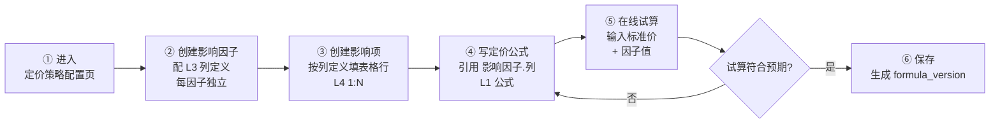

# 客户定价 — 多种定价法需求规格

> 日期:2026-09-29 | 性质:业务需求规格,待业务方评审
> 读者:业务方 + 产品经理 + 开发

---

## 0. 路由向导

按你的角色选择阅读路径:

### 业务方(评审拍板)

1. 第3章 可配置定价策略架构 — 评审 A1-A4 决策
2. 第4章 定价方案 5 个 — 评审 P0/P1
3. 第6章 待业务方拍板汇总(20 项)— **必看**

### 产品经理(需求落地)

1. 第1章 现状与基础 — 理解基本盘(公式固定/可配)
2. 第2章 成本大表分析 + 借鉴
3. 第3章 可配置架构 — 数据树 + 安全护栏
4. 第4章 定价方案 — 5 个方案详细业务方案

### 开发(技术落地)

1. 第2章 成本大表深层逻辑借鉴(2.5 节)
2. 第3章 可配置架构 — 核心实现
3. 3.8 节 公式编辑器技术调研 — Angular CDK + MathLive + mathjs
4. 第4章 各方案 — 数据模型 + 公式细节

### 快速跳转

| 我关心                     | 跳到         |
| -------------------------- | ------------ |
| 拍板 20 项                 | 第6章        |
| 标准定价方案               | 4.2 节       |
| 紧急加价方案               | 4.3 节       |
| VIP 客户价方案             | 4.4 节       |
| 远程诊断定价方案(无标准价) | 4.5 节       |
| 询价包干价方案             | 4.6 节       |
| 跨币种(基础能力)           | 2.5.2 借鉴 D |
| 可配置公式 / 数据树        | 第3章        |
| 编辑器插件                 | 3.8 节       |

---

## 1. 现状与基础

### 1.1 固定部分(不可配)

```
单条明细金额 = Σ(职级费率 × 人数) × 单件标准工时 × 数量
标准价 = Max(合计保底价, 明细合计)
最终报价 = 定价公式(标准价)   // 定价公式内容见 第4章 各方案
```

### 1.2 因子划分

| 类别     | 包含                                  | 作用       |
| -------- | ------------------------------------- | ---------- |
| 基础因子 | 职级费率 / 标准工时 / 数量 / 计件基准 | 推标准价   |
| 影响因子 | (可配的分类)                          | 调节最终价 |

### 1.3 业务事实

- 客户档案已存在
- 默认一船一单
- 客户侧只看最终价(D17)

---

## 2. 成本大表分析

### 2.1 6 种计价逻辑概览

| #   | 方法           | 业务语义             |
| --- | -------------- | -------------------- |
| 1   | 成本加成       | 成本 + 计划毛利率    |
| 2   | 市场导向       | 看竞品行情 + 毛利率  |
| 3   | 边际成本(船套) | 大批量同型船分摊成本 |
| 4   | 效用           | 按客户使用价值       |
| 5   | 自定义         | 名称 + 金额(兜底)    |
| 6   | 其他费用/佣金  | 名称 + 金额(附加项)  |

### 2.2 客户定价场景对照

| #   | 成本大表方法   | 客户定价适用性 | 判定                     |
| --- | -------------- | -------------- | ------------------------ |
| 1   | 成本加成       | ❌ 不适用      | D17 已定客户侧不暴露成本 |
| 2   | 市场导向       | ❌ 不适用      | 客户定价是参考报价       |
| 3   | 边际成本(船套) | ❌ 不适用      | 单船单次,无"船套"概念    |
| 4   | 效用           | ❌ 不适用      | 维保是劳务型             |
| 5   | 自定义         | ✅ 已沿用      | —                        |
| 6   | 其他费用/佣金  | ✅ 已沿用      | —                        |

**核心**:借鉴"可插拔"框架思想(调研报告 5.1 节 P0),不照搬 6 种方法。

### 2.3 4 种不适用方法的详细分析

- **成本加成**:客户侧不看成本构成(D17),加成无意义
- **市场导向**:是 B2C 询价参考,不是 B2B 竞品对比
- **边际成本(船套)**:默认一船一单,无"船套"概念
- **效用**:维保是劳务型服务,非按用量计费商品

### 2.4 2 种可沿用方法

| 方法          | 沿用方式                     |
| ------------- | ---------------------------- |
| 自定义        | 客户定价已有"自定义"附加项   |
| 其他费用/佣金 | 客户定价已有"代理佣金"附加项 |

### 2.5 深层逻辑借鉴

#### 2.5.1 4 个可借鉴的底层逻辑

| 借鉴点            | 业务本质             | 状态        | 备注                     |
| ----------------- | -------------------- | ----------- | ------------------------ |
| Strategy Pattern  | 加新方法不动现有数据 | ✅ P0 已定  | 调研报告 5.1 节          |
| 多对多关联        | 询价单↔客户/系数 N:N | ✅ 浅借鉴   | 审计可追溯               |
| 快照冻结 + 生效期 | 历史询价不受调价影响 | ✅ 已实现   | R-23                     |
| 跨币种 + 汇率     | 国外客户询价锁定     | ✅ 基础能力 | 调研报告 5.2 节,见借鉴 D |

#### 2.5.2 借鉴方式详解

##### 借鉴 A:Strategy Pattern

**未来支持的定价方法**(详见 第4章):标准定价 + 紧急加价 + VIP + 远程诊断 + 包干价,可扩展。

##### 借鉴 B:多对多关联

```
询价单 (inquiry)
├─ N:N 客户档案
├─ N:N 影响因子快照
├─ 1:N 服务项
└─ 1:N 定价公式快照
```

##### 借鉴 C:快照冻结 + 生效期

- 询价单提交冻结(R-23)
- 职级费率卡带生效期
- 调费率/调公式不影响历史询价单

##### 借鉴 D:跨币种 + 汇率(必做基础,非定价方案)

- 询价单加币种 + 汇率字段
- 提交时按当时汇率锁定
- 销售邮件双币种展示
- **不属于 第4章 定价方案范畴,作为基础能力一并实现**

#### 2.5.3 决策点(1 项)

| #   | 决策           | 推荐                    |
| --- | -------------- | ----------------------- |
| C1  | 多对多关联深度 | 浅(只关联客户+影响因子) |

---

## 3. 可配置定价策略架构(定价公式数据模型树)

### 3.1 业务目标与层级关系

#### 业务目标

让业务方自主配置定价公式,无需开发介入。

#### 4 层数据(从外到内)

```
L1 定价公式(根,可配)
   │
   ├─ 引用 L2 的变量
   │
L2 影响因子(分类,可添加 N 个)
   │
   ├─ 每个影响因子配自己的 L3 列定义
   │
L3 列定义(JSON,每因子独立配)
   │
   └─ 决定 L4 表格列展示
   │
L4 影响项(表格行,1:N)
   │
   └─ 公式取值 = 命中行.列值
```

#### 各层关键词

| 层级 | 关键词         | 由谁配             | 影响公式的方式      |
| ---- | -------------- | ------------------ | ------------------- |
| L1   | 定价公式       | 业务方             | 引用 L2 变量        |
| L2   | 影响因子       | 业务方(可加 N 个)  | 被公式引用,提供变量 |
| L3   | 列定义(JSON)   | 业务方(每因子独立) | 决定 L4 表格列      |
| L4   | 影响项(表格行) | 业务方(按列定义填) | 公式取值源头        |

#### 2 种喂数方式(公式中引用)

| 概念         | 用途                                                          | 谁配   |
| ------------ | ------------------------------------------------------------- | ------ |
| 系统变量     | 标准价(固定)                                                  | 系统   |
| 影响因子(L2) | 多档值或单一值(1 行)(VIP 5 档 / 远程费率 / 时长 / 落定系数)等 | 业务方 |

### 3.2 业务方操作流程



**关键节点**:

| 步骤           | 内容                                     | 失败回退                       |
| -------------- | ---------------------------------------- | ------------------------------ |
| ② 创建影响因子 | L2 因子 + L3 列定义(每因子独立配)        | 列定义错 → 改列定义            |
| ③ 创建影响项   | L4 表格行(按列定义填,1:N)                | 系数错 → 改表格行              |
| ④ 写公式       | 拖拽构建器 + 纯文本辅助,引用 影响因子.列 | 公式语法错 → mathjs parse 报错 |
| ⑤ 试算         | 输入标准价 + 各因子值 → 看输出           | 不符合 → 回到 ④ 调整           |
| ⑥ 保存         | 生成 formula_version,询价单引用此版本    | 历史询价单已快照,改不影响      |

**关键顺序**:先有数据(L2/L3/L4),后有公式(L1)引用数据。**②③ 是数据准备,④ 是公式编写**。

### 3.3 核心业务规则

| #    | 规则                | 含义                                  |
| ---- | ------------------- | ------------------------------------- |
| R-A1 | 系数必有,数值       | 影响项表中的"系数"列,公式 × 引用      |
| R-A2 | 因子编码 = 引用 key | 改名不改公式                          |
| R-A3 | 公式 = 数学表达式   | 含变量 + 函数(Max/Min...)             |
| R-A4 | 公式必含标准价      | 或勾选"无标准价"                      |
| R-A5 | 历史询价单已快照    | 改公式不影响历史                      |
| R-A6 | 基础数学函数        | Max/Min/Round/If/Abs/Ceil/Floor(7 个) |
| R-A7 | 反向引用追踪        | 因子配置页显示"被哪些公式引用"        |
| R-A8 | 软删策略            | 删列/项/因子标记"已删除",数据保留     |

### 3.4 数据模型树(4 层 + 3 种喂数方式)

```
                        定价公式(L1,根,可配)
                                │
        ┌───────────────────────┼
        │                       │
   系统变量(固定)         L2 影响因子(业务方配,1:N 个)
   标准价               多档值或单一值(1 行)
                                │
                  ┌─────────────┼─────────────┐
                  │             │             │
               L3 列定义      L3 列定义    L3 列定义
              (JSON, 每因子独立配)
                  │
              name(文本)/rate(数字)/remark(文本,选填)
                  │
              L4 影响项(表格行,1:N)
```

**4 层"配 → 影响"关系**:

| 层级 | 名称           | 由谁配               | 影响下层              |
| ---- | -------------- | -------------------- | --------------------- |
| L1   | 定价公式       | 业务方               | 引用 L2 变量          |
| L2   | 影响因子       | 业务方               | 公式引用              |
| L3   | 列定义(JSON)   | 业务方(每个因子独立) | 决定 L4 表格列        |
| L4   | 影响项(表格行) | 业务方(按列定义填)   | 公式引用"命中行.列值" |

**L3 列定义字段**(JSON,每因子独立配):

| 字段              | 必填 | 说明                                              |
| ----------------- | ---- | ------------------------------------------------- |
| **列名**          | ✅   | 显示用,可起别名(如"折扣率"/"加价率")              |
| **列编码**        | ✅   | 公式引用 key                                      |
| **数据类型**      | ✅   | 文本/数字/日期/下拉/接口                          |
| **是否必填**      | ✅   | 默认 true(除"备注"列)                             |
| **是否参与公式**  | ✅   | 该列能否被公式引用(系数列=是,名称/备注列=否)      |
| **默认值**        | ❌   | 新增影响项时的初始值(系数默认 1.0,备注默认空)     |
| **值域/取值范围** | ❌   | 数值/日期列的合法区间(系数 [0,10],比率 [0.5,3.0]) |

**系数列约定**(每个影响因子必须有):

- 列名默认 = "影响因子名 + 系数"(如"时间系数"、"VIP等级系数"),**可起别名**(如"折扣率"、"加价率"、"落定系数")
- 数据类型 = 数字
- 必填 = true
- 公式引用 = `因子编码.列编码`(如 `VIP_LEVEL.rate`)

#### **待补充:匹配策略(占位)✨**

每个影响因子应配"如何匹配到这个影响项的系数",例如:

- 单值匹配(客户档案某字段 = 影响项某列)
- 范围匹配(服务日期在某区间 → 取某行)
- 默认值匹配(无匹配 → 取默认行)
- 优先级匹配(多匹配 → 取优先级最高的)

**当前状态**:**概念已抛,具体策略待后续讨论**。本章先不深入。

---

**L4 影响项举例**(影响因子"VIP等级"):

```
第 1 层:VIP_LEVEL,名称"VIP等级"
第 1.5 层(列定义):
| 列名 | 列编码 | 数据类型 | 必填 |
|------|--------|---------|------|
| 客户等级 | name | 文本 | ✅ |
| 折扣率 | rate | 数字 | ✅ |
| 备注 | remark | 文本 | ❌ |

第 2 层(影响项,表格):
| 客户等级 | 折扣率 | 备注 |
|---------|--------|------|
| 普通 | 1.00 | 默认 |
| 银卡 | 0.95 | 年度≥3次 |
| 金卡 | 0.90 | 年度≥5次 |
| 钻石 | 0.85 | 战略合作 |
| 战略 | NULL | 协议价 |

公式引用: VIP_LEVEL.rate (取当前命中行的 rate 列值)
```

### 3.5 安全护栏

| 维度          | 规则                                                                        |
| ------------- | --------------------------------------------------------------------------- |
| 反向引用追踪  | 影响因子配置页显示"被哪些公式引用",删/禁用前弹窗警告                        |
| 软删策略      | 删列/项/因子 → 标记"已删除",数据保留,UI 隐藏,公式引用失效警告               |
| 引用 key 稳定 | 因子编码 / 列编码 作引用 key,改名不影响;改编码 ❌ 禁止                      |
| 历史快照      | 询价单提交时全快照(公式 + 因子结构 + 影响项值 + 参数 + 字段),改后不影响历史 |

**关键**:删除实际项跟已报价的内容无影响(已快照),重新生成报价才会用新结构,对客户无感知。

### 3.6 老架构兼容:紧急/地点/时间 = 影响因子

**现状**:紧急/地点/时间 = 影响系数(Max 合成)。

**新架构**:三个都是影响因子(与其他因子同级),通过公式表达式合成:

```
紧急系数 = 紧急影响因子.系数
地点系数 = 地点影响因子.系数
时间系数 = 时间影响因子.系数
公式 = 标准价 × max(紧急系数, 地点系数, 时间系数)
```

业务方能配紧急/地点/时间的影响项(如紧急 5 档),公式用 Max 函数合成。**老逻辑保留**。

### 3.7 多因子命中流程

| 因子             | 命中方式                 | 谁填   |
| ---------------- | ------------------------ | ------ |
| VIP 等级         | 系统从客户档案读         | 自动   |
| 紧急加价         | 客户在询价时选           | 客户   |
| 地点系数         | 客户在询价时选           | 客户   |
| 时间系数         | 服务日期 → 自动算入      | 系统   |
| 落定系数         | 销售在询价后选(影响因子) | 销售   |
| 远程费率(单一值) | 业务方配 1 行影响项      | 业务方 |
| 时长(单一值)     | 客户填影响因子值         | 客户   |

### 3.8 决策点(4 项)

| #   | 决策           | 推荐                                  |
| --- | -------------- | ------------------------------------- |
| A1  | 公式编辑器形态 | 拖拽构建器 + 纯文本辅助               |
| A2  | 影响因子可添加 | 是(业务方/系统可扩)                   |
| A3  | 影响项可配置   | 是(每因子独立配列定义)                |
| A4  | 基础数学函数   | Max/Min/Round/If/Abs/Ceil/Floor(7 个) |

### 3.9 公式编辑器技术调研

> 仅调研文档,未实际集成 MCP。

| 层             | 技术                     | 用途                            | Angular 15 兼容  |
| -------------- | ------------------------ | ------------------------------- | ---------------- |
| 拖拽底层       | `@angular/cdk/drag-drop` | 影响因子/系统变量拖入编辑区     | ✅ 官方          |
| 公式编辑面板   | 自建 Angular 组件        | 业务方拖拽生成公式字符串        | ✅               |
| 公式预览(可选) | `MathLive`               | 字符串 → LaTeX → 数学公式可视化 | ✅ Web Component |
| 公式求值       | `mathjs` `evaluate()`    | 后端跑 + 前端预览               | ✅ 纯 JS         |
| 公式校验       | `mathjs` `parse()`       | 校验语法 + 自定义函数           | ✅ 纯 JS         |

调研时间:2026-09-29 / 状态:仅调研文档,未实际集成 MCP

---

## 4. 定价方案(按推荐优先级)

### 4.1 优先级排序总览

**所有定价方案共同遵守的公式**(不可变):

```
单条明细金额 = Σ(职级费率 × 人数) × 单件标准工时 × 数量
标准价 = Max(合计保底价, 明细合计)
最终报价 = 定价公式(标准价)   // 定价公式内容是每个方案唯一不同的地方
```

| 优先级 | 方案                    | 推荐理由                   | 详细方案 |
| ------ | ----------------------- | -------------------------- | -------- |
| 基础   | 标准定价方案            | 客户定价默认,已实现        | 4.2 节   |
| P0     | 紧急加价方案            | 现有雏形,改造小,业务价值大 | 4.3 节   |
| P1     | VIP 客户价方案          | 客户档案已就位,锁单关键    | 4.4 节   |
| P1     | 远程诊断定价方案        | 覆盖长尾小客户,无标准价    | 4.5 节   |
| P1     | 询价包干价方案          | 区间报价 + 销售落定        | 4.6 节   |
| P2     | 续约折扣 / SLA          | 需订单域/服务承诺前置      | 后置     |
| —      | 季节性折扣 / 保底价拆分 | 不推荐                     | 4.7 节   |

---

### 4.2 标准定价方案(基础,已实现)

#### 1. 一句话

客户定价的默认定价法 — 工时推导单价 × 数量。

#### 2. 公式

```
定价公式:标准价 × 地点系数 × 时间系数
```

#### 3. 决策点

| #   | 决策         | 现状                 |
| --- | ------------ | -------------------- |
| S1  | 单价推导路径 | 统一工时标准(D15)    |
| S2  | 多件作业     | 全额计(D18)          |
| S3  | 保底价       | 人工最低一天 8h(D16) |
| S4  | 影响系数     | Max(地点, 时间)      |

#### 4. 融合方式

- 与基础因子:自身就是基础因子的核心实现
- 与影响因子:正交(紧急/地点/时间 影响因子作用于标准价)
- 与报价公式:`最终报价 = 定价公式(标准价)`,标准价是公式输入
- 与询价单:快照冻结行金额 + 标准价 + 保底价

#### 5. 详细业务方案

##### 业务方操作流程

1. 后台维护职级字典 + 费率卡(带生效期)
2. 后台维护标准工时(型号级多选 > 设备级两级回溯)
3. 客户询价时按型号 + 维保类型匹配
4. 系统按公式算标准价

##### 核心业务规则

| 规则 | 含义                             |
| ---- | -------------------------------- |
| R-S1 | 职级费率卡带生效期,调薪全局生效  |
| R-S2 | 标准工时两级回溯(型号 > 设备)    |
| R-S3 | 多件作业按全额计(件数系数已退役) |

##### 业务验收标准

- V-S1:职级费率卡生效期生效
- V-S2:标准工时两级回溯生效
- V-S3:多件全额计
- V-S4:保底价生效(<明细时托底)

##### 业务方使用场景

**场景:客户询价标准保养**

1. 客户选型号 6S35ME + 维保类型 + 周期
2. 系统匹配标准工时 → 算行金额
3. 套餐合计 + 保底价 → 取高者 = 标准价

---

### 4.3 P0 紧急加价方案 ⭐

#### 1. 一句话(含推荐理由)

客户要得急,加价;要得不急,原价。从乘数升级为独立定价法 — 业务可解释,成本可测算,数据可沉淀。

#### 2. 公式

```
定价公式:标准价 + 标准价 × (加价率 - 1)
```

#### 3. 决策点(6 项)

| #   | 决策           | 推荐                 |
| --- | -------------- | -------------------- |
| U1  | 加价率配置方   | 运营配               |
| U2  | 字典档位       | 5 档(含特急/灾难)    |
| U3  | 与影响因子关系 | 完全解耦(独立定价法) |
| U4  | 加价金额可见性 | 销售邮件可见         |
| U5  | 加价说明路径   | 邮件 + 后台双通道    |
| U6  | 加价率是否独立 | 是(直接引用加价金额) |

#### 4. 加价率与融合方式

**加价率建议**:

| 紧急程度 | 加价率     | 备注        |
| -------- | ---------- | ----------- |
| 不紧急   | 100%       | 默认        |
| 紧急     | 120%(+20%) | 加班成本    |
| 非常紧急 | 150%(+50%) | 外协 + 加班 |
| 特急     | 协议价     | 单谈        |
| 灾难级   | 协议价     | 单谈        |

**升级理由矩阵**:

| #   | 理由           | 升级后效果                                 |
| --- | -------------- | ------------------------------------------ |
| 1   | 业务可见       | 销售邮件明示加价金额                       |
| 2   | 成本可测算     | 加价率=真实成本(加班/外协/违约/物流)       |
| 3   | 与影响因子解耦 | 独立定价法,不再走 Max 合成                 |
| 4   | 多档扩展       | 2 档 → 5 档                                |
| 5   | 数据沉淀       | 加价金额独立字段,统计"加价贡献率"          |
| 6   | 业务可拍板     | 加价率=绝对加价幅度,易决策                 |
| 7   | 可解释         | 销售说清"加价 $20 万 = 加班 + 外协 + 物流" |
| 8   | 维度清晰       | 与地点/时间正交,不再互相挤压               |

**融合方式**:

- 与基础因子:正交(基础因子推标准价,加价因子推加价额)
- 与影响因子:完全解耦,独立定价法,不再走 Max 合成
- 与报价公式:`最终报价 = 标准价 + 加价金额`,加价行独立展示
- 与询价单:新增 `urgency_level_id` + `urgency_premium_amount` + `urgency_premium_rate` + `urgency_premium_explanation` 字段,均进快照
- 与影响因子分类:**影响因子 = "紧急加价"**,影响项 = 5 档加价率

#### 5. 详细业务方案

##### 业务方操作流程

1. 运营配置紧急程度字典(5 档)
2. 运营配置各档加价率
3. 客户询价选紧急程度 → 系统算加价金额
4. 销售邮件显示"紧急加价 $X(理由)"

##### 核心业务规则

| 规则 | 含义                               |
| ---- | ---------------------------------- |
| R-E1 | 5 档(不急/紧急/非常紧急/特急/灾难) |
| R-E2 | 加价率独立配置,运营维护            |
| R-E3 | 加价金额 = 标准价 × (加价率 - 1)   |
| R-E4 | 销售邮件必显示加价理由             |
| R-E5 | 加价金额进询价单快照               |

##### 业务验收标准

- V-E1:5 档字典可配
- V-E2:加价率可独立维护
- V-E3:销售邮件含加价金额 + 理由
- V-E4:快照冻结加价金额
- V-E5:不影响历史询价单

##### 业务方使用场景

**场景:客户紧急询价**

1. 客户选"紧急"
2. 系统:加价 = 100 万 × 20% = 20 万
3. 销售邮件:"标准价 100 万 + 紧急加价 20 万 = 120 万"
4. 销售解释:"加价 20% = 加班 + 物流"

---

### 4.4 P1 VIP 客户价方案 ⭐

#### 1. 一句话(含推荐理由)

同产品,不同客户不同价。按客户等级折扣 — 锁单关键手段,客户档案已就位可直接做。

#### 2. 公式

```
定价公式:标准价 × VIP 折扣率
```

#### 3. 决策点(5 项)

| #   | 决策         | 推荐                |
| --- | ------------ | ------------------- |
| V1  | 等级体系     | 5 级(含战略)        |
| V2  | 评定方       | 系统自动 + 运营复核 |
| V3  | 复评周期     | 一年                |
| V4  | 战略客户参与 | 不参与(协议价)      |
| V5  | 等级快照口径 | 询价时点            |

#### 4. 等级体系与融合方式

**等级体系**:

| 等级 | 折扣率 | 评定标准                         | 备注       |
| ---- | ------ | -------------------------------- | ---------- |
| 普通 | 100%   | 默认                             | —          |
| 银卡 | 95%    | 年度询价 ≥ 3 次 或 累计 ≥ 50 万  | 自动       |
| 金卡 | 90%    | 年度询价 ≥ 5 次 或 累计 ≥ 200 万 | 自动       |
| 钻石 | 85%    | 战略合作                         | 运营手工   |
| 战略 | 协议价 | 不参与折扣                       | 协议价单谈 |

**融合方式**:

- 与基础因子:正交
- 与影响因子:正交
- 与报价公式:`VIP 报价 = 标准价 × VIP 折扣率`,折扣独立展示
- 与询价单:新增 `customer_id` + `customer_level` + `vip_discount_rate` 字段
- 与客户档案:已存在,只需新增等级字段
- 与影响因子分类:**影响因子 = "VIP 等级"**,影响项 = 5 级折扣率

#### 5. 详细业务方案

##### 业务方操作流程

1. 运营配置等级体系(5 级)
2. 系统按规则自动评定等级
3. 运营复核
4. 客户询价按等级折扣
5. 一年后自动复评

##### 核心业务规则

| 规则 | 含义                           |
| ---- | ------------------------------ |
| R-V1 | 5 级(普通/银卡/金卡/钻石/战略) |
| R-V2 | 自动评定 + 运营复核            |
| R-V3 | 一年复评一次                   |
| R-V4 | 战略客户协议价,不参与折扣      |
| R-V5 | 等级快照冻结在询价时点         |

##### 业务验收标准

- V-V1:5 级可配
- V-V2:自动评定按规则
- V-V3:运营可手工调整
- V-V4:战略客户协议价
- V-V5:等级快照生效

##### 业务方使用场景

**场景:金卡客户询价**

1. 客户档案已标"金卡"
2. 询价时识别 → 应用 90% 折扣
3. 销售邮件:"标准价 100 万 × 90% = 90 万(金卡价)"

---

### 4.5 P1 远程诊断定价方案 ⭐(无标准价)

#### 1. 一句话(含推荐理由)

视频/电话指导,不出场 — 覆盖长尾小客户,纯人力低成本,边际成本接近零。

#### 2. 公式

```
定价公式:远程费率 × 时长   // 勾选"无标准价"
```

#### 3. 决策点(2 项)

| #   | 决策           | 推荐                                |
| --- | -------------- | ----------------------------------- |
| B1  | 是否做远程诊断 | 做(P1)                              |
| —   | 远程费率如何配 | 影响因子(单一值 1 行)+ 时长上限封顶 |

#### 4. 远程费率与融合方式

**远程费率建议**:

| 咨询类型 | 费率(假设) | 备注     |
| -------- | ---------- | -------- |
| 视频诊断 | $80/h      | 主力场景 |
| 电话咨询 | $50/h      | 轻量场景 |
| 邮件书面 | $30/封     | 异步场景 |

**时长封顶**:单次询价 ≤ 4 小时,超出转现场服务。

**融合方式**:

- 与基础因子:替代
- 与影响因子:正交(地点可能仍适用;时间不适用)
- 与报价公式:`远程诊断报价 = 远程费率 × 时长`,独立定价
- 与标准价:勾选"无标准价",系统不校验标准价存在
- 与询价单:新增 `pricing_method = remote_diagnosis` + `remote_hours` + `remote_rate` 字段
- 与业务边界:沉淀远程案例库

#### 5. 详细业务方案

##### 业务方操作流程

1. 运营配置远程费率(单一参数)
2. 客户选远程诊断 + 填预估时长
3. 系统按"远程费率 × 时长"算报价
4. 时长封顶(默认 4h,超出转现场)

##### 核心业务规则

| 规则 | 含义                             |
| ---- | -------------------------------- |
| R-R1 | 远程费率 = 影响因子(单一值 1 行) |
| R-R2 | 时长 = 影响因子(单一值,客户填)   |
| R-R3 | 时长上限封顶(默认 4h)            |
| R-R4 | 公式勾"无标准价"                 |
| R-R5 | 沉淀远程案例库                   |

##### 业务验收标准

- V-R1:远程费率可配
- V-R2:时长封顶生效
- V-R3:公式无标准价校验
- V-R4:超 4h 提示转现场服务

##### 业务方使用场景

**场景:小客户远程咨询**

1. 客户选"远程诊断"+"视频 2 小时"
2. 系统:80 × 2 = 160 USD
3. 销售邮件:"远程诊断费 160 USD(视频 2 小时)"

---

### 4.6 P1 询价包干价方案(区间报价) ⭐

#### 1. 一句话(含推荐理由)

系统给"8-12 万"区间报价,期内有效 — 客户决策快,销售沟通轮次减半。

#### 2. 公式

```
定价公式:标准价 × 落定系数(销售在 [0.95, 1.10] 区间内选)
```

#### 3. 决策点(2 项)

| #   | 决策             | 推荐                 |
| --- | ---------------- | -------------------- |
| B2  | 是否做询价包干价 | 做(P1)               |
| —   | 区间宽度如何配   | 下限 95% / 上限 110% |

#### 4. 区间配置与融合方式

**区间配置建议**:

| 标准价档位 | 区间宽度     | 备注            |
| ---------- | ------------ | --------------- |
| < 10 万    | [95%, 110%]  | 小单            |
| 10-50 万   | [95%, 115%]  | 中单            |
| 50-100 万  | [95%, 120%]  | 大单            |
| > 100 万   | [协议, 协议] | 超大单,不走区间 |

**融合方式**:

- 与基础因子:正交
- 与影响因子:正交
- 与报价公式:`最终报价 = 标准价 × 落定系数`
- 与询价单:新增 `pricing_method = package_price` + `price_range_min/max` + `final_locked_price` 字段
- 与销售流程:新增销售落价环节
- 与客户侧:客户看到区间,销售邮件落定具体值

#### 5. 详细业务方案

##### 业务方操作流程

1. 运营配置区间宽度(按标准价档位)
2. 系统生成区间(如 9.5-11 万)
3. 客户拿区间报价
4. 销售在区间内落定具体值(影响因子)
5. 7 天内有效,逾期重算

##### 核心业务规则

| 规则 | 含义                   |
| ---- | ---------------------- |
| R-P1 | 区间按标准价档位配     |
| R-P2 | 销售落定价 ∈ 区间      |
| R-P3 | 7 天有效,逾期重算      |
| R-P4 | >100 万走协议,不走区间 |
| R-P5 | 销售落定价进快照       |

##### 业务验收标准

- V-P1:区间按档位自动生成
- V-P2:销售落定校验在区间内
- V-P3:逾期重算提示
- V-P4:超大单走协议流程

##### 业务方使用场景

**场景:中型客户询价**

1. 系统:标准价 10 万 → 区间 [9.5 万, 11 万]
2. 客户拿区间:"9.5-11 万"
3. 销售落定:"10.5 万"
4. 销售邮件:"标准价 10 万 × 落定系数 1.05 = 10.5 万"

---

### 4.7 P2 暂缓 / 不推荐方案(简列)

| 方案               | 状态      | 备注                  |
| ------------------ | --------- | --------------------- |
| 续约折扣/年单      | P2 后置   | 需客户档案+订单域联动 |
| SLA 等级差价       | P2 暂缓   | 需服务承诺机制配套    |
| 多对多关联深化     | P2        | 见 2.5.2 借鉴 B       |
| 季节性折扣         | ❌ 不推荐 | 维保是刚性需求        |
| 保底价拆分(D16 拆) | ❌ 不推荐 | D16 已定              |
| 批量优惠           | ❌ 不推荐 | 业务场景不清晰        |

---

## 5. 优先级与工作量

| 优先级 | 方案                 | 工作量 | 备注                         |
| ------ | -------------------- | ------ | ---------------------------- |
| 基础   | 标准定价方案(已实现) | —      | 默认定价法                   |
| 基础   | 跨币种 + 汇率        | 1 周   | 必做基础能力,见 2.5.2 借鉴 D |
| P0     | 紧急加价方案         | 1 周   | 改造小,业务可见              |
| P0     | 可配置定价策略框架   | 3 周   | 含 第3章 全部                |
| P1     | VIP 客户价方案       | 1 周   | 客户档案已就位               |
| P1     | 远程诊断定价方案     | 1 周   | 纯人力配置                   |
| P1     | 询价包干价方案       | 2 周   | 区间生成 + 销售落价流程      |
| P2     | 续约折扣             | 3 周   | 需订单域                     |
| P2     | SLA 等级差价         | 2 周   | 需服务承诺                   |
| P2     | 多对多关联深化       | 1 周   | 待 C1                        |

---

## 6. 待业务方拍板汇总(20 项)

| 类别              | 数量   | 编号       |
| ----------------- | ------ | ---------- |
| 紧急加价          | 6      | U1-U6      |
| VIP 客户价        | 5      | V1-V5      |
| 远程诊断 / 包干价 | 2      | B1, B2     |
| 成本大表借鉴      | 1      | C1         |
| 可配置定价策略    | 4      | A1-A4      |
| 不推荐项          | 2      | (内部决策) |
| **总计**          | **20** | —          |

---

## 附录:术语表

| 术语             | 解释                                 |
| ---------------- | ------------------------------------ |
| Strategy Pattern | 加新定价方法不动现有公式             |
| 定价公式         | 业务方配置的数学表达式               |
| 标准价           | Max(合计保底价, 明细合计),不可变     |
| 影响因子         | 定价公式中的变量分类(可添加)         |
| 影响项           | 影响因子下的表格行(按列定义填值)     |
| 列定义           | 每个影响因子独立配置的列结构(JSON)   |
| 系数             | 影响项的核心数值字段,公式中 × 引用   |
| 数据类型         | 列定义字段(文本/数字/日期/下拉/接口) |
| 备注             | 选填列(默认非必填)                   |
| 紧急加价方案     | 客户要求加急,在标准价基础上加收      |
| VIP 客户价方案   | 按客户等级给予不同折扣               |
| 远程诊断定价方案 | 视频/电话指导,不出场(无标准价)       |
| 询价包干价方案   | 系统给区间报价,销售落定              |
| 续约折扣         | 一次性签 N 年维保,年单价递减         |
| 无标准价勾选     | 公式编辑器顶部选项                   |
| formula_version  | 公式版本号                           |
| 跨币种能力       | 必做基础能力,国外客户询价汇率锁定    |
| MathLive         | Web Component 数学公式编辑器         |
| mathjs           | 数学公式解析与求值引擎               |
| Angular CDK      | Angular 官方拖拽底层库               |

---

## 关联文档

- 《客户定价参考成本大表计价逻辑 — 调研报告》(同级目录)
- 《船舶维保定价系统-业务梳理》v1.15(同项目 docs/)
- 《船舶维保定价系统-DDD领域梳理》v2.13(同项目 docs/)
- 《船舶维保定价系统-数据表结构设计》(同项目 docs/)
- 《船舶维保定价系统-开发需求文档》(同项目 docs/)
