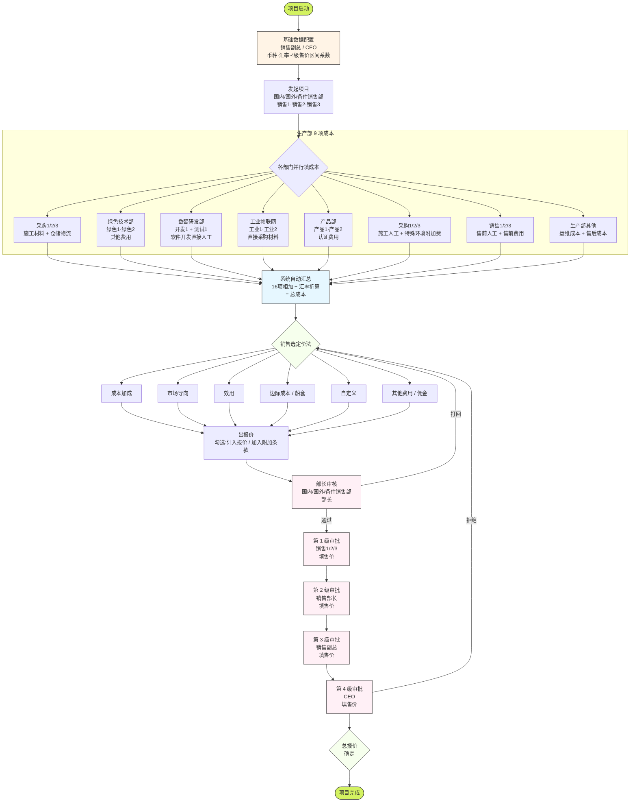

# 成本核算大表 — 全流程图

> 适用范围:`wk-mhc-ui`(前端)+ `wk-sd-supply-api`(后端 `com.wk.sd.cost`)
> 组织架构来源:内部人员表
> 渲染说明:VSCode 安装 `Markdown Preview Mermaid Support` 插件即可看图;GitHub / GitLab / Typora 也支持

---

## 流程图



---

## 角色职责速查

| 角色           | 环节                        | 操作                                      |
| -------------- | --------------------------- | ----------------------------------------- |
| 销售副总 / CEO | 阶段 0                      | 配基础数据                                |
| 销售1/2/3      | 阶段 1 / 阶段 4 / 第1级审批 | 发起 + 填售前成本 + 选定价法 + 第1级售价  |
| 销售部长       | 阶段 4 部门审 / 第2级审批   | 部门审核 + 第2级售价                      |
| 销售副总       | 第3级审批                   | 第3级售价                                 |
| CEO            | 第4级审批                   | 第4级售价 + 终审                          |
| 采购1/2/3      | 阶段 2                      | 施工材料 + 仓储物流 + 施工人工 + 特殊环境 |
| 绿色1/2        | 阶段 2                      | 生产阶段其他费用                          |
| 开发1 + 测试1  | 阶段 2                      | 软件开发直接人工                          |
| 工业1/2        | 阶段 2                      | 生产阶段直接采购材料                      |
| 产品1/2        | 阶段 2                      | 认证费用                                  |

---

## 6 种定价法

| #   | 方法          | 销售要填的字段                 |
| --- | ------------- | ------------------------------ |
| 1   | 成本加成      | 计划毛利率                     |
| 2   | 市场导向      | 计划毛利率 + 市场参考价        |
| 3   | 效用          | 价值感类型 + 建议方式          |
| 4   | 边际成本      | 船套数 + 单船套成本 + 回本年限 |
| 5   | 自定义        | 名称 + 金额                    |
| 6   | 其他费用/佣金 | 名称 + 金额                    |

---

## 4 级审批关键约束

- 每级都有 **售价区间**(基础数据快照,系数 × 项目总报价)
- 每级都要填 **实际售价**(不可越级代办)
- **总裁(CEO)拍板的售价 = 项目最终总报价**

---

## 项目状态机(`CostProjectProcessStatus`)

```
launched          → 发起完成
   ↓
waiting-cost      → 生产部填完成本
   ↓
costing           → 销售汇总中
   ↓
cost-complete     → 汇总完成
   ↓
waiting-price     → 等待销售定价
   ↓
pricing           → 定价编辑中
   ↓
set-price-submit  → 定价提交
   ↓
set-price-complete→ 定价完成
   ↓
complete          → 项目完成
```
