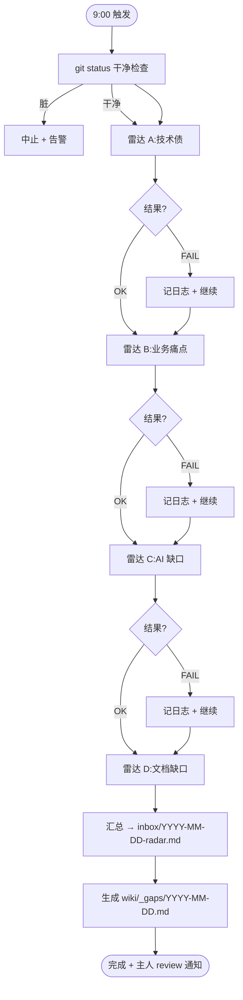
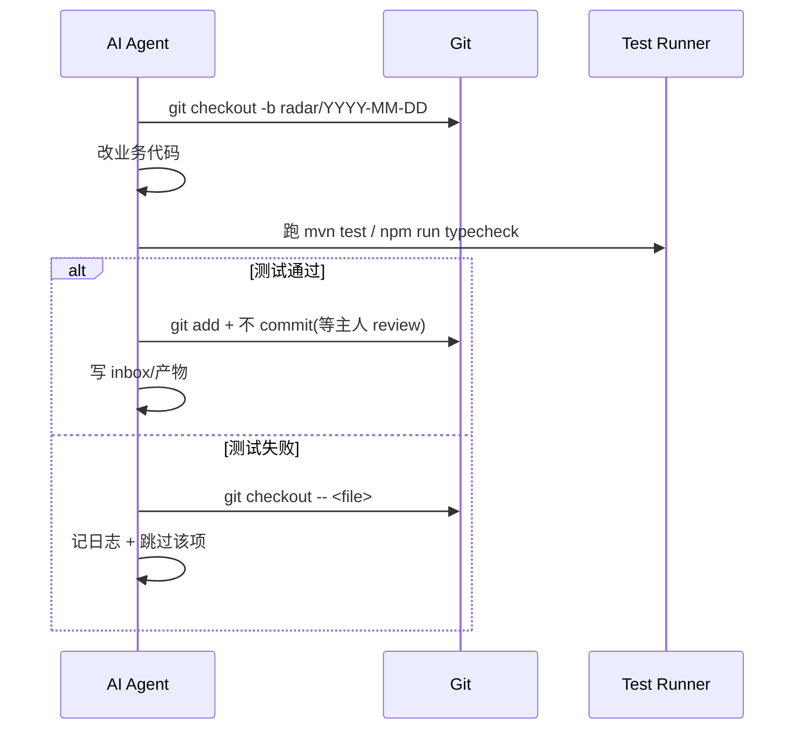

# Self-Driving Radar PRD(自驱需求雷达)

> 最后更新: 2026-07-07
> Owner: 产品经理 agent
> 状态: 草稿(等 Orchestrator 拍板)
> 父任务:工作流永远不停,自己创造需求

## 1. 背景与目标

### 1.1 痛点

| #   | 痛点             | 现象                                        |
| --- | ---------------- | ------------------------------------------- |
| 1   | 工作流闲置       | 没需求时 AI agent 没事干,等主人想           |
| 2   | 需求发现全靠人脑 | 6 个项目 + 大量 TODO/v3 空壳,人工盘点负担重 |
| 3   | 漏看即忘         | 主人错过当日候选,第二天就消失               |
| 4   | 改坏无人兜底     | AI 写代码无 test + 无回滚机制,风险高        |

### 1.2 现状盘点

- 6 个项目:`wk-train-center-service`(后端)/ `wk-train-center-ui`(Vue2)/ `wk-train-center-ui-v3`(Vue3 空壳多)/ `wk-mhc-ui`(Angular)/ `wk-mhc-mobile`(H5)/ `wk-PPTist-ui`(PPT)
- 已知缺口:v3 大量 < 1KB 占位文件、TODO/FIXME 散落、`el_training_record` 字段不可改
- AI 工具链已就位:8 个核心 skill(`.ai-skills-store/`)+ verify-skills.mjs 防回归

### 1.3 目标

装一台"需求雷达",每天北京时间 9:00 自动跑,扫 4 类方向(技术债 / 业务痛点 / AI 缺口 / 文档缺口),产物落 `.products/projects/{项目}/tasks/inbox/` + `.cursor/wiki/_gaps/` 两处,主人 review 后才进 backlog。**AI 改坏自动回滚,人不 review 不 commit。**

## 2. 目标用户

| 角色                  | 占比 | 核心诉求                                   |
| --------------------- | ---- | ------------------------------------------ |
| 主人(产品/项目 owner) | 100% | 每天打开 IDE 看到当天候选清单,不必亲自盘点 |
| AI agent(执行者)      | -    | 拿到雷达产物后能直接排期                   |
| 项目经理(下游)        | -    | 候选清单转为 tasks/{feature}.md 排期       |

## 3. 用户故事(链接)

- [故事 1:每日候选清单](user-stories/radar-daily-candidates.md) — 每天 9 点自动出当天候选
- [故事 2:AI 自测自回滚](user-stories/radar-ai-self-rollback.md) — AI 跑测试失败不留垃圾
- [故事 3:历史归档不丢](user-stories/radar-history-archive.md) — 漏看也能翻历史

## 4. 功能详述

### 4.1 雷达 A:技术债扫描

**扫描源**:`E:\rhProject\` 全仓(排除 `node_modules/`、`.git/`、`dist/`、`target/`、`tempImg/`)

| 检测项              | 实现思路                                                         | 产出粒度                         |
| ------------------- | ---------------------------------------------------------------- | -------------------------------- |
| v3 空壳(< 1KB 占位) | `find . -name "*.vue" -size -1k` 在 `wk-train-center-ui-v3/src/` | 候选文件列表 + 建议(标记,不修复) |
| TODO/FIXME          | `grep -rn "TODO\|FIXME\|XXX" --include="*.{java,ts,vue,js}"`     | 按文件聚合,Top 20                |
| 重复代码            | jscpd 扫描(> 50 行重复块)                                        | 重复块定位                       |
| 未跑测试            | 找 `*Service.java` 但无对应 `*ServiceTest.java`                  | 缺测清单                         |
| 孤儿导出            | `export` 但无 `import` 引用                                      | 清理建议                         |

### 4.2 雷达 B:业务痛点

**扫描源**:`E:\rhProject\logs\`(train-center / qa / jvm 三目录)

| 检测项       | 实现思路                     | 阈值                      |
| ------------ | ---------------------------- | ------------------------- |
| 错误日志     | grep `ERROR\|Exception` 聚合 | 出现 > 10 次/天 进候选    |
| 404/500 路径 | 解析 access.log              | 路径出现 > 5 次/天 进候选 |
| 慢接口       | 解析 `> 2000ms` 响应         | 进 Top 10 候选            |
| 高跳出页面   | 暂无埋点 → 跳过,留 TODO      | -                         |

### 4.3 雷达 C:AI / 前沿能力缺口

**扫描源**:`C:\Users\RUHAI\.ai-skills-store\_SKILL-INDEX.md` + IDE 报错日志

| 检测项        | 实现思路                                                                                |
| ------------- | --------------------------------------------------------------------------------------- |
| skill 缺口    | 对照主人近期 ask 关键词(`grep "$vscode_target_session_log"`),查 INDEX.md 有无对应 skill |
| agent 报错    | 扫 `vscode_target_session_log` 找 "no agent found" / "skill not found"                  |
| 新 skill 建议 | 关键词频次 Top 5 且 INDEX.md 无 → 建议新增                                              |

### 4.4 雷达 D:文档 / ADR 缺口

**扫描源**:`E:\rhProject\Thinkpad\index.md` + 各项目 `PRD.md`

| 检测项           | 实现思路                                        |
| ---------------- | ----------------------------------------------- |
| 模块缺 wiki      | 对照 Thinkpad 22-entities 目录,缺条目 → 候选    |
| 代码/wiki 不一致 | git log 改动的 .java/.vue 但 wiki 未更新 → 候选 |
| ADR 缺失         | 关键决策(框架选型 / 架构变更)缺 ADR → 候选      |

### 4.5 Runner:radar-runner.mjs

**路径**:`E:\rhProject\scripts\radar-runner.mjs`

**核心流程图**:



**关键约定**:

- 每个雷达独立 try/catch,失败不影响其他
- 产物双写:`.products/projects/wk-train-center-service/tasks/inbox/{YYYY-MM-DD}-radar.md` + `.cursor/wiki/_gaps/{YYYY-MM-DD}.md`
- 跑完发主人 1-2 句短通知(微信/IDE)

### 4.6 失败回滚机制



## 5. 红线 & 边界

### 5.1 绝对禁止(AI 不可触碰)

| 禁区                                               | 原因                          |
| -------------------------------------------------- | ----------------------------- |
| ❌ 删 `el_training_record` 字段                    | 业务核心,误删会破坏学习记录   |
| ❌ 补 v3 空壳(只标记)                              | v3 空壳是历史包袱,补错成本高  |
| ❌ 改节点枚举                                      | 改一处全链路断                |
| ❌ 自动 commit                                     | 必须主人 review 后手工 commit |
| ❌ 直连生产库                                      | 只读影子库 / 本地库           |
| ❌ 在 3 个 IDE 的 skills 目录直接改 8 个核心 skill | 必须在 `.ai-skills-store` 改  |

### 5.2 允许(有护栏)

| 操作                  | 护栏                                     |
| --------------------- | ---------------------------------------- |
| ✅ 改业务代码         | 必须先 `git checkout -b radar/{date}`    |
| ✅ 跑测试             | 失败 → `git checkout -- <file>` 自动回滚 |
| ✅ 写 inbox 产物      | 落到 `tasks/inbox/` 不动产品代码         |
| ✅ 建议新 skill/agent | 只在产物里建议,主人拍板再建              |

### 5.3 不在范围内

- 自动发版 / 自动部署
- 跨多项目同步改(单项目单 PR)
- 修改主域枚举(课程状态 / 培训计划节点 / 考试类型)
- 替代主人做产品决策

## 6. 触发机制

| 项   | 值                                                             |
| ---- | -------------------------------------------------------------- |
| 时间 | 每天北京时间 9:00                                              |
| 调度 | Windows Task Scheduler(`schtasks /create /sc daily /st 09:00`) |
| 命令 | `node E:\rhProject\scripts\radar-runner.mjs`                   |
| 重试 | 失败重试 3 次(指数退避 1s / 4s / 16s)                          |
| 日志 | `E:\rhProject\logs\radar\radar-YYYY-MM-DD.log`                 |
| 超时 | 单次最多 30 分钟,超时 kill + 告警                              |
| 通知 | 跑完发主人 1-2 句短消息(产物路径 + Top 3 候选)                 |

**schtasks 创建命令**(阶段 2 实施时用):

```powershell
schtasks /create /sc daily /st 09:00 /tn "Self-Driving Radar" /tr "node E:\rhProject\scripts\radar-runner.mjs" /rl highest
```

## 7. 验收标准(do / done)

### 7.1 雷达各能跑通

- [ ] AC1: `node scripts/radar-a-techdebt.mjs` 单独跑产出 `tasks/inbox/YYYY-MM-DD-techdebt.md`
- [ ] AC2: 雷达 B 产出 `YYYY-MM-DD-painpoints.md`,含至少 1 类业务痛点
- [ ] AC3: 雷达 C 产出 `YYYY-MM-DD-ai-gaps.md`,含 INDEX.md 对照
- [ ] AC4: 雷达 D 产出 `YYYY-MM-DD-doc-gaps.md`,含 wiki 缺索引

### 7.2 Runner 串联

- [ ] AC5: `node scripts/radar-runner.mjs` 一键跑通 4 雷达
- [ ] AC6: 任意 1 个雷达抛错,其他 3 个照常产出
- [ ] AC7: 产物落 `tasks/inbox/YYYY-MM-DD-radar.md` 格式正确(标题 / 分节 / Top N)

### 7.3 安全护栏

- [ ] AC8: 故意改坏 1 个 .java 文件 → 模拟 AI 改 → 测试失败 → `git checkout` 回滚验证
- [ ] AC9: 故意触红线(删 `el_training_record`)→ 雷达拒绝执行 + 记日志
- [ ] AC10: `git status` 脏时执行 → 雷达中止,不发产物

### 7.4 自动化

- [ ] AC11: `schtasks /create` 任务建好,9:00 自动触发
- [ ] AC12: 日志 `logs/radar/radar-YYYY-MM-DD.log` 有完整 4 雷达执行记录
- [ ] AC13: 跑完主人收到短通知(产物路径 + Top 3)

### 7.5 历史归档

- [ ] AC14: `tasks/inbox/` 按日期归档,默认保留 90 天
- [ ] AC15: 漏看第 2 天,仍能 grep 到第 1 天的产物

## 8. 风险 & 缓解

| #   | 风险                                  | 影响              | 缓解                                                             |
| --- | ------------------------------------- | ----------------- | ---------------------------------------------------------------- |
| 1   | 雷达噪音大,产生一堆无效候选           | 主人疲劳,信任崩塌 | 白名单忽略 `docs/ node_modules/ .git/ dist/ target/`;Top N 限 20 |
| 2   | git checkout 误伤主人未 commit 的修改 | 数据丢失          | AI 改前必检 `git status` 干净;改完 diff 确认才回滚               |
| 3   | 9 点跑占用 IDE/CPU                    | 影响主人工作      | background mode 跑,产物落盘,IDE 不阻塞                           |
| 4   | 雷达自己写的产物触发自己(递归)        | 死循环            | 忽略 `tasks/inbox/` `wiki/_gaps/` 目录                           |
| 5   | schtasks 失败无感知                   | 雷达停摆          | 加 watchdog:每天 9:30 检查 9:00 日志是否存在,无则告警            |
| 6   | AI 误判"孤儿导出"清理                 | 删错公共组件      | 清理建议仅入候选,**不自动删**;必须主人二次确认                   |
| 7   | 日志涨爆磁盘                          | 磁盘满            | 日志按月压缩归档,`logs/radar/archive/{YYYY-MM}.zip`              |

---

## 9. 术语表

| 术语     | 解释                                             |
| -------- | ------------------------------------------------ |
| Radar    | 需求雷达,本文核心,4 类自动扫描器                 |
| Runner   | 串联 4 个雷达的总入口(radar-runner.mjs)          |
| Inbox    | 候选清单暂存区,`tasks/inbox/YYYY-MM-DD-radar.md` |
| 红线     | AI 不可触碰的禁区(本节第 5.1)                    |
| 护栏     | AI 可做但需额外保障的操作(本节第 5.2)            |
| Rollback | 改坏自动 `git checkout -- <file>` 回滚           |

## 10. 完成判据(do / done)

- [ ] **判据 1**:4 个雷达脚本(`radar-a/b/c/d-*.mjs`)各能独立跑通,产出对应 md
- [ ] **判据 2**:`radar-runner.mjs` 串联 4 雷达,任意 1 个失败不影响其他
- [ ] **判据 3**:故意改坏文件 → AI 跑测试 → `git checkout` 自动回滚验证通过
- [ ] **判据 4**:触发红线(删 `el_training_record`)→ 雷达拒绝 + 日志记录
- [ ] **判据 5**:`schtasks /create` 建好 9:00 定时任务,实测自动跑通

## 11. 后续动作(交给 Orchestrator)

| #   | 动作                             | 派给             |
| --- | -------------------------------- | ---------------- |
| 1   | 写 4 个雷达脚本                  | 代码专家(阶段 2) |
| 2   | 写 `radar-runner.mjs` 串联       | 代码专家(阶段 2) |
| 3   | 写 `verify-redline.mjs` 拦截红线 | 代码专家(阶段 2) |
| 4   | 创建 schtasks 任务               | DevOps 专家      |
| 5   | 配 watchdog(9:30 检 9:00 日志)   | 代码专家(阶段 2) |
| 6   | 第 1 周观察 + 调白名单           | 产品经理(我自己) |

> **本文档结束。等 Orchestrator 拍板后进入阶段 2(代码实施)。**
