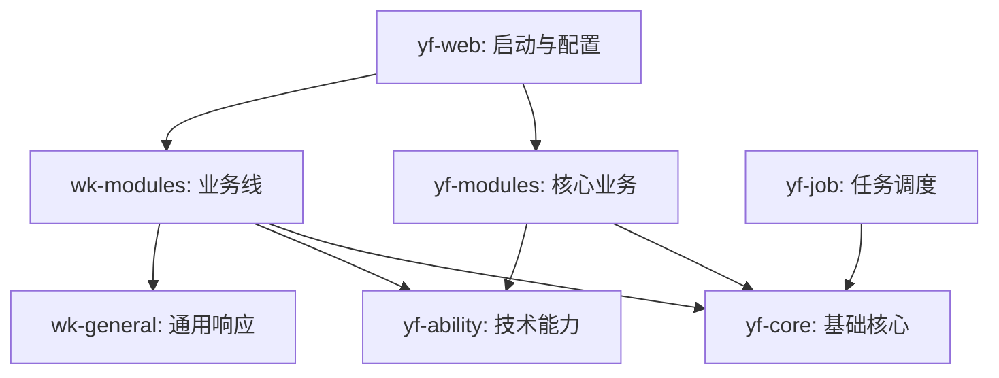
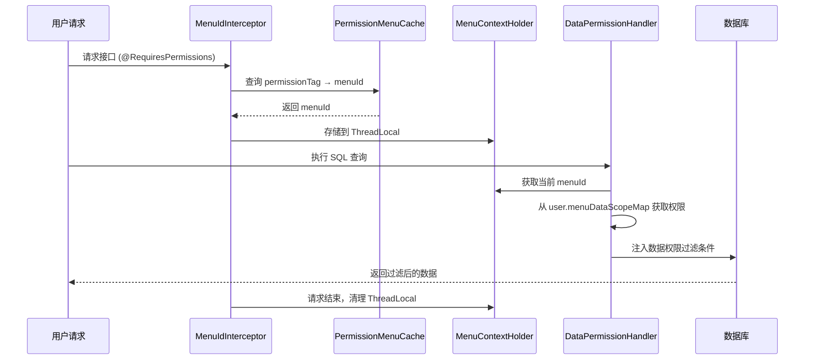

# yf-exam-server 考试培训系统

## 项目简介
这是一个基于 Spring Boot 3.x 开发的模块化考试培训系统。系统集成了在线考试、课程学习、题库练习、数据统计、消息通知等多种核心功能，并支持 AI 集成、人脸识别等高级能力。

## 项目架构图


## 模块导览

| 模块名称 | 职责描述 |
| :--- | :--- |
| **[yf-core](yf-core/README.md)** | 全局通用实体、枚举和基础工具类。 |
| **[yf-ability](yf-ability/README.md)** | 技术支撑能力，集成 AI、OSS、人脸识别、直播、Excel 等。 |
| **[yf-modules](yf-modules/README.md)** | 核心业务领域，包含考试、课程、题库、通知、系统管理等。 |
| **[wk-modules](wk-modules/README.md)** | 业务线定制模块，处理特定业务场景下的课程与考试逻辑。 |
| **** | 业务线专用通用封装和响应工具。 |
| **[yf-job](yf-job/README.md)** | 定时任务调度中心，基于 Quartz 实现。 |
| **[yf-web](yf-web/README.md)** | 项目入口，负责启动加载、全局配置及多环境管理。 |

## 技术栈
- **核心框架**: Spring Boot 3.2.1, Spring Framework 6.1.2
- **安全框架**: Apache Shiro 2.0.2 (Jakarta)
- **持久层**: MyBatis-Plus 3.5.11, MySQL 8.x, Druid
- **缓存**: Redis (Jedis)
- **任务调度**: Quartz
- **接口文档**: Swagger 3, Knife4j
- **工具类**: Hutool, Lombok, Dozer, Jackson

## 开发环境建议
- **JDK**: 17+
- **Build**: Maven 3.6+
- **Database**: MySQL 8.0+
- **Cache**: Redis 6.0+

## 核心功能说明

### 菜单级数据权限系统
系统支持细粒度的菜单级数据权限控制，允许为不同角色在不同菜单下配置独立的数据访问范围。

**架构设计**：


**核心组件**：
- **[PermissionMenuCache](yf-modules/yf-module-system/src/main/java/com/yf/system/modules/menu/cache/PermissionMenuCache.java)**: 权限标签与菜单ID映射缓存
- **[MenuContextHolder](yf-modules/yf-module-system/src/main/java/com/yf/system/modules/menu/cache/MenuContextHolder.java)**: 基于ThreadLocal的菜单上下文
- **[MenuIdInterceptor](yf-web/src/main/java/com/yf/web/aspect/mybatis/MenuIdInterceptor.java)**: 拦截器，提取并存储menuId
- **[DataPermissionHandler](yf-web/src/main/java/com/yf/web/aspect/mybatis/DataPermissionHandler.java)**: MyBatis-Plus数据权限处理器

**数据权限范围**：
| 权限级别 | 说明 | SQL过滤条件 |
|---------|------|------------|
| SCOPE_SELF | 仅查看自己创建的数据 | `create_by = userId` |
| SCOPE_DEPT | 查看本部门数据 | `dept_code = userDeptCode` |
| SCOPE_DEPT_DOWN | 查看本部门及下级部门数据 | `dept_code LIKE 'userDeptCode%'` |
| SCOPE_ALL | 查看全部数据 | 无限制 |

**权限判定逻辑**：
1. **菜单级权限优先**：如果用户在当前菜单有明确权限配置，使用菜单级权限
2. **无权限拒绝**：如果系统识别到menuId但用户无该菜单权限，拒绝访问
3. **全局权限兜底**：对于未配置菜单级权限的旧接口，使用用户的全局数据权限

## 重要架构变更记录

### 2025-02-05: 循环依赖修复
**问题**：`yf-web` 和 `yf-module-system` 之间存在循环依赖
- `yf-web` 依赖 `yf-module-system`
- `SysMenuServiceImpl`(yf-module-system) 需要使用 `PermissionMenuCache`(yf-web)

**解决方案**：将权限缓存相关类迁移到被依赖方
- 将 `PermissionMenuCache` 从 `yf-web/aspect/mybatis/` 迁移到 `yf-module-system/modules/menu/cache/`
- 将 `MenuContextHolder` 同步迁移到相同位置
- 更新所有引用文件的导入路径

**影响文件**：
- ✅ 新建: `yf-module-system/.../menu/cache/PermissionMenuCache.java`
- ✅ 新建: `yf-module-system/.../menu/cache/MenuContextHolder.java`
- ✅ 修改: `SysMenuServiceImpl.java` (导入路径更新)
- ✅ 修改: `MenuIdInterceptor.java` (导入路径更新)
- ✅ 修改: `DataPermissionHandler.java` (导入路径更新)
- ❌ 删除: `yf-web/.../mybatis/PermissionMenuCache.java`
- ❌ 删除: `yf-web/.../mybatis/MenuContextHolder.java`

**修复后依赖关系**：
```
yf-module-system (提供缓存类)
    ↑
    │ 单向依赖
    │
yf-web (使用缓存类)
```
