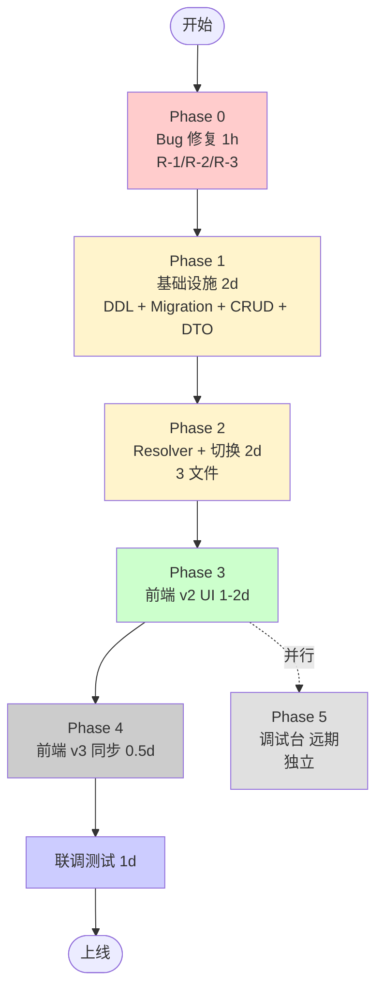
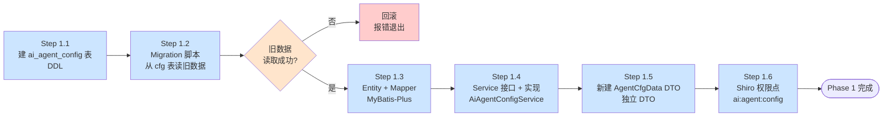
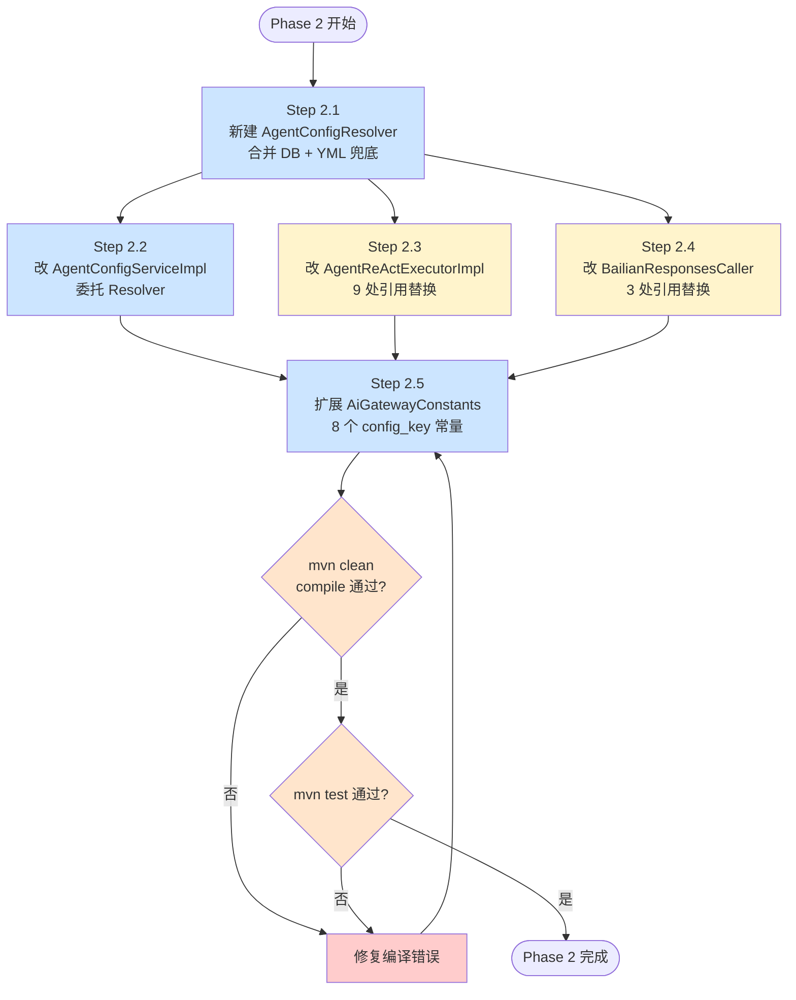
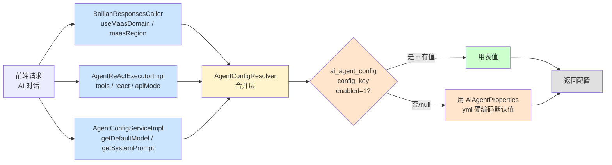
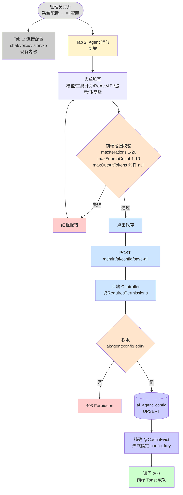
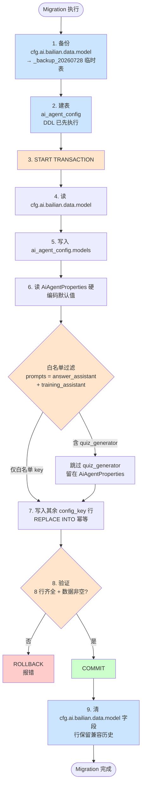
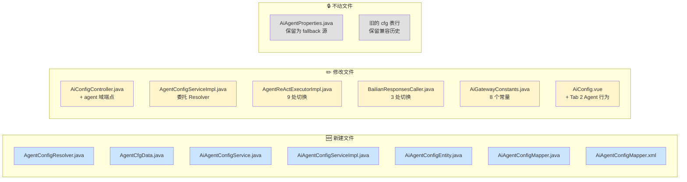

# AI 配置控制台 DDD 演进 — 实施流程图

> 配套文档: [reviews/1.5/2026-07-28-AI配置控制台DDD演进-计划审核-by-claude.md](./2026-07-28-AI配置控制台DDD演进-计划审核-by-claude.md)
> 配套文档: [reviews/1.5/2026-07-28-AI配置控制台DDD演进v2-计划再审-by-claude.md](./2026-07-28-AI配置控制台DDD演进v2-计划再审-by-claude.md)

## 一、整体流程(5 Phase + 0 前置)



**工期**:Phase 0 + 1 + 2 + 3 + 4 + 联调 = **7-8.5d**

---

## 二、Phase 1 详细流程(基础设施)



**输出**:1 张新表 + 8 行初始数据 + 5 个新 Java 文件 + 2 个 Shiro 权限点

---

## 三、Phase 2 详细流程(Resolver + 3 文件切换)



**关键点**:

- 3 个切换文件**可并行**(S22/S23/S24)
- 编译 + 测试**阻塞门**(任一失败回修)
- AgentReActExecutorImpl 1377 行,9 处 aiAgentProperties 引用需逐个 grep 替换

---

## 四、配置读取链路(运行时)



**核心**:`Resolver` 是唯一合并入口,所有消费方(3 文件)都委托它。**cfg 表优先,yml 兜底**。

---

## 五、前端 UI 流程(用户操作)



**关键校验**:

- 前端校验用户输入合法范围
- 后端 Shiro 权限点把守
- 保存触发精确缓存失效,下次读取立即生效

---

## 六、数据迁移流程(一次性)



**安全保证**:

- 事务化(START TRANSACTION + COMMIT/ROLLBACK)
- 幂等化(REPLACE INTO 而非 INSERT)
- 白名单过滤(quiz_generator 不写入)
- 验证门(8 行齐全才 COMMIT)
- 执行顺序: 先写新表 → 再清旧字段(中间失败回滚无业务影响)

---

## 七、决策时序回顾(grill-me 拍板)

```mermaid
flowchart LR
    A[主人抛问题<br/>审核 qoder 计划] --> B{grill-me<br/>9 问}
    B --> C1[F-1<br/>prompts 入库]
    B --> C2[F-2<br/>配置存储]
    B --> C3[F-3<br/>切换范围]
    B --> C4[S-2<br/>model 双源]
    B --> C5[S-3<br/>quiz_generator]
    B --> C6[M-4<br/>工时]
    C1 --> D[拍板结果]
    C2 --> D
    C3 --> D
    C4 --> D
    C5 --> D
    C6 --> D
    D --> E[9 项决策<br/>写入 v2 plan]
    E --> F[v2 落地<br/>审核再审]
    F --> G{通过?}
    G -->|否| H[整改]
    H --> F
    G -->|是| I([开工])

    style A fill:#e0e0e0
    style B fill:#ffe5cc
    style C1 fill:#ccccff
    style C2 fill:#ccccff
    style C3 fill:#ccccff
    style C4 fill:#ccccff
    style C5 fill:#ccccff
    style C6 fill:#ccccff
    style D fill:#cce5ff
    style E fill:#cce5ff
    style F fill:#fff4cc
    style G fill:#ffe5cc
    style H fill:#ffcccc
    style I fill:#ccffcc
```



---

## 八、文件改动全景



**总计**:**7 个新文件 + 6 个修改 + 2 个不动**

---

## 九、一句话总结

```
Phase 0 修 Bug (1h)
  → Phase 1 建表+迁移+CRUD+DTO (2d)
  → Phase 2 Resolver+切 3 文件 (2d)
  → Phase 3 前端 Tab 2 (1-2d)
  → Phase 4 v3 同步 (0.5d)
  → 联调 (1d)
  = 总计 7-8.5d 上线
```

**核心改动**:把 yml 写死的 AI 参数搬到 DB,前端控制台可视化管理,Resolver 做合并层兜底。
