# 后端 + 前端 AI 架构全景(零基础讲通版)

> **作者**:Claude · **日期**:2026-07-23 · **版本归属**:wk-train-center/mobile1.2
> **受众**:零基础小白。读完能讲清楚:用户打字 → 后端调度 → 阿里云百炼思考 → 一个字一个字推回前端 → 屏幕显示打字机效果,这条链路里每个文件在干啥。
> **约定**:所有路径用绝对路径,可点开。

---

## 目录

1. [总览:三个角色、三条主线](#1-总览三个角色三条主线)
2. [后端架构(一个大脑管家 + 多个抽屉)](#2-后端架构)
3. [前端架构(三个 Vue 表兄弟 + 一个 Angular 异类)](#3-前端架构)
4. [端到端完整链路(用户视角)](#4-端到端完整链路)
5. [流式输出深度讲解(打字机原理)](#5-流式输出深度讲解)
6. [ReAct 主循环深度讲解(AI 思考-行动)](#6-react-主循环深度讲解)
7. [知识库 / 工具 / 多模态](#7-知识库--工具--多模态)
8. [错误处理与会话管理](#8-错误处理与会话管理)
9. [关键概念速查表](#9-关键概念速查表)

---

## 1. 总览:三个角色、三条主线

整个 AI 系统就是「**前台 → 调度 → 大脑**」三帮人协作。理解这一点,后端前端都通了。

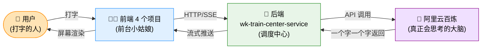

### 三条主线

| 主线                              | 干啥                             | 涉及主要文件                                                                                            |
| --------------------------------- | -------------------------------- | ------------------------------------------------------------------------------------------------------- |
| **主线 1:答疑/陪练对话**    | 用户问问题,AI 流式回答           | 前端 AiMessageList → 后端 WkAiAgentController → AgentReActExecutor → BailianChatCaller → 阿里云百炼 |
| **主线 2:阅卷抽考点**       | 从一段文本里抽出考点(同步)       | 后端 SysKeyPointAiController → 老版 AiFactory → BaiLianConfigServiceImpl → 阿里云百炼                |
| **主线 3:视觉识图**(仅手机) | 拍照/相册选图 → AI 识别图中文字 | 前端 useImageRecognition → api/ai/image.ts →**前端直连** DashScope multimodal-generation        |

> 零基础口诀:**前端打字 → 后端调度 → 百炼思考 → 流式回吐**。后端是中转站,前端是显示器,大脑在阿里云上。

---

## 2. 后端架构

后端代码全在 `E:\rhProject\wk-train-center-service\`。AI 相关代码分 **3 大块**:

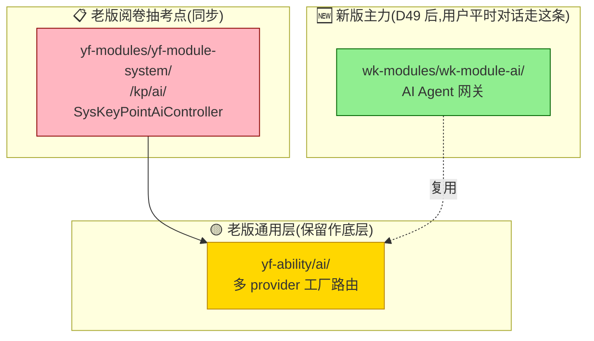

### 2.1 新版主力:wk-module-ai 四层架构

`E:\rhProject\wk-train-center-service\wk-modules\wk-module-ai\src\main\java\com\wk\traincenter\ai\`

后端用 DDD(领域驱动设计)分层。你可以把 DDD 理解成「**按职责分抽屉**」——每个抽屉只管一件事。

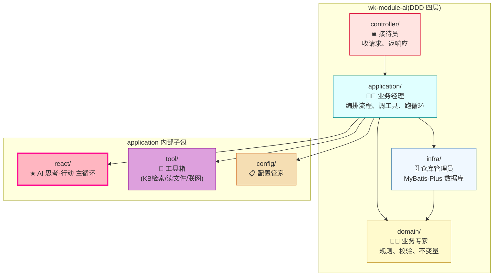

#### Controller 层 — 🛎️ 接待员

> **职责**:只管接活、翻译、返结果。业务逻辑全部委托给 application 层。

```mermaid
graph LR
    REQ(["HTTP POST<br/>{promptKey, messages[],<br/>tools, fileList}"]) --> CC["WkAiAgentController<br/>chatStream()"]
    CC --> RL["Redis 限流检查<br/>ai:agent:chat-stream:{userId}<br/>10秒一次"]
    RL --> AC2["拿 systemPrompt<br/>AgentConfigService.getSystemPrompt()"]
    AC2 --> HC["拼 history + 提取 fileList"]
    HC --> SS["new SseEmitter(300_000ms)<br/>5 分钟通道"]
    SS --> EX["agentReActExecutor.execute()"]
    EX --> EMIT["emitter.send(chunk)"]
    EMIT --> RESP(["SSE 流<br/>data: {...}\n\n"])

    classDef req fill:#FFE4B5,stroke:#FF8C00
    classDef controller fill:#FFB6C1,stroke:#DC143C
    classDef resp fill:#90EE90,stroke:#006400

    class REQ req
    class CC,RL,AC2,HC,SS,EX,EMIT controller
    class RESP resp
```

| 文件                                                                                                                                                                                          | 类比     | 干啥                                                                                                                     |
| --------------------------------------------------------------------------------------------------------------------------------------------------------------------------------------------- | -------- | ------------------------------------------------------------------------------------------------------------------------ |
| [WkAiAgentController.java](E:\rhProject\wk-train-center-service\wk-modules\wk-module-ai\src\main\java\com\wk\traincenter\ai\controller\WkAiAgentController.java)                               | 大堂前台 | **唯一 AI 入口**。`POST /api/wk/ai/agent/chat-stream` 接活 → 开 5 分钟通话通道(`SseEmitter`)→ 委托给大脑管家 |
| [WkAiAgentExceptionHandler.java](E:\rhProject\wk-train-center-service\wk-modules\wk-module-ai\src\main\java\com\wk\traincenter\ai\controller\WkAiAgentExceptionHandler.java)                   | 紧急救援 | **只救这一个 Controller**。出错时把异常翻译成 5 种错误码,塞进 SSE 流最后吐给前端                                   |
| [WkTrainingRoleManagementController.java](E:\rhProject\wk-train-center-service\wk-modules\wk-module-ai\src\main\java\com\wk\traincenter\ai\controller\WkTrainingRoleManagementController.java) | 后台管理 | 陪练角色的增删改查(`@RequiresPermissions`)                                                                             |
| [WkTrainingRoleStudentController.java](E:\rhProject\wk-train-center-service\wk-modules\wk-module-ai\src\main\java\com\wk\traincenter\ai\controller\WkTrainingRoleStudentController.java)       | 学员前台 | 陪练相关 REST + 老版流式旁路`aiAsk()`                                                                                  |
| [WkAnswerStudentController.java](E:\rhProject\wk-train-center-service\wk-modules\wk-module-ai\src\main\java\com\wk\traincenter\ai\controller\WkAnswerStudentController.java)                   | 学员前台 | 答疑助手的增删改查 + 导入会话                                                                                            |

#### Application 层 — 🧑‍💼 业务经理

> **职责**:编排业务流程、调工具、跑循环。不碰 HTTP,也不碰 SQL。

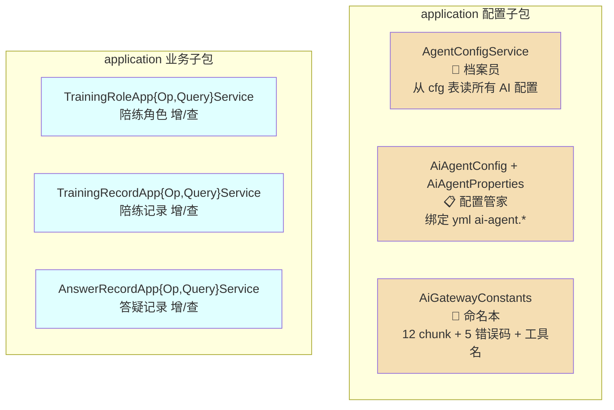

| 文件                                                                                                                                                                                                                                                                                                                              | 类比         | 干啥                                                                                               |
| --------------------------------------------------------------------------------------------------------------------------------------------------------------------------------------------------------------------------------------------------------------------------------------------------------------------------------- | ------------ | -------------------------------------------------------------------------------------------------- |
| [AgentConfigService.java](E:\rhProject\wk-train-center-service\wk-modules\wk-module-ai\src\main\java\com\wk\traincenter\ai\application\AgentConfigService.java) + Impl                                                                                                                                                             | 档案员       | **统一配置中心**。从数据库 cfg 表读 5 类配置:WorkspaceId、ApiKey、AccessKey、KB 列表、提示词 |
| [AiAgentConfig.java](E:\rhProject\wk-train-center-service\wk-modules\wk-module-ai\src\main\java\com\wk\traincenter\ai\application\config\AiAgentConfig.java) + [AiAgentProperties.java](E:\rhProject\wk-train-center-service\wk-modules\wk-module-ai\src\main\java\com\wk\traincenter\ai\application\config\AiAgentProperties.java) | 配置管家     | `@ConfigurationProperties("ai-agent")`,绑定 yml 全部字段(默认模型、最大迭代 10、并发搜索 5 等)   |
| [AiGatewayConstants.java](E:\rhProject\wk-train-center-service\wk-modules\wk-module-ai\src\main\java\com\wk\traincenter\ai\application\config\AiGatewayConstants.java)                                                                                                                                                             | 命名本       | **常量集中营**。12 种 chunk 类型 + 5 种错误码 + 工具名 + `<<<suggest>>>` 起止标记          |
| `TrainingRoleApp{Op,Query}Service` + Impl                                                                                                                                                                                                                                                                                       | 陪练业务经理 | 角色 CRUD + 分页查询                                                                               |
| `TrainingRecordApp{Op,Query}Service` + Impl                                                                                                                                                                                                                                                                                     | 陪练记录员   | 老版对话链路入口(保留兼容)                                                                         |
| `AnswerRecordApp{Op,Query}Service` + Impl                                                                                                                                                                                                                                                                                       | 答疑记录员   | 答疑分页查询 + CRUD                                                                                |

#### Application/react 子包 — ★ AI 的「思考-行动」主循环

> 这是整个 AI 系统的核心。**AI 不是一次性回答,而是「想一下→动手查→再想→再查→最终答」循环**。

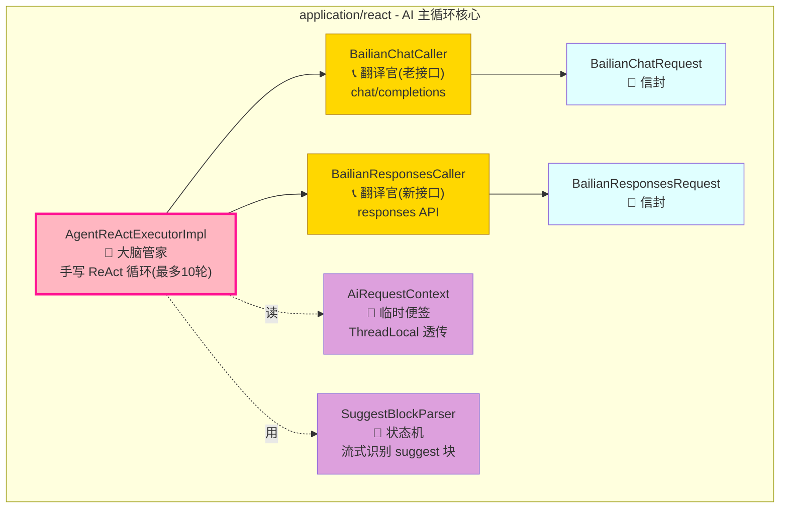

| 文件                                                                                                                                                                         | 类比                     | 干啥                                                                                                                                       |
| ---------------------------------------------------------------------------------------------------------------------------------------------------------------------------- | ------------------------ | ------------------------------------------------------------------------------------------------------------------------------------------ |
| [AgentReActExecutor.java](E:\rhProject\wk-train-center-service\wk-modules\wk-module-ai\src\main\java\com\wk\traincenter\ai\application\react\AgentReActExecutor.java) + Impl  | **🧠 AI 大脑管家** | `execute(ReactRequest) → Flux<AgentChatChunkVo>`,**手写 ReAct 主循环**。最多 10 轮,每轮发百炼→收 chunk→执行工具→回填结果→再发 |
| [BailianChatCaller.java](E:\rhProject\wk-train-center-service\wk-modules\wk-module-ai\src\main\java\com\wk\traincenter\ai\application\react\BailianChatCaller.java)           | 📞 老接口翻译官          | OkHttp 直连百炼`chat/completions` 流式接口,把百炼的 SSE 一行一行翻译成 `AgentChatChunkVo`                                              |
| [BailianResponsesCaller.java](E:\rhProject\wk-train-center-service\wk-modules\wk-module-ai\src\main\java\com\wk\traincenter\ai\application\react\BailianResponsesCaller.java) | 📞 新接口翻译官          | 直连百炼`responses` 接口(P1+ 备用),支持内置工具(file_search / web_search / code_interpreter)                                             |
| `BailianChatRequest / BailianResponsesRequest`                                                                                                                             | 📮 信封                  | 发给百炼的请求 DTO,Builder 模式                                                                                                            |
| [AiRequestContext.java](E:\rhProject\wk-train-center-service\wk-modules\wk-module-ai\src\main\java\com\wk\traincenter\ai\application\react\AiRequestContext.java)             | 📝 临时便签              | ThreadLocal 透传 kbChoose/kbList/fileIds,不污染工具签名                                                                                    |
| [SuggestBlockParser.java](E:\rhProject\wk-train-center-service\wk-modules\wk-module-ai\src\main\java\com\wk\traincenter\ai\application\react\SuggestBlockParser.java)         | 🚦 状态机                | 流式里识别`<<<suggest>>>` 区段,状态机处理跨 delta 半标记                                                                                 |

#### Application/tool 子包 — 🔧 AI 的工具箱

> AI 回答问题时常需要「帮手」。这里就是帮手的仓库。

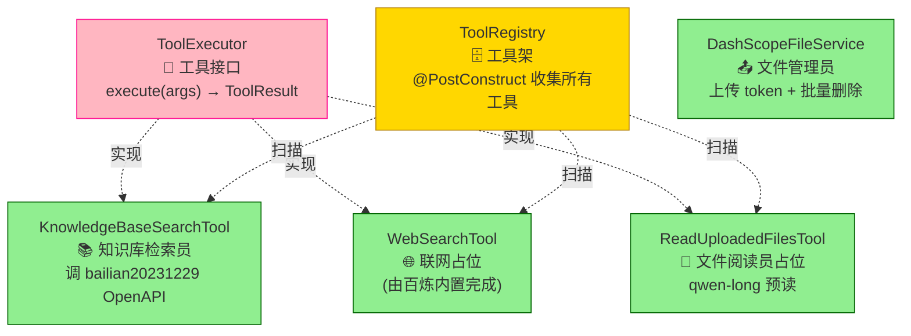

| 文件                                                                                                                                                                          | 类比            | 干啥                                                                                                     |
| ----------------------------------------------------------------------------------------------------------------------------------------------------------------------------- | --------------- | -------------------------------------------------------------------------------------------------------- |
| [ToolExecutor.java](E:\rhProject\wk-train-center-service\wk-modules\wk-module-ai\src\main\java\com\wk\traincenter\ai\application\tool\ToolExecutor.java)                       | 🔌 工具接口     | 定义`execute(args) → ToolResult`,所有工具都实现它                                                     |
| [ToolRegistry.java](E:\rhProject\wk-train-center-service\wk-modules\wk-module-ai\src\main\java\com\wk\traincenter\ai\application\tool\ToolRegistry.java)                       | 🗄️ 工具架     | Spring 启动时(`@PostConstruct`)扫描所有 `ToolExecutor` Bean 收进架子,运行时按名字取                  |
| [KnowledgeBaseSearchTool.java](E:\rhProject\wk-train-center-service\wk-modules\wk-module-ai\src\main\java\com\wk\traincenter\ai\application\tool\KnowledgeBaseSearchTool.java) | 📚 知识库检索员 | 调百炼 OpenAPI`bailian20231229 Client.retrieveWithOptions`,从 KB 里搜最相关 5 条                       |
| [WebSearchTool.java](E:\rhProject\wk-train-center-service\wk-modules\wk-module-ai\src\main\java\com\wk\traincenter\ai\application\tool\WebSearchTool.java)                     | 🌐 联网占位     | 真实联网由百炼内置完成(Responses 路径)                                                                   |
| [ReadUploadedFilesTool.java](E:\rhProject\wk-train-center-service\wk-modules\wk-module-ai\src\main\java\com\wk\traincenter\ai\application\tool\ReadUploadedFilesTool.java)     | 📖 文件阅读员   | 占位,实际由`AgentReActExecutorImpl` 截胡,用 `qwen-long` 把用户上传的 PDF/Word 预读,Redis 缓存 1 小时 |
| [DashScopeFileService.java](E:\rhProject\wk-train-center-service\wk-modules\wk-module-ai\src\main\java\com\wk\traincenter\ai\application\tool\DashScopeFileService.java)       | 📤 文件管理员   | 给前端发百炼上传 token,批量删除百炼文件                                                                  |

#### Domain 层 — 👨‍⚖️ 业务专家

`E:\rhProject\wk-train-center-service\wk-modules\wk-module-ai\src\main\java\com\wk\traincenter\ai\domain\`

| 文件                                                                                                  | 类比                                                          |
| ----------------------------------------------------------------------------------------------------- | ------------------------------------------------------------- |
| `entity/{TrainingRole, TrainingRecord, AnswerRecord, AnswerHistoryRecord, TrainingRoleRecord}.java` | 5 个业务实体:陪练角色、陪练记录、答疑记录、历史记录、聊天条目 |
| `command/*Command / *Condition / *PageQueryCommand`                                                 | CQRS 入参(CQRS = 读写分离)                                    |
| `factory/{TrainingRoleFactory, AnswerRecordFactory, TrainingRecordFactory}(+Impl)`                  | Factory 模式,造实体时封装不变量校验                           |
| `repository/{TrainingRoleRepository, TrainingRecordRepository, AnswerRecordRepository}`             | 仓储接口,纯领域,不依赖 MyBatis                                |
| `support/{AiRecordKeywordUtils, TrainingRecordOverviewUtils}`                                       | 纯函数工具,关键词/概述处理                                    |

#### Infra 层 — 🗄️ 仓库管理员

`E:\rhProject\wk-train-center-service\wk-modules\wk-module-ai\src\main\java\com\wk\traincenter\ai\infra\`

| 文件                                            | 类比                           |
| ----------------------------------------------- | ------------------------------ |
| `entity/*Entity`                              | MyBatis-Plus 实体              |
| `mapper/*Mapper` + `resources/mapper/*.xml` | 数据库表映射 + XML(3 张表)     |
| `converter/*Converter`                        | 领域实体 ↔ 数据库实体 互转    |
| `repository/*RepositoryImpl`                  | 仓储实现:调 Mapper + Converter |

### 2.2 老版通用层:yf-ability/ai

`E:\rhProject\wk-train-center-service\yf-ability\src\main\java\com\yf\ability\ai\`

老版实现,**保留作底层**。5 个 provider 都能用,工厂模式路由。

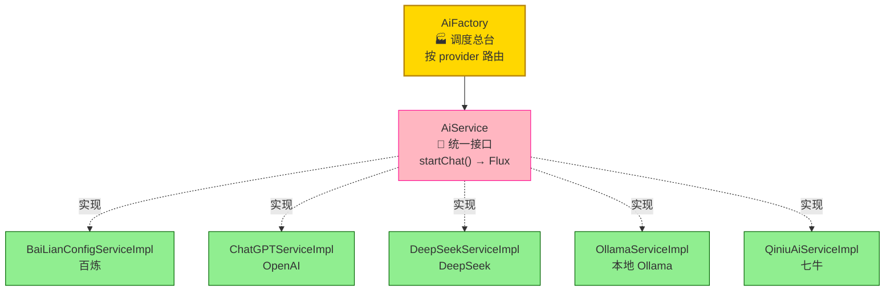

| 文件                                                                                                                    | 类比                                                          |
| ----------------------------------------------------------------------------------------------------------------------- | ------------------------------------------------------------- |
| [AiFactory.java](E:\rhProject\wk-train-center-service\yf-ability\src\main\java\com\yf\ability\ai\AiFactory.java)         | 🏭 调度总台:看你要哪家大脑,就给哪家接线                       |
| [AiService.java](E:\rhProject\wk-train-center-service\yf-ability\src\main\java\com\yf\ability\ai\service\AiService.java) | 🔌 统一接口:`startChat(systemMsg, userMsg) → Flux<String>` |
| `providers/bailian/BaiLianConfigServiceImpl.java`                                                                     | 百炼实现(同步调用,走`ChatApiUtils`)                         |
| `providers/{chatgpt,deepseek,ollama,qiniu}/*ServiceImpl`                                                              | 其他 4 家                                                     |
| `utils/chat/{ChatApiUtils, ChatClientUtils, dto/ChatApiReqDTO, dto/ChatApiRespDTO}`                                   | 老版 SDK 辅助                                                 |

### 2.3 阅卷抽考点:KeyPoint AI

`E:\rhProject\wk-train-center-service\yf-modules\yf-module-system\src\main\java\com\yf\system\modules\kp\ai\`

```mermaid
graph LR
    REQ(["POST /api/sys/kp/ai/extract<br/>{text: 试卷内容}"]) --> CTRL["SysKeyPointAiController<br/>📥 同步入口"]
    CTRL --> SVC["SysKeyPointAiServiceImpl<br/>📋 调 AiFactory"]
    SVC --> FAC["AiFactory.getService()"]
    FAC --> BAI["BaiLianConfigServiceImpl.assistant()"]
    BAI --> UTILS["ChatApiUtils.completions(json)"]
    UTILS --> BRAIN["阿里云百炼<br/>sync, stream=false"]
    BRAIN --> RESP(["{考点: [...]}"])

    classDef req fill:#FFE4B5
    classDef sync fill:#FFD700
    classDef brain fill:#F0E0FF

    class REQ req
    class CTRL,SVC,FAC,BAI,UTILS sync
    class BRAIN,RESP brain
```

| 文件                                                                                                                                                                              | 类比                                                        |
| --------------------------------------------------------------------------------------------------------------------------------------------------------------------------------- | ----------------------------------------------------------- |
| [SysKeyPointAiController.java](E:\rhProject\wk-train-center-service\yf-modules\yf-module-system\src\main\java\com\yf\system\modules\kp\ai\controller\SysKeyPointAiController.java) | 📥 抽考点入口,**同步**不走流式                        |
| `SysKeyPointAiService.java` + Impl                                                                                                                                              | 走老版`AiFactory → BaiLianConfigServiceImpl.assistant()` |

---

## 3. 前端架构

4 个前端项目,**3 个 Vue 同源 + 1 个 Angular 独立**。

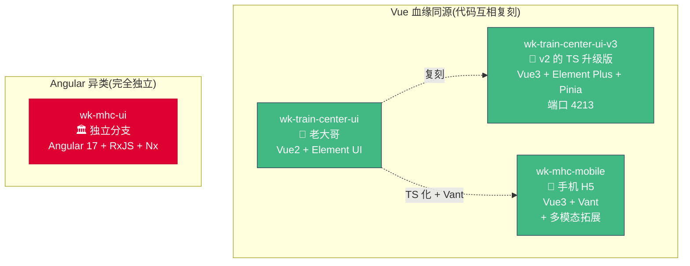

### 3.1 v2 — wk-train-center-ui(老大哥)

`E:\rhProject\wk-train-center-ui\src\`。Vue2 + Element UI。

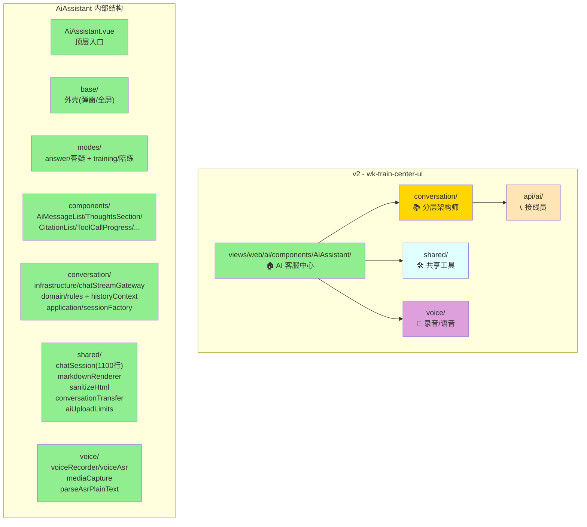

#### v2 核心文件(小白视角)

| 文件                                                                                                                                            | 路径                                                 | 类比                                                                                                                              |
| ----------------------------------------------------------------------------------------------------------------------------------------------- | ---------------------------------------------------- | --------------------------------------------------------------------------------------------------------------------------------- |
| [apps.js](E:\rhProject\wk-train-center-ui\src\api\ai\apps.js)                                                                                    | `src/api/ai/apps.js`                               | 📇 名片夹:3 个应用的 appId + promptKey                                                                                            |
| [assistant.js](E:\rhProject\wk-train-center-ui\src\api\ai\assistant.js)                                                                          | `src/api/ai/assistant.js`                          | ☎️ 接线总机:陪练/答疑的 REST 调用都走这                                                                                         |
| [common.js](E:\rhProject\wk-train-center-ui\src\api\ai\common.js)                                                                                | `src/api/ai/common.js`                             | 🔧 万能接线员:`chatAppStream`(老直连百炼) + `chatModelStream` + `fetchAiChatConfig` + `classifyStreamError`(5 种错误分类) |
| [chatStreamGateway.js](E:\rhProject\wk-train-center-ui\src\views\web\ai\components\AiAssistant\conversation\infrastructure\chatStreamGateway.js) | `conversation/infrastructure/chatStreamGateway.js` | **★★ 翻译中枢**。12 种 SSE chunk 路由 + 抗丢字 + 抗重复 + 50ms 节流 thoughts                                              |
| [chatSession.js](E:\rhProject\wk-train-center-ui\src\views\web\ai\components\AiAssistant\shared\chatSession.js)                                  | `shared/chatSession.js`                            | **★★ 会话大管家**。1100+ 行,`sendMessage` 完整流程                                                                      |
| [markdownRenderer.js](E:\rhProject\wk-train-center-ui\src\views\web\ai\components\AiAssistant\shared\markdownRenderer.js)                        | `shared/markdownRenderer.js`                       | 🎨 排版员:marked + LRU 缓存 + 表格容错 + 代码复制按钮                                                                             |
| [AiMessageList.vue](E:\rhProject\wk-train-center-ui\src\views\web\ai\components\AiAssistant\AiMessageList.vue)                                   | `components/AiAssistant/AiMessageList.vue`         | **★ 屏幕**:渲染消息、思考链、引用、工具进度                                                                                |

### 3.2 v3 — wk-train-center-ui-v3(v2 的 TS 升级版)

`E:\rhProject\wk-train-center-ui-v3\src\`。Vue3 + Element Plus + Pinia + Vite。**端口 4213**。

v2 → v3 的关系:**几乎 1:1 复刻,改 TS + Pinia + 拆模块**。

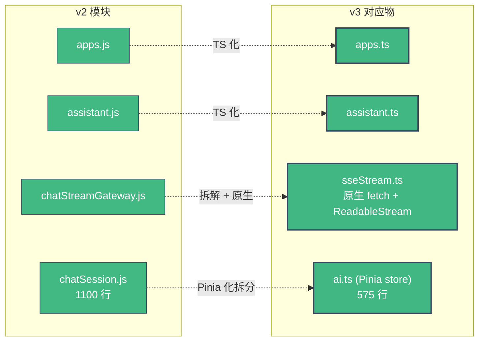

| v2 文件                      | v3 对应文件                                                                                                   | 路径                                                                                                |
| ---------------------------- | ------------------------------------------------------------------------------------------------------------- | --------------------------------------------------------------------------------------------------- |
| `api/ai/apps.js`           | [apps.ts](E:\rhProject\wk-train-center-ui-v3\src\api\client\ai\apps.ts)                                        | `src/api/client/ai/apps.ts`                                                                       |
| `api/ai/assistant.js`      | [assistant.ts](E:\rhProject\wk-train-center-ui-v3\src\api\client\ai\assistant.ts)                              | `src/api/client/ai/assistant.ts`                                                                  |
| `chatStreamGateway.js`     | [sseStream.ts](E:\rhProject\wk-train-center-ui-v3\src\views\web\ai\components\AiAssistant\shared\sseStream.ts) | `src/views/web/ai/components/AiAssistant/shared/sseStream.ts`(原生 fetch + ReadableStream,272 行) |
| `chatSession.js` (1100 行) | **[stores/modules/ai.ts](E:\rhProject\wk-train-center-ui-v3\src\stores\modules\ai.ts)**                  | `src/stores/modules/ai.ts`(Pinia,575 行)                                                          |
| `AiAssistant.vue`          | [AiAssistant.vue](E:\rhProject\wk-train-center-ui-v3\src\views\web\ai\AiAssistant.vue)                         | `src/views/web/ai/AiAssistant.vue`(用 `<component :is="currentModeView">` 切换)                 |
| —                           | [router/modules/admin.ts](E:\rhProject\wk-train-center-ui-v3\src\router\modules\admin.ts)                      | `src/router/modules/admin.ts` 行 388 注册 `/admin/ai`                                           |

> **关键差异**:**Pinia 把 1100 行会话控制器压到 575 行**,因为 Pinia 状态机天然就是单例,不用手写 class。

### 3.3 wk-mhc-mobile(手机 H5 版)

`E:\rhProject\wk-mhc-mobile\src\pages\smart-training\`。Vue3 + Vant。

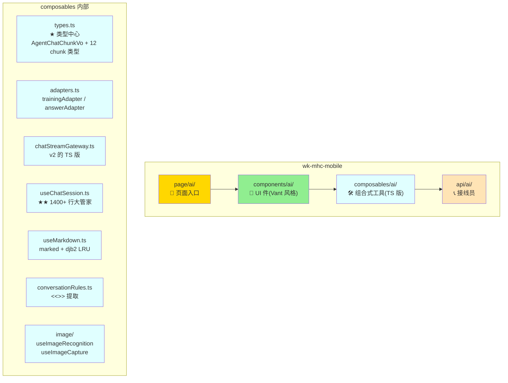

#### mobile 独有特性

| 特性                                    | 文件                                                                                                                                          | 类比                                                                        |
| --------------------------------------- | --------------------------------------------------------------------------------------------------------------------------------------------- | --------------------------------------------------------------------------- |
| **★★ 视觉识图**(仅 mobile 实现) | [api/ai/image.ts](E:\rhProject\wk-mhc-mobile\src\pages\smart-training\api\ai\image.ts)                                                         | 📸 拍照/相册 → 前端**直连百炼** `multimodal-generation/generation` |
| 拍照选图工具                            | [composables/ai/image/useImageRecognition.ts](E:\rhProject\wk-mhc-mobile\src\pages\smart-training\composables\ai\image\useImageRecognition.ts) | 📷 拍照识题链路                                                             |
| **★ 陪练视图**(角色选择 + 评分)  | [components/ai/TrainingAssistantView.vue](E:\rhProject\wk-mhc-mobile\src\pages\smart-training\components\ai\TrainingAssistantView.vue)         | 🎭 角色选择 + 评分 prompt + 结束按钮                                        |
| AI 助手 Tab 页                          | [page/ai/ai-assistant/index.vue](E:\rhProject\wk-mhc-mobile\src\pages\smart-training\page\ai\ai-assistant\index.vue)                           | 📱 VanNavBar + van-tabs(答疑/陪练两个 Tab)                                  |

### 3.4 wk-mhc-ui(Angular 独立分支)

`E:\rhProject\wk-mhc-ui\remotes\knowledge-center\src\app\marin-engine-ai\`。Angular 17 + Nx + Module Federation + RxJS。

**完全独立,与上面 3 个 Vue 项目无代码复用**。走的是 `KnowledgeStreamService.StreamAI()` 另一套后端。

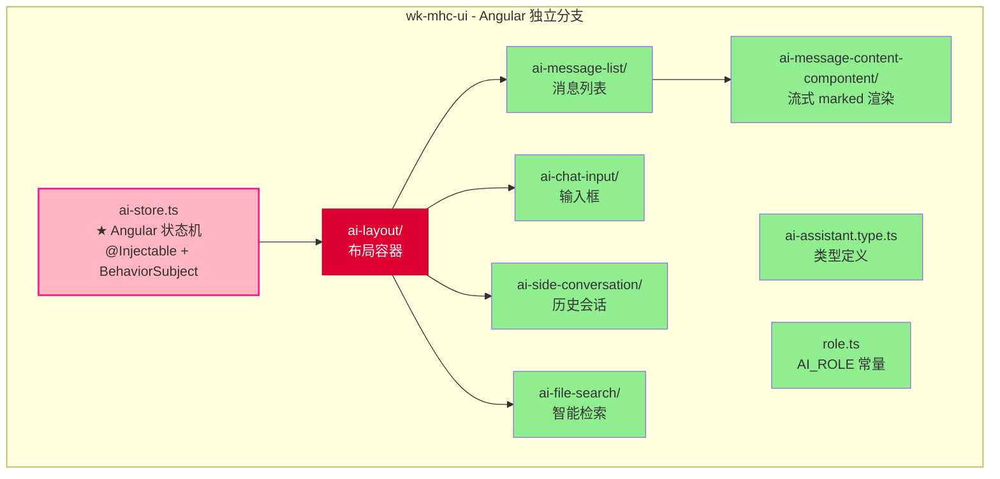

#### Angular 这边的核心特色

> Angular 这边最「复古」——**直接拼 HTML 字符串**,光标通过内嵌 `<span class="ai-cursor">` 实现。

```typescript
// ai-store.ts 的 printCharacters 方法(伪代码)
messageText += thought + text + cursorStr
// ↑ 一行代码把思考 + 文本 + 光标全拼进去,每次 chunk 重渲
```

---

## 4. 端到端完整链路(用户视角)

用户在前端打「变电所巡视要注意什么?」,完整链路:

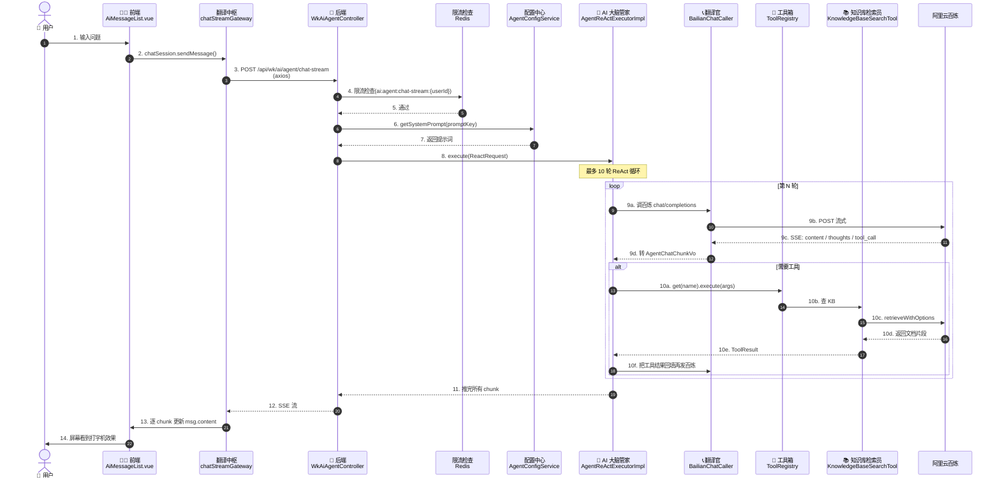

### 链路分解(零基础版)

```mermaid
graph LR
    A["1️⃣ 用户打字<br/>(前端)"] --> B["2️⃣ 前端 axios 发请求<br/>(前端)"]
    B --> C["3️⃣ 后端 Controller 接活<br/>(后端)"]
    C --> D["4️⃣ 配置中心拿提示词<br/>(后端)"]
    D --> E["5️⃣ ReAct 主循环启动<br/>(后端)"]
    E --> F["6️⃣ 调百炼 + 工具<br/>(后端 → 阿里云)"]
    F --> G["7️⃣ SSE 流式推回<br/>(后端 → 前端)"]
    G --> H["8️⃣ 前端逐 chunk 渲染<br/>(前端)"]
    H --> I["9️⃣ 屏幕打字机效果<br/>(用户看见)"]

    classDef step fill:#E0FFFF,stroke:#008B8B
    class A,B,C,D,E,F,G,H,I step
```

---

## 5. 流式输出深度讲解(打字机原理)

### 5.1 后端 SSE 通道

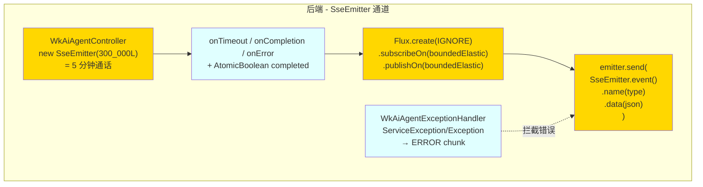

### 5.2 SSE chunk 12 种类型

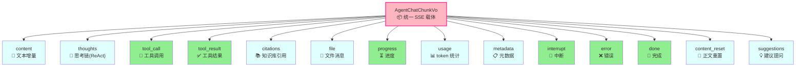

### 5.3 前端解析路径

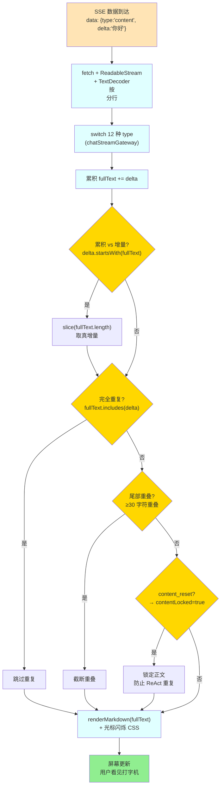

### 5.4 四个前端项目的流式实现对比

| 项目                    | 协议 | 端点                                                                                      | 解析库                                                         | 光标动画                                                          |
| ----------------------- | ---- | ----------------------------------------------------------------------------------------- | -------------------------------------------------------------- | ----------------------------------------------------------------- |
| **v2**            | SSE  | 老:`dashscope.aliyuncs.com/api/v1/apps/{appId}/completion`(生产禁用);新:后端 Agent 网关 | `@microsoft/fetch-event-source@^2.0.1` + 原生 ReadableStream | CSS 类`streaming` + `@keyframes blink`                        |
| **v3**            | SSE  | 后端`/api/wk/answer/student/stream` + `/api/wk/training/role/student/stream`          | 原生 fetch + ReadableStream                                    | Element Plus`<el-icon>` + `class="stopping"`                  |
| **wk-mhc-mobile** | SSE  | 同 v3 + 老路径(chatAppStream)                                                             | 原生 fetch + ReadableStream                                    | Vant`<van-loading>` + `:class="msg.loading"`                  |
| **wk-mhc-ui**     | SSE  | `KnowledgeStreamService.StreamAI()`                                                     | 原生 fetch +`ReadableStreamDefaultReader`                    | 内嵌`<span class="ai-cursor">` + `@keyframes ai-cursor-blink` |

### 5.5 抗丢字 / 防重复 7 重保险

```mermaid
graph TB
    NEW["新 delta 到达"] --> C1{"1️⃣ 累积全文?<br/>delta.startsWith(fullText)"}
    C1 -->|是| S1["slice(fullText.length)<br/>取真增量"]
    C1 -->|否| C2{"2️⃣ 完全重复?<br/>len>30 && fullText.includes(delta)"}
    C2 -->|是| SK["跳过"]
    C2 -->|否| C3{"3️⃣ 尾部重叠?<br/>≥30字符重叠"}
    C3 -->|是| TR["截断重叠"}
    C3 -->|否| C4{"4️⃣ content_reset?<br/>已有≥50字正文"}
    C4 -->|是| LOCK["contentLocked=true<br/>忽略后续 content"}
    C4 -->|否| C5{"5️⃣ thoughts 50ms<br/>节流 flush?"}
    C5 -->|是| THR["首 delta 立即 flush<br/>后续 50ms 节流"}
    C5 -->|否| C6{"6️⃣ safeOnDone?<br/>doneCalled 守卫"}
    C6 -->|是| DED["去重触发"}
    C6 -->|否| C7{"7️⃣ abort 流清理?<br/>异常路径"}
    C7 -->|是| FLUSH["flushPendingThoughts(true)<br/>+ onError"}
    C7 -->|否| ACC["fullText += delta<br/>正常累积"}

    classDef check fill:#FFD700
    classDef action fill:#90EE90

    class C1,C2,C3,C4,C5,C6,C7 check
    class S1,SK,TR,LOCK,THR,DED,FLUSH,ACC action
```

---

## 6. ReAct 主循环深度讲解(AI 思考-行动)

### 6.1 ReAct 是什么

```mermaid
graph LR
    Q["❓ 用户问题<br/>变电所巡视要注意什么?"] --> T1["💭 思考 1<br/>这个问题需要查 KB"]
    T1 --> A1["🔧 行动 1<br/>调 KnowledgeBaseSearchTool<br/>查 培训知识库"]
    A1 --> O1["👀 观察 1<br/>找到 3 条相关文档"]
    O1 --> T2["💭 思考 2<br/>文档够了吗?够 → 总结"]
    T2 --> A2["🔧 行动 2<br/>不再调工具<br/>直接 LLM 总结"]
    A2 --> O2["👀 观察 2<br/>生成最终回答"]
    O2 --> DONE["🏁 完成<br/>流式输出给前端"]

    classDef think fill:#FFD700
    classDef act fill:#FFB6C1
    classDef observe fill:#E0FFFF
    classDef done fill:#90EE90,stroke-width:3px

    class T1,T2 think
    class A1,A2 act
    class O1,O2 observe
    class Q,DONE done
```

### 6.2 主循环代码级流程

```mermaid
graph TB
    START["AgentReActExecutorImpl.execute()<br/>Flux.create(IGNORE)"]
    CTX["AiRequestContext<br/>setKbChoose/setKbList/setFileIds"]
    PATH{"路径选择<br/>useResponsesApi<br/>&& !hasFileIds?"}
    RP["runReactLoop<br/>(Chat Completions)"]
    RR["runReactLoopResponses<br/>(Responses API)"]

    START --> CTX
    CTX --> PATH
    PATH -->|是| RR
    PATH -->|否| RP

    RP --> LOOP1
    RR --> LOOP2

    subgraph "runReactLoop"
        LOOP1["for i=1..maxIterations"]
        LOOP1 --> EM1["emitThinking('思考中第N轮')"]
        EM1 --> CC1["BailianChatCaller.call()<br/>OkHttp POST → 解析 SSE"]
        CC1 --> PARSE1["流式 emit<br/>content/thoughts/tool_call/<br/>tool_result/citations/progress"]
        PARSE1 --> CHK1{"有 tool_call?"}
        CHK1 -->|是| EXE1["ToolRegistry.get(name).execute()"]
        EXE1 --> RF1{"read_uploaded_files?"}
        RF1 -->|是| QWEN["AgentReActExecutorImpl<br/>.executeReadUploadedFilesTool<br/>→ qwen-long 预读<br/>Redis 缓存 1h"]
        RF1 -->|否| BACK1["把 tool_result 回填 messages"]
        QWEN --> BACK1
        BACK1 --> LOOP1
        CHK1 -->|否| DONE1["sink.next(buildDoneChunk())"]
    end

    subgraph "runReactLoopResponses"
        LOOP2["for i=1..maxIterations"]
        LOOP2 --> EM2["emitThinking('思考中第N轮')"]
        EM2 --> CC2["BailianResponsesCaller.call()"]
        CC2 --> BUILT["emitBuiltinToolProgress<br/>(百炼内置工具)"]
        BUILT --> CIT["extractBuiltinToolCitations<br/>(file_search/web_search/<br/>code_interpreter/web_extractor/mcp_call)"]
        CIT --> CANCEL{"sink.isCancelled?"}
        CANCEL -->|是| STOP["sink.next(buildErrorChunk())<br/>+ complete()"]
        CANCEL -->|否| BACK2["回填 previousResponseId<br/>继续下一轮"]
        BACK2 --> LOOP2
    end

    classDef main fill:#FFB6C1,stroke:#FF1493,stroke-width:2px
    classDef loop fill:#FFD700
    classDef tool fill:#90EE90
    classDef done fill:#E0FFFF

    class START,CTX,PATH,RP,RR main
    class LOOP1,LOOP2,EM1,EM2,CC1,CC2,PARSE1,BUILT,CIT loop
    class EXE1,RF1,QWEN,BACK1,BACK2,CHK1,CANCEL tool
    class DONE1,STOP done
```

### 6.3 ReAct 涉及的所有文件

```mermaid
graph LR
    REQ(["ReactRequest<br/>{promptKey, history, fileList, kbList}"]) --> EXE["AgentReActExecutorImpl"]
    EXE --> CALL1["BailianChatCaller"]
    EXE --> CALL2["BailianResponsesCaller"]
    CALL1 --> CHUNK["AgentChatChunkVo<br/>12 种类型"]
    EXE --> REG["ToolRegistry.get(name)"]
    REG --> T1["KnowledgeBaseSearchTool"]
    REG --> T2["WebSearchTool"]
    REG --> T3["ReadUploadedFilesTool"]
    T1 --> KB["bailian20231229 OpenAPI"]
    EXE --> CTX["AiRequestContext"]
    EXE --> PAR["SuggestBlockParser"]

    classDef input fill:#FFE4B5
    classDef core fill:#FFB6C1,stroke:#FF1493,stroke-width:2px
    classDef caller fill:#FFD700
    classDef tool fill:#90EE90
    classDef helper fill:#E0FFFF

    class REQ input
    class EXE core
    class CALL1,CALL2 caller
    class CHUNK,REG,T1,T2,T3,KB core
    class CTX,PAR helper
```

---

## 7. 知识库 / 工具 / 多模态

### 7.1 知识库打通链路

```mermaid
graph LR
    USER["用户问:变电所巡视?"] --> CFG["AgentConfigService<br/>getKnowledgeBases()"]
    CFG --> DB[("数据库 cfg 表<br/>type=bailian_kb")]
    DB --> MAP["{workspaceId,<br/>trainingVectorStoreId,<br/>gongwuVectorStoreId}"]

    USER --> EXE["AgentReActExecutor"]
    EXE --> TOOL["KnowledgeBaseSearchTool.execute()"]
    TOOL --> SDK["bailian20231229<br/>Client.retrieveWithOptions"]
    SDK --> ENDPOINT["POST bailian.cn-beijing.aliyuncs.com<br/>(OpenAPI 同步)"]
    ENDPOINT --> RESP["返回 topK=5 相关文档"]
    RESP --> CITE["AgentChatChunkVo<br/>type=citations"]
    CITE --> FRONT["前端 CitationList 渲染<br/>[1][2] 标号"]

    classDef user fill:#FFE4B5
    classDef config fill:#FFD700
    classDef core fill:#FFB6C1
    classDef sdk fill:#90EE90
    classDef front fill:#E0FFFF

    class USER user
    class CFG,DB,MAP config
    class EXE,TOOL,CITE core
    class SDK,ENDPOINT,RESP sdk
    class FRONT front
```

### 7.2 工具箱全部工具一览

| 工具名                            | 实现类                                                                                                                                                                        | 实际功能           | 调百炼 API                                      |
| --------------------------------- | ----------------------------------------------------------------------------------------------------------------------------------------------------------------------------- | ------------------ | ----------------------------------------------- |
| `TOOL_NAME_KB_SEARCH`           | [KnowledgeBaseSearchTool.java](E:\rhProject\wk-train-center-service\wk-modules\wk-module-ai\src\main\java\com\wk\traincenter\ai\application\tool\KnowledgeBaseSearchTool.java) | 知识库检索         | `bailian20231229 OpenAPI retrieveWithOptions` |
| `TOOL_NAME_WEB_SEARCH`          | [WebSearchTool.java](E:\rhProject\wk-train-center-service\wk-modules\wk-module-ai\src\main\java\com\wk\traincenter\ai\application\tool\WebSearchTool.java)                     | 联网搜索           | 占位(百炼内置完成,Responses 路径)               |
| `TOOL_NAME_READ_UPLOADED_FILES` | [ReadUploadedFilesTool.java](E:\rhProject\wk-train-center-service\wk-modules\wk-module-ai\src\main\java\com\wk\traincenter\ai\application\tool\ReadUploadedFilesTool.java)     | 读用户上传文件     | `qwen-long` 预读 + Redis 缓存 1h              |
| `TOOL_NAME_FILE_SEARCH`         | (百炼内置)                                                                                                                                                                    | Responses API 内置 | 百炼服务端完成                                  |
| `TOOL_NAME_CODE_INTERPRETER`    | (百炼内置)                                                                                                                                                                    | Responses API 内置 | 百炼服务端完成                                  |
| `TOOL_NAME_WEB_EXTRACTOR`       | (百炼内置)                                                                                                                                                                    | Responses API 内置 | 百炼服务端完成                                  |

### 7.3 多模态(图片/文档/音视频)

```mermaid
graph TB
    subgraph "前端上传"
        F1["v2: OneTimeFileManager.vue"]
        F2["v3: 同 v2 路径"]
        F3["mobile: AiCourseFilePicker.vue<br/>前端直传 OSS"]
        F4["mhc-ui: oss-upload-control-knowledge<br/>MFE 远程组件"]
    end

    subgraph "后端转存"
        B1["POST /api/file/upload<br/>业务后端转存 OSS"]
        B2["返回 {url, dashScopeFileId, name}"]
    end

    subgraph "签名 + 推送"
        S1["getPrivateFileUrlBatch(urls, 600)<br/>过期 600s 签名"]
        S2["合并到 messages[lastUserIdx].fileList"]
        S3["Agent 网关 / 百炼直连消费"]
    end

    subgraph "图片直传(mobile 独有)"
        I1["拍照/相册 → useImageCapture"]
        I2["File → FileReader.readAsDataURL()"]
        I3["POST dashscope.aliyuncs.com/<br/>api/v1/services/aigc/<br/>multimodal-generation/generation"]
        I4["解析 choices[0].message.content[0].text<br/>识别文本塞回 AI 会话"]
    end

    F1 --> B1
    F2 --> B1
    F3 --> B1
    F4 --> B1
    B1 --> B2
    B2 --> S1
    S1 --> S2
    S2 --> S3

    I1 --> I2
    I2 --> I3
    I3 --> I4

    classDef front fill:#E0FFFF
    classDef backend fill:#FFD700
    classDef sign fill:#FFB6C1
    classDef image fill:#DDA0DD

    class F1,F2,F3,F4 front
    class B1,B2 backend
    class S1,S2,S3 sign
    class I1,I2,I3,I4 image
```

---

## 8. 错误处理与会话管理

### 8.1 5 类错误码(前后端一致)

```mermaid
graph TB
    ERR["Throwable"] --> CK{"mapToErrorCode<br/>关键字归类"}
    CK --> E1["AI_AUTH_FAIL<br/>🔑 401/403/auth/api key"]
    CK --> E2["AI_QUOTA_EXCEED<br/>📊 429/quota"]
    CK --> E3["AI_TOOL_FAIL<br/>🔧 tool/KB/search 失败"]
    CK --> E4["AI_INTERNAL<br/>💥 500/超时/网络兜底"]
    CK --> E5["AI_RATE_LIMIT<br/>⏱️ 限流"]

    E1 --> CHUNK["AgentChatChunkVo<br/>type=error<br/>errorCode=xxx"]
    E2 --> CHUNK
    E3 --> CHUNK
    E4 --> CHUNK
    E5 --> CHUNK
    CHUNK --> FRONT["前端 classifyStreamError<br/>出友好提示"]

    classDef check fill:#FFD700
    classDef err fill:#FFB6C1
    classDef front fill:#E0FFFF

    class CK check
    class E1,E2,E3,E4,E5,CHUNK err
    class FRONT front
```

### 8.2 IO 异常细分(BailianChatCaller.classifyIOException)

| 异常类型                       | 关键字                                                            | 日志级别 | 原因             |
| ------------------------------ | ----------------------------------------------------------------- | -------- | ---------------- |
| **CLIENT_ABORT**         | Windows 中文"中止"/"中断"、Broken pipe、Connection reset、aborted | info     | 用户点"停止"按钮 |
| **BAILIAN_STREAM_BREAK** | Connection reset(其他)                                            | warn     | 百炼服务端流中断 |
| **NETWORK**              | DNS/SSL/超时                                                      | warn     | 网络问题         |
| **UNKNOWN**              | 其他                                                              | error    | 未知错误         |

### 8.3 会话状态管理(不依赖 Redis 存会话内容)

```mermaid
graph TB
    subgraph "会话内容"
        FH["前端 messages[]<br/>完整传"]
        TH["ThreadLocal<br/>AiRequestContext<br/>(kbChoose/kbList/fileIds)"]
        CACHE["Redis 缓存<br/>(文件摘要 1h)"]
    end

    subgraph "Redis 用途(3 处)"
        R1["ai:agent:chat-stream:{userId}<br/>限流 10s"]
        R2["training:ai:ask:{userId}<br/>限流 20s(老路径)"]
        R3["ai:file:summary:{hash}<br/>文件摘要缓存 1h"]
    end

    subgraph "持久化(陪练/答疑)"
        DB1[("MySQL training_record")]
        DB2[("MySQL answer_record")]
    end

    classDef content fill:#FFB6C1
    classDef redis fill:#FFD700
    classDef db fill:#90EE90

    class FH,TH,CACHE content
    class R1,R2,R3 redis
    class DB1,DB2 db
```

---

## 9. 关键概念速查表

| 概念                                                | 干啥                                                                                                                             | 涉及文件                                                                           |
| --------------------------------------------------- | -------------------------------------------------------------------------------------------------------------------------------- | ---------------------------------------------------------------------------------- |
| **SSE**                                       | Server-Sent Events。后端往前端一个字一个字推的通道。HTTP 一次连接,长开                                                           | 后端`SseEmitter` / 前端 `fetch + ReadableStream`                               |
| **SseEmitter**                                | Spring 的 SSE 通道对象。5 分钟超时,前端断开自动触发 onCompletion                                                                 | `WkAiAgentController`                                                            |
| **Flux<AgentChatChunkVo></agentchatchunkvo>** | Reactor 响应式流。每个元素就是一个 chunk                                                                                         | `AgentReActExecutorImpl`                                                         |
| **ReAct**                                     | Reason + Act。AI 思考→动手查→再思考→再查,最多 10 轮                                                                           | `AgentReActExecutorImpl.runReactLoop`                                            |
| **Tool Calling**                              | AI 调用外部工具(查 KB / 读文件 / 联网)的能力                                                                                     | `ToolExecutor` + `ToolRegistry` + 6 个实现                                     |
| **Agent 网关**                                | 统一入口`WkAiAgentController`,所有 AI 对话都走这                                                                               | `WkAiAgentController`                                                            |
| **KB**                                        | Knowledge Base 知识库。百炼的向量数据库,存文档                                                                                   | `KnowledgeBaseSearchTool` + `bailian20231229 SDK`                              |
| **dashScopeFileId**                           | 百炼文件 ID。用户上传到百炼后,后续对话直接引用,免重复上传                                                                        | `DashScopeFileService`                                                           |
| **PromptKey**                                 | 提示词钥匙。后端 yml 维护,前端只发钥匙不发文本                                                                                   | `AgentConfigService.getSystemPrompt(promptKey)`                                  |
| **streamChatCompletion**                      | 前端流式调用主函数                                                                                                               | v2`chatStreamGateway.js` / v3 `sseStream.ts` / mobile `chatStreamGateway.ts` |
| **chunk_type 12 种**                          | content/thoughts/tool_call/tool_result/citations/file/progress/usage/metadata/interrupt/error/done + content_reset + suggestions | `AiGatewayConstants.CHUNK_TYPE_*`                                                |
| **CQRS**                                      | Command Query Responsibility Segregation 读写分离                                                                                | `TrainingRoleApp{Op,Query}Service` 等                                            |
| **DDD**                                       | Domain-Driven Design 领域驱动设计                                                                                                | controller/application/domain/infra 四层                                           |
| **Factory 模式**                              | 工厂模式,造实体时封装不变量校验                                                                                                  | `TrainingRoleFactory` 等                                                         |
| **Strategy 模式**                             | 策略模式,多 provider 路由                                                                                                        | `AiFactory` + `ToolExecutor` 多实现                                            |
| **State Machine**                             | 状态机,流式处理跨 delta 半标记                                                                                                   | `SuggestBlockParser`                                                             |
| **ThreadLocal 上下文**                        | 线程局部变量透传,不改接口签名                                                                                                    | `AiRequestContext`                                                               |
| **Builder 模式**                              | 建造者模式,链式构造 DTO                                                                                                          | `BailianChatRequest` 等                                                          |
| **Record**                                    | Java 14+ 的不可变数据类                                                                                                          | `ToolResult` / `ReactRequest` / `HistoryMessage`                             |

---

## 附录:一句话回顾

> **前端打字 → axios SSE 流式发请求 → 后端 Controller 开通道 → ReAct 循环调百炼 + 工具 → 百炼一个 chunk 一个 chunk 回吐 → 后端逐 chunk 推给前端 → 前端逐字渲染 + Markdown 排版 + 光标闪烁 → 用户看到「打字机」效果。**

如果想深入某一块(比如「ReAct 主循环具体怎么跑」、「抗丢字算法细节」、「前端 Markdown 渲染流式原理」),告诉我哪一块,我拆细讲。

---

**变更历史**

| 日期       | 作者   | 变更                                              |
| ---------- | ------ | ------------------------------------------------- |
| 2026-07-23 | Claude | 初版:零基础视角,大量流程图,覆盖后端+前端 4 个项目 |
