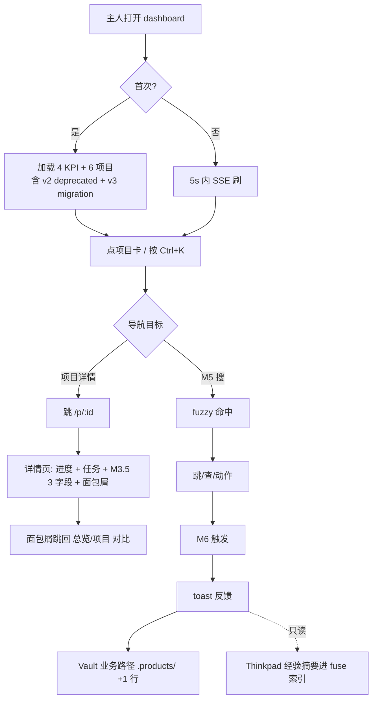

# wk-train-center 产品需求文档(PRD)

> 状态: 已开首条需求
> Owner: 产品经理 agent
> 范围: **跨代码仓产品层** —— 不绑定具体后端/前端代码仓,只承载产品需求、决策与跨仓变更。

---

## R1 — 主工作区 Dashboard 面板(2026-07-07)

> 关联实施项(spec §1.3):
>
> - `e:\rhProject\CLAUDE.md` ❌ 不存在
> - `docs/superpowers/specs/` ✅ 已实施
> - `C:\Users\RUHAI\.claude\projects\e--rhProject\WIKI.md` ✅ 已实施
> - `C:\Users\RUHAI\.claude\projects\e--rhProject\memory\` ✅ 已实施
> - `learning.md` ❌ 不存在
> - `WIKI.md 引用"VSCode+Claude 维护的 wiki"` ❌ 不存在
> - `scripts/hooks/session-start.mjs` ❌ 不存在
> - `.claude/projects/ 屏蔽` ✅ 已实施
> - `Thinkpad/.claude-skills.md 边界声明` ✅ 已实施
> - `Thinkpad/index.md 被 hook 读` ❌ 不存在
> - 灰度 4 步: Step 0/2 ✅ / Step 3 🟡 / Step 1/4 ❌

> 当前 R1 状态判定: dashboard 跑起来 = 🟢 开发。

> 主人拍板: ✅ — R1 主工作区面板实际已经落地(dashboard 跑起来 + 4 步灰度 3 步已 ✅ + 主人浏览器可见),主人 2026-07-07 拍板升到反馈态。

### 需求背景

主人(沈超)在管理 `E:\rhProject\` 主工作区时,需要一眼看到:

1. 整个 `.products/` 下各产品/技术项目的需求跟踪状态
2. `Thinkpad/22-entities-实体档案/agent-经验库/` 下各 agent 沉淀的经验数量与近期更新

当前现状:

- 产品层文档散在 `.products/projects/wk-train-center/`,技术层散在各 `wk-*` 项目目录
- agent 经验库有 20+ 份 `.md`,靠手动 `ls` 才能看最新
- 没有统一概览,主人每天要花 5-10 分钟人工盘点

### 需求目标

提供一个本地 Web 面板,集成到主人日常工作流,支持:

- 开机自启(主人 2026-07-07 拍板)
- 一眼看到产品需求 4 状态闭环(需求 → 开发 → 测试 → 反馈)
- 一眼看到 agent 经验库摘要
- 提供桌面快捷方式,一键打开面板

### 用户角色

| 角色                  | 用法                                        |
| --------------------- | ------------------------------------------- |
| 主人(产品/项目 owner) | 每天打开 IDE 顺便看面板,5 秒掌握全局        |
| 产品经理 agent        | 写新需求后,面板自动反映                     |
| 项目经理 agent        | 任务状态变更后面板自动反映                  |
| Wiki 维护 agent       | changelog/decision 写完后,面板自动反映      |
| 各代码专家            | 通过 Thinkpad/fix-plans 写经验,面板自动反映 |

### 验收标准

- [ ] 面板能展示产品层 PRD/decision/task 数量与状态
- [ ] 面板能展示 agent 经验库 20+ 份文件的摘要
- [ ] 顶部 KPI 卡显示 4 类数字:产品需求总数 / 进行中 / 已完成 / agent 经验总数
- [ ] 两个 Tab:【产品需求】/【Agent 经验】
- [ ] 开机自启(Windows 计划任务,登录后触发)
- [ ] 桌面快捷方式(`Open-Dashboard.lnk`)一键打开
- [ ] 失败重试 3 次 + 启动日志
- [ ] 项目 venv 隔离,不影响系统 Python

### 范围外

- 远程访问(只本地 localhost:8501)
- 多用户/权限(只主人自己用)
- 实时协作(读静态文件,实时性差几秒没关系)
- 移动端适配(只桌面浏览器)
  > 主人拍板: ✅ — 主人 2026-07-07 拍板

---

## R3 — 主工作区面板本地链接(2026-07-07)

> 关联实施项(spec §1.3 即将更新):
>
> - 主面板"快速打开"区(4 个 link_button)
> - 实施项表格"📂 在 VSCode 打开"按钮
> - PRD expander 文件路径自动 vscode:// 链接
> - 主题色: 奶茶 #F0E9D8 + 烟青蓝 #7A8FA6

> 当前 R3 状态判定: 实施中(主面板接入 + 详情接入 + 主题色注入)。

> 主人拍板: 🟢 — 主人 2026-07-07 拍板进入开发态。

---

## R7 — Dashboard 改写为 Vue3 混合体(2026-07-08)

> **状态**: ✅ v3 已审过 — 主人 2026-07-08 拍板通过 + 追加 M5 命令面板 + M6 自动化
> **拍板**: Vue 3.5 稳定版 + 看板 + 迭代 + 仪表盘(无拖拽) + 反连 Thinkpad

### 一页纸形态

```
┌─ 顶部 KPI (4 卡) ─────────────────────────────────────────────┐
│ 需求总数 │ 进行中 │ 已完成 │ 笔记总数                          │
├──────┬───────────────────────────────────┬──────────────────┤
│ 项目 │  主视图 (按路由切换)               │ Vault 侧边栏     │
│ 导航 ├───────────────────────────────────┤                  │
│ • wk-│  / 总览(仪表盘 4 图)              │ • 今日 log       │
│ • wk-│  /k  看板(4 列)                  │ • 最近 fix-plans │
│ • wk-│  /i  迭代(Sprint 列表)            │ • entities 速览  │
│ • wk-│  /p/<id> 项目详情                │                  │
│ • wk-│  /v  Vault 全部笔记              │                  │
└──────┴───────────────────────────────────┴──────────────────┘
```

### 5 模块

| #   | 模块           | 做什么                                                 | 不做什么   |
| --- | -------------- | ------------------------------------------------------ | ---------- |
| M1  | **看板**       | 4 列静态:待办/进行/已完成/已关闭                       | 不拖拽     |
| M2  | **迭代**       | Sprint 列表 + 起止 + 需求清单                          | 不做新创建 |
| M3  | **仪表盘**     | 4 ECharts:状态饼/覆盖率/燃尽/项目分布                  | 不下钻     |
| M4  | **项目对比**   | 5 项目横比进度/任务数/最后活动                         | 不编辑     |
| M5  | **Vault 反连** | dashboard 写 → log.md 追加; vault 改 → dashboard 5s 刷 | 不双向写   |

### 5 物件数据模型

| 物件        | 字段                                  | 源                                     | 状态                   |
| ----------- | ------------------------------------- | -------------------------------------- | ---------------------- |
| Requirement | id/title/status/owner/created         | `.products/projects/*/docs/PRD.md`     | ❌/🟡/✅/🟢            |
| Task        | id/title/status/priority/owner/parent | `.products/projects/*/tasks/*.md`      | todo/doing/done/closed |
| Iteration   | id/name/start/end/需求                | `.products/projects/*/iterations/*.md` | planned/active/done    |
| Project     | name/path/type/lastActivity           | `E:\rhProject\wk-*/`                   | (只读)                 |
| VaultNote   | path/title/type/tags                  | `Thinkpad/**/*.md`                     | (只读)                 |

### 5 项决策(主入已拍)

| 决策       | 选项                                      | 主入拍板         |
| ---------- | ----------------------------------------- | ---------------- |
| 脚手架位置 | 新建 / 融入 v3 /**原地加 dashboard-vue/** | C                |
| Vault 协同 | 只读 / 反链 /**双向写入**                 | Z                |
| 数据后端   | Node / Streamlit / 静态 JSON              | i (Node Fastify) |
| 实时性     | chokidar+SSE / 30s 轮询                   | a (主推)         |
| ECharts    | vue-echarts /**echarts 5 自包**           | b                |

### 5 条验收

- [ ] 5s 内打开 `localhost:5173` 看 4 KPI + 5 项目
- [ ] 5 项目间切换视图无错
- [ ] 改 PRD.md 一处, 5s 内 dashboard 自动刷
- [ ] dashboard 改状态, 5s 内 log.md 多 1 行
- [ ] 4 ECharts 图各显真数据

### 不做(主入已否)

- 任务拖拽 / 多人协作 / 双向 vault 写 / 缺陷模块 / 甘特单模 / 响应式 / 鉴权

### 实施 6 块(等 spec §1.3 拆细节)

1. **脚手架** `.products/dashboard-vue/` (Vite 5 + Vue 3.5 + Pinia + vue-router 4)
2. **后端** `server/` (Fastify + chokidar + SSE + portalocker)
3. **前端壳** 路由/布局/黑客绿主题/file:// 链接(沿用 R6.2/R6.3)
4. **M1+M2** 看板 + 迭代 (静态, Vue 组件)
5. **M3** 仪表盘 (echarts 5, 4 图, 静态数据流)
6. **M4+M5** 项目对比 + Vault 反连 (粗粒度单写 log.md)

### 风险

- **R1** Windows 路径编码 → `path.win32.normalize` 兜底
- **R2** log.md 并发写 → portalocker 文件锁
- **R3** 8501 灰度双服务 → 5173 + 8501 端口分离
- **R4** 浏览器 CORS → Node 同源代理

---

> **主入拍板**: ⏳ 等审 v3

---

## 追加章节: M5 命令面板 + M6 自动化 (2026-07-08)

> **来源**: 主人 2026-07-08 拍板"希望控制自动化 + 快捷功能 + 找 GitHub/网上类似设计"
> **设计参考**: VS Code Ctrl+Shift+P / Linear Cmd+K / Obsidian Ctrl+P / Templater hotkey

### M5 — 命令面板 (Cmd-K)

**入口**: 全局 `Ctrl+K` / `Cmd+K` 弹命令面板, 模糊搜, 大输入框 + 命令列表

```
┌─ 命令面板 (Cmd-K) ─────────────────────────┐
│ 🔍 搜命令、项目、笔记、文件...            │
│                                            │
│ > 跳转到 R7                                │
│   打开 wk-train-center-service             │
│   跳到今日 log.md                          │
│   查 21-fix-plans 笔记                     │
│   ...                                      │
│                                            │
│ ↑↓ 移动 │ Enter 执行 │ Esc 关闭           │
└────────────────────────────────────────────┘
```

**命令类型** (3 类):

| 类型     | 例                               | 实现                           |
| -------- | -------------------------------- | ------------------------------ |
| **导航** | "跳到 R7" / "打开 wk-mhc-ui"     | vue-router 跳转 / 路径 file:// |
| **查询** | "查 fix-plans" / "看今日 log"    | 调后端 GET /api/search?q=      |
| **动作** | "重生成 PRD 摘要" / "同步 vault" | 调后端 POST /api/action        |

**Fuzzy 搜**: fuse.js (本地, 不调后端, <5k 条数据)

### M6 — 自动化按钮区

**入口**: 主页右下角浮动 4-6 个圆形按钮, 名字+图标+快捷键

| 按钮          | 快捷键         | 动作                                                | 借鉴                 |
| ------------- | -------------- | --------------------------------------------------- | -------------------- |
| 🔄 重生成摘要 | `Ctrl+R`       | 重跑 parsers, 刷 dashboard 缓存                     | Templater hotkey     |
| 📝 出今日 log | `Ctrl+L`       | 把 dashboard 当日变更写 Thinkpad/log.md             | (自创)               |
| 🔍 全量重扫   | `Ctrl+Shift+R` | 强制 chokidar 重发, dashboard 5s 内全刷             | (自创)               |
| 🧪 跑测试     | `Ctrl+T`       | 调后端 POST /api/test 跑单测 (本工作区暂无, 留接口) | VS Code Ctrl+Shift+P |
| 📦 打包 PRD   | `Ctrl+P`       | 把所有 PRD 打包成单 .md 导出                        | (自创)               |
| ⚙️ 设置       | `Ctrl+,`       | 跳设置页(主题/端口/缓存 TTL)                        | VS Code Ctrl+,       |

**实现**: 后端 POST /api/action { name }, 前端用 fetch, 结果 toast 反馈

### 6 模块汇总 (v3 + 追加)

| #   | 模块                    | 来源     |
| --- | ----------------------- | -------- |
| M1  | 看板 (4 列静态)         | v3       |
| M2  | 迭代 (Sprint 列表)      | v3       |
| M3  | 仪表盘 (4 图 ECharts)   | v3       |
| M4  | 项目对比 (5 项目)       | v3       |
| M5  | **命令面板 (Cmd-K)**    | **追加** |
| M6  | **自动化按钮 (4-6 个)** | **追加** |

### 数据流更新

```
[Node 后端]
    ├── GET  /api/requirements, /tasks, /iterations, /projects, /vault
    ├── POST /api/action {name}             # M6 触发
    ├── GET  /api/search?q=                 # M5 模糊搜
    ├── SSE  /api/events                    # 实时推送
    └── POST /api/owner-override {rid,val}  # 写回 PRD (沿用 R3)
```

### 验收追加 (3 条)

- [ ] `Ctrl+K` 弹命令面板, 输 "R7" 出现 "跳转到 R7"
- [ ] `Ctrl+R` 触发重生成, dashboard 5s 内刷新
- [ ] `Ctrl+L` 触发出今日 log, Thinkpad/log.md 末尾多 1 行

### 不做追加

- ❌ 全局 hotkey (Cmd+Space Raycast 模式) — 太重
- ❌ 自动化编排 (Zapier workflow 模式) — 简单按钮够
- ❌ 跨设备命令同步 — 个人本机
- ❌ 语音命令 — 个人本机

### 实施块 (8 块)

1. 脚手架 (Vite 5 + Vue 3.5 + Pinia + vue-router 4)
2. 后端 (Fastify + chokidar + portalocker + SSE + action 路由)
3. 前端壳 (路由/布局/黑客绿/file:// + Cmd-K 全局监听)
4. M1 + M2 (看板/迭代)
5. M3 (4 图 ECharts)
6. M4 (项目对比)
7. **M5 命令面板 (fuse.js 集成)**
8. **M6 自动化按钮 (4-6 个 + action API)**
9. M0 沿用: Thinkpad 反连 (写 log.md)
10. 部署 (计划任务 5173, 8501 灰度 2 周)

### 风险追加

- **R5** Cmd-K 监听与浏览器原生冲突 — 用 `e.ctrlKey && e.key === 'k' && preventDefault()`
- **R6** action API 误触发破坏文件 — 加 dry-run 模式 + confirm modal
- **R7** 模糊搜性能 — fuse.js index 全量加载 1 次, 不每次重建

### 调研参考 (主入要求"找 GitHub/网上类似")

| 工具                          | 模式               | 我们怎么抄 |
| ----------------------------- | ------------------ | ---------- |
| **VS Code** Ctrl+Shift+P      | 命令面板 + 模糊搜  | M5 整体    |
| **Linear** Cmd+K              | Quick switcher     | M5 导航类  |
| **Obsidian** Ctrl+P           | 调出命令           | M5         |
| **Templater (Obsidian 插件)** | hotkey -> 模板执行 | M6 按钮    |
| **Zapier / Make**             | trigger -> action  | M6 简化    |
| **Raycast**                   | 全局命令           | 太重, 不抄 |

---

> **主人拍板**: ✅ v3 + M5/M6 追加 — 主人 2026-07-08 拍板
> 实施起点: 1 脚手架

## v5 升级 — 主人拍板 v5 spec (2026-07-08)

> **来源**: 主人 2026-07-08 6 问拍板 (弹选项框) → `docs/superpowers/specs/2026-07-08-r7-mvp-redesign.md`
> **变更**: 增量升级 v3 → v4 → v5, **不重写 v3 章节** (R1/R3 不动)
> **拍板**: ✅ 主人 2026-07-08 v5 spec 已审, 本段为 v5 落地版

### 6 问拍板汇总

| #   | 主题       | 主人拍板                                      | 备注                           |
| --- | ---------- | --------------------------------------------- | ------------------------------ |
| 1   | 知识库边界 | **业务 `.products/` + 经验 `Thinkpad/`**      | 双路径, 后端只读 Thinkpad      |
| 2   | v2 项目    | **必须体现** (v2 才是生产稳定版, v3 还在迁移) | 标 `v2_production_stable=true` |
| 3   | 项目版本   | **3 字段: branch + lastCommit + uncommitted** | M3.5 新增                      |
| 4   | 详情返回   | **面包屑** [总览 / 项目 / xxx]                | 主路径明显, 可跳过中间         |
| 5   | MVP 范围   | **加 M3.5 项目版本**                          | 旧 5 物件模型保留              |
| 6   | 数据架构   | **A. JSON 静态源** (后端读文件, 不存 DB)      | chokidar 触发 + 内存缓存       |

### 知识库边界 (v4 → v5)

| 类型     | 路径                                          | 例                      | 写权限       |
| -------- | --------------------------------------------- | ----------------------- | ------------ |
| 业务     | `.products/projects/<proj>/docs/PRD.md`       | R7, R1, R3              | dashboard 写 |
| 业务     | `.products/projects/<proj>/docs/decisions/`   | ADR                     | dashboard 写 |
| 业务     | `.products/projects/<proj>/tasks/*.md`        | 任务                    | dashboard 写 |
| 业务     | `.products/projects/<proj>/iterations/*.md`   | 迭代                    | dashboard 写 |
| **经验** | `Thinkpad/22-entities-实体档案/agent-经验库/` | 各 agent experiences.md | **只读**     |
| 经验     | `Thinkpad/20-concepts-已消化笔记/`            | 概念                    | **只读**     |
| 经验     | `Thinkpad/21-fix-plans-修复经验/`             | 修复经验                | **只读**     |
| 经验     | `Thinkpad/23-Tools-工具用法/`                 | 工具用法                | **只读**     |

> **后端 chokidar 监 2 类路径**:
>
> - 业务源 (写): `.products/**/*.md` (4 子路径)
> - 经验源 (只读): `Thinkpad/22-entities/**/*.md` (主入 agents 用, 后端**只读, 不写**)

### MVP 6 视图 (v4 → v5, 主入修订)

1. **总览** `/` — 4 KPI + **6 项目** + 近期 log
2. **项目详情** `/p/:id` — 名字 + 进度 + 任务列表 + **M3.5 版本 3 字段** + 面包屑
3. **项目对比** `/compare` — **6 卡片横比** (含 v2 + v3 状态标)
4. **看板** `/k` — sprint 2 占位
5. **迭代** `/i` — sprint 2 占位
6. **Vault** `/v` — sprint 2 占位

### 6 项目数据真值 (v4 → v5)

| id                      | name        | type        | agent        | 状态                                    |
| ----------------------- | ----------- | ----------- | ------------ | --------------------------------------- |
| wk-mhc-mobile           | mhc-mobile  | vue3.5      | h5           | active                                  |
| wk-mhc-ui               | mhc-ui      | angular     | angular      | active                                  |
| wk-PPTist-ui            | PPTist      | **vue3.5**  | ppt          | active                                  |
| wk-train-center-service | train-svc   | spring-boot | java-backend | active                                  |
| wk-train-center-ui      | train-ui    | **vue2.7**  | vue2         | **v2_production_stable** (主人长期维护) |
| wk-train-center-ui-v3   | train-ui-v3 | **vue3.5**  | vue3         | **v3_in_migration** (仍有小问题)        |

> 5 → 6 项目, v2 标 deprecated 标, v3 标迁移标, **两者都必显**.

### M3.5 — 项目版本 (v5 新增)

项目详情页 `/p/:id` 必须显示 3 字段:

| 字段          | 含义                        | 数据源                                      |
| ------------- | --------------------------- | ------------------------------------------- | ------ |
| `branch`      | 当前分支                    | `git -C <path> rev-parse --abbrev-ref HEAD` |
| `lastCommit`  | 最近 commit hash (短 7 位)  | `git -C <path> log -1 --format=%h`          |
| `uncommitted` | 未提交变更数 (含 untracked) | `git -C <path> status --porcelain           | wc -l` |

后端 `GET /api/project/:id/version` → `{ branch, lastCommit, uncommitted }`.

### 详情返回 — 面包屑 (v5 新增)

项目详情页 `/p/:id` 顶部固定面包屑:

```
[总览 / 项目 / wk-train-center-ui]
```

- "总览" → 跳 `/`
- "项目" → 跳 `/compare`
- "wk-train-center-ui" → 当前页 (不可点)

### 数据架构 (v4 隐含 → v5 明定 A 静态源)

后端 chokidar 监 5 路径 → 内存中拼对象 → 暴露 REST:

| 方法 | 路径                       | 返回                                         |
| ---- | -------------------------- | -------------------------------------------- |
| GET  | `/api/projects`            | 6 项目数组                                   |
| GET  | `/api/project/:id`         | 详情 (含 progress + tasks + 路径)            |
| GET  | `/api/project/:id/version` | `{ branch, lastCommit, uncommitted }` (M3.5) |
| GET  | `/api/search?q=`           | fuse 索引 (M5 模糊搜)                        |
| POST | `/api/action`              | dispatcher (M6 6 按钮)                       |
| GET  | `/api/events`              | SSE 实时推送                                 |

后端**不存 DB**, 全程文件直读 + 内存缓存 + chokidar 失效.

### 验收 (v4 5 条 → v5 **6 条**, 加 M3.5 + 项目详情 1 条)

- [ ] 启动 5s 内 4 KPI + **6 项目** (含 v2 deprecated 标)
- [ ] `/compare` **6 卡** (含 v2 + v3 状态标)
- [ ] `/p/wk-train-center-ui` 详情页: 进度 + 任务 + **3 字段 (branch=main, lastCommit=xxx, uncommitted=2)** + 面包屑
- [ ] `/p/wk-train-center-ui-v3` 同上, 状态标 `v3_in_migration`
- [ ] `Ctrl+K` 弹 → 输 `R7` 跳
- [ ] 6 按钮 P0 3 个生效 (重生成 / 出 log / 全量重扫)

### 不做 (v5 = v4 维持)

- M1 看板 / M2 迭代 / M3 仪表盘 4 图 (留 sprint 2)
- 拖拽 / 多人 / 响应式
- **写经验到 Thinkpad** (主人自己维护, 后端只读)
- **写业务到 Thinkpad** (不混淆边界)
- ❌ M6 按钮砍半 / ❌ 全文件 fuzzy 搜

### 风险追加 (v5 增量)

- **R11** v2/v3 双版本项目, dashboard 状态标易混 → 统一用 `v2_production_stable` / `v3_in_migration` 两个 flag
- **R12** M3.5 调 git 在 Windows 卡 → 异步 + 缓存 60s, 不阻塞详情页
- **R13** chokidar 监 5 路径 vs 实际 `.md` 分布 → 先启动扫一次, 避免冷启空白
- **R14** 知识库边界写反 → 后端按路径前缀白名单 `.products/` 写, `Thinkpad/` 只读

### 实施优先级 (v5 = v4 P0/P1)

| 优先级 | 内容                                                                                                                                                                      |
| ------ | ------------------------------------------------------------------------------------------------------------------------------------------------------------------------- |
| **P0** | 脚手架 + 后端 (A 静态源 + chokidar + M3.5 git 调) + 前端壳 (含面包屑) + 总览 (6 项目) + 详情 (含 M3.5) + 对比 (6 卡) + M5 + M6 重生成/出 log/全量重扫/设置 + Vault 写业务 |
| **P1** | M6 跑测试 (留接口) + M6 打包 PRD + M1/M2/M3 仪表盘 4 图 (留 sprint 2)                                                                                                     |

### 流程图 (主人进入 dashboard 的主路径, v5 修订)



### 后续动作

- 主人审 v5 ✅ → Orchestrator 派脚手架 + 后端 A 静态源任务
- 主人审 v5 ✏️ → 改 v5, 再审
- v5 spec 是 source of truth (主入已审), 本 PRD 段为落地版

---

> **主人拍板**: ✅ v5 已审 (2026-07-08) — 派脚手架 + 后端 A 静态源任务
> **写日期**: 2026-07-08
> **写者**: 产品经理 agent (Orchestrator 派单)
> **v5 源**: `docs/superpowers/specs/2026-07-08-r7-mvp-redesign.md`

---

## R8 — Sprint 2: M1 看板 + M2 迭代 + M3 ECharts 仪表盘 (2026-07-08)

> **状态**: ⏳ 待主人审
> **来源**: 主人 2026-07-08 同会话"跳 sprint 2"
> **作者**: 产品经理 agent (Orchestrator 派单)
> **范围**: v5 spec §MVP 6 视图 §"不做 (留 sprint 2)" 3 条落地 — M1/M2/M3

### 1. 目标 (1 页纸)

把 MVP v5 spec 留的 3 模块(M1 看板 / M2 迭代 / M3 ECharts)落地,让 dashboard 从"看 + 操作"升级为"看 + 操作 + 进度可视化"。

### 2. 4 物件数据真值 (R8 调研复核)

| 物件        | 字段                                                                    | 数据源                                        | 现状                                                                                 |
| ----------- | ----------------------------------------------------------------------- | --------------------------------------------- | ------------------------------------------------------------------------------------ |
| Requirement | id(R\d+) / title / status(❌/🟡/✅/🟢) / owner                          | `.products/projects/*/docs/PRD.md` `^## R\d+` | ✅ PRD.md 已含 R1/R3/R7 (本 R8 增量)                                                 |
| Task        | id / title / status(todo/doing/done/closed) / priority / owner / parent | `.products/projects/*/tasks/*.md` frontmatter | ✅ `wk-train-center/tasks/` 已有 4 个 (MVP/任务/2 计划), id 形如 `TASK-YYYYMMDD-...` |
| Iteration   | id / name / start / end / 需求列表 (R 编号)                             | `.products/projects/*/iterations/*.md`        | 🟡 目录暂缺 (R8 实施时落地, 首份 = R8 sprint 2 自身)                                 |
| Project     | name / type / lastActivity / v2_production_stable / v3_in_migration     | 6 项目真值 (见 v5 spec)                       | ✅                                                                                   |

> M1 看板 → Task; M2 迭代 → Iteration; M3 4 图 → Requirement + Iteration + Project 三者聚合。

### 3. M1 看板 (`/k`)

- **4 列静态**: 待办 / 进行中 / 已完成 / 已关闭
- **不拖拽** (主人 R7 v3 明说, R8 不推翻)
- 数据源: `Task.frontmatter.status` (`todo/doing/done/closed` → 4 列)
- 卡片显示: 标题 + 优先级(P0/P1/P2) + owner + 父需求(R 编号, 软链到 PRD)
- 缺 `iterations/` 路径时显示空列 + "暂无 task" 占位 (不报错)

### 4. M2 迭代 (`/i`)

- **Sprint 列表**: 每个 iteration 一个卡片
- 每行显示: 名称 + 起止日期(`start`/`end` frontmatter) + 包含的需求列表(R 编号链到 PRD)
- 排序: 默认按 `end` 倒序(近的在前), 活跃迭代置顶
- 后端新端点: `GET /api/iterations` (列表) + `GET /api/iteration/:id` (单详)
- 数据源: `.products/projects/*/iterations/*.md` frontmatter

### 5. M3 ECharts 仪表盘 (`/` 总览)

- **4 图** (沿用 v5 spec §MVP 6 视图, 不增减):

| 图           | 取数                                                                            | 渲染                           |
| ------------ | ------------------------------------------------------------------------------- | ------------------------------ |
| **状态饼**   | Requirement 4 状态 (❌/🟡/✅/🟢) 在所有 `.products/projects/*/docs/PRD.md` 聚合 | ECharts pie, 4 扇区            |
| **覆盖率**   | Requirement done / total (✅+🟢)/总数                                           | ECharts gauge, 中心百分比      |
| **燃尽**     | 当前 active iteration 剩余工时 = (end - now) / (end - start) \* 总需求数        | ECharts line, x = 日, y = 剩余 |
| **项目分布** | 6 Project 按 type (vue3.5/vue2.7/angular/spring-boot) 柱                        | ECharts bar, x = type          |

- **包**: `echarts@5` 自包, **不引入 `vue-echarts` wrapper** (主入 R7 v3 拍 `b`)
- **主题色**: accent `#00FF9C` (黑客绿, 沿用 R6.2/R6.3), ECharts 用作 series 主色
- 数据源: `GET /api/stats` (新端点), 聚合 3 类物件 + 6 项目
- 路由: `/` 总览 4 图 + 原 4 KPI 同时显示 (不替换 KPI, **叠加**)

### 6. 数据架构 (R8 增量)

- 后端沿用 v5 A 静态源(**不建 DB**)
- 新端点 **3 个**:

| 方法 | 路径                 | 返回                                                                                             |
| ---- | -------------------- | ------------------------------------------------------------------------------------------------ |
| GET  | `/api/iterations`    | iteration 数组 (含 name/start/end/需求列表)                                                      |
| GET  | `/api/iteration/:id` | 单 iteration 详 (含 status = planned/active/done)                                                |
| GET  | `/api/stats`         | `{ pie: {🟡,🟢,✅,❌}, coverage: 0.x, burndown: [{day, remaining}], projects: [{type, count}] }` |

- **chokidar 监 1 新路径**: `.products/projects/*/iterations/*.md` (v5 已有 5 路径 + 本 = 6 路径)
- 缓存: 内存同 v5 (无 TTL 累加, 复用 R7 v3 60s 软失效)
- SSE: `/api/events` 已含本路径变更推送, **无需新通道**

### 7. 不做 (沿用 v5)

- ❌ 拖拽 / 多人 / 响应式 / 鉴权 (v5 不做, R8 不推翻)
- ❌ ECharts 额外图 (v3 5 图选项 → R8 定 **4 图**, 不 5)
- ❌ 写 entity 档案到 Thinkpad (主入 2026-07-08 改成 Thinkpad 只读)
- ❌ M1 看板拖拽 / M2 迭代创建新迭代 / M3 下钻点击
- ❌ 移动 ECharts 实例到 vue-echarts (主入 v3 已否)

### 8. 实施块 (待 spec §1.3 拆细节)

```
[B1] 后端: 3 新端点 + chokidar 1 新路径 + 聚合 helpers
[B2] 前端: M1 看板 (/k 路由 + KanbanBoard.vue + 4 列卡片)
[B3] 前端: M2 迭代 (/i 路由 + IterationList.vue + 单 iteration 卡片)
[B4] 前端: M3 ECharts 4 图仪表盘 (/ 叠加原 4 KPI + StatsCharts.vue)
[B5] ECharts 集成 + 主题色 (#00FF9C 入 :root + echarts theme register)
[B6] 部署 + 6 验收 (curl + vue-tsc + 浏览器截图)
```

### 9. 6 验收

- [ ] `/k` 看板 4 列显示真实 task (从 `.products/projects/wk-train-center/tasks/` 读, frontmatter status 映射 4 列)
- [ ] `/i` 迭代列表显示 Sprint 卡片 + 起止日期 + R 需求链
- [ ] `/` 总览 4 ECharts 图 (状态饼 / 覆盖率 / 燃尽 / 项目分布) 显真实数据(非 mock)
- [ ] 主题色 `#00FF9C` 在 ECharts series accent 可见(目视 + DevTools 取色)
- [ ] 改 `tasks/*.md` frontmatter status, 看板 5s 内刷 (SSE 验证, R7 v3 沿用 60s debounce)
- [ ] `vue-tsc --noEmit` 0 错 + 5 条验收 curl 200 (`/api/iterations` / `/api/iteration/:id` / `/api/stats` / `/api/projects` / `/api/events`)

### 10. 风险 (R8 增量)

- **R15** chokidar 新增 `iterations/*.md` 路径, 旧 watcher 实例不感知 → 实施时需重启 server 才生效
- **R16** ECharts 包体 ~900KB → Vite manualChunks 拆 vendor, 首屏不阻塞
- **R17** `iterations/` 目录缺首份文件 → 后端空数组正常返 + 前端空态; 在 R8 任务包首份创建 `2026-07-08-S2-R8.md`
- **R18** 状态饼聚合跨项目 PRD → 解析各 `PRD.md` 的 `^## R\d+` 段 + 状态 emoji (❌/🟡/✅/🟢), 不引入 md parser 大依赖

### 11. 后续动作

- 主人审 R8 ✅ → Orchestrator 派 B1~B6 任务 (8 块表 由 PM 拆)
- 主人审 R8 ✏️ → 改 R8, 再审
- R8 落地后再开 R9 sprint 3 (候选: 真拖拽 / 移动端 / Vuex → Pinia 等)

---

> **主人拍板**: ⏳ 待审
> **写日期**: 2026-07-08
> **写者**: 产品经理 agent (Orchestrator 派单)

<!-- b1 chokidar prd test 2026-07-08T15:27:41.6220988+08:00 -->
