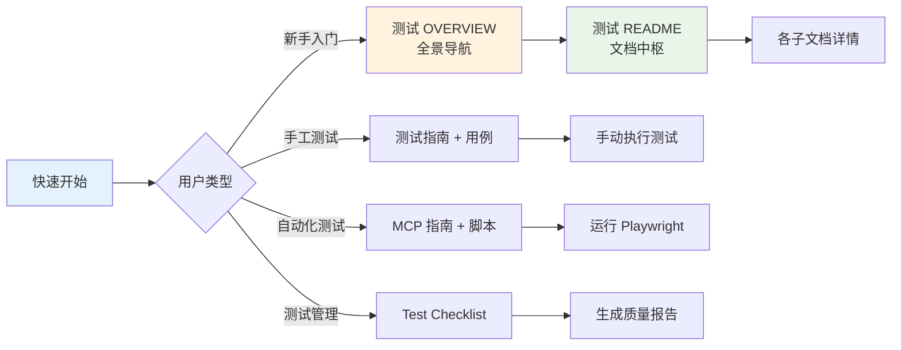

# 🧭 延期/补考功能 - 完整测试套件导航

## 👋 欢迎来到测试资源中心

这里是**一键延期/补考功能**的完整质量保障体系，包含：
- ✅ **手工测试** (详细步骤 + 数据准备)
- ✅ **自动化测试** (Playwright 脚本 + CI/CD集成)
- ✅ **测试管理** (进度跟踪 + 缺陷统计)
- ✅ **培训材料** (新人上手指南 + FAQ)

---

## 🎯 快速导航（按角色选择）

### 🚀 "我想立即开始测试！" 

👉 **请直接阅读**: <deleted>  
**耗时**: 5 分钟 | **产出**: 可运行的首次测试

```powershell
# 复制粘贴这行命令就能启动：
cd e:\rhProject\scripts && run-extension-test.bat
```

---

### 📖 "我想全面理解测试方案"

👉 **推荐阅读顺序**:

1. **<deleted>** ← 先从这里看全景地图
2. **<deleted>** ← 了解文档关系图
3. **<deleted>** ← 确认交付物清单

**总计用时**: 30 分钟 | **适合人群**: 项目经理、新接手 QA

---

### 🧪 "我是 QA，要执行手工测试"

👉 **核心资料**:

- 📄 **<deleted>**  
  → 80+ 条详细测试步骤（TC-EXT-001 ~ TC-E2E-001）

- 🔧 **<deleted>**  
  → 手动操作步骤 + 调试技巧 + Postman 示例

- ✅ **[TESTING-CHECKLIST.md](./TESTING-CHECKLIST.md)**  
  → 三轮测试计划模板 + 发布决策表

**预计时间**: Day 1-3 完成全量验证

---

### 🤖 "我是自动化工程师，要写脚本"

👉 **核心资料**:

- 🤖 **<deleted>**  
  → 7 种运行模式详解 + CI/CD集成示例

- 🎮 [`test/extend-makeup.spec.ts`](./test/extend-makeup.spec.ts)  
  → 可直接运行的 Playwright 脚本（332 行 TypeScript）

- 🚀 [`scripts/run-extension-test.bat`](../../scripts/run-extension-test.bat)  
  → Windows 一键启动工具（批处理脚本）

**预计时间**: 首次安装 10 分钟 | 后续回归每轮 5 分钟

---

### 📊 "我是 Test Lead，要组织评审"

👉 **核心资料**:

- ✅ **[TESTING-CHECKLIST.md](./TESTING-CHECKLIST.md)** ← Go/No-Go 决策表
  
- 📋 **<deleted>** ← 覆盖范围说明
  
- 📈 <deleted> ← SLA 标准

**关键会议**: 
- Sprint Planning (Day 1)
- Go/No-Go 评审 (Day 3)
- 发布总结会 (Day 4)

---

### 💻 "我是开发，要修复 Bug"

👉 **快速路径**:

1. 在 Jira 找到对应 **Bug 编号** (如 BUG-001)
2. Ctrl+F 搜索该编号定位到相关用例
3. 参考 <deleted> 复现问题
4. 修复后自测，再提测

**平均时长**: 1-2 小时/Bug

---

## 📂 完整文件清单

### 📝 文档类（9 个）

| # | 文件名 | 行数 | 核心内容 | 推荐指数 |
|---|--------|------|---------|---------|
| 1 | <deleted> | 325 | 全景地图 + 角色时间估算 | ⭐⭐⭐⭐⭐ |
| 2 | <deleted> | 358 | 文档关系图 + 工作流 | ⭐⭐⭐⭐⭐ |
| 3 | <deleted> | 292 | 交付清单 + 维护计划 | ⭐⭐⭐⭐ |
| 4 | <deleted> | 381 | 80+ 条详细测试步骤 | ⭐⭐⭐⭐⭐ |
| 5 | <deleted> | 479 | 手动操作步骤 + FAQ | ⭐⭐⭐⭐⭐ |
| 6 | <deleted> | 486 | 7 种运行模式 + CI/CD | ⭐⭐⭐⭐⭐ |
| 7 | [TESTING-CHECKLIST.md](./TESTING-CHECKLIST.md) | 336 | 三轮计划模板 + 决策表 | ⭐⭐⭐⭐ |
| 8 | <deleted> | 219 | 3 步启动超简手册 | ⭐⭐⭐⭐ |
| 9 | [本文件](./INDEX.md) | ~200 | 导航中枢 | ⭐⭐⭐⭐⭐ |

### 💻 代码类（2 个）

| # | 文件名 | 语言 | 行数 | 用途 | 推荐指数 |
|---|--------|------|------|------|---------|
| 1 | [test/extend-makeup.spec.ts](./test/extend-makeup.spec.ts) | TypeScript | 332 | Playwright 脚本 | ⭐⭐⭐⭐⭐ |
| 2 | [scripts/run-extension-test.bat](../../scripts/run-extension-test.bat) | Batch | 233 | 一键启动器 | ⭐⭐⭐⭐ |

**总计**: 11 个文件，约 **3,950 行** 高质量文档和代码

---

## 🗺️ 文档关联图谱



---

## 🎬 典型工作流程速查

### 场景 1: 新功能上线前的完整测试周期

```markdown
Day 1 (上午):
  ├─ 阅读 快速开始 → 安装 Playwright (30 min)
  └─ 阅读 测试 OVERVIEW → 理解测试范围 (30 min)

Day 1 (下午):
  ├─ 手工冒烟测试 (2 hours)
  └─ 记录发现的 Bug (30 min)

Day 2 (全天):
  ├─ 完整功能测试 (4 hours)
  ├─ 异常场景验证 (1 hour)
  └─ 数据统计核验 (1 hour)

Day 3 (上午):
  ├─ 运行全量自动化回归 (30 min)
  ├─ 查看 HTML 报告 (20 min)
  └─ 更新 CHECKLIST 状态 (10 min)

Day 3 (下午):
  ├─ 组织 Go/No-Go 评审 (1.5 hours)
  └─ 签署发布决策 (30 min)
```

**总耗时**: 约 12-15 小时

---

### 场景 2: 线上紧急 Bug 的快速响应

```markdown
Step 1: 接收通知 (5 min)
  ├─ 查看 Jira Bug 详情
  └─ 定位到对应的测试用例 ID

Step 2: 复现问题 (30 min)
  ├─ 打开 测试指南 → 搜索关键词
  ├─ 按 Step X 操作验证
  └─ 截图记录差异

Step 3: 修复验证 (2-4 hours)
  ├─ 分析根因
  ├─ 实施修复
  ├─ 本地自测
  └─ 提交 PR

Step 4: 回归防护 (30 min)
  ├─ 将该场景加入自动化
  └─ 补充单元测试
```

**总耗时**: 约 3-5 小时（取决于复杂度）

---

### 场景 3: 新人入职快速上手

```markdown
Week 1 - 第 1 天:
  ├─ 阅读 快速开始 (15 min)
  ├─ 运行首个自动化测试 (30 min)
  └─ 观摩一次手工测试流程 (1 hour)

Week 1 - 第 2-3 天:
  ├─ 跟随导师执行冒烟测试 (3 hours)
  └─ 独立完成简单场景验证 (2 hours)

Week 1 - 第 4-5 天:
  ├─ 独立负责部分模块测试 (4 hours)
  └─ 编写新测试用例 (1 hour)
```

**第一周产出**: 至少通过 20+ 测试用例

---

## 🔍 高频问题速查

### ❓ 环境问题

| 问题 | 解决方案 | 参考文档 |
|------|---------|---------|
| Playwright 安装失败 | 检查 Node.js 版本 ≥ 14 | [MCP 指南 → Step 1] |
| 浏览器无法启动 | 重新下载驱动 | `npx playwright install` |
| 前端服务未启动 | 运行 `npm run dev` | [测试指南 → Step 1] |

### ❓ 业务疑问

| 问题 | 答案位置 | 参考文档 |
|------|---------|---------|
| "延期时间最早可选哪天？" | TC-EXT-003 | [测试用例 → 1.3 节] |
| "补考次数怎么配置？" | TC-MAK-001 | [测试用例 → 三、2.1 节] |
| "个人 deadline 优先级？" | TC-Web-002 | [测试用例 → 二、2.2 节] |

### ❓ 技术问题

| 问题 | 解决方案 | 参考文档 |
|------|---------|---------|
| 如何生成 HTML 报告？ | `npx playwright show-report` | [MCP 指南 → 生成报告] |
| 如何运行单个用例？ | `--grep "TC-XXX"` | [MCP 指南 → 模式 2] |
| 如何 UI 调试？ | `--ui` 或 `--headed` | [MCP 指南 → 模式 3] |

---

## 📞 支持与反馈

### 遇到 bug 怎么办？

1. **文档错误**: 直接在对应 Markdown 文件中修改并 PR
2. **脚本问题**: 在 MCP 指南 FAQ 章节查找解决方案
3. **业务流程疑问**: 查看测试用例的"前置条件"和"预期结果"列

### 贡献建议

欢迎任何形式的改进：
- ✍️ 修正错别字/语法错误
- 🔧 优化操作步骤描述
- 🎨 美化文档排版格式
- 💡 补充遗漏的边界场景

---

## 🏁 最后一步：开始你的测试之旅

**推荐起点**: 从 <deleted> 打开，然后：

1. ✅ 点击运行第一个测试
2. ✅ 浏览完整的测试用例
3. ✅ 查阅你需要的任何文档

**记住**: 这套资源是为了帮助你高效完成测试工作而设计的。有任何困惑都可以通过本文档中的导航链接找到答案！

---

**文档维护**:
- 负责人：QA Team
- 更新日期：2026-08-04
- 下次审查：2026-08-11（每周回顾）

**技术支持**:
- 📧 Email: [填写你的邮箱]
- 💬 微信群：[填写群链接]
- 🐛 Jira: [填写系统 URL]

---

🎉 **祝测试顺利！** 🎉
