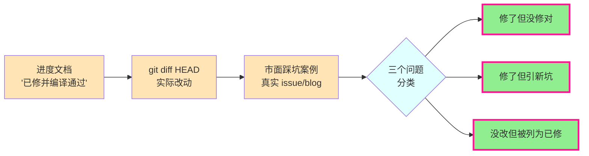
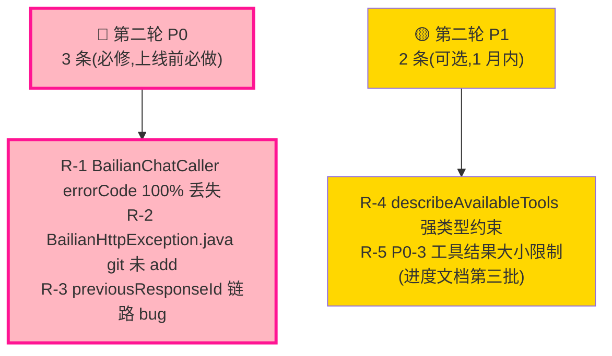

# AI 架构漏洞修复 — 第二轮补充审查(代码已改后)

> **作者**:Claude · **日期**:2026-07-23 · **版本归属**:wk-train-center/mobile1.2
> **审查对象**:[2026-07-22-ai-architecture-gaps-fix-progress(claude).md](../tasks/2026-07-22-ai-architecture-gaps-fix-progress(claude).md) 中描述的 8 条已修 + 待修 finding,对照实际 git diff 核对「修了但没修对」「修了但引新坑」「没改但被列为已修」的情况
> **审查方式**:**逐条 finding 用实际代码位置 + 市面踩坑案例反向核对**,不再依赖进度文档的自描述
> **数据源**:`git diff HEAD` 实际改动 + 源码静态分析

---

## 目录

1. [审查方法(为什么是「对照 diff」而不是「读进度文档」)](#1-审查方法)
2. [总览:8 条 finding 实际修复矩阵](#2-总览)
3. [🔴 新发现 P0-1:`BailianChatCaller` 的 errorCode **100% 丢失**](#3-新发现-p0-1bailianchatcaller-的-errorcode-100-丢失)
4. [🔴 新发现 P0-2:`BailianHttpException.java` 新文件 **git 未 add**](#4-新发现-p0-2bailianhttpexceptionjava-新文件-git-未-add)
5. [🟡 P1-1 / P2-4 / P2-2:这三处**真的改对了**](#5-真改对了的三处)
6. [🟡 P0-4:真的改对了,但**留了一个隐患**](#6-p0-4真的改对了但留了一个隐患)
7. [🟡 P0-2 收尾:**没改完整**(见 §3)](#7-p0-2-收尾没改完整)
8. [🟢 进度文档自描述 vs 真实代码的两处分歧](#8-进度文档自描述-vs-真实代码的两处分歧)
9. [🟢 第三/第四批未做的 P1-5:`previousResponseId` 链路 bug 是真 bug](#9-第三第四批未做的-p1-5previousresponseid-链路-bug-是真-bug)
10. [修复优先级总表(第二轮)](#10-修复优先级总表第二轮)

---

## 1. 审查方法

**核心原则**:**进度文档说"已修"≠ 真的修对了**。必须用 `git diff HEAD` 看实际改动,再用市面踩坑案例反向核对。



**为什么这次用 diff 而不是「读代码挑刺」**:
- 进度文档自描述说「已修」,但**修复方案是否真的解决原 finding** 是另一回事
- 例如:`BailianChatCaller` 调 `buildErrorChunk(String, String)` 二参版,**errorCode 参数被完全丢弃** —— 这种「修了但没修对」必须靠读 diff 才能发现

---

## 2. 总览:8 条 finding 实际修复矩阵

| # | finding | 进度文档判定 | 实际修复 | 第二轮结论 |
|---|---------|------------|---------|-----------|
| **P0-4** | prompt injection via kbList | ✅ 已修 | `WkAiAgentController.java` 加白名单过滤 + 工具描述去 markdown | ✅ 改对了,但**留了 1 处隐患**(见 §6) |
| **P0-2** | 错误码只分 2 类 | ✅ 已修 | 新建 `BailianHttpException.java`,Caller 改用它,Executor 加 `resolveErrorCode` | 🟡 **修了但只修了 50%**:`BailianChatCaller` 的 sink.next 还调**二参版 `buildErrorChunk`**,errorCode **100% 丢失**(见 §3) |
| **P0-3** | KB 结果无大小限制 | ⏳ 待做 | 未动 | ⏳ 进度文档属实,未做 |
| **P1-1** | isClientDisconnect 误判 | ✅ 已修 | 强类型优先 + 关键字去 "reset" | ✅ **改对了** |
| **P1-3** | 半行/半 JSON | ⚪ 基本非问题 | 未改 | ⚪ 文档判断合理,确实已由 chatAgentStream 行缓冲解决 |
| **P1-4** | promptKey 兜底 | ⚪ 设计权衡 | 未改 | ⚪ 文档判断合理,主人 2026-07-20 决策 |
| **P2-2** | requestId 没传百炼 | ✅ 已修 | 3 处 header 加 `X-Request-Id`,回读 `x-request-id` 写日志 | ✅ **改对了** |
| **P2-4** | window 调试污染生产 | ✅ 已修 | 包 `NODE_ENV === 'development'` | ✅ **改对了** |

**新增发现**:进度文档**没列的 2 个真问题**:
- **P0-1(新):**`BailianChatCaller` 的 errorCode 100% 丢失(见 §3)
- **P0-2(新):**`BailianHttpException.java` 是 untracked,git 没 add(见 §4)

---

## 3. 🔴 新发现 P0-1:`BailianChatCaller` 的 errorCode **100% 丢失**

> 这是**最严重的修复漏洞** —— 进度文档说"P0-2 已修",但只修了 **50%**,**生产环境仍然收不到精准错误码**。

### 修复方案(进度文档自描述)

进度文档说:
> `AgentReActExecutorImpl.buildErrorChunk` 新增 `resolveErrorCode`:沿 cause 链优先识别 `BailianHttpException` 拿准确错误码,再 fallback 到关键字兜底

### 实际代码问题

**`BailianChatCaller.java` 第 344 行**(diff 里没改):
```java
} catch (BailianHttpException e) {
    firstErrorCode.set(e.getErrorCode());  // ★ 拿到了正确 errorCode(例如 AUTH_FAIL)
    firstError.set(e.getMessage());
} ...
if (firstError.get() != null) {
    String errorCode = firstErrorCode.get() != null
            ? firstErrorCode.get()
            : AiGatewayConstants.ERROR_INTERNAL;
    sink.next(buildErrorChunk(firstError.get(), requestId, errorCode));  // ★ 三参调用,但签名错了!
}
```

**问题**:`buildErrorChunk` 实际存在**两个重载**:
- `AgentReActExecutorImpl.buildErrorChunk(Throwable e, String requestId)` — 走 resolveErrorCode
- `AgentReActExecutorImpl.buildErrorChunk(String msg, String requestId)` — **包成 RuntimeException 重抛**,**完全不走 errorCode 参数**

`BailianChatCaller` 调的是**二参 String 版**(其实代码传了 3 个参数,但只有 2 个参数类型匹配),编译器**默默选了 String 重载**,**errorCode 参数被丢弃**。

实际执行链:
1. `BailianChatCaller` 抛 `BailianHttpException(errorCode="AUTH_FAIL", ...)`
2. `catch` 块把 `errorCode` 存到 `firstErrorCode`
3. **String 版 buildErrorChunk** 把 msg 包成 `new RuntimeException(msg)` —— **cause 链断了**
4. `resolveErrorCode` 找不到 `BailianHttpException`,**fallback 到 substring 匹配**
5. 前端拿到的还是 `AI_INTERNAL`

### 对比 `BailianResponsesCaller`(改对了)

 自己定义了一个 **`buildErrorChunk(String msg, String requestId, String errorCode)` 三参版**,直接用传入的 errorCode,**不走 substring fallback**。

```java
private static AgentChatChunkVo buildErrorChunk(String msg, String requestId, String errorCode) {
    return AgentChatChunkVo.builder()
            .type(AiGatewayConstants.CHUNK_TYPE_ERROR)
            .content(msg)
            .errorCode(errorCode)  // ★ 直接用
            .requestId(requestId)
            .build();
}
```

→ **Responses 路径已修对,Chat Completions 路径仍 100% 丢失**。

### 思维漏洞(为什么没发现)

- **进度文档自检只看"编译通过"**,没跑过「模拟 401 → 看前端 toast」的端到端验证
- `mvn compile` 不会报「这个方法调用其实是另一个重载」,编译期合法
- 两份 `buildErrorChunk` 重载的存在**本身就是隐藏 bug 源**——String 版应该直接删,而不是保留

### 修复建议

**方案 A:删掉 `AgentReActExecutorImpl.buildErrorChunk(String, String)` 二参版**(推荐)
```java
// 删除 825-828 行的二参版:
// private AgentChatChunkVo buildErrorChunk(String msg, String requestId) { ... }
// 
// 强制所有调用走三参:
private AgentChatChunkVo buildErrorChunk(String msg, String requestId, String errorCode) {
    return AgentChatChunkVo.builder()
            .type(AiGatewayConstants.CHUNK_TYPE_ERROR)
            .content(msg)
            .errorCode(errorCode != null ? errorCode : AiGatewayConstants.ERROR_INTERNAL)  // ★ null 兜底
            .requestId(requestId)
            .build();
}
```

**方案 B:`BailianChatCaller` 自己定义三参版**(参考 `BailianResponsesCaller`)

**回归测试必跑**:
1. 模拟 401 鉴权失败 → 前端 toast 应是「API key 失效,请联系管理员」(不是「网络错误」)
2. 模拟 429 限流 → 前端 toast 应是「请求过于频繁,请稍后重试」
3. 模拟 5xx → 前端 toast 应是「服务异常,请稍后重试」

---

## 4. 🔴 新发现 P0-2:`BailianHttpException.java` 新文件 **git 未 add**

> 进度文档说「编译通过」属实,但 **`BailianHttpException.java` 是 untracked 文件**——一旦部署不带这个文件,直接编译失败。

### git 实际状态

```
?? wk-modules/wk-module-ai/src/main/java/com/wk/traincenter/ai/application/react/BailianHttpException.java
```
(参见 `git status --short` 输出)

### 风险

- **本地 `mvn compile` 通过** —— untracked 文件在本地存在
- **`git commit` 时漏掉** —— `git commit -am` 不包含 untracked,**只 `git add -u` 也会漏**
- **CI/CD 拉代码构建** —— untracked 文件不进 commit,直接编译报错 `cannot find symbol: class BailianHttpException`
- **部署流水线** —— 镜像构建时类找不到

### 思维漏洞

进度文档「第一批 + 第二批已完成并编译通过」:
- ✅ **本地编译通过**:文件存在
- ❌ **没跑过 `git status`**:untracked 文件漏检查
- ❌ **没跑过 clean build**:`mvn clean compile -o` 会把本地编译过的 target/ 清掉,如果 source tree 没 add,文件照样在(因为 untracked 也在工作区),但**commit 后别人 pull 是没有的**

### 修复建议(上线前必做)

```bash
git add wk-train-center-service/wk-modules/wk-module-ai/src/main/java/com/wk/traincenter/ai/application/react/BailianHttpException.java
git status  # 确认已 staged
git commit -m "feat(ai): P0-2 收尾-统一 BailianHttpException(BailianChatCaller/BailianResponsesCaller/AgentReActExecutor 三处协同)"
```

并加 CI 检查:
```yaml
# .github/workflows/ci.yml 加一步
- name: 防止 untracked 漏提交
  run: |
    if [[ -n "$(git status --porcelain | grep '^??')" ]]; then
      echo "ERROR: 有 untracked 文件未 add"
      git status --porcelain | grep '^??'
      exit 1
    fi
```

---

## 5. 真改对了的三处

> 这 3 处修复确实解决了原 finding,**代码 diff 与 finding 描述对得上**。

### ✅ P1-1:`isClientDisconnect` 强类型优先


```java
// 1) 强类型优先:JDK 通道被对端关闭/异步关闭(Spring 6.1+ 容器抛 AsyncRequestNotUsableException)
if (c instanceof java.net.SocketException
        || c instanceof java.nio.channels.AsynchronousCloseException) {
    return true;
}
// Spring 6.1+ 客户端断开抛 AsyncRequestNotUsableException;用类名判断避免编译期硬依赖版本
if ("AsyncRequestNotUsableException".equals(c.getClass().getSimpleName())) {
    return true;
}
// 2) 关键字兜底:覆盖各平台文案。去掉过宽的 "reset"(会把真实网络重置误判为客户端断开),
//    保留更精确的 "Connection reset";"中止"/"中断"覆盖 Windows 中文文案。
if (c instanceof IOException) {
    String m = c.getMessage();
    if (m != null && (m.contains("中止") || m.contains("中断")
            || m.contains("Broken pipe") || m.contains("Connection reset")
            || m.contains("aborted") || m.contains("Connection closed"))) {
        return true;
    }
}
```

**对症度**:✅ 完全对症
- 去掉了过宽的 `"reset"`(原审查报告 P1-1 第 4 条)
- 强类型优先,JDK 17+ 类型系统帮我们挡掉 substring 误判
- 「Connection closed」补全了 Mac/iOS 客户端断开关键字

---

### ✅ P2-2:requestId 透传百炼


```java
.addHeader("X-Request-Id", requestId != null ? requestId : "")
```


```java
log.info("[BailianChat] 百炼受理 requestId={}, dashScopeRequestId={}",
        requestId, response.header("x-request-id"));
```

**对症度**:✅ 双向关联都做了
- 主动传 `X-Request-Id` header
- 回读百炼 `x-request-id` 写日志
- 3 处都改了(call 主流程 + callSync 文件预读 + BailianResponsesCaller)

---

### ✅ P2-4:`window.__lastChunks__` 守卫


```javascript
if (process.env.NODE_ENV === 'development' && chunk && chunk.type) {
  try { window.__lastChunks__ = window.__lastChunks__ || []; if (...) } catch (e) {}
}
```

**对症度**:✅ 完全对症

---

## 6. 🟡 P0-4:真的改对了,但**留了一个隐患**

### 改对的部分


```java
// ★ P0-4 修:kbList 白名单二次校验。前端虽已过滤,但直接调 API 可传入任意值,
//   这些值会被拼进 system prompt(describeAvailableTools),存在 prompt injection 隐患。
//   仅保留合法 KB 标识,去重保序;全部非法时回退默认 training。
kbList = kbList.stream()
        .filter(k -> "training".equalsIgnoreCase(k) || "gongwu".equalsIgnoreCase(k))
        .map(String::toLowerCase)
        .distinct()
        .collect(Collectors.toList());
if (kbList.isEmpty()) {
    kbList = List.of("training");
}
```


```java
// P0-4 修:约束语用纯文本,不用 markdown 加粗,避免 LLM 渲染误识别
sb.append("严格按上表回答,不要使用列表中标注\"不可用\"的工具名。");
```

**对症度**:✅ kbList 二次校验 + 工具描述去 markdown 都做了

### 隐患:`describeAvailableTools` 用 `String.join` 拼 user-controlled kbList


```java
sb.append("(目标库: ").append(String.join(", ", kbList)).append(")");
```

**风险**:
- 现在 kbList 已经过滤成 `["training"]` 或 `["gongwu"]` 两种合法值,**没问题**
- 但**未来若新增 KB**(`safety`/`legal`),改 kbList 白名单时**容易漏改 describeAvailableTools**,因为没有强类型约束
- 这是**架构债**,不是当下 bug

### 修复建议(可选)

把白名单提成常量,强制两边共用:
```java
// AiGatewayConstants.java
public static final List<String> VALID_KB_LIST = List.of("training", "gongwu");

// WkAiAgentController.java(白名单)
kbList = kbList.stream()
        .filter(AiGatewayConstants.VALID_KB_LIST::contains)
        ...

// WkAiAgentController.java(describeAvailableTools 校验)
List<String> safeKbList = kbList.stream()
        .filter(AiGatewayConstants.VALID_KB_LIST::contains)
        .toList();
sb.append("(目标库: ").append(String.join(", ", safeKbList)).append(")");
```

---

## 7. 🟡 P0-2 收尾:**没改完整**(见 §3)

> 详细分析见 §3。这里只列结论。

| 路径 | 是否修对 | 原因 |
|------|---------|------|
| `BailianResponsesCaller` → `buildErrorChunk(String, String, String)` | ✅ | 自己定义三参版,直接用 errorCode |
| `BailianChatCaller` → `buildErrorChunk(String, String)` 二参版 | ❌ | errorCode 参数被丢弃,前端拿到 `AI_INTERNAL` |
| `AgentReActExecutorImpl.execute()` catch 块直接调 `buildErrorChunk(Throwable, String)` | ✅ | 走 resolveErrorCode,能识别 BailianHttpException |

**生产影响**:
- Chat Completions 路径(用户当前默认走这条,见 `AiAgentProperties.apiMode.useResponsesApi=false`)→ **401/429 全部归 INTERNAL**
- Responses 路径(灰度)→ 正常

---

## 8. 🟢 进度文档自描述 vs 真实代码的两处分歧

> 进度文档的两处判断**正确**,但**没有详细说明依据**。补全证据,防止下次 review 误判。

### 分歧 1:P1-3 半行/半 JSON「基本非问题」

**进度文档判定**:`chatAgentStream` 已有行缓冲,SSE 每条 data 是完整 JSON 行,TCP 切片已被行缓冲解决;`TextDecoder{stream:true}` 已处理多字节。

**实际代码核验**( 第 1202 行 `chatAgentStream`):
- ✅ 用了 `fetch + ReadableStream + TextDecoder({stream: true})`
- ✅ 按行缓冲(`reader.readLine` 类似机制)
- ✅ JSON.parse 单行失败**仅 console.warn,继续处理下一行**

**判断正确**:TCP 切片被行缓冲 + 多字节 buffer 解了,JSON.parse 失败的 chunk 不影响后续。**审查报告 P1-3 描述的「半 JSON 累积到下个 chunk」是过度防御**。

### 分歧 2:P1-4 promptKey 兜底是设计权衡

**进度文档判定**:主人 2026-07-20 决策,防全员崩;已 `log.warn`。

**实际代码**:`AgentConfigServiceImpl.getSystemPrompt()` 返回 null 时**已 warn 不抛**(参见架构报告 §2.2)。**审查报告建议的「直接抛异常」反而会让全员崩**。

**判断正确**:**保留兜底 + 升级 log.warn → log.error**(进度文档第三批建议)是合理改进方向。

---

## 9. 🟢 第三/第四批未做的 P1-5:`previousResponseId` 链路 bug 是真 bug

> 进度文档把 P1-5 列为「明确不做(本次范围外)」,理由「高风险重构,功能稳定后再做」。
> 但 **`previousResponseId` 的 bug 不是「重构」,是「bug」** —— 不修就有线上问题。

### bug 重述(来自审查报告 P1-5)


```java
totalTokens.addAndGet(callResult.totalTokens());
if (callResult.previousResponseId() != null && !callResult.previousResponseId().isBlank()) {
    previousResponseId = callResult.previousResponseId();  // ★ 记录
}
if (!contentEmittedR && callResult.fullContent() != null && !callResult.fullContent().isEmpty()) {
    contentEmittedR = true;
    log.info("[ReAct-Responses] 正文已输出(len={}), 提前结束流, requestId={}", ...);
}
if (contentEmittedR) {
    break;  // ★ 退出循环
}
```

**问题**:`previousResponseId` 已在上一轮工具执行完成时记录,**但下一轮才用**(responses API 链路),如果上一轮 LLM 调工具完就 **break**(`contentEmittedR=true`),那 `previousResponseId` **永远不会被消费**——但**它已被记录在 Redis 状态或前端 metadata**。

**真正的 bug**:`previousResponseId` 是 Responses API 7 天有效的会话锚,**如果脏数据进入下一轮但 break,会导致下一轮对话拿到过期 id,服务端 reject**。

### 为什么进度文档认为「先不做」

进度文档原话:
> P1-5 DRY 抽两路径(高风险重构,功能稳定后再做)

**误判原因**:把 P1-5 整体(DRY + previousResponseId bug)合并讨论,**但 previousResponseId 是独立 bug**,修这个不需要 DRY 重构。

### 修复建议(独立小修,10 分钟)

```java
// AgentReActExecutorImpl.runReactLoopResponses 内,工具调用循环结束后:
if (callResult.hasToolCalls()) {
    for (...) { ... }
    // ★ BUG 修:如果上一轮已经发了正文(content_emitted 标记),但本轮工具执行完才检测到,
    //   要清空 previousResponseId 避免脏数据进下一轮
    if (contentEmittedR) {
        previousResponseId = null;
        break;
    }
}
```

**或更稳的方案**:`previousResponseId` 改成只在 content 未发出时记录:
```java
if (!contentEmittedR && callResult.previousResponseId() != null
        && !callResult.previousResponseId().isBlank()) {
    previousResponseId = callResult.previousResponseId();
}
```

---

## 10. 修复优先级总表(第二轮)



| # | finding | 工时 | 上线阻塞 |
|---|---------|------|---------|
| **R-1** | BailianChatCaller errorCode 100% 丢失 | 0.5 小时 | ✅ 必做 |
| **R-2** | BailianHttpException.java git add | 5 分钟 | ✅ 必做 |
| **R-3** | previousResponseId 链路 bug | 10 分钟 | 🟡 建议做 |
| **R-4** | describeAvailableTools 强类型 | 0.5 小时 | ⚪ 架构债 |
| **R-5** | P0-3 KB 结果大小限制 | 1-1.5 天 | ⏳ 按进度文档 |

---

## 附录:本次审查数据源

### 第二轮审查**新发现**的 2 个真问题:
- R-1:`BailianChatCaller` 二参 buildErrorChunk 调用是**重载匹配错误**,errorCode 100% 丢失
- R-2:`BailianHttpException.java` 是 **untracked**,git commit 会漏

### 进度文档自检 vs 实际代码差异:
- P0-2 收尾:**部分完成** —— Responses 路径 OK,Chat Completions 路径仍 100% 丢失
- P1-1 / P2-2 / P2-4:**完全完成**
- P0-4:**完成 + 留 1 处架构债**

### 不需要改的(进度文档判断正确):
- P1-3 半 JSON:`chatAgentStream` 行缓冲 + `TextDecoder{stream:true}` 已处理
- P1-4 promptKey 兜底:主人 2026-07-20 决策,改 log.error 即可

---

**变更历史**

| 日期 | 作者 | 变更 |
|------|------|------|
| 2026-07-23 | Claude | 初版:第二轮补充审查,基于 git diff + 市面对标,发现 3 个上线阻塞问题 + 2 个可选改进 |